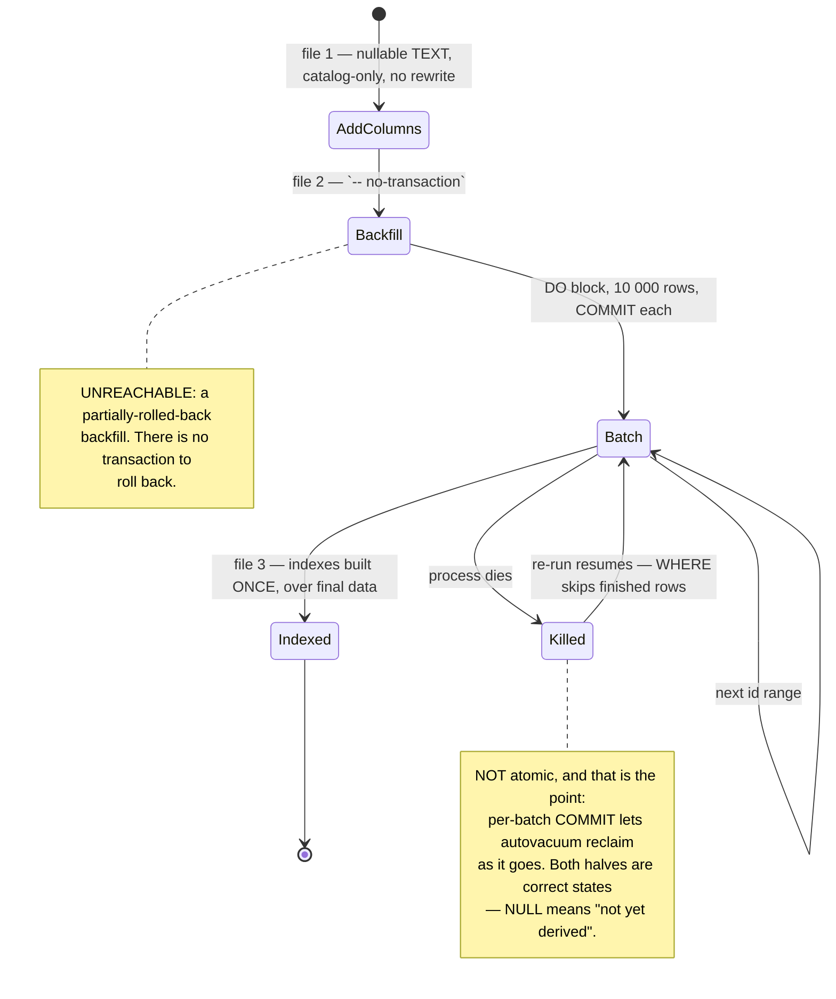

# Writing a migration here

Two directories, two databases, two binaries:
`migrations/` → `app/lightbridge-authz/src/migrate.rs` (the `authz` DB) and `migrations-usage/` →
`app/lightbridge-authz-usage/src/migrate.rs` (the `usage` DB). Both are embedded SQLx migrations,
applied by the migrate step before anything serves.

## Rule 1 — new files only. An applied migration's bytes are frozen.

SQLx stores a checksum per migration and validates it on every run. Editing an applied file — **even
to add a comment** — aborts the next migrate with a version mismatch. Corrections go in a **new
forward migration**, or in the owning ADR. Never in the file.

There are no `down` migrations here: files are `*.sql`, not `*.up.sql`/`*.down.sql`. "Migration
up/down" in a ticket is satisfied by evidence that the up applies against pre-existing rows.

## Rule 2 — check the version prefix against `origin/main` before you write it

```bash
git fetch origin
git ls-tree --name-only origin/main migrations/ | sed 's#.*/##; s/_.*//' | sort | uniq -d
# then confirm YOUR prefix is not already taken, on main AND in any branch about to merge:
git ls-tree --name-only origin/main migrations/ migrations-usage/ | sed 's#.*/##' | sort | tail -20
```

SQLx keys `_sqlx_migrations` on the numeric **version**, not the filename. Two files sharing a prefix
collide on that table's primary key: the second to apply fails `23505` and aborts the whole run —
locally that is every `sqlx::test` dying at setup, in a deployment it is the migrate step failing so
nothing comes up at all.

**Neither PR's CI can catch this.** Each branch contains only its own migration; the collision exists
solely in the merge result. It has happened twice:

- 2026-08-30, #564 × #565, healed by #568.
- **2026-09-02, #653 × #654** — merged minutes apart, both claiming `20260902000002`. #655 found it
  and renumbered #654's file to `…000004` (contents unchanged).

Which file moves is not a coin toss:

- **A version any environment has durably applied cannot be reassigned.** `_sqlx_migrations` is the
  record of what actually ran there.
- The file that moves is the one **not applied anywhere durable** — renumbering it is a clean first
  application. Moving the other would trip sqlx's "previously applied but has been modified" check on
  a partially-migrated environment.
- If both have been applied somewhere, renumbering is not available and the fix is a new forward
  migration.

A same-day pair is the common case, because everybody reaches for today's date. Re-check the prefix
**immediately before pushing**, not only when you started.

## Rule 3 — one file is one transaction, unless you say otherwise

sqlx applies a file as **one multi-statement simple query**, i.e. an implicit transaction block. Two
consequences:

- `CREATE TYPE` / `ALTER TYPE … ADD VALUE` cannot be used the way you would at a psql prompt. This
  schema has **zero** `CREATE TYPE`; closed value domains are CHECK-constrained `TEXT`
  (`budget_grants.source` is the precedent, `budget_reset_schedules.cadence`/`mode` follow it).
- **`CREATE INDEX CONCURRENTLY` is rejected outright**, and is banned here for a second reason
  besides: a failed `CONCURRENTLY` build leaves a silently **INVALID** index that a re-run's
  `IF NOT EXISTS` then skips — a migration that reports success while the index it promised never
  comes into service. That is exactly the silent wrongness this store's doctrine refuses. Take the
  SHARE lock; the only writer on `usage_events` is an OTLP exporter that retries.
  (`migrations-usage/20260903000002_usage_event_query_covering_index.sql:64-69` states this in the
  file itself — do the same in yours.)

## Rule 4 — a backfill over a live table is `-- no-transaction`, batched, and idempotent

The shape, from `migrations-usage/20260902000002_usage_event_dimensions_backfill.sql`:



Split into **three files**, in that order, and say why in each header:

1. columns added **nullable** — catalog-only on PG 11+, no table rewrite;
2. the `-- no-transaction` batched backfill;
3. indexes **last**, once, over final data.

Make the batch predicate self-skipping (`WHERE col IS NULL AND <source yields something>`) so a
re-run is free and a killed run resumes. Never rewrite the source column. State the trade-off
explicitly in the header: the backfill is not atomic, and that is bought deliberately for per-batch
reclaim on a table whose growth already exhausted a production volume once (#549).

Prove it against real data. `sqlx::test` runs migrations on a *fresh* database, so the loop body runs
over zero rows and proves nothing. #652 seeded 25 000 production-shaped rows, deleted the bookkeeping
row from `_sqlx_migrations`, re-ran the real migrator, and pasted the row counts. Do that.

## Rule 5 — fail loud

**No `EXCEPTION WHEN OTHERS` anywhere.** A migration that swallows its own error reports success
against a schema it did not produce, and every later run's `IF NOT EXISTS` agrees with it. The
service refusing to start is the correct outcome.

The same instinct applies upward: a nullable column whose value is unknown stays `NULL`. `NULL` and
a sentinel like `'other'` are **different facts** and must stay different on the wire — "we do not
know" is not "a value we have no name for" (#652), and "no requester was recorded" is not "the
account" (#654). Where NULL is permanent because no source can reconstruct the value, say so in the
migration comment, in the Rust doc comment and in the UI contract, and tell the console to render an
explicit sentinel rather than guess.

## Checklist before you push

- [ ] New file; no applied file edited, not even a comment.
- [ ] Prefix re-verified free on `origin/main` **just now**, both directories.
- [ ] Additive: nullable/defaulted columns, new tables, new indexes. (ADR-0031's expand/contract half
      — code that *requires* the new shape ships in the release **after** the one that adds it.)
- [ ] No `CREATE INDEX CONCURRENTLY`, no `CREATE TYPE`, no `EXCEPTION WHEN OTHERS`.
- [ ] A `COMMENT ON COLUMN` for anything whose meaning is not obvious from its name.
- [ ] Backfill (if any) batched, idempotent, resumable, and exercised against seeded rows.
- [ ] The migration runs in the DB-backed suites: see the `authz-verify` skill.
- [ ] `docs/architecture/data-model.md` updated if the shape changed.
