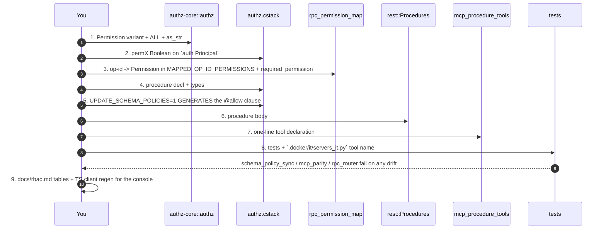

# Adding a cratestack procedure, end to end

**Nine places move together.** Missing one does not fail loudly in every case — that is the whole
reason this list exists. `AGENTS.md` "Persistence" and [`docs/rbac.md`](../../../docs/rbac.md) are
the authoritative background; this is the running order.



## 1 — the `Permission` variant

`crates/lightbridge-authz-core/src/authz.rs`. Add the variant, its entry in `Permission::ALL`
(**bump the array length**, currently `[Permission; 37]` at `:196`), its `as_str` arm, and the serde
rename. Add it to `default_role_permissions()` (`role_defaults`) if a non-admin role should hold it.

You do **not** hand-write the `auth().perm*` name: `rpc_permission_map::permission_field_name`
(`:194`) derives it mechanically from `as_str()`, splitting on `:` and `-`
(`budget:read-own` → `permBudgetReadOwn`).

**Choosing whether it needs its own permission.** House default (see the memory note on role gating)
is *any member*, not owner/admin-only, unless it is the single most destructive op in its area. Give
it a **new** permission rather than reusing one when the data it reads or the damage it does is a
different shape — `user:read` is separate from `account:read` because it reads profile claims for
subjects the caller has no relationship with; `rbac:manage` is separate from `user:read` because it
is the one capability that hands out every other capability.

## 2 — the `auth Principal` block

`crates/lightbridge-authz-api/schema/authz.cstack:80`. Add `permX Boolean`. A policy predicate can
only name a declared field, so this must exist before any clause can read it.
`CratestackAuthProvider::build_context` populates every `perm*` field unconditionally — no change
needed there.

## 3 — the op-id → permission map

Two edits in `crates/lightbridge-authz-rest/`:

- `rpc_authorize.rs` — the `required_permission` match arm.
- `rpc_permission_map.rs` — the matching `MAPPED_OP_ID_PERMISSIONS` entry, **in the same declaration
  order**. `every_mapped_op_id_maps_to_the_documented_permission` walks the two arm-for-arm.

`RpcScope` is *derived* from the permission's `budget:` prefix — there is no second list to update.

**An op-id absent from this map is denied unconditionally, on the unary and `/rpc/batch` paths
alike.** That is the fail-closed rule, and the only exception is the enumerated
`AUTHENTICATED_ONLY_OP_IDS` (`rpc_permission_map.rs:42`) — today `getMyAccess` and `getBuildInfo`.
Adding a third entry is a security decision: it must be a value the caller can already obtain from
what they are holding, or one already served unauthenticated elsewhere. Write the reasoning into the
doc comment, as the two existing entries do.

## 4 & 5 — the schema declaration, and the generated clause

Declare the procedure and its input/output types in `authz.cstack`. Then **generate** the `@allow`
clause; do not type it:

```bash
UPDATE_SCHEMA_POLICIES=1 cargo test -p lightbridge-authz-rest --test schema_policy_sync_tests
```

The default (non-`UPDATE`) run then verifies it byte-for-byte and fails CI on drift.

Name collisions are real and are compile errors, not runtime surprises: cratestack emits
`handle_list_<model>` for the generic `model.<M>.list` verb, so a procedure named `listSessions` is a
hard `E0428` at codegen. #657 shipped `querySessions` for exactly this reason — record the constraint
at the declaration when you hit one.

**Where own-scoping belongs.** If the rule is *"a caller may see their own rows, an admin may see
everyone's"*, put it in a model `@@allow("read", …)` clause, not in the handler: cratestack compiles
the predicate into the SQL `WHERE`, so it holds for every filter combination rather than for the ones
a handler remembered to clamp. Adding `@@allow("read", …)` does **not** light up the generic verbs —
they stay denied because `MAPPED_OP_ID_PERMISSIONS` does not list them — but adding
`@@allow("update", …)` **would**, and on `Session` that would be a way to un-revoke a session. When
the check needs the row a caller-supplied id names, it cannot live in a clause at all (a procedure
`@allow` sees only `auth()`); put it in the handler and say why in the doc comment.

## 6 — the procedure body

`crates/lightbridge-authz-rest/src/lib.rs` implements on `Procedures`. **Watch the LoC gate**: that
file sits on its committed baseline in `.github/loc-baseline.json` and may be touched but not grown.
Put the body in its own module (`identity_directory.rs`, `session_directory.rs`,
`platform_roles_directory.rs` are the precedents) and, if you must make room in a grandfathered file,
move something out **verbatim** and re-export it. See the `authz-verify` skill.

Queries go through cratestack (ADR-0038). Hand-written SQL needs an entry on `AGENTS.md`'s exception
list and a stated reason.

## 7 & 8 — the MCP tool, and the three lists that must agree

One line in `app/lightbridge-authz/src/mcp_procedure_tools.rs`. It takes the procedure's own
generated `Args` and returns its own `Output`, dispatched through the shared `Procedures` registry —
so shapes and `@allow` evaluation match the RPC surface by construction.

MCP holds **no permission table of its own**: `mcp_rbac::tool_gate` resolves tool → op-id and asks
`rpc_authorize::required_permission`. The surface is 70 tools = 68 reachable op-ids + 2 MCP-only
validation tools.

Then add the tool name to `.docker/it/servers_it.py`'s `EXPECTED_MCP_TOOLS`. **This is the copy that
bites.** It is a Python file that cannot import the crate, it asserts set-equality against the live
server, and it turned `main` red the day #670 merged — while every other job stayed green. #672 added
`the_it_servers_expected_tool_set_matches_the_mcp_surface`, which reads it from the Rust side, so you
will now be told at `cargo test` time rather than by a red `main`.

`app/lightbridge-authz/tests/mcp_parity_tests.rs` (6 tests) fails the build when a reachable op-id
has no tool, when a tool's gate differs from the REST permission, when a tool claims an op-id the
schema does not dispatch, or when a tool exposes an op-id the REST surface fail-closes.

## 9 — docs and the console's client

- [`docs/rbac.md`](../../../docs/rbac.md) — the permission row and the op-id/MCP-tool table. Also the
  domain doc for the area (`sessions-api.md`, `admin-identity-resolution.md`,
  `budget-refill-ui-contract.md`, …), with the **mermaid pair** the repo requires for any process.
- `AGENTS.md` — only if you added an ADR-0038 exception or a new doc.
- **TypeScript client** for `converse-frontends`:

  ```bash
  cratestack generate-typescript \
    --schema crates/lightbridge-authz-api/schema/authz.cstack \
    --out /tmp/ts-check --package-name @lightbridge/authz-rpc
  cd /tmp/ts-check && npm install && ./node_modules/.bin/tsc -p tsconfig.json --noEmit
  ```

  That it compiles is the acceptance criterion on this side. On the console side the generated
  package is gitignored and postinstall does not rebuild it — a regeneration there needs
  `rm -rf packages/authz-rpc/generated` and a real `pnpm build`. **Known asymmetry:** the TS codegen
  keeps `@readonly` fields *required* on `Create*Input` (unlike the Rust side), so the console's
  `build*Input` helpers need patching when you add one.

## Tests that must exist

| What | Where the precedent is |
| --- | --- |
| the gate admits the permission and nothing else covers it | `budget_router_tests::schedule_management_requires_budget_schedule_manage_and_nothing_else_covers_it` |
| an "admin minus one" token (every permission **except** yours) is refused | `rbac_gate_denies_platform_role_management_without_rbac_manage` |
| the generic model verbs stay dead | `rbac_gate_denies_unmapped_and_locked_ops_even_for_admin` |
| DB-backed behaviour | `cargo test -p <crate> --features it-tests` — see the `authz-verify` skill |

Test the *interesting* failure: not "a viewer is refused" but "a broad grant does not imply this
one".
