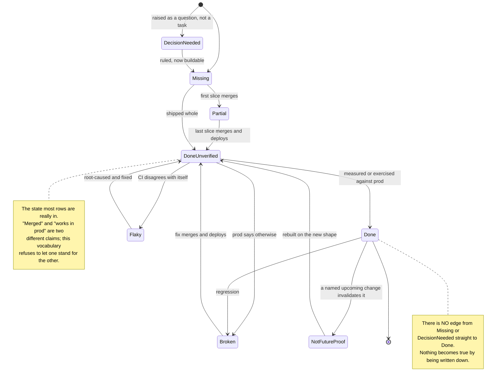

# Roadmap — what is done, what is not, and what is quietly wrong

This is a **matrix, not a narrative**. It is the standing answer to "where does `lightbridge-authz`
actually stand", grouped by workstream, one row per item, every row carrying a citation you can
re-check. It supersedes nothing: [`docs/releases/2026-09-03-admin-console-v2.md`](./releases/2026-09-03-admin-console-v2.md)
is the story of one push, the ADRs are the decisions, `CHANGELOG.md` is release-please's ledger.
This page is the *state of play*.

**Update rule.** A merged PR updates its row **in the same PR**. A row with no citation is a rumour.

Sibling matrices, same vocabulary, same update rule:
[`ai-helm-values/ROADMAP.md`](https://github.com/ADORSYS-GIS/ai-helm-values/blob/main/ROADMAP.md)
(cluster, gateway, values) and
[`converse-frontends/docs/ROADMAP.md`](https://github.com/ADORSYS-GIS/converse-frontends/blob/main/docs/ROADMAP.md)
(console, LCI, export — filed in the same sweep as this page). Rows that name another repo say so;
nothing here claims to own the cluster.

---

## State vocabulary

| State | Means |
|---|---|
| **Done** | Merged **and** confirmed working in production. |
| **Done, unverified in prod** | Merged and deployed, but the production-side effect has never been measured or exercised. Not the same as working. |
| **Partial** | Some of the acceptance criteria are met; the remainder is named in Notes. |
| **Missing** | No implementation exists. Distinguished from *Partial* because there is nothing to review. |
| **Broken** | Exists, is wired up, and does not do what it says. |
| **Flaky** | Passes and fails without a code change — environment-, ordering- or timing-dependent. |
| **Not future-proof** | Correct today; a foreseeable, already-named change makes it wrong or misleading. |
| **Decision needed** | Blocked on an owner ruling, not on engineering effort. Never assign this to a sprint. |

A row moves through these states; the transitions that do **not** exist are the point.

---

## 1. Identity & RBAC

| Item | State | Evidence | Notes |
|---|---|---|---|
| Platform roles are a table, stamped at mint (`platform_role_grants`, `ClaimSource::PlatformRoles`) | Done | [#656](https://github.com/ADORSYS-GIS/lightbridge-authz/pull/656) `a7b4fbc`, [ADR-0033](./adr/0033-platform-roles-are-a-table-stamped-at-mint.md) | Replaced "every signed-in human is a `lightbridge-admin`". Claim mappers are fail-closed: a broken roles read refuses every mint. |
| `getMyAccess` — the console asks the backend what it may do | Done | [#656](https://github.com/ADORSYS-GIS/lightbridge-authz/pull/656); `crates/lightbridge-authz-api/schema/authz.cstack:2115` | Console gating on it: converse-frontends #467. |
| `rbac` CLI + first-admin bootstrap runbook | Done | [#656](https://github.com/ADORSYS-GIS/lightbridge-authz/pull/656); [`rbac.md` → Bootstrap runbook](./rbac.md) | Executed once in prod (grant to user `49534505`). The runbook has been run exactly once — it is not a rehearsed procedure. |
| Owner default role = `editor` (not `viewer`, not `admin`) | Done | ai-helm-values #353 `eae6e4e` | Consequence, stated because it is not obvious: **every owner can self-refill**, bounded only by the policy ladder. |
| `user:read` + `resolveUserProfiles` / `resolveActorLabels` / `searchUsers` | Done | [#655](https://github.com/ADORSYS-GIS/lightbridge-authz/pull/655) `14cc374`, [`admin-identity-resolution.md`](./admin-identity-resolution.md) | API-key names added row-scoped in [#674](https://github.com/ADORSYS-GIS/lightbridge-authz/pull/674). |
| `listRoles` / `listPermissions` read API | **Partial** | [#571](https://github.com/ADORSYS-GIS/lightbridge-authz/issues/571); `grep listRoles schema/authz.cstack` → 0 hits | Grant/revoke shipped; the **catalogue** did not. `/settings/roles` renders a client-side mirror of the permission list, which is a copy that will drift. |
| Epic: RBAC beyond admin and user (org-admin, team-admin, auditor) | **Partial** | [#262](https://github.com/ADORSYS-GIS/lightbridge-authz/issues/262) (open), children [#263](https://github.com/ADORSYS-GIS/lightbridge-authz/issues/263)–[#265](https://github.com/ADORSYS-GIS/lightbridge-authz/issues/265) | #656 delivered the *assignment* half (a grant is a row). The *role model* half — scoped admins, an auditor role, closing the uncalled-permission gaps ([#177](https://github.com/ADORSYS-GIS/lightbridge-authz/issues/177)) — is untouched. |
| Operator-privileged all-accounts enumeration | **Missing** | [#602](https://github.com/ADORSYS-GIS/lightbridge-authz/issues/602); no `listAllAccounts` in `schema/authz.cstack` | [#652](https://github.com/ADORSYS-GIS/lightbridge-authz/pull/652) gave `usage:read-all` a scope bypass, so the *usage* half works. The console still derives account ids from the family + refill queue, capped and captioned. |
| Account membership concept | **Missing** | [#594](https://github.com/ADORSYS-GIS/lightbridge-authz/issues/594) | `/settings/accounts/<id>` cannot show Members because there is no members table. |
| Authorization data left the JWT — introspection is the only source | Done | [#430](https://github.com/ADORSYS-GIS/lightbridge-authz/issues/430), [#454](https://github.com/ADORSYS-GIS/lightbridge-authz/pull/454); prereq [#429](https://github.com/ADORSYS-GIS/lightbridge-authz/pull/429) deployed as `sha-8d55d6af` | `allowed_models`/`model_policy`/`quota_tier` are no longer minted on any token; ADR-0011 Decision 7 restored, ADR-0017 superseded, ADR-0018 partially. `budget_tier` is the one documented exception (ADR-0014 reaffirmed, ADR-0034 §12). Gateway half: [ai-helm-values#296](https://github.com/ADORSYS-GIS/ai-helm-values/pull/296) deletes the now-dead `auth.identity.*` CEL arms — **not merged, and it is not a blocker**: those arms were already structurally unreachable (every human-plane token carries `api_key_id`, so the CEL always took the introspection branch). |

## 2. Sessions

| Item | State | Evidence | Notes |
|---|---|---|---|
| `querySessions` + `revokeSession`, `session:read` / `session:read-own` | Done | [#657](https://github.com/ADORSYS-GIS/lightbridge-authz/pull/657) `c3a3b6a`, [`sessions-api.md`](./sessions-api.md) | Own-scoping lives in the schema policy, not the handler. Named `querySessions`, not `listSessions` as [#649](https://github.com/ADORSYS-GIS/lightbridge-authz/issues/649) asked. |
| `client_id` recorded for browser sessions | **Partial** | [#659](https://github.com/ADORSYS-GIS/lightbridge-authz/pull/659) `6cb3869`, ADR-0021 D3 amendment | A CHECK constraint forced `client_id` NULL for browser sessions. Fixed at login; **rows written before the roll stay NULL until their TTL expires** — the ledger is honest but incomplete for one session lifetime. |
| `offline` flag derived from the refresh chain's scope | Done | [#657](https://github.com/ADORSYS-GIS/lightbridge-authz/pull/657) | |
| Revoke actually breaks the token chain | **Done, unverified in prod** | converse-frontends #468 | The revoke→"next refresh fails" round trip was never exercised against a live session. The UI path is proven; the security claim is not. |

## 3. Budget ledger & refills

| Item | State | Evidence | Notes |
|---|---|---|---|
| `requested_by_user_id` on refill requests | Done | [#654](https://github.com/ADORSYS-GIS/lightbridge-authz/pull/654) `6c0fc32` | Closes [#560](https://github.com/ADORSYS-GIS/lightbridge-authz/issues/560). |
| `budget_reset_schedules` + replica-safe scheduler (`FOR UPDATE SKIP LOCKED`) | Done | [#653](https://github.com/ADORSYS-GIS/lightbridge-authz/pull/653) `7addf8e`, [ADR-0032](./adr/0032-budget-reset-schedules.md) | There was **no scheduler anywhere in this repo** before it. `trigger_key` = `schedule_id + window_start + account id`. |
| Forced next execution date (`nextRunAt`) | Done | [#669](https://github.com/ADORSYS-GIS/lightbridge-authz/pull/669) `0d993c5`, ADR-0032 A8 | One-off; the schedule then returns to its cadence grid. |
| Reset schedules change **gateway** behaviour | **Missing, by design** | ADR-0032 D10; epic [#645](https://github.com/ADORSYS-GIS/lightbridge-authz/issues/645) Out of Scope | Resets are **ledger-only**. 429s still come from Envoy `BackendTrafficPolicy` buckets keyed on `x-billing-plan`. The console copy is *required* to say so. See §4. |
| `current_tier` collapses any off-ladder grant to `b-15` | **Broken** | `crates/lightbridge-authz-api-key/src/repo.rs:551-571`; memo §3 defect (a) | A grant of an amount that is not a rung resolves to `B15` — so a refill can *lower* the minted claim. Its own doc comment flags it. Nothing reads the claim yet, which is the only reason this is not an incident. |
| `automatic` grants re-pin the claim every daily reset | **Broken** | `repo.rs:136-139`; memo §3 defect (b) | `automatic` is in the tier-representing source list, so every scheduler tick re-pins that account to `b-15`. Fix = exclude `automatic` from the tier source list. |
| Fail-closed floor emits `b-6`, a label no rung matches | **Broken** | `crates/lightbridge-authz-budget/src/rule_data.rs:148`, `store.rs:107-112`; memo §3 defect (c) | Against an `Exact` descriptor selector, `b-6` matches **no rule** — so the fail-closed floor would silently *remove* the ceiling rather than lower it. **All three defects must land before anything downstream keys on `budget_tier`.** |
| Tier ladder ↔ limit mapping (`b-15` = $15 vs prod's flat $24) | **Decision needed** | memo §5 D7; `ai-helm-values/environments/prod/values/core-gateway.yaml:79-102` | All three plans (`free`/`pro`/`enterprise`) are identically $24/mo, $6/wk today. Does `b-15` mean $15 — a cut for everyone — or is the ladder re-anchored? Blocks §4 Stage 3. |
| Budget read path for a non-home owned/member account | **Missing** | [#577](https://github.com/ADORSYS-GIS/lightbridge-authz/issues/577) | |
| Refill history / notes / snapshots / decided list | **Missing** | [#556](https://github.com/ADORSYS-GIS/lightbridge-authz/issues/556)–[#559](https://github.com/ADORSYS-GIS/lightbridge-authz/issues/559) | Explicitly *not* served by any 2026-09-02/03 PR. The console captions each gap. |
| Per-project budget ceiling | **Missing** | [#561](https://github.com/ADORSYS-GIS/lightbridge-authz/issues/561) | |

## 4. Dynamic budget limiter (ADR-0034)

The gateway reads the live ledger balance instead of trusting a token claim. Stage 1 is live; the
thing it exists to do is not.

**Amended 2026-09-04 (ADR-0034 §15):** the budget is no longer a second Authorino metadata call. It
is three fields on the introspection `authz-opa` already serves, read from a precomputed snapshot
that a background refresher in `authz-budget` keeps warm. One call per request, one indexed read of
added cost.

| Item | State | Evidence | Notes |
|---|---|---|---|
| ADR-0034 + `GET /budget/v1/remaining` | Done | [#676](https://github.com/ADORSYS-GIS/lightbridge-authz/pull/676) `adaab0a`, [ADR-0034](./adr/0034-dynamic-budget-limiter.md) | |
| Transport is a shared secret, not mTLS | Done | [#679](https://github.com/ADORSYS-GIS/lightbridge-authz/pull/679) `3a513e9`, ADR-0034 §3.2 | Authorino v0.24 cannot present a client certificate. Not a shortcut — a capability limit, cited. |
| Unknown account id → `404`, not a zero balance | Done | [#681](https://github.com/ADORSYS-GIS/lightbridge-authz/pull/681) `9341d7b`, ADR-0034 §3.3 | *Known* = a row in `accounts` whose `user_id` resolves to a row in `users`. Previously a typo'd account id arrived as "real user, out of money". |
| The route has a span, so its p99 exists | Done | [#680](https://github.com/ADORSYS-GIS/lightbridge-authz/pull/680) `b999bdc`, [#682](https://github.com/ADORSYS-GIS/lightbridge-authz/pull/682) `6fe895b` | Plain axum route, outside cratestack — it carried no span while `/rpc/procedure.*` spans arrived normally. "The service is in Tempo" was compatible with this criterion having no data. |
| **One call per request — the budget rides on the introspection** | Done | ADR-0034 §15; migration `20260904000001`; `crates/lightbridge-authz-budget/src/snapshot*.rs`; owner directive 2026-09-04 | The `budgetremaining` metadata step is deleted. `budget_remaining_micros` / `budget_next_reset_at` / `budget_snapshot_age_seconds` ride on `POST /v1/authorino/validate/introspect`, read from `budget_remaining_snapshots` by primary key. Absent still means UNKNOWN, never zero. |
| Cold-start latency tail | **Resolved by §15** | `EXPLAIN (ANALYZE, BUFFERS)`: Index Scan on the pkey, **3 buffer hits, 0.017–0.030 ms**; end-to-end p50 0.4–1.4 ms over 2 000 samples (`snapshot_read_latency_tests.rs`, which asserts the *plan* and reports the timings) | Was: p50 10 ms with a 614 ms tail, because the request path did a ledger `SUM` plus an HTTPS hop to `authz-usage`. The request path now does one primary-key probe; the `SUM` and the spend query moved to a 15 s background refresher. |
| Refill visible without waiting for a tick | Done | ADR-0034 §15; `BudgetRepo::grant` + `snapshot_store::APPLY_GRANT_DELTA_SQL` | A booked grant moves the snapshot by its own amount inside the grant's transaction. Exact, not approximate: a grant moves the ceiling and never the spend. |
| Budget coverage on the `repobinding` / Keycloak planes | **Missing — blocks Stage 3** | ADR-0034 §15.3 | `lightbridgeintrospect` only runs for `api_key_id`-bearing, non-Keycloak credentials, so those two planes carry no budget fields and must be published as `enforced: false` (fail-open) until coverage is extended. Deliberate, and not acceptable at enforce. |
| Gateway-side enforcement (Stage 2 shadow → Stage 3) | **Broken → reverted** | ai-helm-values #363 (Stage 1), #365/#366/#367 (revert), #368 (incident record) | Shadow mode was enabled and **reverted after two incidents** (16:13–16:18, 16:24–16:28 UTC 2026-09-03). A CEL precedence bug took the public plane down. |
| Envoy Gateway v1.8.2 runs inline Lua in a gopher-lua sandbox that nils `rawget` | **Broken (root-caused, fixed)** | ai-helm #1098 `3f63b98`, helm-values #370 `5db5031` | The policy was rejected → **every route on both planes** rewritten to `direct_response 500`. A new `egctl translate` gate now catches it (negative control reproduces the prod error text). |
| Exit criterion: ingest lag between ledger `remaining` and the Redis cost counter | **Downgraded to an observation** | ADR-0034 §15.1, §10 Stage 2 | Owner ruling 2026-09-04: over-consumption is forgiven. The window is now `30 s introspection TTL + ≤15 s snapshot age + ingest lag + one in-flight request`, stated rather than gated on. Still worth measuring; no longer blocks Stage 3. |
| Exit criterion: Authorino p99 / ext_authz timeout at the gateway | **Missing** | ADR-0034 §10 Stage 2 | Authorino is unscraped. There is no series to read. |
| §3.3 unknown-account → gateway mapping (what a `404` becomes at the edge) | **Decision needed** | ADR-0034 §3.3 | The endpoint's contract is settled; what the Lua does with a `404` is not. |
| Stage 3 enforce date + cost-bucket deletion, on a 1st-of-month 00:00 UTC boundary | **Decision needed** | ADR-0034 §10 Stage 3; memo §5 D8 | One commit: `shadowMode: false` **+** delete the monthly and weekly cost rule families **+** the exporter co-change. A new terminal `402` on a previously-always-200 path is a client-visible API change and must be announced first. |
| Runbook `budget-limiter-rollout.md` | **Missing here, written in the values repo** | `ai-helm-values docs/runbooks/budget-limiter-rollout.md` | The rollout is a values-repo operation (AuthConfig + `budgetLimiter` flags), so the runbook lives beside the values it drives. `docs/runbooks/budget-remaining-snapshot.md` in THIS repo covers the backend half. |

## 5. Usage store & query API

| Item | State | Evidence | Notes |
|---|---|---|---|
| `azp` / `operation` / `billing_plan` promoted out of the `attributes` JSONB into real columns | Done | [#652](https://github.com/ADORSYS-GIS/lightbridge-authz/pull/652) `8019375`; `migrations-usage/20260902000001..3` | Plus `operation_in` and an admin scope bypass for `usage:read-all`. |
| One-scan query + covering index | **Done, unverified in prod** | [#665](https://github.com/ADORSYS-GIS/lightbridge-authz/pull/665) `96f675b`; `migrations-usage/20260903000002`; [`usage-performance.md`](./usage-performance.md) | Local fixture: **279,627 → 13,436 pages** (20.8×). Production baseline **34.8 s** measured on the replica; the doc predicts 1–2 s after. **That prediction has never been re-measured against prod.** |
| Optional `metrics` request field (skip percentiles you do not need) | Done | [#665](https://github.com/ADORSYS-GIS/lightbridge-authz/pull/665); `crates/lightbridge-authz-usage/src/models/mod.rs:63` | |
| Covering index costs index size to save heap reads | **Not future-proof** | `usage-performance.md` — 436 MB index against a 3,906 MB heap locally; ~215 MB at prod's shape | It buys 20.8× on a table with **no retention**. Both halves grow together; the index is a lever, not a fix. |
| `usage_events` retention | **Missing** | [#549](https://github.com/ADORSYS-GIS/lightbridge-authz/issues/549) (P0, open) | 100 MB/day, 87% of the heap is the `attributes` blob nobody queries. Contributed to the 2026-08-29 volume-exhaustion outage. This is the single highest-severity open row in this document. |
| Epic: multi-source usage ingestion (hypertable per grain) | **Partial — one bridge, zero epic** | [#581](https://github.com/ADORSYS-GIS/lightbridge-authz/issues/581), children [#582](https://github.com/ADORSYS-GIS/lightbridge-authz/issues/582)–[#589](https://github.com/ADORSYS-GIS/lightbridge-authz/issues/589) all open | **Nothing from the epic has landed.** [#652](https://github.com/ADORSYS-GIS/lightbridge-authz/pull/652) is an explicit throwaway-safe bridge on the *existing* table, and PR-1b is required to carry its three columns forward. |
| "Would Timescale hypertables fix the slow queries?" | **Answered** | [`plans/0581-…md` §0a](./plans/0581-multi-source-usage-plan-of-work.md) | Measured, not argued: **compression and continuous aggregates would help; chunk exclusion would not** — a 30-day query against a 30-day retention window *is* the whole table. |
| `usage_events` is not a hypertable anywhere; four `EXCEPTION WHEN OTHERS` swallow the failure | **Broken** | `migrations-usage/20260223000001_init_usage.sql:25-59`; 0581 §0 | `PRIMARY KEY (id)` omits the partition column. Prod has no TimescaleDB extension at all. |
| D9–D13, D17 (archive + normalizer ownership, `ingest_manifests`) | **Decision needed** | 0581 §1 | D1–D8, D14–D16, D18–D23 are ruled in [ADR-0028](./adr/0028-finops-first-settles-the-usage-store-conventions.md). |
| `operation` derivation exists in **five** copies, held in sync by a code comment | **Not future-proof** | [#660](https://github.com/ADORSYS-GIS/lightbridge-authz/issues/660) (D); `handlers/ingest.rs:212`, `models/mod.rs:28`, `migrations-usage/20260902000002_…sql:78`, + 2 in converse-frontends | `ingest.rs`'s own doc comment: a drift makes "every 'how many chat completions' chart silently step at the migration timestamp". At minimum, a test asserting the Rust table and the SQL `CASE` agree. |
| `docs/lightbridge-query-api.md` / `docs/usage-api.md` publish a wrong closed vocabulary | **Broken (docs)** | [#660](https://github.com/ADORSYS-GIS/lightbridge-authz/issues/660) (D) | `chat_completions` rendered as `n` — looks like a bad global substitution. A caller who copies the published example gets a `400`. |
| Error/status signal for a request error-rate board | **Missing** | [#597](https://github.com/ADORSYS-GIS/lightbridge-authz/issues/597) | Scope decided by [#652](https://github.com/ADORSYS-GIS/lightbridge-authz/pull/652); the column is not there. |
| Per-grain query APIs with `source` as a dimension | **Missing** | [#586](https://github.com/ADORSYS-GIS/lightbridge-authz/issues/586) | The query contract changed under it in #652/#665 — re-read the ACs before starting. |

## 6. MCP parity

| Item | State | Evidence | Notes |
|---|---|---|---|
| MCP tool surface at **68/68** op-ids (from 31/68) | Done | [#670](https://github.com/ADORSYS-GIS/lightbridge-authz/pull/670) `74c1713` | 37 tools added; the second, hand-maintained permission table is deleted — the gate now calls `rpc_authorize::required_permission`. |
| Drift guard covers the Python copy in `.docker/it/servers_it.py` | Done | [#672](https://github.com/ADORSYS-GIS/lightbridge-authz/pull/672) `ab11479` | #670 built a drift guard for exactly this failure mode and still shipped a red `main`, because a *third* copy lived in a Python file that cannot import the crate. |
| `app/lightbridge-authz/src/mcp.rs` split by tool group | **Missing** | [#520](https://github.com/ADORSYS-GIS/lightbridge-authz/issues/520) (open); `mcp.rs` = 3,500 lines | Two of its four ACs are now void ("tool names byte-identical before and after" — #670 deliberately added 37). Rewrite the ACs before scheduling. |

## 7. Build info

| Item | State | Evidence | Notes |
|---|---|---|---|
| `GET /version`, `getBuildInfo()`, `--version`, a `service.build` startup log | Done | [#663](https://github.com/ADORSYS-GIS/lightbridge-authz/pull/663) `509005e`, [`build-info.md`](./build-info.md) | One stamp, four readers. `https://auth.ai.camer.digital/version` reports the live git + image SHA. Closed [#573](https://github.com/ADORSYS-GIS/lightbridge-authz/issues/573). |
| `imageTag` carries a **full reference**, not a tag | **Not future-proof** | `docs/build-info.md:28` — `"ghcr.io/adorsys-gis/lightbridge-authz:<sha>"` | The field is named `imageTag`; it holds `registry/repo:tag`. converse-frontends split this into `IMAGE_TAG` (tag only) + `IMAGE_REF` in cf #486; this repo did not. Anything parsing `imageTag` as a tag is wrong. |

## 8. Config & charts

| Item | State | Evidence | Notes |
|---|---|---|---|
| One `global.lightbridge.sharedConfig` instead of five copies of `config.yaml` | Done | [#662](https://github.com/ADORSYS-GIS/lightbridge-authz/pull/662) `005c634` ⚠️ breaking, [`single-source-config.md`](./single-source-config.md) | Six rendered configs deep-equal before/after, and live. |
| Chart publishing | **Broken since v5.0.0 (2026-08-25)** | [#666](https://github.com/ADORSYS-GIS/lightbridge-authz/issues/666) (open); GHCR holds `3.7.0, 5.0.0, 10.0.0` — 6.0.0–9.0.0 absent | release-please tags with `GITHUB_TOKEN`, which by design never fires a `push: tags` workflow. `10.0.0` exists only because somebody ran `helm-oci.yml` by hand. [#501](https://github.com/ADORSYS-GIS/lightbridge-authz/issues/501) is the same bug. |
| Images and releases are on different clocks | **Not future-proof** | release note §"Is it live?"; `10.0.0` cut at `aa6c9ce` | Seven merged PRs (#663, #665, #667, #668, #669, #670, #672) run in production and are in **no** released chart or GitHub Release. Prod's pin was a hard `5.0.0` until #662 forced the issue. |
| ADR-0031 — migrations run in init containers | **Accepted, unimplemented** | [ADR-0031](./adr/0031-migrations-run-in-init-containers.md) Status: Accepted | The chart still ships the ADR-0016 sync-wave Job and the cluster still runs five of them. Do not assume the ADR describes the tree. Its *expand/contract* half is a discipline you can follow today regardless. |
| `Helm chart tests` CI job | Done | [#668](https://github.com/ADORSYS-GIS/lightbridge-authz/pull/668) `617a09f` | It had **never once passed** since #662 added it — a green tick that proved nothing for eleven days. Three stacked breakages: Helm 4 plugin verification, empty repo cache, stale `Chart.lock`. |
| Helm pinned to 4.2.1 (= ArgoCD's) | **Not future-proof** | [#668](https://github.com/ADORSYS-GIS/lightbridge-authz/pull/668) | Deliberate and correct today. It is a pin that will go stale silently, exactly like the LoC baseline did. |
| The usage chart cannot start the usage binary (`server.query` not rendered) | **Not a defect — the plan doc is stale** | Verified 2026-09-03: `charts/lightbridge-authz-usage/values.yaml:289-296` renders `server.query` (address, port 3006, TLS), and `:327-328` the Service port | 0581 §0 asserts the opposite as "verified 2026-08-31". It has since been fixed and the plan doc never caught up. Correct §0 when it is next touched. |

## 9. cratestack & dependencies

| Item | State | Evidence | Notes |
|---|---|---|---|
| cratestack 0.10.0 → 0.11.0 | Done | [#675](https://github.com/ADORSYS-GIS/lightbridge-authz/pull/675) `faa21ac`, [`plans/cratestack-0.11.0-migration.md`](./plans/cratestack-0.11.0-migration.md) | |
| Rate limiting pinned to `StoreErrorPolicy::Deny` (fail-closed) | Done | [#675](https://github.com/ADORSYS-GIS/lightbridge-authz/pull/675) | With bypass-reproducing tests — the default would have let a store error *open* the limiter. |
| Typed error bodies no longer leak operator text | Done | [#675](https://github.com/ADORSYS-GIS/lightbridge-authz/pull/675) | |
| Generated TS keeps `@readonly` fields required on `Create*Input` | **Not future-proof** | converse-frontends `packages/authz-rpc` | Asymmetric with the Rust side; the frontend patches its `build*Input` helpers to compensate. A codegen bump re-breaks it. |

## 10. CI & quality gates

| Item | State | Evidence | Notes |
|---|---|---|---|
| `concurrency: cancel-in-progress: true` on `main` | **Broken** | `.github/workflows/ci.yml:21-23`; `gh run list --branch main` → `4096c47`, `b999bdc`, `9341d7b` all **cancelled** | Three consecutive `main` commits reached production-adjacent state with a *cancelled* pipeline and therefore **no container image**. The comment above the block already records a 2026-07-30 incident where both runs cancelled each other. `main` should not cancel. |
| LoC ratchet does not ratchet | **Broken** | [#622](https://github.com/ADORSYS-GIS/lightbridge-authz/issues/622) (open); [#667](https://github.com/ADORSYS-GIS/lightbridge-authz/pull/667) `7be5535` | The gate's contract is "grandfathered files may be touched but must not grow". With a stale baseline it inverted to "already over the line ⇒ may not be touched at all" and was failing sixteen files on `main`. **We then did the exact thing #622 complains about** — raised the baseline in the same PR that grew the file ([#655](https://github.com/ADORSYS-GIS/lightbridge-authz/pull/655), [#667](https://github.com/ADORSYS-GIS/lightbridge-authz/pull/667)). |
| `crates/lightbridge-authz-rest/tests/authorization_code_store_tests.rs` is **not** feature-gated | **Broken** | Verified 2026-09-03: `cargo test -p lightbridge-authz-rest --test authorization_code_store_tests` → `DATABASE_URL must be set: EnvVar(NotPresent)`, 0 passed / 2 failed | A bare `cargo test --workspace` on a clean machine fails. Its siblings do it right: `multi_account_ownership_it_tests.rs:39` is `#![cfg(feature = "it-tests")]`. |
| `redis_tls_tests` | **Flaky / environment-dependent** | Verified 2026-09-03: 3 passed, **3 failed** with `timed out` (`redis_tls_tests.rs:189`, `:226`, `:303`) | It stands up a real `tokio-rustls` loopback acceptor. Green in CI, red in any shell without loopback TCP. Not a correctness bug — a portability one, and it makes local verification lie. |
| `spend_unavailable_routes_self_service_refill_to_manual_review_never_auto_approve` | **Flaky (pre-existing)** | `crates/lightbridge-authz-rest/tests/budget_rpc_it_tests.rs:930` | Shares one `DATABASE_URL` database across the whole binary by design; the file is run `--test-threads=1` in CI for exactly this reason. |
| `multi_account_ownership_it_tests.rs` — cratestack's `CREATE TABLE IF NOT EXISTS` bootstrap race | **Done, unverified in prod** | [#684](https://github.com/ADORSYS-GIS/lightbridge-authz/issues/684); before: 2 of 8 runs failed (`a_stranger_cannot_see_or_write_into_someone_elses_secondary_account`, `the_owner_can_create_and_read_a_project_inside_their_secondary_account`) with `23505 duplicate key value violates unique constraint "pg_type_typname_nsp_index"`; after: 30 of 30 runs green, zero occurrences in the Postgres log | `CREATE TABLE IF NOT EXISTS` is not atomic across sessions — concurrent first audited writes on a fresh database raced `ensure_audit_table` (cratestack-sqlx 0.11.0 `src/audit/schema.rs:53-69`), surfacing as an opaque `500 {code: "internal", message: "internal error"}` with the cause discarded. The identical defect existed on `cratestack_idempotency` at server startup (`src/idempotency.rs:34-43`), so two replicas racing on a fresh database could fail to boot rather than serve a 500. Fixed by migration-owning both tables (`migrations/20260904000002_cratestack_bootstrap_tables.sql`) and deleting both runtime bootstrap call sites — verified locally 30/30, not yet re-run through CI. |
| The test action's own comment cites closed issues and markers that no longer exist | **Not future-proof (stale comment)** | `.github/actions/tests/action.yml` cites #219/#220 and `#[ignore = "tracked in #219"]`; both issues are **CLOSED** and `grep -c '#\[ignore' crates/lightbridge-authz-rest/tests/rpc_it_tests.rs` → **0** | The reason a job is shaped the way it is outlived the reason. Exactly the failure mode the LoC baseline row below describes, in prose instead of JSON. |
| Usage crate it-tests in CI | **Done — 0581 §0 is stale here** | `.github/actions/tests/action.yml:173,191,209`; `justfile:171-177` | 0581 §0 says they "run in no CI job and no `just` recipe". They now run as three separate steps with a **per-binary** `>0 passed` guard, so a binary reporting "0 tests, exit 0" fails the job. Correct the plan doc when it is next touched. |
| `main` reaches prod with no human release decision and no green-verdict gate | **Missing** | [#536](https://github.com/ADORSYS-GIS/lightbridge-authz/issues/536) | Combined with the cancel-in-progress row above, "what is in prod" is decided by which runs happened not to be cancelled. |

## 11. Observability

Today: **one component of six emits telemetry.**

| Item | State | Evidence | Notes |
|---|---|---|---|
| `authz-budget` → Alloy OTLP, spans in Tempo | Done | [#680](https://github.com/ADORSYS-GIS/lightbridge-authz/pull/680), ai-helm-values #372 `3d5fe80`; ADR-0034 §10 | `alloy.observability.svc.cluster.local:**4317**` (gRPC): `lightbridge-authz-core`'s exporter is `.with_tonic()` and the `Otel` config struct `{enabled, otlp_endpoint, service_name}` has **no protocol field**. Pointed at 4318 — the HTTP listener the Next.js apps use — every export fails *silently*. |
| `authz-api` OTel | **Missing** | prod `lightbridge-app.yaml:365` `enabled: false` in `sharedConfig`; `:518-519` overrides only `service_name` | The shared default is off and no component but `budget` overrides it. Verified against `origin/main` 2026-09-03: the file contains exactly **four** `otel.enabled` flags — `:365 false`, `:523 true` (budget), `:1702 true` (budget), `:1970 false` (usage). |
| `authz-idp` OTel | **Missing** | same, `:1142` block | The IdP is the component whose outage is most user-visible and it is unobserved. |
| `authz-opa` OTel | **Missing** | same, `:1536` block | |
| `lightbridge-mcp` OTel | **Missing** | no `otel` block | |
| `authz-usage` OTel | **Missing** | same, `:1925-1928` `enabled: false` | Also carries 9 unused OTel dependency declarations ([#660](https://github.com/ADORSYS-GIS/lightbridge-authz/issues/660) A) — the deps are there, the wiring is not. |
| Authorino is unscraped | **Missing** | ADR-0034 §10 Stage 2 | Blocks a limiter exit criterion (§4). |
| **Cross-app OTel dashboard** — one Grafana board over `service.name` for every component | **Missing** | epic [#638](https://github.com/ADORSYS-GIS/lightbridge-authz/issues/638), stories [#639](https://github.com/ADORSYS-GIS/lightbridge-authz/issues/639) (export to Alloy), [#640](https://github.com/ADORSYS-GIS/lightbridge-authz/issues/640) (dashboard), [#641](https://github.com/ADORSYS-GIS/lightbridge-authz/issues/641) (alerts) | **The roadmap item.** One board, RED panels per `service.name`, covering `lightbridge-authz-{api,idp,opa,budget,usage}`, `lightbridge-mcp`, and the front ends already reporting (`converse-console`, `converse-lci`, `typst-render` via log correlation only). Two prerequisites, both outside this repo: (1) `otel.enabled: true` for the five dark components; (2) **Tempo has no metrics-generator** — the deployed `configmap/tempo` has `overrides.defaults: {}`, so TraceQL metrics have no `local-blocks` and `quantile_over_time` returns `{"series":[]}` with **HTTP 200**. An empty p99 panel reads as "nothing is slow". Companion ticket belongs in `ai-helm-values` (see its ROADMAP and `docs/runbooks/observability-endpoints.md` §6b for the client-side quantile recipe that works meanwhile). |
| Three auth alerts, one per incident class | **Missing** | [#641](https://github.com/ADORSYS-GIS/lightbridge-authz/issues/641) | Nothing pages when authentication breaks. |

## 12. Dead code

Owner-decides inventory — [#660](https://github.com/ADORSYS-GIS/lightbridge-authz/issues/660) is an **inventory, not a change**. Nothing below is deleted yet.

| Item | State | Evidence | Notes |
|---|---|---|---|
| `crates/lightbridge-authz-proto/` cannot build | **Broken** | [#660](https://github.com/ADORSYS-GIS/lightbridge-authz/issues/660) (A) | Not a workspace member; `lib.rs` is two `pub use` lines; `cargo-machete` cannot even load it because the workspace stopped declaring `envoy-types`. Delete the crate **and** the three docs paragraphs explaining why it is still there. |
| 11 unused dependency declarations across 3 crates | **Decision needed** | [#660](https://github.com/ADORSYS-GIS/lightbridge-authz/issues/660) (A) — `cargo-machete`, each re-verified by grep | `authz-rest`: `axum-server`. `authz-usage`: 9 incl. the whole OTel stack. `authz-api`: `serde` (hosts generated code — confirm codegen first). |
| 3 clippy warnings, all in test files | **Decision needed** | [#660](https://github.com/ADORSYS-GIS/lightbridge-authz/issues/660) (A/B) | Headline worth stating plainly: `cargo clippy --workspace --all-targets -W dead_code -W unused` finds **zero unreachable items in shipping code**. |
| 172 `pub` items never referenced outside their crate | **Decision needed** | [#660](https://github.com/ADORSYS-GIS/lightbridge-authz/issues/660) (C) | Narrowing to `pub(crate)` is what would let `dead_code` actually fire in future. One wide mechanical PR. |
| `config/mod.rs` (2,205 lines) / `rest/src/lib.rs` (5,049) / `mcp.rs` (3,500) | **Not future-proof** | [#644](https://github.com/ADORSYS-GIS/lightbridge-authz/issues/644), [#519](https://github.com/ADORSYS-GIS/lightbridge-authz/issues/519), [#520](https://github.com/ADORSYS-GIS/lightbridge-authz/issues/520), [#521](https://github.com/ADORSYS-GIS/lightbridge-authz/issues/521) | `lib.rs` **grew** 4,068 → 5,049 during this push (verified 2026-09-03 with `wc -l`). The split tickets are older than the growth. |

## 13. Docs, skills & harnesses

| Item | State | Evidence | Notes |
|---|---|---|---|
| 6 skills, 3 agents, 21 harness symlinks (Copilot/OpenCode/Cursor/Gemini) | Done | [#673](https://github.com/ADORSYS-GIS/lightbridge-authz/pull/673) `0d913ba`, [`agent-harnesses.md`](./agent-harnesses.md) | |
| Narrative release record for 2026-09-02/03 | Done | [`releases/2026-09-03-admin-console-v2.md`](./releases/2026-09-03-admin-console-v2.md) | Written once; deliberately **not** maintained. The ADRs and domain docs are the living sources. |
| ADR-0032/0033/0034 | Done | [ADR-0032](./adr/0032-budget-reset-schedules.md), [ADR-0033](./adr/0033-platform-roles-are-a-table-stamped-at-mint.md), [ADR-0034](./adr/0034-dynamic-budget-limiter.md) | |
| `plans/0581-…md` §0 has stale ground truth | **Broken (docs)** | §0 "usage it-tests run in no CI job" vs `.github/actions/tests/action.yml:173-214` | See §10. A plan doc whose "verified" section has quietly expired. |
| Phase 6a decision memo | **Decision needed** | [#658](https://github.com/ADORSYS-GIS/lightbridge-authz/issues/658) (open); ADR-0034 §13 "the memo's eight owner decisions" | The memo's short answer: **a refill buys nothing at the gateway today.** Two buckets govern every request in prod, both keyed on `(x-account-id, x-billing-plan, calendar-window)`, and all three plans are identically $24/mo. |
| SOLID/DRY reviewer checklist in the PR template | **Missing** | [#518](https://github.com/ADORSYS-GIS/lightbridge-authz/issues/518) | |

---

## The three things to fix first

1. **[#549](https://github.com/ADORSYS-GIS/lightbridge-authz/issues/549) — `usage_events` has no retention.** P0, open, and it has already contributed to one outage. Every other usage row in §5 is an optimisation on top of an unbounded table.
2. **`cancel-in-progress` on `main` (§10).** Three consecutive commits shipped with no image. This is not a nuisance; it decides what is in production.
3. **The three `budget_tier` defects (§3).** Harmless only because nothing reads the claim. §4 Stage 3 makes something read it.
