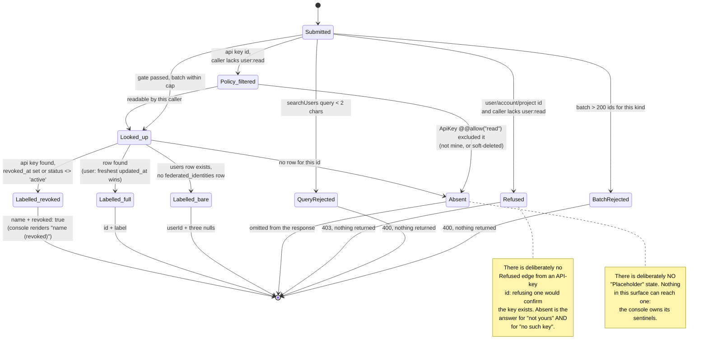

# Identity resolution (`user:read`, plus one row-scoped kind)

Three read-only RPC procedures turn opaque ids into human labels for a console, so it can
show "Ada Lovelace · ada@example.com" instead of a cuid:

| Procedure             | Input                                                    | Output                                          |
| --------------------- | -------------------------------------------------------- | ----------------------------------------------- |
| `resolveUserProfiles` | `{ userIds: string[] }`                                   | `{ profiles: UserProfile[] }`                    |
| `resolveActorLabels`  | `{ userIds[], accountIds[], projectIds[], apiKeyIds[] }`  | `{ users[], accounts[], projects[], apiKeys[] }` |
| `searchUsers`         | `{ query: string, limit?: number }`                       | `{ users: UserProfile[] }`                       |

`UserProfile` is `{ userId, displayName?, email?, username? }`; `ActorApiKeyLabel` is
`{ apiKeyId, name, projectId, accountId, revoked }`.

`resolveUserProfiles` and `searchUsers` are gated whole on the single `user:read` permission
(`Permission::UserRead`), which `lightbridge-admin`'s default `*` grant covers and neither
`lightbridge-editor` nor `lightbridge-viewer` holds — see `docs/rbac.md`.

`resolveActorLabels` is gated **per kind**, and that is the one thing to understand about this
surface before changing anything in it.

## Why `resolveActorLabels` is gated per kind

Owner feedback, 2026-09-03: *"can we use names on the 'Spend by API key' panel? API keys do have
names."* They did, and the panel printed raw cuid2s, because the only key names the console could
reach were a PROJECT-scoped `listApiKeys` — so a panel with one `projectId` could label its rows and
a panel spanning several (the account-family lens at `/settings/overview/usage`, the account
overview's own breakdown) could not.

Two obvious fixes were both wrong. Widening the console's listing is an N+1 across projects.
Widening this procedure's `user:read` gate hands every reader of a spend panel the estate-wide
identity surface — display claims for people they have no relationship with. So the authorization
got **finer** instead of looser:

| Kind                                   | Who may resolve it                     | An id they may not see |
| -------------------------------------- | -------------------------------------- | ---------------------- |
| `userIds`, `accountIds`, `projectIds`  | `user:read` only — estate-wide, no ownership filter | `403`, naming the reason |
| `apiKeyIds`                            | anyone, scoped per ROW by `ApiKey`'s own `@@allow("read", …)` | absent from the result |

The op-id itself therefore sits in `AUTHENTICATED_ONLY_OP_IDS` rather than being mapped to
`user:read`: a coarse per-op gate cannot say "three of these lists need a permission, the fourth
needs a row check". The `user:read` requirement **moved into the handler**
(`identity_directory.rs::require_user_read_for_admin_kinds`); it did not go away. An
`apiKeyIds`-only call — which is exactly what an ordinary member's spend panel sends — is served.

**The two "may not see" answers are deliberately different.** The three estate-wide kinds *refuse*,
because an empty list already means "no row for that id", and reusing it for "you may not ask"
would make an unknown id and a forbidden one indistinguishable. `apiKeyIds` *omits*, because there
the refusal itself would be the leak: a `403` for a key id you do not own confirms that the key
exists, and it would take the caller's own resolvable keys down with it in the same batch.

### How the API-key row scope is enforced

Not by a hand-written ownership join. The handler reads the requested ids back through the
generated `db.api_key()` delegate — the `listMyExpiringApiKeys` idiom — so the isolation rule *is*
`ApiKey`'s own compiled `@@allow("read", …)` clause (account owner **or** project member, plus
`apikey:read`), which cratestack-pg folds into the SQL `WHERE` unconditionally with no bypass. A
second hand-written predicate could drift from the model's policy; this one cannot. The model's
`@@soft_delete` filter comes along for free, which is why a non-admin sees no label for a deleted
key while an admin does.

The visible ids then go through one shared query
(`lightbridge-authz-api-key/src/api_key_labels.rs`) for the label shape itself — the `projects` join
that supplies `accountId`, which the `ApiKey` model deliberately has no relation path for.

`revoked` is derived (`revoked_at IS NOT NULL OR status <> 'active'`), not a column. It is
deliberately coarse — "this key cannot be used any more", not a four-valued lifecycle — because a
spend row for a dead key reads as a live cost centre otherwise, and that is the only distinction a
label needs to draw.

## Two rules that are not negotiable

**Never fabricate an identity.** An id with no row is simply ABSENT from the result. The console
owns every "Unknown" sentinel it renders; the backend has no placeholder-identity concept. A `users`
row that exists but has never completed a login still resolves — to its `userId` plus three nulls,
which is a different fact from "absent" and is reported as one.

**Reject, do not truncate.** Batches are capped at 200 ids per kind (`apiKeyIds` included, checked
before the visibility query rather than only inside it) and an over-cap batch is refused with
`BadRequest`. A truncated result is indistinguishable from "those ids do not exist", which is
precisely the confusion this surface exists to remove. `searchUsers`'s `limit` is the deliberate
exception: it *clamps* to 50 (default 20), because asking for "as many as you have" makes no
correctness claim about a specific set of ids.

## Where the data comes from

`users` carries `id`/`status` and nothing else. Every display claim (`name`, `email`,
`preferred_username`) lives on `federated_identities`, refreshed on each login. The join runs
`users.id → accounts.user_id → accounts.id → federated_identities.account_id`, because a federated
identity adopts an *account*, not a user (ADR-0024, corrected 2026-08-25). One person may own
several accounts (ADR-0026) and the uniqueness index is per `account_id`, so several identity rows
per user are structurally possible; the query picks the most recently updated one.

## Request flow

```mermaid
sequenceDiagram
    autonumber
    participant C as Admin console
    participant G as rpc_authorize gate<br/>(rpc_authorize.rs)
    participant P as cratestack policy<br/>(@allow, authz.cstack)
    participant D as identity_directory.rs<br/>+ actor_api_key_labels.rs
    participant K as db.api_key()<br/>(generated delegate)
    participant R as StoreRepo<br/>(identity_resolution.rs,<br/>api_key_labels.rs)
    participant DB as Postgres

    C->>G: POST /rpc/procedure.resolveActorLabels<br/>{ userIds, accountIds, projectIds, apiKeyIds }
    G->>P: dispatch (authenticated-only op-id)
    P->>P: auth() != null && auth().rpcScope == "crud"
    P->>D: resolve_actor_labels(args)

    alt any list longer than 200
        D-->>C: 400 BadRequest (rejected, not truncated)
    else within cap
        alt apiKeyIds non-empty
            alt caller holds user:read
                D->>R: resolve_api_key_labels(apiKeyIds) — estate-wide
            else caller does not
                D->>K: db.api_key().find_many().where_(id IN apiKeyIds)
                K->>DB: SELECT … WHERE id IN (…)<br/>AND «ApiKey @@allow("read") folded in»<br/>AND deleted_at IS NULL
                DB-->>K: only the rows this caller may read
                D->>R: resolve_api_key_labels(visible ids)
            end
            R->>DB: SELECT k.id, k.name, k.project_id, p.account_id,<br/>(k.revoked_at IS NOT NULL OR k.status <> 'active')<br/>FROM api_keys k JOIN projects p …
        end

        alt userIds/accountIds/projectIds non-empty and caller lacks user:read
            D-->>C: 403 — "…require the user:read permission; apiKeyIds does not"
        else permitted (or all three empty)
            D->>R: resolve_user_profiles(userIds)
            R->>DB: SELECT DISTINCT ON (u.id) … FROM users u<br/>LEFT JOIN accounts LEFT JOIN federated_identities
            D->>R: resolve_account_labels(accountIds)
            R->>DB: SELECT … FROM accounts WHERE id = ANY($1)
            D->>R: resolve_project_labels(projectIds)
            R->>DB: SELECT … FROM projects WHERE id = ANY($1)
            D-->>C: { users, accounts, projects, apiKeys } — unknown/invisible ids absent
        end
    end
```

One query per kind, never one per id. They run sequentially rather than concurrently: each is a
single indexed `= ANY($1)` lookup capped at 200 ids, and racing them would buy the round trips'
latency at the cost of a pool connection per kind per call. `apiKeyIds` costs two round trips on
the row-scoped path — the visibility read, then the label read — and one on the admin path.

## What happens to one requested id



`Absent` and `Labelled_bare` are different facts and stay different on the wire — "we have never
heard of this id" versus "this person exists but has never completed a login".

## Search, honestly

`searchUsers` matches case-insensitively on all three display columns, prefix **or** substring, and
orders deterministically: prefix matches first, then by the best available label, then by `userId`.
LIKE metacharacters in the query are escaped, so searching `100%` searches for that text rather
than matching everyone.

`20260902000003_federated_identities_display_claim_indexes.sql` adds three partial
`lower(<col>) text_pattern_ops` indexes. They serve the **prefix** arm only. No btree index of any
operator class can serve a leading-wildcard `%needle%` match — that needs a `pg_trgm` GIN index, and
`CREATE EXTENSION pg_trgm` needs privileges the migration role is not guaranteed to hold, which
would fail every service's init container (ADR-0031) rather than degrade. The substring arm stays a
scan over a table with one row per human who has ever logged in, reachable only with the admin-only
`user:read` permission. Revisit if that table ever grows past the point where it is a real cost.

## ADR-0038 note

The four estate-wide queries are hand-written SQL
(`crates/lightbridge-authz-api-key/src/identity_resolution.rs`), not the generated cratestack
client, for two independent reasons:

1. `federated_identities` is deliberately absent from `authz.cstack` entirely — it also carries the
   sealed Keycloak token envelope, so a credential-bearing table must be unreachable from any
   generated read path (ADR-0024 Q4). There is no generated path to reach the claims through.
2. `Account`/`Project`'s `@@allow("read", …)` clauses are ownership-scoped (`userId == auth().id`)
   and cratestack folds them into every query unconditionally with no bypass. An estate-wide admin
   label lookup is exactly the query that policy cannot express, and widening the shared clause
   would widen `model.Account.list`/`model.Project.list` for every other caller too.

The `@allow` clause is therefore the whole authorization story for `resolveUserProfiles` and
`searchUsers`: the SQL underneath applies no ownership filter, on purpose.

The API-key label query (`api_key_labels.rs`) is hand-written for reason 2 only, in a narrower
form: `ApiKey` carries `projectId` and no account edge — the model deliberately has no second
relation path to `Account` (see `ProjectMember`'s comment in `authz.cstack` for the codegen blowup
that rule exists to prevent) — so the label's `accountId` needs a join the generated client cannot
express. It applies no ownership filter of its own **because the caller already applied one**: the
handler decides visibility through `db.api_key()` first and passes only the surviving ids. That
split is what lets one SQL shape serve both an admin and a member. Any future caller of
`resolve_api_key_labels` must do the same; the function is `pub` because the REST crate needs it,
not because it is safe to hand raw user input to.
