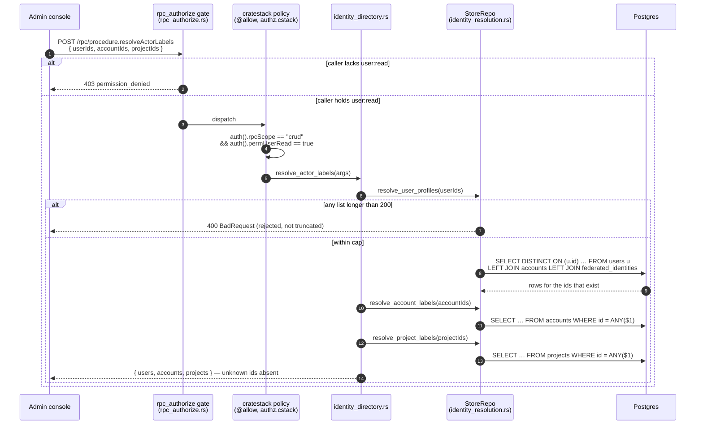
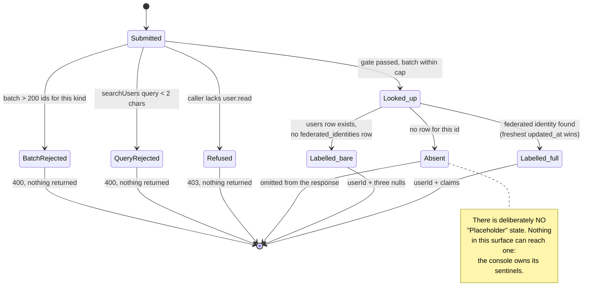

# Admin identity resolution (`user:read`)

Three read-only RPC procedures turn opaque ids into human labels for an admin console, so it can
show "Ada Lovelace · ada@example.com" instead of a cuid:

| Procedure              | Input                                       | Output                                       |
| ---------------------- | ------------------------------------------- | -------------------------------------------- |
| `resolveUserProfiles`  | `{ userIds: string[] }`                     | `{ profiles: UserProfile[] }`                 |
| `resolveActorLabels`   | `{ userIds[], accountIds[], projectIds[] }` | `{ users[], accounts[], projects[] }`         |
| `searchUsers`          | `{ query: string, limit?: number }`         | `{ users: UserProfile[] }`                    |

`UserProfile` is `{ userId, displayName?, email?, username? }`. All three are gated on the single
`user:read` permission (`Permission::UserRead`), which `lightbridge-admin`'s default `*` grant
covers and neither `lightbridge-editor` nor `lightbridge-viewer` holds — see `docs/rbac.md`.

## Two rules that are not negotiable

**Never fabricate an identity.** An id with no row is simply ABSENT from the result. The console
owns every "Unknown" sentinel it renders; the backend has no placeholder-identity concept. A `users`
row that exists but has never completed a login still resolves — to its `userId` plus three nulls,
which is a different fact from "absent" and is reported as one.

**Reject, do not truncate.** Batches are capped at 200 ids per kind and an over-cap batch is refused
with `BadRequest`. A truncated result is indistinguishable from "those ids do not exist", which is
precisely the confusion this surface exists to remove. `searchUsers`'s `limit` is the deliberate
exception: it *clamps* to 50 (default 20), because asking for "as many as you have" makes no
correctness claim about a specific set of ids.

## Where the data comes from

`users` carries `id`/`status` and nothing else. Every display claim (`name`, `email`,
`preferred_username`) lives on `federated_identities`, refreshed on each login. The join runs
`users.id → accounts.user_id → accounts.id → federated_identities.account_id`, because a federated
identity adopts an *account*, not a user (ADR-0024, corrected 2026-08-25). One person may own
several accounts (ADR-0026) and the uniqueness index is per `account_id`, so several identity rows
per user are structurally possible; the query picks the most recently updated one.

## Request flow

One query per kind, never one per id. The three run sequentially rather than concurrently: each is
a single indexed `= ANY($1)` lookup capped at 200 ids, and racing them would buy three round trips'
latency at the cost of three pool connections per call.

## What happens to one requested id

`Absent` and `Labelled_bare` are different facts and stay different on the wire — "we have never
heard of this id" versus "this person exists but has never completed a login".

## Search, honestly

`searchUsers` matches case-insensitively on all three display columns, prefix **or** substring, and
orders deterministically: prefix matches first, then by the best available label, then by `userId`.
LIKE metacharacters in the query are escaped, so searching `100%` searches for that text rather
than matching everyone.

`20260902000003_federated_identities_display_claim_indexes.sql` adds three partial
`lower(<col>) text_pattern_ops` indexes. They serve the **prefix** arm only. No btree index of any
operator class can serve a leading-wildcard `%needle%` match — that needs a `pg_trgm` GIN index, and
`CREATE EXTENSION pg_trgm` needs privileges the migration role is not guaranteed to hold, which
would fail every service's init container (ADR-0031) rather than degrade. The substring arm stays a
scan over a table with one row per human who has ever logged in, reachable only with the admin-only
`user:read` permission. Revisit if that table ever grows past the point where it is a real cost.

## ADR-0038 note

All four queries are hand-written SQL (`crates/lightbridge-authz-api-key/src/identity_resolution.rs`),
not the generated cratestack client, for two independent reasons:

1. `federated_identities` is deliberately absent from `authz.cstack` entirely — it also carries the
   sealed Keycloak token envelope, so a credential-bearing table must be unreachable from any
   generated read path (ADR-0024 Q4). There is no generated path to reach the claims through.
2. `Account`/`Project`'s `@@allow("read", …)` clauses are ownership-scoped (`userId == auth().id`)
   and cratestack folds them into every query unconditionally with no bypass. An estate-wide admin
   label lookup is exactly the query that policy cannot express, and widening the shared clause
   would widen `model.Account.list`/`model.Project.list` for every other caller too.

The `@allow` clause is therefore the whole authorization story for these three procedures: the SQL
underneath applies no ownership filter, on purpose.
