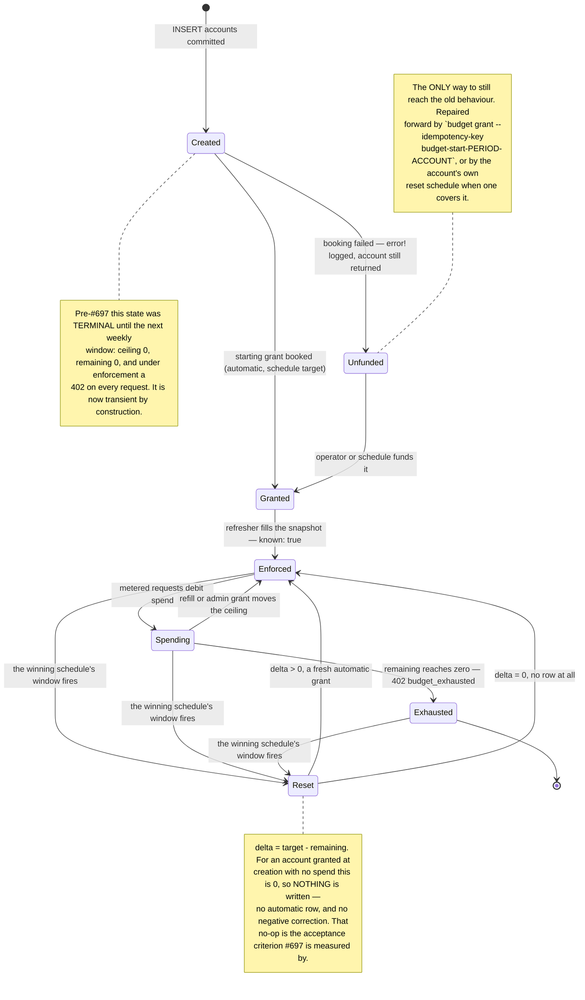

# ADR-0015: Refill amounts are admin-configured policy ranges, not a fixed server-picked ladder

- Status: Proposed
- Date: 2026-08-19
- Decision owners: @stephane-segning

## Context

ADR-0008 decided refills move an account exactly one rung up a compile-time, 7-value ladder
(`b-15 … b-1000`) that only the server chooses from (`current_tier.next()`); the caller supplies
no amount. That was deliberate: `converse-frontends#148`'s attempt at a caller-chosen tier was
rejected on exactly that basis, recorded at `authz.cstack:701-704` ("a tier picker cannot be
built because the caller doesn't choose the tier").

Two things have changed since.

**Product requirement.** Refill amounts must be admin-configurable without a Rust recompile,
bounded (today: $6 minimum, $30 maximum for self-service), and the request UI must state the
amount that will actually be requested rather than hiding it behind a button that silently asks
for "the next rung."

**The gateway constraint ADR-0008 was built around currently binds nothing.** That constraint is
real — Envoy/Lyft-ratelimit counters keyed on rule position, ADR-0084's incident, ADR-0110's
append-only rule — but verified directly against `ai-helm`'s `origin/main`: `git grep` for
`x-budget-tier`/`budget-tier` across the whole tree matches only `plans/` planning docs, never a
rendered `BackendTrafficPolicy` template. The live gateway today keys purely on `x-billing-plan`.
The `x-budget-tier` cutover (`ai-helm#877`, "Phase 6a") is open, unimplemented, and retargeted to
land no earlier than 2026-09-01. So there is no live redis counter today whose key identity
depends on how many rungs exist, what they're named, or whether they're defined in Rust or in a
policy document — the constraint governs the *eventual* gateway cutover, not this change.

Separately, `converse-frontends#148`'s blocking objection — "the caller doesn't choose the
tier" — is answered differently now than a bare caller-chosen amount alone would answer it: the
existing rule-data `PolicyEngine` (ADR-0007) already gates every requested amount through
`AutoApprove` / `AutoApproveCapped` / `ManualReview` / `Deny` before any grant is written. A
caller choosing an amount does not mean a caller is granted that amount — policy still decides,
exactly as it does today for the single amount the server used to compute on the caller's
behalf.

## Decision

1. **Refill amounts are admin-managed, not a fixed enum.** The valid self-service amounts
   (today: $6, …, $30) are a field on the same rule-data policy document (`RuleSet`,
   `crates/lightbridge-authz-budget/src/rule_data.rs`) that already decides
   auto-approve/manual-review/deny, versioned and activated through the existing
   `PolicyStore` / `activateBudgetPolicy` / `simulateBudgetPolicy` / `getBudgetPolicyStatus`
   machinery. No new CRUD surface, no new admin RPC family.

2. **Discrete offered amounts, not a continuous range.** `RuleSet` carries
   `allowed_amounts_micros: Vec<i64>` (strictly ascending, unique, positive) rather than a
   `min`/`max` pair a caller could pick any value inside of. Justification: it keeps ADR-0008's
   "a rung is always a meaningful jump" property alive (a $17.43 refill is not a meaningful
   product concept here); it keeps the UI a picker instead of a currency text input with
   rounding/precision edge cases; and it keeps "reset-not-topup" legible — each offered amount
   is a known, round period total, exactly as today's `b-15…b-1000` values are. `min_micros`/
   `max_micros` are not separate fields — they are simply the first/last element of the
   (validated-ascending) vector, used for display and for validating the vector itself.

3. **The caller chooses an amount from the configured set; policy still decides the outcome.**
   `RequestBudgetRefillInput` gains `requestedAmountMicros: String`. `RefillService::
   request_refill` stops deriving the amount via `current_tier.next()`; it validates the
   caller's requested amount is a member of the active policy's `allowed_amounts_micros`, then
   hands it to `PolicyEngine::evaluate` exactly as before. `AutoApprove` / `AutoApproveCapped` /
   `ManualReview` / `Deny` are unchanged.

4. **"Admin accepts if needed" is the existing `ManualReview` + `ReviewService` queue.** No
   parallel or new approval path is built for this change.

5. **The starting budget for an account with no grant history this period is its own,
   separately admin-configured value** (`starting_amount_micros` on the same policy document) —
   distinct from both the offered self-service amounts and the fail-closed floor (Decision 6).
   It is not derived from the minimum of `allowed_amounts_micros`, even though it may happen to
   equal it.

6. **The fail-closed floor for an outage or an unresolvable/unrecognized amount is a distinct,
   separately configured value** (`fail_closed_floor_micros`), used only when a lookup fails or
   returns data matching no known amount — never the same code path as "new account, no history
   yet" (Decision 5). If policy itself cannot be loaded (the policy-store read fails), resolution
   falls back to a hardcoded, in-code constant `DEFAULT_FAIL_CLOSED_FLOOR_MICROS`, documented at
   its declaration, set low enough that no plausible real policy would ever configure a floor
   below it — an absent policy must never grant more than a present one would.

7. **What survives from ADR-0008:** reset-not-topup semantics (a granted amount is a period
   total, not an increment; changing amount resets the window's counter — unchanged); the
   per-period self-service step cap (was "two rungs," now expressed as the existing
   `self_service_grant_count` rule-data condition — unchanged mechanism, only the offered
   amounts it gates changed shape); the ledger recording exactly what was requested and why
   (ADR-0009 — unchanged); ADR-0008's own gateway-constraint analysis (still correct — it
   simply does not currently bind, per Context above).

8. **What is replaced:** the compile-time `BudgetTier` enum as the sole source of valid refill
   amounts, and the "server always picks `.next()`, caller chooses nothing" model. This
   directly and deliberately reverses the basis on which `converse-frontends#148` was rejected
   (`authz.cstack:701-704`) — only because policy-mediated approval now answers the concern
   that rejection existed to protect: an unconstrained caller *choice* does not become an
   unconstrained *grant*.

## Consequences

**Positive**

- Amounts change with a policy revision, not a Rust recompile or a service deploy.
- One place (`RuleSet`) now owns both "is this amount grantable" and "which amounts are worth
  offering," instead of splitting that between a Rust enum and separate policy rules.
- The refill UI can state the true amount being requested instead of an opaque "request a
  refill."

**Negative**

- Removes the enum's compile-time guarantee that only known, reviewed amounts are ever
  requested. That guarantee moves to runtime validation against the active policy document —
  weaker in kind (a bad revision is now a runtime condition, not a compile error) — though
  `PolicyStore` already validates a revision before activating it, and activation refuses to
  swap in an invalid one.
- Three previously-conflated concepts (starting budget, fail-closed floor, offered self-service
  amounts) now need three explicit fields instead of one enum's lowest variant silently doing
  triple duty. This is only safe if each has its own test asserting it is read from its own
  field and none of the three silently substitutes for another.

**Neutral / follow-ups**

- `ai-helm#877`'s Technical Context and `ai-helm`'s `plans/lightbridge-dynamic-budget.md §0.2`
  still hard-code `b-15 … b-1000` as *the* ladder. They need a corresponding update before #877
  is implemented, or its eventual gateway cutover renders a stale, mismatched ladder. Tracked
  separately — this ADR does not modify `ai-helm`.
- PR #381 (`feat/budget-tier-jwt-claim`, open) added `BudgetRepo::current_tier` and
  `resolve_budget_tier`, both hard-coded to `BudgetTier::B15` as their fail-closed fallback,
  written before this ADR existed. It must either land first — with this ADR's Decision 6
  fallback applied to it in a prompt follow-up — or be rebased onto this change. Either way,
  its fallback must resolve to `fail_closed_floor_micros`, never a hard-coded rung.
- The wire labels the old enum used (`"b-15"`, `"b-30"`, …) may still be a reasonable *display*
  convention for whatever amounts a policy happens to configure, but they are no longer a
  source of truth for which amounts are valid — only `allowed_amounts_micros` is.

## Alternatives considered

- **Keep the enum; add a `B6` variant and config-driven min/max caps around it.** Rejected:
  still requires a deploy to change any amount, which the product requirement
  ("configurable") explicitly rules out.
- **A `min_micros`/`max_micros` continuous range instead of discrete offered amounts.**
  Rejected for the reasons in Decision 2 — it reintroduces arbitrary-amount UX and precision
  questions ADR-0008 deliberately avoided, for no product benefit stated in this request.
- **A new, separate admin CRUD surface for "budget ranges."** Rejected: duplicates
  `PolicyStore`'s already-shipped versioned/validated/activatable lifecycle for no reason; the
  rule-data document is already the right shape for "an administrator changes numbers that
  govern refill outcomes without a deploy."
- **Grants decrement the counter instead of resetting it.** Already rejected by ADR-0008 for
  reasons that still hold (it would change what the ADR-0070 quota dashboard means); this ADR
  takes no new position on it.

## Amendment, 2026-09-05 — Decision 9: the starting grant is booked at account creation

[#697](https://github.com/ADORSYS-GIS/lightbridge-authz/issues/697). Decision 5 named the number a
brand-new account starts with. It did not say **who books it, or when** — and nobody did. An
account was funded only when a reset schedule with a matching predicate next ran (ADR-0032), which
is weekly. Seven free-plan accounts created between June and August 2026 held zero grant rows until
the 2026-09-04 backfill, invisible only because the gateway read them as `known: false` and failed
open. Under the enforcing limiter (ADR-0034 §15.7, enforcing since 2026-09-04) the same gap is up
to **seven days of `402 budget_exhausted` for every new signup**.

**Decision 9. Account creation books the starting grant, in the same call, before it returns.**

- **Trigger:** every path that writes an `accounts` row. That is exactly one place —
  `StoreRepo::create_account` — reached through `AuthzStoreImpl::create_account`, which the RPC
  `createAccount` procedure, the MCP `create-account` tool and the console's bootstrap flow all
  delegate to. The grant is booked there, not at first API-key issuance.
- **Amount — the rule, and it is not Decision 5 by default:** the grant equals what
  `effective_schedule(account)` would reset the account to, i.e. the winning enabled reset
  schedule's `amount_micros`. **Decision 5's `starting_amount_micros` is the fallback, and only
  when no enabled schedule covers the account at all.** The reset scheduler in `mode: reset` books
  `delta = target − remaining`, so any other amount is clawed back by a negative `correction` row
  on the next window — the `$8`-vs-`$15` trap `docs/budget-cli.md` documents. Granting the
  schedule's own target makes that window a no-op (`delta = 0`, and a zero-amount row is rejected
  by `budget_grants_amount_sign_chk` anyway).
- **Source `automatic`, not `admin`:** the grant stands in for the schedule run that would
  otherwise have funded the account, so `budget_balances` must bucket it that way.
- **Idempotent on `budget-start-<period>-<account_id>`**, through `BudgetRepo::grant` and never raw
  SQL (ADR-0009: a double grant has no undo).
- **Not in the account insert's transaction.** `accounts` is written by
  `lightbridge-authz-api-key`, which does not and should not depend on the budget crate — the
  budget domain is downstream of tenancy, not beside it. The grant is booked immediately after the
  insert commits, with the idempotency key as the retry guard.
- **A failure to book is logged (`error!`), not propagated.** The `accounts` row is already
  committed, and since ADR-0026 a retried `createAccount` mints a *second* account rather than
  re-running the first — so failing the procedure would turn one unfunded account into two. The
  repair path is `lightbridge-authz budget grant --idempotency-key budget-start-<period>-<id>`,
  which is exactly once by construction.
- **The snapshot is touched** (ADR-0034 §15's existing `touch` path), so the account joins the
  refresher's working set immediately and the gateway reads `known: true` on the next tick rather
  than on the account's first metered request.

### The consequence to keep in view

An account carries no `billing_plan` of its own; a plan reaches it through its projects
(`projects.billing_plan`) and their API keys. At `createAccount` an account has neither, so a
`billing_plan`-scoped schedule — which is what production runs (`"Refill $8"`, scope
`billing_plan=free`) — does **not** cover it yet, and Decision 5's policy amount is what fires.
**Keep `starting_amount_micros` aligned with the operative plan schedule's `amount_micros`**, or
the first weekly window after the account acquires a free-plan project books the difference as a
`correction`. A `global`-scoped schedule matches from the first second and has no such gap. Both
branches are pinned by tests (`starting_grant_tests.rs`).

### Create → grant → snapshot

```mermaid
sequenceDiagram
    autonumber
    actor U as Caller (console / RPC / MCP)
    participant H as AuthzStoreImpl::create_account
    participant T as StoreRepo (tenancy, own tx)
    participant S as StartingGrantService
    participant SCH as effective_schedule
    participant PG as BudgetRepo::grant (one tx)
    participant SNAP as budget_remaining_snapshots
    participant GW as Gateway (Authorino)

    U->>H: createAccount { defaultQuota?, name? }
    H->>T: BEGIN — INSERT accounts (+ users via trigger) — COMMIT
    T-->>H: account { id }
    H->>S: book(account.id, now)
    S->>SCH: winning enabled schedule for this account?
    alt a schedule covers it
        SCH-->>S: EffectiveSchedule { amount_micros = target }
    else nothing covers it
        SCH-->>S: none
        S->>PG: read the active policy revision
        PG-->>S: starting_amount_micros (ADR-0015 Decision 5)
    end
    S->>PG: BEGIN — INSERT budget_grants (source=automatic,<br/>idempotency_key=budget-start-PERIOD-ACCOUNT)<br/>+ UPDATE budget_balances — COMMIT
    Note over PG: a replay resolves to the grant that already exists;<br/>apply_grant_delta is a no-op — there is no reading to move yet
    S->>SNAP: touch(account.id) — row created, last_seen_at = now()
    S-->>H: booked grant
    H-->>U: account
    Note over SNAP,GW: the refresher fills the reading on its next tick,<br/>so the gateway reads known: true, remaining = grant
```

### An account's budget, as a lifecycle



## Related

- ADR-0007 (the decision contract this reuses unchanged), ADR-0008 (superseded on the points
  listed under Decisions 7/8 above; its gateway-constraint analysis otherwise stands),
  ADR-0009 (ledger, unchanged)
- `converse-frontends#148` (the prior caller-chosen-amount rejection this deliberately
  reverses, and why)
- `lightbridge-authz` PR #381 (`feat/budget-tier-jwt-claim`, open — fallback needs Decision 6
  applied)
- [#697](https://github.com/ADORSYS-GIS/lightbridge-authz/issues/697) (Decision 9 above),
  ADR-0032 (reset schedules, `effective_schedule`), ADR-0034 §15/§15.6/§15.7 (the snapshot and the
  enforcing limiter), `docs/budget-cli.md` (the `$8`-vs-`$15` rule this reuses)
- `ai-helm#877`, `ai-helm` ADR-0084, ADR-0110 (the gateway constraint this ADR's Context
  verifies does not currently bind, and the cross-repo doc drift this ADR flags but does not
  fix)
