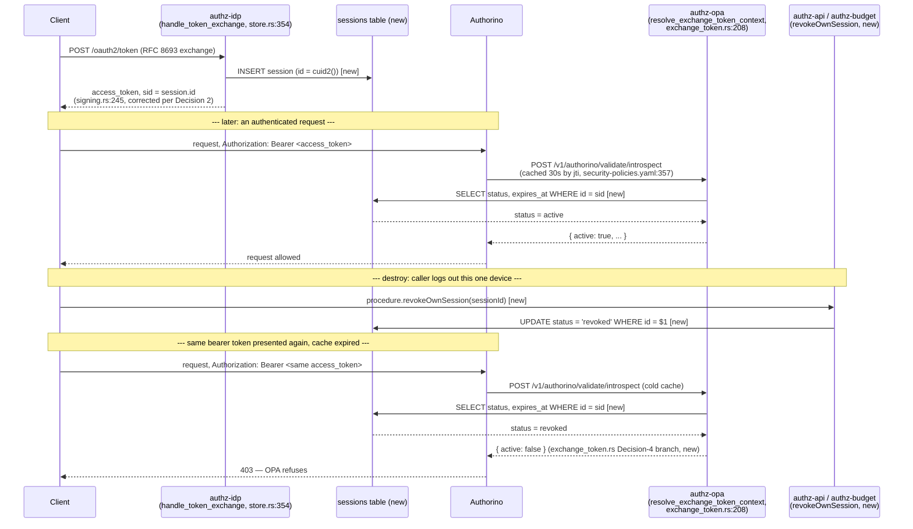
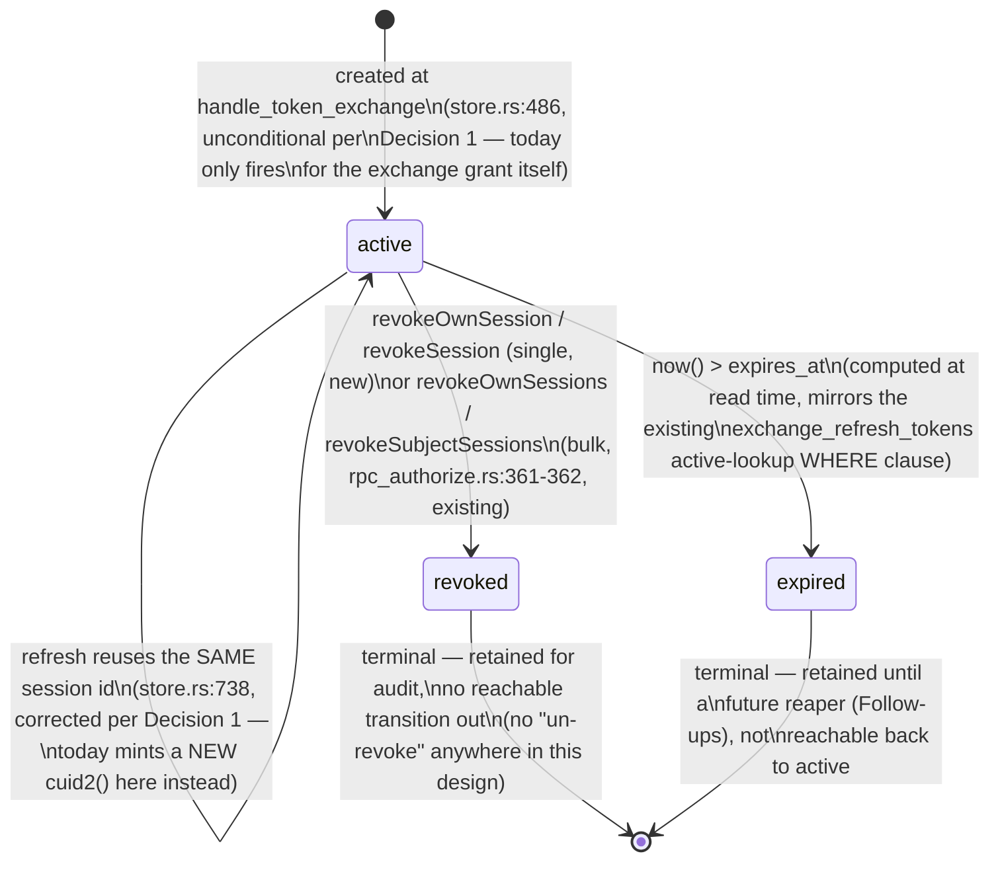

# ADR-0020: Sessions become a first-class, revocable table; `sid` becomes its id, and introspection fails closed on revocation

- Status: Accepted
- Date: 2026-08-23
- Decision owners: Stephane Segning Lambou

## Context

**This service already gives out a claim named `sid` and a permission pair named
`session:revoke-own`/`session:revoke`, and neither one currently identifies or protects a real
row.** That gap is the whole subject of this ADR. It is a **blocking design document**: it decides
the shape, not the code — no implementation lands in this PR, only the decision and the follow-up
ticket breakdown (see "Follow-ups").

### 1. `sid` is minted fresh, at random, on every single token — and read by nothing

`access_token_extra` (`crates/lightbridge-authz-rest/src/signing.rs:224-267`), the one function
shared by the self-signed API-key signer and the token-exchange grant, unconditionally does this
on line 245:

```rust
extra.insert("sid".to_string(), Value::String(cuid2()));
```

Every access token this service mints — API key or human/OIDC — gets a brand-new random CUID2 in
its `sid` claim, uncorrelated with anything before or after it. A repo-wide `grep -rn '"sid"'`
(excluding `target/`) turns up exactly two other hits, both in
`crates/lightbridge-authz-rest/tests/signing_tests.rs:874,899`, and both only assert that `sid`
*changes* between two mints of the same key — never that it identifies anything durable. `sid` is
never written to any table and never read back by any handler. It is, today, decoration.

### 2. A second, differently-named session id exists — also freshly minted, also never persisted, and this one IS read back

`TokenExchangeOpStore::handle_token_exchange` and `handle_refresh_token`
(`crates/lightbridge-authz-rest/src/oauth2_op/store.rs:354`, `:633`) each mint their own session id
independently:

```rust
// handle_token_exchange, store.rs:486
let session_id = cuid2();
// ...
let mut access_extra = access_token_extra(
    &owner,
    &session_id,          // <- store.rs:496, passed into access_token_extra's `api_key_id` param
    ...
);
```

```rust
// handle_refresh_token, store.rs:738 — a SECOND, unrelated cuid2() call
let session_id = cuid2();
```

Because `access_token_extra`'s second positional parameter is named `api_key_id`
(`signing.rs:226`), this `session_id` value lands on the token's **`api_key_id` claim**, not `sid`
— there is no `api_keys` row behind it (`exchange_token.rs:178-181`'s own doc comment: *"there is
no `api_keys` row, so this is surfaced as the introspection response's `sub`... never as
`api_key_id`"*). `resolve_exchange_token_context` (`exchange_token.rs:208`) reads it straight back
out at line 295: `session_id: claims.api_key_id`. This is a **known, filed, open bug**
([#421](https://github.com/ADORSYS-GIS/lightbridge-authz/issues/421), open today, filed by this
repo's owner: *"We need to stop reusing the JWT claim name `api_key_id` for the native RFC 8693
token-exchange session id... a token-exchange-minted access token carries a claim set that is
unambiguously distinguishable, at every layer that reads it"*) — see Decision 2.

**Neither value is persisted anywhere in this workspace.** Both are regenerated from scratch on
every exchange *and* every refresh — `handle_refresh_token` does not reuse the session id of the
token it is refreshing, it mints a new one (store.rs:738). So even the one claim that today gets
read back (`api_key_id`) identifies a session that changes identity on its own next refresh — it
cannot be looked up, cannot be listed, and cannot be revoked mid-lifetime by anything.

### 3. This service's own code already says this is an accepted tradeoff — quoted here because this ADR supersedes it

`resolve_exchange_token_context`'s doc comment (`exchange_token.rs:193-206`) states the current
position plainly:

> **What `active: true` means for the token this builds a response for.** Unlike an API key
> (revocable by flipping `api_keys.status`), a token-exchange access token has no per-token
> revocation list — it is a short-lived, stateless JWT
> (`oauth2.token_exchange.access_ttl_seconds`), exactly like a Keycloak-issued access token, and
> this service has never had a way to revoke one mid-lifetime (see the disabled
> `keycloakintrospection` AuthConfig step in `ai-helm-values` for the same accepted tradeoff on the
> Keycloak plane).

The same acceptance is independently documented at the config layer:
`Oauth2TokenExchange::access_ttl_seconds`'s own doc comment
(`crates/lightbridge-authz-core/src/config/mod.rs:891-892`): *"Kept short (session-scoped) because
these tokens are only revocable by expiry."*

**This ADR supersedes both statements.** After this ADR's implementation tickets land, a
token-exchange access token *does* have a per-token revocation list — the `sessions` table — and
introspection consults it. The disabled Keycloak-plane `keycloakintrospection` step
(`ai-helm-values` `environments/prod/values/security-policies.yaml`, commented out since 2026-07-02
per #533, for reasons unrelated to this ADR — a synchronous-call/fail-open bug under load, not a
design objection) is a **separate** system (Keycloak's own session store) and is explicitly out of
scope here; this ADR only closes the gap on the plane this repo controls: tokens issued by its own
`authz-idp` token-exchange grant.

### 4. `exchange_refresh_tokens` is the only durable, revocable artifact today — and it is closer to "a session" than its name admits

`migrations/20260709000002_exchange_refresh_tokens.sql` defines: `id, subject, account_id,
project_id, token_hash, scope, status, created_at, expires_at, last_used_at`. Three later ALTERs
grew it further:

- `migrations/20260814000002_..._add_identity_snapshot.sql` — `email`, `email_verified`,
  `auth_time` (upstream snapshots, ADR-0011).
- `migrations/20260814000003_..._add_client_id.sql` — `client_id`, binding a refresh token to the
  registered client it was issued to.
- `migrations/20260815000001_..._add_chain.sql` — **`chain_id`** and **`chain_expires_at`**. This
  is the closest thing this codebase has today to a session identity: `chain_id` is *"shared by
  every token minted across one rotation chain, starting at the offline_access exchange grant that
  gave birth to it and inherited unchanged by every subsequent rotation"*, and `chain_expires_at`
  is *"an absolute deadline set once, when the chain is born... without this, refreshing before
  every individual token's `expires_at` gives an unbounded session"* (migration's own comment). In
  other words: this codebase already independently arrived at "a stable id born at first grant,
  inherited across rotation, with an absolute lifetime cap" — it just called it `chain_id` and
  scoped it to refresh-token bookkeeping instead of promoting it to a first-class, introspectable
  concept. Decision 1 below builds on this precedent rather than ignoring it.

`exchange_refresh_tokens` is a documented ADR-0038 exception already (`AGENTS.md`'s "Persistence"
section: CAS rotation via `SELECT ... FOR UPDATE`, not migratable to cratestack).

### 5. Revocation authority for "all of a subject's sessions" already exists — but it cannot touch an already-minted access token

This was the biggest surprise this investigation turned up, and it changes this ADR's scope for the
better: **`session:revoke-own`/`session:revoke` are not proposed permissions — they already exist**
(`crates/lightbridge-authz-core/src/authz.rs:121,125`), already gate two live RPC procedures
(`docs/rbac.md:330-355`, "Refresh-token session revocation"):

- `procedure.revokeOwnSessions` (`rpc_authorize.rs:361`, gated `SessionRevokeOwn`) — "log out
  everywhere": revokes every active refresh-token session for `auth().id`. No subject field on its
  input at all (`authz.cstack`'s `RevokeOwnSessionsInput` — `reason` only) — structurally incapable
  of targeting anyone else.
- `procedure.revokeSubjectSessions` (`rpc_authorize.rs:362`, gated `SessionRevoke`, admin-only via
  `lightbridge-admin`'s `*`) — the offboarding kill switch, targeting an operator-supplied
  `accountId` (`authz.cstack`'s `RevokeSubjectSessionsInput` — `accountId`, `reason`).

Both call `AuthzStoreImpl::revoke_sessions` (`crates/lightbridge-authz-rest/src/handlers/mod.rs:596`),
which calls `StoreRepo::revoke_active_exchange_refresh_tokens_for_subject`
(`crates/lightbridge-authz-api-key/src/repo.rs:908-921`) — one `UPDATE exchange_refresh_tokens SET
status = 'revoked' WHERE subject = $1 AND status = 'active'`.

**The gap: this flips refresh tokens, and introspection never reads `exchange_refresh_tokens` at
all.** `resolve_exchange_token_context` (`exchange_token.rs:208-296`) — the function that actually
answers "is this access token still good" for every introspection call against a non-API-key
credential — checks JWKS signature/expiry, current project membership, and project/account
suspension. It contains **zero** references to `exchange_refresh_tokens` or to either revoke
procedure's effect. So today: a user who calls `revokeOwnSessions` correctly stops all future
*refreshes* — but every access token already in someone's hands from before that call keeps
introspecting as `active: true`, completely unaffected, until it naturally expires
(`access_ttl_seconds`, default 900s). The two existing RPC procedures give an operator a button
that looks like "kill this session now" and actually means "this session cannot renew itself
anymore, wait up to 15 minutes." That distinction is not currently surfaced anywhere the caller can
see it.

Also missing today: neither procedure can target **one specific session** — both are
bulk-revoke-everything-for-a-subject. There is no "list my sessions" query at all, so a user has no
way to even see what they are revoking before hitting the "log out everywhere" button.

### 6. Discovery/upstream facts already established elsewhere, restated for reference

- Authorino caches the `/v1/authorino/validate/introspect` response it fetches for this class of
  token for **30 seconds**, keyed by `jti`: `ai-helm-values`
  `environments/prod/values/security-policies.yaml:356-357` (`cache: { key: { selector:
  auth.identity.jti }, ttl: 30 }`), on the `"lightbridgeintrospect"` metadata step, gated on
  `auth.identity.api_key_id != ""` (`security-policies.yaml:348-350`) — a condition every
  token-exchange access token also satisfies today, per point 2 above, since its `api_key_id` claim
  currently carries the (unpersisted) session id. `ai-helm-values` is a sibling GitOps repo,
  verified here via a local clone, not modified by this ADR.
- `access_ttl_seconds` defaults to 900s (`config/mod.rs:918-920`); `refresh_ttl_seconds` to
  2,592,000s / 30 days (`:922-924`); `refresh_absolute_ttl_seconds` to 90 days
  (`default_exchange_refresh_absolute_ttl_seconds`, same file).
- `resolve_exchange_token_context` is the live production code path backing
  `/v1/authorino/validate/introspect` for exchange tokens — confirmed by
  `introspect_api_key`'s dispatch (`crates/lightbridge-authz-rest/src/handlers/introspect.rs:45-60`):
  any bearer with no matching `api_keys` row falls through to
  `introspect_exchange_token`/`resolve_exchange_token_context`. **This means the session-status
  check this ADR adds requires no new gateway wiring** — it lands inside a function already on the
  hot path Authorino already calls and already caches.
- ADR-0039 (id format): every id this service mints is CUID2 via
  `lightbridge_authz_core::cuid::cuid2()`, `TEXT`, opaque, never shape-validated, never sorted by
  (use `created_at`).
- ADR-0038 (persistence): cratestack is the sanctioned database API; documented exceptions are
  `signing_keys` (advisory-lock rotation), `project_members` (composite PK), `exchange_refresh_tokens`
  (CAS rotation), and the usage service's dynamic aggregates.
- ADR-0019 already put a device-grant and authorization-code flow on this service's roadmap,
  neither of which is refresh-token-shaped in the way the native RFC 8693 exchange is —
  `AuthorizationCodeStore`/`DeviceCodeStore` bind a short-lived code/user-code to a client and
  redirect, not to a refresh-token row. Whatever "session" means here has to outlive any one grant
  type's own storage shape.

## Decision

### 1. A new, dedicated `sessions` table — not an overload of `exchange_refresh_tokens`

Rejected: extending `exchange_refresh_tokens` to double as the session record. Two independent
reasons, both concrete:

- **Not every token-exchange grant has a refresh token.** A caller that does not request
  `offline_access` gets an access token and no `exchange_refresh_tokens` row at all
  (`handle_token_exchange`'s `offline` gate, store.rs). But every access token — with or without a
  paired refresh token — needs to be revocable and introspectable as a session; Decision 4 requires
  a session lookup on *every* introspection call for this credential class, not only the ones that
  happen to have a refresh token. A refresh-token-shaped table structurally cannot represent that.
- **Future grant types (ADR-0019) are not refresh-token-shaped.** The authorization-code flow's
  `AuthorizationCodeStore` and the device grant's `DeviceCodeStore` bind a short-lived code to a
  client and a pending authentication, not to a rotating bearer secret. A `sessions` table needs to
  be the thing every grant type's resulting access token points at, independent of which store
  minted it — `exchange_refresh_tokens` is scoped to exactly one grant's renewal mechanism and
  should stay that way.

**Relationship to `exchange_refresh_tokens`:** a refresh-token row gains a `session_id` column
referencing `sessions.id`, minted once at the initial exchange and carried unchanged through every
rotation — the same "born once, inherited across rotation" shape `chain_id` already established
(Context, point 4). Concretely, `chain_id`'s role is subsumed by `sessions.id`
and `chain_expires_at`'s role is subsumed by `sessions.expires_at`: the *session* is now the thing
with a stable identity and an absolute lifetime; the refresh-token chain is one renewal mechanism
scoped underneath it. Whether the implementation ticket retires `chain_id`/`chain_expires_at`
outright (backfilling `session_id` from the existing `chain_id` values, since every existing chain
already satisfies this ADR's definition of a session) or keeps them as a redundant safety net for
one release is left to that ticket — the column-level migration mechanics are not decided here,
only that `sessions.id` becomes the source of truth going forward.

**Session creation/reuse rule, correcting today's behavior:** a session row is created exactly
once, at the initial `handle_token_exchange` grant (Context point 2's `store.rs:486`) —
**unconditionally**, whether or not `offline_access` was requested, since even an access-token-only
grant needs a revocable identity. `handle_refresh_token` (Context point 2's `store.rs:738`) **must
stop minting a new session id on every refresh** and instead resolve and reuse the session id
already bound to the refresh token being redeemed (via the new `session_id` column). This is a
correction, not a new requirement: today's `let session_id = cuid2();` at store.rs:738 silently
discards session continuity on every single refresh, which is inconsistent with `chain_id` already
getting this right one column over.

### 2. `sid` becomes the session row's id — and this should land together with #421

The `sid` claim (`signing.rs:245`) stops being `Value::String(cuid2())` computed inline and instead
carries the same value as the newly created/resolved session row's `id`. This makes `sid`
consultable for the first time: introspection (Decision 4) looks a session up by `claims.sid`.

This directly intersects open issue **#421** (*"api_key_id claim reused for token-exchange session
id causes gateway 403 + wrong budget-refill refusal"*), which is about the **other** claim
(`api_key_id`, Context point 2) currently carrying an unpersisted session-shaped value. **These
should land together, as one implementation PR, not sequenced:**

- #421's fix (stop stamping the session id into `api_key_id`) and this ADR's fix (start stamping a
  *real, resolvable* session id into `sid`) are two edits to the exact same two call sites
  (`store.rs:486` and `:738`, both calling `access_token_extra`). Landing them separately means an
  intermediate state where `api_key_id` still carries a stale/ambiguous session-shaped value *and*
  `sid` now carries a real one — two claims disagreeing about which one is authoritative, which is
  strictly worse than either bug alone, and is exactly the "gateway 403" failure mode #421 already
  documents happening once with only one of the two claims wrong.
- Concretely: `access_token_extra`'s `api_key_id` parameter (`signing.rs:226`) stops being
  overloaded with the session id (satisfying #421) in the exact same commit that gives it a
  *correct* home — the `sid` claim, now backed by a real row (satisfying this ADR). Splitting these
  into two PRs asks a reviewer to reason about which claim gateway config should trust for one PR's
  entire lifetime, twice.

### 3. Revocation authority reuses what already exists, and adds only what's missing: read, and a single-session target

No new *authority* is needed for "self can revoke own, admin can revoke any subject's, break-glass
revoke-all-for-a-subject exists" — Context point 5 already established all three are live via
`session:revoke-own`/`session:revoke`. What's missing is (a) a way to see sessions before revoking
one, and (b) a way to revoke exactly *one* session instead of every session for a subject. Two new
permissions, following the existing `budget:read-own`/`budget:read` self/admin split exactly:

| Permission | Mirrors | Grants |
|---|---|---|
| `session:read-own` (new) | `budget:read-own` | `listMySessions` — the caller's own sessions only, no target field, same structural shape as `RevokeOwnSessionsInput`/`GetMyBudgetBalanceInput` |
| `session:read` (new) | `budget:read` | `listSubjectSessions` — admin, operator-supplied `accountId`, mirrors `RevokeSubjectSessionsInput` |
| `session:revoke-own` (existing) | — | `revokeOwnSessions` (existing, bulk, unchanged) **plus** `revokeOwnSession(sessionId)` (new) — revoke exactly one of the caller's own sessions, e.g. "log out that one browser," leaving the others live |
| `session:revoke` (existing) | — | `revokeSubjectSessions` (existing, bulk-by-subject, unchanged — this remains the break-glass "revoke every session for this subject" capability) **plus** `revokeSession(sessionId)` (new) — the estate-wide "revoke any one session" capability the task asks for explicitly, distinct from the existing bulk-by-subject one |

`session:read-own` is granted to every default role that already holds `session:revoke-own`
(`lightbridge-editor`, `lightbridge-viewer` — `docs/rbac.md:209-210`), on the same "seeing/ending
your own sessions is self-protective, not a write capability inconsistent with a read-only role"
reasoning `docs/rbac.md:353-355` already applies to `session:revoke-own`. `session:read` follows
`session:revoke`'s admin-only posture (`lightbridge-admin`'s `*` only). This is a decision for the
implementation ticket's role-mapping config, not this ADR's schema change.

### 4. Introspection must consult session status — fail closed on any lookup error

`resolve_exchange_token_context` (`exchange_token.rs:208-296`) gains a session-status lookup keyed
on `claims.sid` (post-Decision-2), joining the existing membership/project/account-suspension
checks it already runs live on every call. Three outcomes, matching the function's existing
"never widen `active`" contract (its own doc comment, `exchange_token.rs:196`, "no partial state
escapes this function"):

- **Session found, `status = active`, not past `expires_at`**: proceed exactly as today —
  membership/suspension checks still run, unchanged.
- **Session found but `status != active`, or past `expires_at`, or no session row found at all
  (e.g. pre-migration token, or a claim that doesn't resolve)**: return `Ok(None)`, following the
  exact pattern the function already uses for `not_a_member`/`project_suspended`/`account_suspended`
  (structured `tracing::info!` with `active = false, reason = "..."`, then `return Ok(None);`).
  Introspection responds `active: false` — this is the revocation taking effect.
- **The session lookup itself errors** (DB unreachable, timeout): **this is a fail-closed refusal,
  never a fallback to "treat as active."** Mirrors the pattern `resolve_quota_tier` already uses
  one function over (`store.rs:282-301`, doc comment: *"refusing to mint rather than omitting the
  claim, which would be indistinguishable from a legitimate 'no per-member ceiling' account"`) —
  applied here to *reading* rather than minting: a session lookup that fails is not
  distinguishable from "the session is fine, we just couldn't check," and the whole point of this
  ADR is that a caller must never see stale-active because a check silently didn't run. Propagate
  `Err`, not `Ok(None)` and not `Ok(Some(...))` — this repo's own house rule states it plainly
  (`AGENTS.md`, review priority #1): *"A missing or unparseable claim is not a default — it is
  'unknown', and unknown routes to the strictest branch."* An unreachable session store is
  "unknown," and the strictest available branch for an already-erroring request is to fail the
  introspection call outright (which itself resolves to a safe outcome — Authorino's own
  documented fail-open-on-fetch-failure behavior for *that* HTTP call is a property of the gateway
  config, not something this function should try to simulate by inventing an `active: true`).
  **A test asserting this — session-store unreachable ⇒ introspection call errors, never `active:
  true` — is a hard requirement of the implementation ticket, not optional coverage**, per this
  repo's own testing rule to write one such test per dependency.

The full mint → introspect → destroy → OPA-refuses lifecycle, citing the exact call sites each
step lands on (`(new)` marks code this ADR's implementation tickets add; everything else already
exists on the path today):



### 5. The revocation boundary, stated honestly

**What "destroying a session" guarantees, and what it does not:**

- An access token is a stateless, signed JWT. Nothing this ADR builds can strike a bearer JWT out
  of existence or make a signature-only validator (one that checks `exp`/signature and never calls
  `/v1/authorino/validate/introspect`) refuse it before its `exp`. This repo controls Authorino's
  configured behavior, not every conceivable future consumer's.
- For the plane that **does** call introspection (Authorino's `"lightbridgeintrospect"` metadata
  step, already covering this credential class per Context point 6), revocation takes effect within
  **the Authorino cache TTL**, currently `30` seconds
  (`ai-helm-values` `environments/prod/values/security-policies.yaml:357`) — the next introspection
  call after the cached entry expires sees the updated session status. Before that TTL elapses, a
  request presenting the now-revoked token that hits a warm cache entry is still allowed —
  revocation is not instantaneous for a request landing inside the cache window.
- **Worst case is bounded, not unbounded**, by `oauth2.token_exchange.access_ttl_seconds`
  (`config/mod.rs:891-894`, default 900s / 15 minutes): even if a revocation is issued the instant
  after a token is minted and cached, the token cannot outlive its own `exp` regardless of session
  status — so the true worst case for "how long can a revoked-but-cached token still work" is
  `min(access_ttl_seconds, time until the next post-revocation introspection call)`, i.e. **at most
  900 seconds, typically far less** once the ≤30s cache window is accounted for. This is the number
  to give an operator who asks "how fast is 'destroy this session,' really" — not "instant."
- This is a real, permanent narrowing of the previously-accepted tradeoff (Context point 3), not a
  full close of it. State this in any user-facing "log out this device" copy: it should not promise
  instant effect everywhere, only "this device stops being able to refresh immediately, and stops
  being usable at all within a few tens of seconds to a few minutes depending on when its current
  access token was cached."

### 6. Session lifecycle: three states, two reachable forward transitions, no reachable reverse transition

- **`active`** — the only state a session is created in.
- **`revoked`** — terminal. Reached only via an explicit action: `revokeOwnSession`/`revokeSession`
  (single, new) or `revokeOwnSessions`/`revokeSubjectSessions` (bulk, existing, repointed at
  `sessions` instead of `exchange_refresh_tokens` directly — see Decision 9). No transition out of
  `revoked` exists; there is no "un-revoke." A caller who revoked the wrong session must mint a new
  one (log in again), the same recovery story `exchange_refresh_tokens` already has for a revoked
  refresh token.
- **`expired`** — reached by the passage of time past `expires_at`, **computed at read time, not
  written by any process**. This mirrors how `exchange_refresh_tokens`' own active-token lookup
  already works (a `WHERE status = 'active' AND expires_at > now()` shape, not a background job
  that flips rows to a literal `'expired'` string) — no cron/reaper is required for correctness,
  only for storage hygiene (Follow-ups).
- Retention: revoked and expired rows are **retained**, not deleted — consistent with every other
  status-flip table in this schema (`exchange_refresh_tokens` rows are never `DELETE`d either; only
  `budget_grants` is a DB-trigger-enforced append-only ledger per ADR-0009, and `sessions` does not
  need that stronger guarantee — a session is a mutable-status row like `exchange_refresh_tokens`,
  not a financial ledger). A bounded-retention purge of long-dead rows is a real future need
  (storage growth, and a privacy retention argument — Decision 7) but is explicitly **not** decided
  here; see Follow-ups.



**Unreachable by design, stated explicitly per this repo's own "draw the state machine, don't just
describe it" rule:** `revoked -> active` and `expired -> active` do not exist as transitions
anywhere in this decision. A UI must not offer a "reactivate" control for either state — if that
capability is ever wanted, it needs its own ADR, because it changes the revocation guarantee
Decision 5 states ("no reachable reverse transition" is part of what makes the guarantee honest).

### 7. Session metadata — what makes the UI list useful, and the privacy call on each field

| Field | Purpose | Privacy note |
|---|---|---|
| `id` | the session's own identity (= `sid`) | opaque, ADR-0039 |
| `account_id` | whose session this is | already the JWT `sub`, no new exposure |
| `project_id` | which project context this session was scoped to at mint | — |
| `client_id` | which registered OAuth client this session belongs to (dashboard vs. a future CLI/browser client) | lets a user tell "the dashboard, in Chrome" apart from "a CLI token" in a list |
| `status` | `active` / `revoked` / `expired` (Decision 6) | — |
| `created_at` | when the session began | — |
| `last_used_at` | most recent successful introspection or refresh | tells a user "this session is still being used" before they revoke it |
| `expires_at` | absolute cap (Decision 1's `chain_expires_at` successor) | — |
| `user_agent` | raw `User-Agent` header string presented at mint time, best-effort | **Recommended, low sensitivity on its own** — this is exactly what makes "Chrome on macOS" vs. "curl/8.1" distinguishable in a session list, the whole point of the feature. Store the raw string; do not build a UA-parsing pipeline as part of this ADR (a follow-up UI concern, not a storage one). |
| `ip_address` (proposed, not decided) | the source IP at mint time | **Flagged, not settled here.** An IP is more identifying than a UA string and this repo has no existing precedent for storing one (nothing in this schema does today). Storing it raises a real retention/purpose-limitation question a docs-only ADR should not wave through silently. The implementation ticket must either (a) get an explicit decision to store it, with a stated retention bound, or (b) drop it from the first cut and ship without it — either is acceptable, but "store it because it might be useful" is not a decision this ADR makes. |

This table is deliberately smaller than "everything we could capture" — matching this repo's own
"claims freeze at mint time... a roster/quota change should propagate faster than a token's
lifetime" discipline (`docs/governance-model-and-enforcement.md`, cited in ADR-0011 Decision 7):
session metadata is a snapshot at mint time, not a live-updated profile, except for `last_used_at`
and `status`, the two fields that exist specifically to change.

### 8. ADR-0039 compliance, restated for this table specifically

`sessions.id` is minted via `lightbridge_authz_core::cuid::cuid2()` — the one chokepoint, no second
import path, no `Uuid::new_v4`/`gen_random_uuid()`. Stored `TEXT`. Opaque: no regex, no `starts_with`,
no length check anywhere in this design. Never sorted or paginated by `id` — `listMySessions`/
`listSubjectSessions` order by `created_at`, matching every other list in this schema.

### 9. ADR-0038: `sessions` goes through cratestack's schema for reads and single-row writes; bulk revoke stays a hand-written procedure, exactly like today

Unlike this repo's three existing exceptions:

- `signing_keys` needs `pg_advisory_xact_lock` for cross-replica rotation — `sessions` has no
  cross-replica coordination problem; every write is scoped to one row or one subject's rows.
- `project_members` needs a composite primary key cratestack's generator can't model — `sessions`
  has a plain, single-column `id` PK, no different from `Project`/`ApiKey`.
- `exchange_refresh_tokens` needs `SELECT ... FOR UPDATE` CAS rotation because a refresh token is
  single-use-and-replaced under concurrent-refresh risk — a session's own status flip
  (`active -> revoked`) has no equivalent race to guard against: revoking an already-revoked session
  is a harmless no-op, not a security-relevant double-spend the way redeeming a refresh token twice
  is.

**Reads and single-session operations are a real cratestack `Session` model**, `@use(AuditFields)`
for `createdAt`/`updatedAt` (matching every other model in `authz.cstack`), `status` as a plain
`String` (this schema's established convention for closed-set values — see `Project.modelPolicy`'s
and `AugmentationRequest.status`'s own doc comments for the same choice, parsed fail-closed on the
Rust side the same way `ModelPolicy::from(String)` already is). `listMySessions`/
`listSubjectSessions` and the new single-session `revokeOwnSession`/`revokeSession` mutations use
`@@allow` row-scoping the exact same way `Project`'s read policy already does (`accountId ==
auth().id` for self; the coarse RBAC permission gate in `rpc_authorize.rs`, Decision 3's table,
for the admin variants) — no new authorization mechanism, the same two-layer split (RBAC gate
first, `@@allow` ownership second) `rpc_authorize.rs`'s own module doc already establishes for
every other model here.

**The two existing bulk procedures (`revokeOwnSessions`/`revokeSubjectSessions`) stay hand-written
`Procedures` methods, unchanged in shape** — a single `UPDATE ... WHERE account_id = $1 AND status
= 'active'` affecting an unbounded number of rows under one permission check is exactly the kind of
query ADR-0038's existing exceptions are for, and cratestack's generated single-row mutations don't
express "flip every matching row" natively. They are simply repointed at `sessions` instead of
`exchange_refresh_tokens` directly (Decision 6), and — per Decision 1 — cascade to revoke the
`exchange_refresh_tokens` rows chained under each revoked session too, so a bulk "log out
everywhere" cannot leave a live refresh token behind for a session it just killed.

## Consequences

### Positive

- Closes a real, already-documented, already-quoted gap: "no way to revoke a token-exchange access
  token mid-lifetime" stops being true for the introspected plane.
- Mostly additive to already-shipped work, not a rebuild: `session:revoke-own`/`session:revoke`,
  `revokeOwnSessions`/`revokeSubjectSessions`, and the `chain_id`/`chain_expires_at` precedent all
  already exist and are reused, not replaced. The net-new authority surface is two read permissions
  and two single-session-targeted mutations.
- Gives a UI something real to render for the first time — `listMySessions` did not exist before
  this ADR; today's "log out everywhere" button had nothing to show a user before they pressed it.
- Fixes #421 as a structural side effect of Decision 2, rather than needing its own separate,
  uncoordinated fix that could land in either order and produce a worse intermediate state.

### Negative

- **Deploy-and-implementation ordering matters within one PR, not across a gateway config change**
  (unlike ADR-0018's cross-repo ordering constraint): Decisions 1, 2, and 4 are one coherent unit —
  a session row must exist and be correctly identified by `sid` *before* introspection can safely
  consult it, and the introspection check must land in the same change as the minting change, or
  there is a window where sessions are created but nothing enforces them (harmless — a fail-open
  gap, not fail-closed) or, worse, where `sid` is wired into introspection before session rows are
  reliably created for every grant (which would fail every introspection call closed — the more
  dangerous ordering mistake). The implementation ticket must land Decisions 1/2/4 together.
- The revocation guarantee remains bounded, not instant (Decision 5) — this must be stated honestly
  in any UI copy, and reviewers should reject a "instantly logs you out everywhere" claim in a PR
  description or frontend string.
- `handle_refresh_token` (`store.rs:633`) changes behavior: it must look up and reuse an existing
  session id instead of calling `cuid2()` again, which touches the same function ADR-0011 already
  flagged as security-sensitive, RFC 8693-critical code. Per this repo's own testing discipline,
  every existing refresh-path failure-mode test needs to be re-run against this change, not assumed
  to still pass.
- New security-sensitive surface: two new single-session mutations (`revokeOwnSession`,
  `revokeSession`) need the same ownership-check rigor as everything else gated by `@@allow` —
  specifically, `revokeOwnSession` must be unreachable for any session not owned by the caller
  (never trust a caller-supplied `sessionId` alone; the `@@allow(accountId == auth().id)` clause is
  what this ADR relies on, and it must be tested, not assumed correct by construction).
- Whether the gateway's existing `"lightbridge-key-active"` deny-on-`active:false` authorization
  step (`ai-helm-values` `security-policies.yaml`, around lines 518-537) already covers
  token-exchange-shaped tokens or carves them out via its `azp` condition was **not** conclusively
  resolved during this ADR's research — it is a different repo's live config, and asserting its
  exact current behavior without deploying and observing it would be guessing. If it turns out to
  carve out exchange tokens today, closing that gap is a gateway-side config change, tracked as a
  follow-up check against a real deployment, not decided or implemented here.

## Alternatives considered

- **Overload `exchange_refresh_tokens` as the session table (add a `sid`-matching column to it
  directly).** Rejected — Decision 1 gives the concrete reason: not every access token has a
  refresh-token row to overload, and future non-refresh-token grant types (ADR-0019) would have
  nowhere to attach.
- **Keep `sid` and `api_key_id` as two independent, coexisting session-identifying claims.**
  Rejected — this is the status quo today (Context point 2) and it is precisely what #421 flags as
  the bug: two claims that can disagree about "the session" is strictly worse than one authoritative
  claim, and maintaining both invites exactly the kind of gateway-config confusion #421's own
  incident already produced once.
- **Instant revocation via a token blocklist checked on every request path, bypassing Authorino's
  cache entirely.** Rejected as out of scope for this ADR: it would mean either a new low-latency
  shared cache this service doesn't currently operate for this purpose, or removing Authorino's
  cache TTL (a throughput/availability tradeoff belonging to a different, gateway-owned decision,
  and the same TTL that #533 already tuned for a real production incident on a different metadata
  step). Decision 5's bounded-not-instant guarantee is judged sufficient for the stated use case
  (a user or admin ending a compromised/stale session), and a stronger guarantee can be revisited
  later against a concrete latency budget if the bound in Decision 5 proves insufficient in
  practice.
- **A DB trigger banning `UPDATE`/`DELETE` on `sessions`, mirroring `budget_grants`' ADR-0009
  append-only ledger.** Rejected — a session's `status` column is specifically designed to be
  mutated in place (`active -> revoked`, `active -> expired` at read time); an append-only ledger
  would need a second projection table just to answer "is this session currently active," which is
  exactly the query this table exists to answer directly and fast, on a request-authorization hot
  path.
- **Skip the two new single-session-targeted mutations and ship only `listMySessions`/
  `listSubjectSessions` plus the existing bulk revoke-all.** Rejected — a session list with no way
  to act on one entry defeats the UI's own purpose ("log out that one old laptop, not my current
  phone too"), and the task this ADR is scoped against explicitly asks for the estate-wide
  admin-revoke-any-session capability, which the existing bulk-by-subject procedure does not
  provide.

## Follow-ups

Implementation tickets this ADR implies, each scoped to land as its own PR:

1. **Migration + cratestack model.** `sessions` table (columns per Decision 7, minus the
   undecided `ip_address` unless a separate decision settles it first), `exchange_refresh_tokens`
   gains `session_id` (FK to `sessions.id`), backfilled from existing `chain_id` values per
   Decision 1. `Session` model added to `crates/lightbridge-authz-api/schema/authz.cstack` per
   Decision 9.
2. **`sid`/session-minting wiring, landed together with #421** (Decision 2): `store.rs:486` mints a
   session row and stamps its id into `sid`; `store.rs:738` resolves and reuses the existing
   session instead of calling `cuid2()` again; `signing.rs:224-267`'s `api_key_id` parameter stops
   carrying a session-shaped value for the token-exchange call sites.
3. **Introspection session-status check** (Decision 4): `resolve_exchange_token_context` gains the
   fail-closed session lookup, plus the required "session store unreachable ⇒ error, never
   `active: true`" regression test.
4. ~~**RPC procedures + RBAC** (Decision 3)~~ — **DONE**, lightbridge-authz#649, 2026-09-02. See
   `docs/sessions-api.md` for the shipped contract and its diagrams. What landed, and how it
   differs from what this ADR sketched:
   - `session:read` / `session:read-own` are in `Permission`, in `rpc_authorize.rs`'s op-id map,
     and `session:read-own` is granted to `lightbridge-editor`/`lightbridge-viewer` in both
     `default_role_permissions()` and the shipped `config/default.yaml` /
     `.docker/authz/container.yaml`, exactly as sketched.
   - **One** read procedure, `querySessions`, not the `listMySessions` + `listSubjectSessions`
     pair. The pair existed in this sketch because own-scoping was assumed to need two input
     shapes; it does not. `Session` gained its `@@allow("read", (auth().permSessionRead == true ||
     subject == auth().id) && ...)` clause instead, which cratestack folds into the SQL `WHERE`, so
     ONE procedure serves both audiences and an own-scope caller cannot escape their scope with any
     filter — the enforcement is the schema, not a handler clamp. Named `querySessions` rather than
     `listSessions` for a codegen constraint, not a design one: cratestack emits
     `handle_list_sessions` for the generic `model.Session.list` verb, so a procedure of that name
     is a hard compile error.
   - Per-session revoke is `revokeSession` as sketched. Its own-vs-other check is in the handler
     (`session_directory::revoke_session`) and cannot move into the schema: `Session` has no
     `@@allow("update", ...)` — adding one would light up the generic `model.Session.update` verb,
     i.e. a way to flip a revoked session back to `active` — and a procedure `@allow` clause can
     only see `auth()`, never the row an id names.
   - `revokeOwnSessions`/`revokeSubjectSessions` were already repointed at `sessions` with the
     cascade by #437/#492 and are untouched by #649.
   - Two additions this sketch did not anticipate, both driven by what a console session table has
     to render: `offline` (does the session's refresh chain carry `offline_access`) and
     `subjectUserId` (the person owning the subject's account, for `resolveUserProfiles`).
5. **UI screen**: a session list consuming `querySessions`, with a per-row "log out this device"
   action calling `revokeSession`, and copy that states the bounded revocation guarantee from
   Decision 5 honestly rather than promising instant effect. Now unblocked by Follow-up 4; the
   admin-console half is tracked as converse-frontends' `/admin/sessions` story.
6. **Gateway verification check** (tracked separately, against a real `ai-helm-values` deployment,
   not this repo): confirm whether `"lightbridge-key-active"`'s existing deny-on-`inactive` step
   already covers token-exchange-shaped tokens once this ADR's introspection change ships, per the
   open question in Consequences.
7. **Reaper/retention pass for long-dead `sessions`/`exchange_refresh_tokens` rows** (Decision 6) —
   sized as its own follow-up once there is a real storage-growth or privacy-retention trigger, not
   speculative work now.
