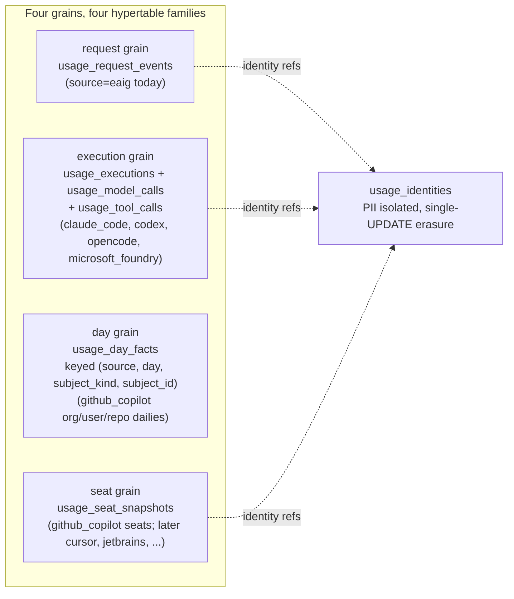

# ADR-0027: one usage store — telemetry partitions by grain, source is a dimension, and the store lives in `lightbridge-authz`

- Status: Accepted
- Date: 2026-08-31
- Decision owners: Stephane Segning Lambou
- Resolves: [lightbridge-authz#535](https://github.com/ADORSYS-GIS/lightbridge-authz/issues/535)
  (this repo's half of the boundary decision) and, via its mirror ADR in `lightbridge-governance`
  ([#182](https://github.com/ADORSYS-GIS/lightbridge-governance/issues/182)), the cross-repo
  contradiction between epic #491 and governance RFC-0003 §6.
- Mirror: `lightbridge-governance` `docs/adr/0014-usage-telemetry-consolidates-into-the-authz-usage-store.md`
  — the two ADRs are written to agree; amending one without the other reopens #535.

> **Update (2026-08-31):** `docs/adr/0028-finops-first-settles-the-usage-store-conventions.md`
> amends several of this ADR's storage-convention details, decided before the first migration
> shipped. It leaves the boundary decision, the four-grain taxonomy, "grain partitions storage,
> vendor never does," and decision 4's *principle* (no unauthenticated door for developer-attributed
> telemetry) untouched. What it supersedes, per ADR-0028's own "What this supersedes in ADR-0027":
> decision 2's mermaid `source` tokens (`claude_code`/`microsoft_foundry`/`github_copilot`) are
> replaced by ADR-0028 D4's kebab-case set (`claude-code`/`microsoft-foundry`/`github-copilot`);
> decision 3's execution-grain dedup key `(trace_id, span_id)` is replaced by D22's
> `(observed_at, trace_id, span_id)`; decision 3's uniform "retention 90 days" is replaced by D6's
> tiered table (13 months raw, 25 months for day/seat facts and aggregates) — "compression at 7
> days" survives; and decision 4's per-collector projected-ServiceAccount-token mechanism is
> replaced by D8 (the principle is unchanged, only the mechanism). The section below is left as
> originally written; read it together with ADR-0028 for the current state.

## Context

Two repositories have been building two normalized, micro-USD, AI-usage telemetry stores, each
assuming a boundary that was never written down (authz audit Q8: the boundary was "inferred, not
recorded anywhere"):

- **This repo** ([#491](https://github.com/ADORSYS-GIS/lightbridge-authz/issues/491)) asserts the
  authz usage DB serves the governance KPIs — one governed, deduplicated, retention-managed store,
  split by grain. Today it holds exactly one table, `usage_events`, fed only by the AI gateway's
  Envoy OTLP access-log sink, with two open P0s against it
  ([#489](https://github.com/ADORSYS-GIS/lightbridge-authz/issues/489): never actually a
  hypertable, prod has no TimescaleDB extension;
  [#549](https://github.com/ADORSYS-GIS/lightbridge-authz/issues/549): no retention, ~100 MB/day,
  60% of it a write-only JSONB column).
- **`lightbridge-governance`** (RFC-0003 §6) asserts the opposite split: gateway request telemetry
  here, IDE and vendor-platform telemetry there. It holds a grain-partitioned
  `executions`/`model_calls`/`tool_calls` hierarchy fed by a push connector with per-provider
  normalizers (`claude_code`, `codex`, `microsoft_foundry`), plus vendor-named Copilot day tables
  its own [#167](https://github.com/ADORSYS-GIS/lightbridge-governance/issues/167) already
  condemns. Its store also runs without TimescaleDB
  ([#159](https://github.com/ADORSYS-GIS/lightbridge-governance/issues/159)).

Both allocations are defensible. Only one is buildable. The repo owner's direction (2026-08-31):
usage ingests from **every governance source** — the gateway today, Copilot/Claude
Code/Codex/OpenCode and the rest of the RFC-0003 taxonomy next — and serves the query APIs for all
of it, the way it already does for gateway data.

## Decision

### 1. One store: `lightbridge-authz-usage` is the system of record for AI-usage telemetry

All AI-usage telemetry — gateway request logs, IDE/CLI OTLP pushes, vendor-platform pull reports —
lands in the usage database owned by this repo and is served by this repo's query APIs.
`lightbridge-governance` keeps the **collectors** (governance-ctl, governance-auth, redact-extproc,
the `aiCliOtel` collector chart) and becomes a *client* of the usage ingest surface; its own
Postgres telemetry store is decommissioned after migration.

### 2. Grain partitions storage. Vendor never does.

Adopted verbatim from governance ADR-0013 invariant 1, and from
[governance#167](https://github.com/ADORSYS-GIS/lightbridge-governance/issues/167)'s acceptance
criteria. There is **one hypertable family per grain**, and `source` is a `TEXT NOT NULL`,
indexed, filterable, group-by-able **dimension column** — never a table name.

**Adding a source requires no schema change.** The definition of done for the first migration is
governance#167's: a second source demonstrably lands in an existing grain table with only a
normalizer and a registry row.

The corollary bans the alternative reading of "a hypertable per collected data": a
`claude_code_events` table, a `copilot_user_daily` table, or any vendor-named table is a defect
under this ADR. The Copilot day tables migrating in from the governance store are folded into
`usage_day_facts` with `subject_kind ∈ {org, user, repo, user_team}`, not copied as-is.

### 3. Rewriting the request grain settles the audit's F-series while we hold the pen

The grain migration is the one moment the whole table is rewritten, so the F1–F6 fixes from
`docs/research/2026-08-25-genai-usage-ingestion.md` land in the same change: money becomes
`cost_micro_usd BIGINT NULL` where `NULL` means *unknown, never zero* (F1/F4, governance ADR-0008);
every grain table carries a deterministic dedup key so retried ingest never double-bills (F5 —
`(trace_id, span_id)` for the execution grain, `(source, day, subject_kind, subject_id)` for the
day grain, an ingest-content key for request events); the attribute bag becomes an **allowlisted**
tail instead of the verbatim, write-only, PII-bearing JSONB that is 60% of current storage (F6,
#549); and identity fields (emails, user names, IPs) move to `usage_identities`, joined not
embedded, erasable with a single UPDATE.

Hypertable discipline per #489, made loud: PK includes the time column,
`by_range(observed_at, INTERVAL '1 day')`, compression at 7 days segmented by the query scope
columns, retention 90 days. **No `EXCEPTION WHEN OTHERS` anywhere in these migrations** — the
current init migration reports success while creating a plain table, and production ran that way
for months. Migrations fail loudly, and a sabotage test proves the failure fires (break it, watch
it fail, restore it — governance#164's bar).

### 4. Developer-attributed telemetry never enters through an unauthenticated door

The strongest argument #535 recorded *against* consolidation was that this store's ingest listener
is unauthenticated by design. That stops being acceptable the moment IDE telemetry — per-developer,
per-email — lands here. So authenticated ingest is a **prerequisite of, not a follow-up to**, any
non-gateway source going live:

- Laptop-origin CLIs (Claude Code, Codex, OpenCode) push to the `aiCliOtel` collector, which
  OIDC-validates authz-issued tokens and forwards with its own workload identity.
- In-cluster collectors (`governance-ctl`, the collector itself) authenticate with per-collector
  projected ServiceAccount tokens (governance#169/#191's pattern), which sidesteps the authz-idp
  machine-to-machine gap (#534) rather than blocking on it.
- **Source identity comes from the credential or the trusted collector processor, never from the
  payload** (governance ADR-0013 invariant 2). A payload-asserted identity is a cross-check that
  raises an alert on mismatch; it never overwrites.

The gateway's existing in-cluster path keeps its current posture until it, too, moves behind
workload identity; it is the one source whose emitter is pinned by deployment topology.

### 5. The query surface is per-grain, and this repo owns it

`lightbridge-authz-usage` serves one closed, typed query endpoint per grain (the ADR-0022
contract, which governance#183 already names as the shape to copy), each with `source` as filter
and group-by. Cross-grain aggregation is **unrepresentable** — separate endpoints, no shared table
parameter — because the audit's F3 showed an optional grain filter defaulting to off double-counts
every KPI. Each endpoint declares its authoritative table in exactly one place (governance#187).
Continuous aggregates: one per KPI measure, exactly one authoritative source per measure, no
aggregate spans grains (governance#166). The named owner #535 demanded for the cross-cutting query
path is this repo's usage service — dashboards (converse-frontends#327, ai-helm#879/#880 successors)
read it, not the governance Postgres.

## Rejected: Option A, separation by origin

RFC-0003 §6's split (gateway here, IDE/vendor there) was coherent and is rejected on costs, not
correctness:

- The headline governance query — total AI spend per engineer across all sources
  (governance#36) — becomes a cross-service join between two stores with two query contracts,
  two auth stacks, and two unit/NULL disciplines. That query is the product; the architecture
  should not make it the hardest query in the estate.
- Every storage invariant (hypertables asserted not assumed, retention, compression, µUSD,
  NULL-cost, dedup, PII isolation) would be built, tested, and operated **twice**, on two CNPG
  tenants, both currently lacking TimescaleDB. #489 and governance#163/#164/#165 are the same
  work; separation doubles it forever.
- The seam was already leaking: governance's RFC-0003 §6 itself flags #491 as asserting the
  opposite, and neither repo could name who owned "spend per engineer".

What Option A would have bought — keeping developer PII out of this store, and a smaller blast
radius per repo — is preserved by decisions 3 and 4 instead: PII is isolated in
`usage_identities`, and non-gateway ingest is authenticated before it exists.

## Consequences

Positive: one Timescale foundation, one query contract, one money discipline; governance#36
becomes a single-store query; governance#167's "no schema change per new source" holds estate-wide.

Negative: this repo absorbs a second grain hierarchy (#535 was explicit: execution grouping, tool
grain, trace correlation are "not a column addition") and the migration of the governance store's
existing rows (Copilot dailies replayable from the S3 raw archive; executions migrated directly).
The usage service's blast radius grows — it already contributed to the 2026-08-29 outage via
unbounded growth, which is why decision 3's retention/compression is not severable from this ADR.

Follow-ups, scoped and linked from #491 per #535's acceptance criteria: the multi-source epic and
its child stories (grain tables, normalizer registry, authenticated ingest, per-grain query APIs,
continuous aggregates, governance-store migration) — filed alongside this ADR. Governance-side:
#182's mirror ADR, RFC-0003 §6 corrected, ADR-0002/0003 amendment notes, epics #159/#161 re-scoped
(#161's own text: "if the boundary resolves the other way, this epic moves repositories" — it now
does).

## Related

- #535, #491, #489, #549, #570, #578 (this repo); ADR-0022 (query contract prior art)
- governance: #182, #167, #159, #161, #166, #187, #30, RFC-0003, ADR-0008, ADR-0013
- `docs/research/2026-08-25-genai-usage-ingestion.md` (the F1–F6 audit this ADR keeps citing)
