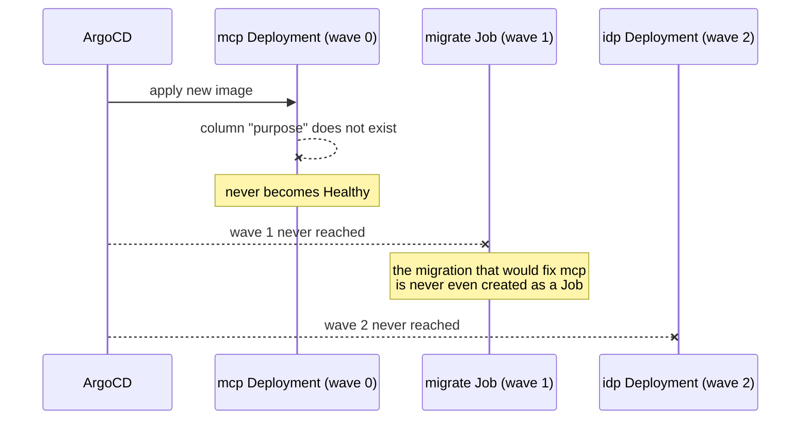
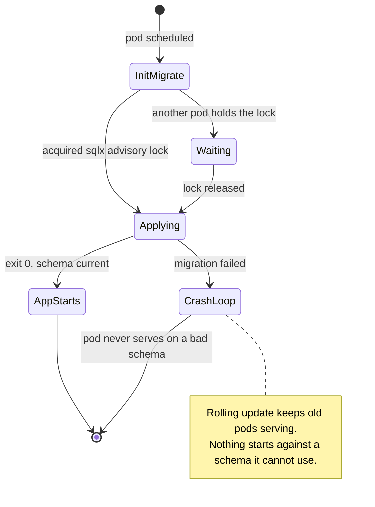

# ADR-0031: Migrations run in init containers, and migrations are backward-compatible for one release

- Status: Accepted
- Date: 2026-09-02
- Decision owners: @stephane-segning
- Supersedes: [ADR-0016](0016-migrate-job-sync-wave-not-hook.md) (the sync-wave Job)

## Context

ADR-0016 replaced a Helm hook with an ArgoCD sync-wave Job, because a `post-install,post-upgrade`
hook only fires once every non-hook resource is already Healthy — exactly backwards when a
migration is a *precondition* for readiness. That reasoning was correct and is not being reversed.

What is being reversed is the mechanism, because the sync-wave Job has now produced **three
separate production incidents in ten days**, in two distinct failure classes.

### Class 1 — the Job's pod template is immutable, its name is not derived from what changed

ADR-0016 gave the Job a name folding the image tag, so a new image yields a new Job. It does not
fold the rendered config. bjw-s/common stamps a `checksum/configMaps` annotation into the pod
template, so a **config-only** change re-renders the *same* Job name with a *different*, immutable
`spec.template`.

- **2026-08-24 (#480, twice).** A config-only change failed the whole app's sync with
  `field is immutable`.
- **2026-09-01 (ai-helm ADR-0135).** The same collision, but the dangerous half: the server-side
  diff dry-run failed, the app stopped applying **anything**, and ArgoCD kept reporting `Synced`
  off cached manifests. The live ConfigMap never changed. Recovery was deleting five completed
  Jobs by hand. A false green is worse than a red.

Mitigations exist (`ServerSideDiff=false`, `Force=true,Replace=true` on the Job). On 2026-09-01
both annotations were present on the live resource and the server-side diff **ran anyway**.

### Class 2 — sync-waves are a global ordering that every subchart must opt into

- **2026-09-02.** [#631](https://github.com/ADORSYS-GIS/lightbridge-authz/pull/631) added a
  `purpose` column to `signing_keys`. `lightbridge-mcp` calls `bootstrap_signing_key` at startup,
  so its new image queries that column. `charts/lightbridge-mcp` has no migrate Job of its own and
  had never been given a sync-wave, so its Deployment rendered at wave **0** — *ahead* of the
  wave-1 migration.

Nothing was user-visible — old pods kept serving — but no deploy could complete, and the sync
retried indefinitely. The ordering guarantee ADR-0016 bought applies only within the chart that
remembered to annotate itself.

## Decision

**1. Migrations run in an init container on every component that talks to the database.**

Each pod runs `lightbridge-authz migrate` as an init container before its app container starts.
`sqlx` takes an advisory lock, so concurrent runners across replicas and components serialize;
the first applies, the rest no-op in milliseconds.

This removes both failure classes by construction: there is no Job resource, so no immutable pod
template and no name-hash to get wrong; and ordering is per-pod, so no subchart can forget to
opt in.

**2. Migrations are backward-compatible for one release (expand/contract).**

A migration may only *add* — new columns nullable or defaulted, new tables, new indexes. Code that
*requires* the new shape ships in the release **after** the one that adds it. Removals and
narrowings are a third release.

This is the part that actually prevents recurrence. #631 shipped a migration and code that
required it *in the same release*; under any ordering mechanism that is a window where some pod
runs against a schema it cannot use. With expand/contract, ordering stops being load-bearing at
all — the init container becomes defence in depth rather than the thing standing between you and
an outage.

## Consequences

**What we gain**

- The immutable-Job-name class (2 of 3 incidents) becomes impossible — there is no Job.
- The cross-subchart wave-discipline class (1 of 3) becomes impossible — no waves are involved.
- No false-green: a failed migration is a `CrashLoopBackOff` on a real workload, not a Job whose
  failure ArgoCD can report as `Synced` from cache.
- Self-healing: any pod that starts has a current schema, including one rescheduled long after the
  original deploy.

**What we give up, stated plainly**

- ADR-0016's explicit promise that *"if migrate fails the sync stops at wave 1 and this Deployment
  is never touched, so already-migrated pods keep serving."* With init containers a bad migration
  crashloops new pods across every component at once. Rolling update still keeps old pods serving,
  so the practical outcome is close — but the failure is spread across five workloads instead of
  isolated in one Job.
- **Observability gets worse, and this is the real cost.** A failed Job is a single obvious object.
  A failed init container is buried in pod events across every deployment. Mitigation: the init
  container keeps the same image and command, so `kubectl logs <pod> -c migrate` is the one place
  to look, and it must be named `migrate` on every component so that command is uniform.
- Every pod start pays a database round trip and possibly a lock wait.
- Migration timing is no longer a distinct deploy phase, so "did the migration run?" is answered by
  reading pod init status rather than a Job's completion.

**Not adopted, and why**

- *Keep the Job, just fix the annotations.* This is what was done on 2026-09-02 as an immediate
  unblock (mcp pinned to wave 2 in `ai-helm-values`). It works, but it is discipline: every future
  subchart must remember, and the 2026-09-01 incident showed the Job's own mitigations can fail to
  take effect.
- *A single migration-owner component with the others gated on it.* Reintroduces cross-component
  ordering, which is the thing that broke.
- *Making the app tolerate a missing migration.* Turns a loud failure into a silent one at the
  authentication boundary. Rejected outright.

## Migration path

1. Add the `migrate` init container to `charts/lightbridge-authz` and `charts/lightbridge-authz-usage`,
   and — this is the one that was missing — to `charts/lightbridge-mcp`.
2. Remove the `migrate` Job controller and its sync-wave annotations, and drop the wave-2
   annotations from the `main` controllers, which then have nothing to order against.
3. Remove the `mcp` sync-wave override from `ai-helm-values` (`environments/prod/values/lightbridge-app.yaml`),
   which exists only to unblock 2026-09-02 and is dead once the Job is gone.
4. Delete the completed migrate Jobs by hand once, since nothing will own them afterwards.

Step 2 is itself a config change to a Job, i.e. exactly the operation that has wedged the app
before — expect to force a resync on the cutover, and do it when someone is watching.

## References

- [ADR-0016](0016-migrate-job-sync-wave-not-hook.md) — the sync-wave Job this supersedes
- ai-helm ADR-0135 — the 2026-09-01 false-green `Synced`
- lightbridge-authz#480 — the 2026-08-24 immutable-pod-template failures
- lightbridge-authz#631 — the migration whose deploy exposed the wave-0 gap
- ai-helm-values#338 — the immediate mcp wave-2 unblock
