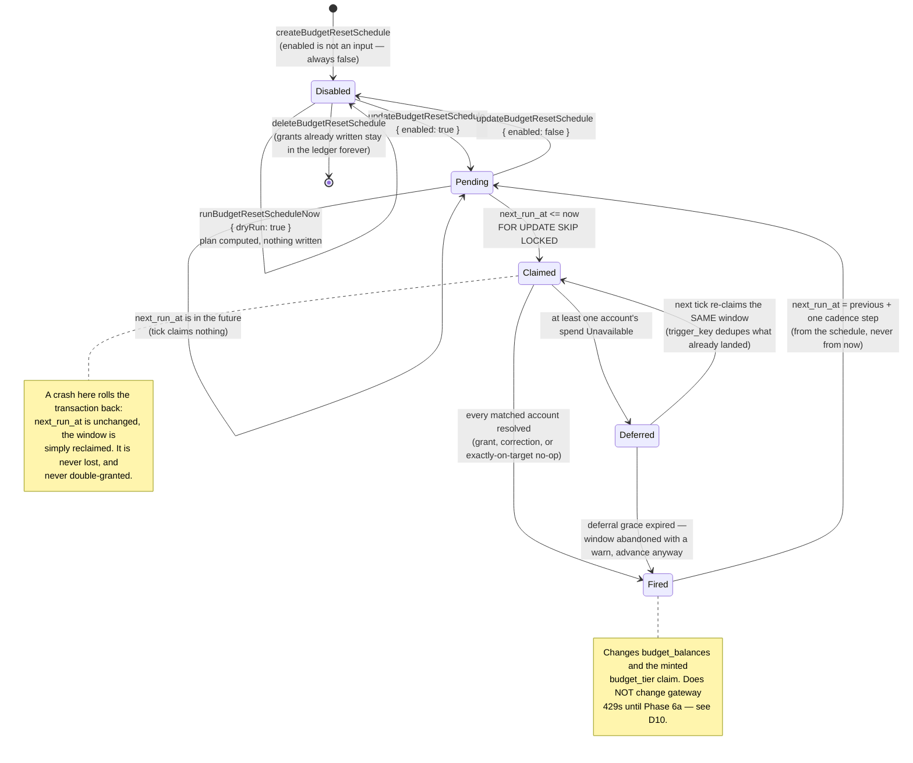

# ADR-0032: Budget reset schedules are ledger policy, executed by a replica-safe scheduler

- Status: Accepted
- Date: 2026-09-02
- Decision owners: @stephane-segning
- Story: [lightbridge-authz#651](https://github.com/ADORSYS-GIS/lightbridge-authz/issues/651)
- Builds on: [ADR-0008](0008-refills-are-discrete-budget-tiers.md) (the period is a calendar
  month), [ADR-0009](0009-budget-grants-are-an-immutable-ledger.md) (append-only, corrections are
  new rows), [ADR-0010](0010-budget-domain-uses-procedures-not-cratestack-models.md)
  (hand-written procedures and repositories), [ADR-0014](0014-budget-tier-claim-via-token-mint-not-keycloak-writeback.md)
  (intra-DB reads at mint time), [ADR-0015](0015-refill-amounts-are-admin-configured-policy-ranges.md)
  (amounts are configured policy, not code)

## Context

There is **no scheduler anywhere in lightbridge-authz**: no cron crate, no job table, no
`tokio::interval` outside the three listener tasks. A budget period simply has no `budget_balances`
row until something writes a grant, which is why most accounts sit at $0 on the first of the month
and why "reset everyone to $2 a day" is, today, a human remembering to run `grantBudget` by hand.

The ask is a standing, previewable, operator-authored rule: *reset remaining to $2.00 every day at
00:00 UTC for every account on the `free` plan*. Three things make that harder than a cron entry:

1. **The ledger is append-only.** A reset that has to take budget *away* cannot update or delete a
   row — `budget_grants_forbid_mutation` rejects it outright.
2. **Spend is not always knowable.** Remaining is `effective_budget − spend_to_date`, and
   spend-to-date comes over HTTP from `lightbridge-authz-usage`. `Spend::Unavailable` is a real,
   common answer, and it is emphatically not `Known(0)`.
3. **`authz-budget` runs several replicas.** Every one of them would wake on the same interval.

## Decision

### D1 — A schedule is a row, not config

`budget_reset_schedules` (migration `20260902000002`) carries `scope_kind` (`global` |
`billing_plan` | `account`), `scope_id`, `cadence` (`daily` | `weekly` | `monthly`), `anchor`
(ISO weekday 1–7 weekly, day-of-month 1–28 monthly, NULL daily), `run_at_utc`, `amount_micros`,
`mode` (`reset` | `top_up`), `enabled`, `next_run_at`, `last_run_at`. Closed domains are
CHECK-constrained TEXT, matching `budget_grants.source` — this schema has no Postgres enum types
and this is not the place to introduce the `ALTER TYPE … ADD VALUE`-outside-a-transaction hazard.

Schedules are **data, not `config/default.yaml`**, for ADR-0015's reason: an operator changes a
budget policy far more often than they roll a deployment.

### D2 — `reset` clamps BOTH ways; a negative delta is a `correction` row

The owner's binding ruling. `delta = amount − (effective_budget − spend_to_date)`.

- `delta > 0` → one grant, `source = 'automatic'`.
- `delta < 0` → one **negative** row, `source = 'correction'` — the only source
  `budget_grants_amount_sign_chk` permits to be negative, and precisely the compensating-entry
  mechanism ADR-0009 already defines (`docs/runbooks/roll-back-a-budget-policy.md`, step 3). The
  original grants are untouched and still visible in `listBudgetGrants`.
- `delta == 0` → **no row at all**. A zero-amount grant is rejected by the same CHECK and would be
  audit noise.

No constraint was widened and `budget_balances`' materialization is unchanged: a `correction`
already lands in `effective_budget_micros` only, never in a source bucket, and the balance
projection still replays bit-for-bit from the ledger (asserted by
`reset_above_target_books_a_negative_refund_type_correction`).

`top_up` is unconditional `+amount_micros`, and does not consult spend at all.

### D3 — Precedence: account > billing_plan > global, most specific only

When several **enabled** schedules match one budget account, exactly one fires: the most specific.
At equal specificity the oldest (`created_at`) wins. A disabled schedule is invisible to
precedence, so disabling an account override hands that account back to the plan schedule with no
further edit. "Reset to $2 daily" and "reset to $15 weekly" coexist by targeting different
plans/accounts.

### D4 — Idempotency is `trigger_key`, and it carries the account id

`trigger_key = "<schedule_id>:<window_start>:<budget_account_id>"`. The story names
`schedule_id + window_start`; `budget_grants_trigger_key_uidx` is a UNIQUE index over the whole
table, so a window matching 100 accounts would collide with itself on the second row without the
third segment. The same string is bound as `idempotency_key` too, because that is the column
`BudgetRepo::grant` resolves with `ON CONFLICT … DO NOTHING` — a replayed window returns the
already-committed grant instead of raising a unique violation.

### D5 — Never grant on unknown spend; a deferred window stays due

`Spend::Unavailable` for an account under a `reset` schedule writes **nothing** for that account,
logs at `warn`, and lets every other account in the window proceed. The schedule's `next_run_at` is
**not** advanced while any account was deferred, so the next 60-second tick re-claims the same
window and retries — accounts that already succeeded are protected by D4. The retry is bounded by a
one-hour grace period (`DEFERRAL_GRACE`), after which the window is abandoned loudly rather than
re-scanning the estate every minute forever against a permanently unreachable usage service.

### D6 — One 60-second tick, claimed with `FOR UPDATE SKIP LOCKED`

`start_budget_server` spawns one `tokio::time::interval(60s)` task (`MissedTickBehavior::Delay`, so
an overrunning tick does not queue a catch-up burst). Each tick opens a transaction, claims due
rows with `SELECT … WHERE enabled AND next_run_at <= now() … FOR UPDATE SKIP LOCKED`, does the
whole pass, advances `next_run_at`, and commits. Several replicas are safe by construction: a row
another replica holds is skipped, not waited on.

The pass runs **inside** the claim transaction on purpose. The grants themselves go through
`BudgetRepo::grant`, which takes its own transaction on its own connection against a different row
(`budget_balances`), so there is no deadlock — and a crash mid-pass rolls the `next_run_at` advance
back, leaving the window due for the next tick, where D4 makes reprocessing harmless. Committing
the advance first would silently lose a window on a crash.

### D7 — `next_run_at` advances from the schedule, never from `now()`

Anti-drift and catch-up are the same rule: the next window is `previous next_run_at + one cadence
step`, stepped until it is strictly in the future. A tick that wakes 47 seconds late still lands on
midnight; a schedule six windows stale lands on the next future window in ONE advance, not six
fires. All arithmetic is UTC, where a calendar day is always 24 hours, so there is no DST
discontinuity to absorb. The monthly anchor is capped at 28 so no month silently skips.

### D8 — `enabled` defaults to false, and no RPC can override that on create

`CreateBudgetResetScheduleInput` has no `enabled` field at all, and `next_run_at` is derived
server-side. A misconfigured `global` schedule cannot rewrite every balance before a human has
looked at the dry run. The intended flow is create → `runBudgetResetScheduleNow { dryRun: true }` →
`updateBudgetResetSchedule { enabled: true }`. Every automatic grant is auditable through
`listBudgetGrants` (`source='automatic'`, or `'correction'` for a reset-down; both carry the
schedule id in their `triggerKey` and its name in `reason`).

### D9 — `budget:schedule-manage`, except for the read

The five management procedures (`listBudgetResetSchedules`, `createBudgetResetSchedule`,
`updateBudgetResetSchedule`, `deleteBudgetResetSchedule`, `runBudgetResetScheduleNow`) share one
new permission. Authoring, editing, deleting and manually firing a standing rule are the same
capability with the same blast radius; splitting them would be granularity theatre. The dry run is
gated there too — it enumerates the estate's accounts and balances.

`getEffectiveResetSchedule` is deliberately gated at **`budget:read`**, the grant a budget card
already needs for `getBudgetBalance`. Reading which rule governs an account is materially
lower-risk than authoring one, and the console's per-account "next reset: `<date>` → $2.00" line
must not require schedule-management rights.

### D10 — This changes the ledger, NOT gateway 429s

**Stated plainly, because it is the thing most likely to be misread:** a fired schedule changes the
`budget_balances` projection the console shows and the `budget_tier` claim minted at token exchange
(ADR-0014). It does **not** change what a request experiences at the gateway. Live 429s come from
Envoy `BackendTrafficPolicy` rate-limit buckets keyed on the Authorino-stamped `x-billing-plan`
header (an epoch-anchored 30-day window that drifts), and
`docs/governance-model-and-enforcement.md:540-551` already records that a successful
`requestBudgetRefill` "changes the ledger and nothing a request actually experiences at the
gateway". Reset schedules inherit that gap exactly. Closing it is **Phase 6a**, a separate
follow-up the owner explicitly ruled out of this scope. Any UI surfacing schedules must carry the
honest caption.

## The process, as diagrams

One tick, end to end:

```mermaid
sequenceDiagram
    autonumber
    participant T as interval task (60s)<br/>lib.rs start_budget_server
    participant S as ResetScheduler::tick<br/>reset_scheduler.rs
    participant DB as budget_reset_schedules
    participant U as SpendReader<br/>/usage/v1/spend/query
    participant L as BudgetRepo::grant<br/>budget_grants + budget_balances

    T->>S: tick(now)
    S->>DB: BEGIN; SELECT … WHERE enabled<br/>AND next_run_at <= now<br/>FOR UPDATE SKIP LOCKED
    DB-->>S: due schedules (another replica's rows skipped)
    loop per claimed schedule
        S->>DB: enumerate matching accounts<br/>(accounts ⋈ users [⋈ projects/api_keys])
        loop per account
            S->>S: drop it if a more specific<br/>enabled schedule covers it
            S->>L: effective_balance(account, period, now)
            S->>U: spend_for_account(account, period)
            alt Spend::Unavailable and mode = reset
                U-->>S: unavailable
                Note over S: no grant — never grant on unknown spend;<br/>account deferred, window stays due
            else Spend::Known(spent) or mode = top_up
                U-->>S: known
                S->>L: grant(delta, source=automatic|correction,<br/>trigger_key=sched:window:account)
                L-->>S: grant (or the already-committed replay)
            end
        end
        alt nothing deferred (or grace expired)
            S->>DB: UPDATE next_run_at = previous + cadence,<br/>last_run_at = now
        else something deferred
            S->>DB: UPDATE last_run_at = now only<br/>(window stays due for the next tick)
        end
    end
    S->>DB: COMMIT
    S-->>T: TickReport { claimed, grants_written }
```

One schedule's lifecycle:



## Consequences

- The first background job in this codebase. `authz-budget` now has a process-level side effect
  that runs whether or not anyone calls an RPC; a failing tick is logged and retried, never fatal to
  the RPC surface.
- A `global` schedule enumerates every account on every window. Bounded today by
  `MAX_CLAIMED_PER_TICK` and a single batched billing-plan lookup, but this is the first query in
  the budget domain whose cost scales with the estate. If the account count grows by an order of
  magnitude, the per-account spend read (one HTTP call each) is what will need batching first —
  `/usage/v1/spend/query` has no bulk form today.
- `Permission::ALL` grows to 33 variants; every generated `auth().perm*` field and the
  `MAPPED_OP_ID_PERMISSIONS` table follow mechanically (`schema_policy_sync_tests`).
- The honest caption in D10 is now load-bearing UI copy, not a footnote. It comes down when Phase
  6a lands, and not before.
