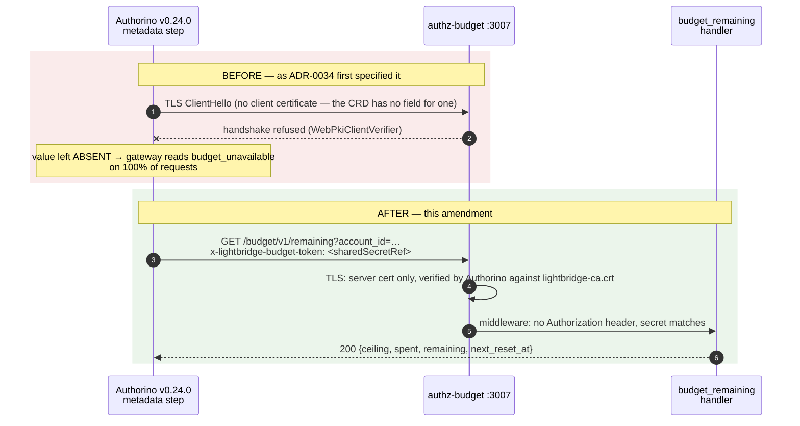
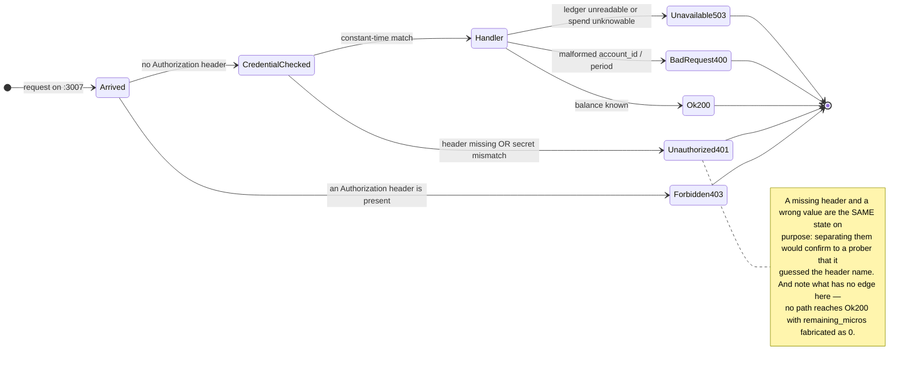
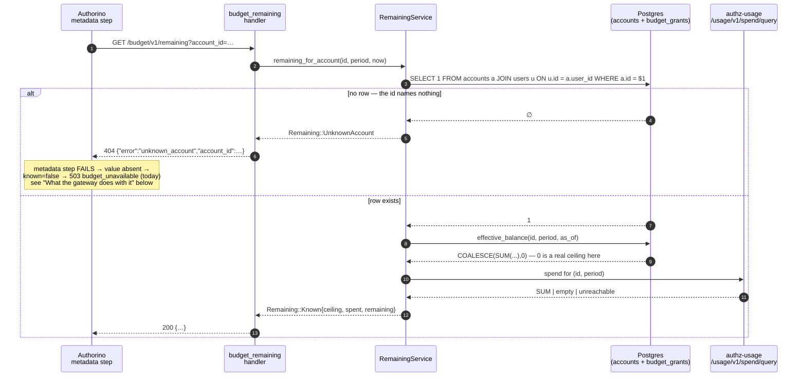
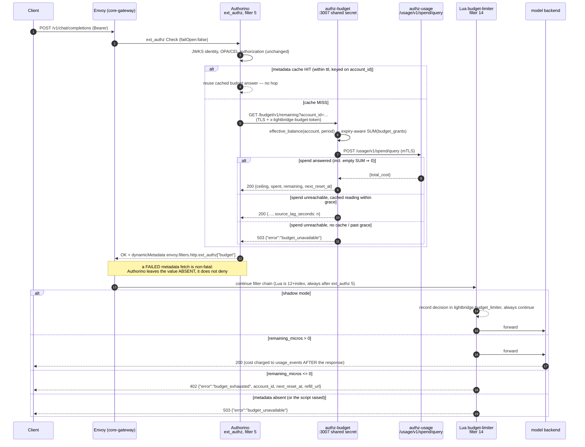
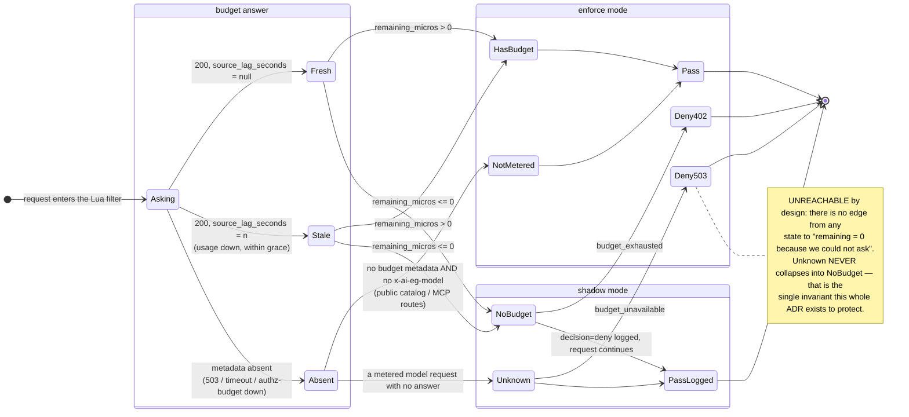

# ADR-0034: The Dynamic Budget Limiter — the gateway reads the live balance, it does not trust the token

- Status: Proposed
- Date: 2026-09-03 (amended three times the same day — first §3.1/§4.1/§9/§14 re-grounded on the
  **deployed** Authorino v0.24.0 CRD rather than upstream source, after `kubectl explain` against
  prod contradicted the upstream Go types on `metadata.http.timeout`; then **§3's transport
  changed from mTLS to a shared secret** during Stage 1, after the same `kubectl explain` showed
  Authorino cannot present a client certificate at all — see §3.2; then **an unknown account id
  became a `404`** rather than a `200` with a zero balance, on the owner's directive — see §3.3)
- Decision owners: @stephane-segning
- Story: [lightbridge-authz#658](https://github.com/ADORSYS-GIS/lightbridge-authz/issues/658)
  (Phase 6a decision memo)
- Builds on: [ADR-0007](0007-refill-decisions-rule-data-then-opa-wasm.md) (facts are gathered by the host, the
  evaluator is pure), [ADR-0008](0008-refills-are-discrete-budget-tiers.md) (the period is a
  calendar month), [ADR-0009](0009-budget-grants-are-an-immutable-ledger.md),
  [ADR-0026](0026-one-identity-may-own-many-accounts.md) (*Proposed* — the counter-identity
  caveat in §7), [ADR-0032](0032-budget-reset-schedules.md) (`next_reset_at`)
- Supersedes for enforcement purposes: [ADR-0014](0014-budget-tier-claim-via-token-mint-not-keycloak-writeback.md)'s
  role as the *enforcement* path. The `budget_tier` claim is **not** retired by this ADR — see §12.

---

## 1. Context

`lightbridge-authz#658`'s audit settled the question it was asked: **a refill buys nothing.** The
ledger moves, the console updates, the `budget_tier` claim is minted — and the gateway keeps
enforcing two static Envoy rate-limit rules keyed on `(x-account-id, x-billing-plan,
calendar-window)`, whose limits come from Helm values and whose counters live in the Lyft
ratelimit service's Redis. Nothing in that chain reads `budget_grants`.

The memo's §4.1/§4.2 answer was to stamp the *tier* as a header and add one `Exact`-matched
rate-limit rule per rung. That works, and it has three properties the owner rejected on
2026-09-03:

1. **It trusts the token.** The tier rides a claim (or an introspection response cached for 30 s)
   that was computed at mint time. The gateway then keys a rule on a value it did not derive.
2. **It quantises money into rungs.** ADR-0015 already made refill amounts admin-configured
   ranges; the ladder forces every one of them back onto seven compile-time numbers, and the memo
   itself found two defects (`repo.rs:551-571`, `rule_data.rs:148`) where an off-ladder amount
   silently collapses to a label that matches either the wrong rule or *no* rule — and a request
   matching no budget rule is **unlimited**.
3. **A tier change resets the window's counter.** Moving an account between two `Exact` rules
   changes the descriptor, hence the Redis key, hence the counter. `ai-helm`'s
   `plans/lightbridge-dynamic-budget.md` §0.1(a) documents this as a deliberate product choice;
   it is still the ADR-0084 incident mechanism, invoked on purpose.

**Owner's direction (2026-09-03), verbatim in intent:** *when the JWT is from authz, check the
budget and allow or block. Keep `billing_plan`, but scope it strictly to rate limiting. Use
AuthConfig `metadata` — after JWKS authentication and OPA authorization — to bring the budget
downstream, and block on empty remaining with a custom error. I don't trust the token.*

That is the memo's §4.3 option 2 (*"Dynamic per-request balance check"*), which the memo
recommended **against**. The objection is real and must be answered rather than waved past.

### 1.1 The objection this ADR has to survive

`ai-helm`'s `plans/lightbridge-dynamic-budget.md` §1.2 is unambiguous:

> Authorino stamps only **stable** identifiers […] and the *limiter* does the allowance lookup.
> **Never add a budget lookup to the Authorino step.**

The reason is a live incident. On 2026-07-02 the Keycloak introspection `metadata` step was
commented out of the prod AuthConfig because a cold-cache request made a synchronous call inside
the ext_authz path; when Keycloak slowed under load, Envoy's ext_authz timeout fired and — with
`failOpen: false` — became a 403 for real users. The AuthConfig still carries that note
(`ai-helm-values/environments/prod/values/security-policies.yaml:250-263`).

Four things make this proposal a different shape from that incident, and all four are load-bearing:

| The 2026-07-02 failure | This design |
|---|---|
| Keycloak: an external IdP, shared with unrelated traffic, no latency budget of our own | `authz-budget`, in-cluster, ClusterIP, one route, owned by us |
| A read whose cost was unbounded (a full introspection, cold cache per token) | Two indexed reads (`SUM` over `budget_grants` for one account/period, plus one HTTP call to `authz-usage`), cached per identity per TTL |
| No cache on the failure path, and no fallback: a slow call *was* the outcome | A bounded server-side grace window (§5.3) that answers from the last known reading while the spend source is down |
| A failure mode that produced a *403 to the user* | A failure mode that produces a **503 `budget_unavailable`** — a different status, a different message, a different runbook, and an alertable signal |

And one thing that is unchanged and must stay unchanged: **ext_authz `failOpen` stays `false`.**
The manifests assert it explicitly rather than relying on the CRD default, because the entire
value of this feature evaporates if a slow Authorino means "allow".

---

## 2. Decision

Enforce the **live ledger balance** at the gateway, per request, through the existing ext_authz
step — and keep the enforcement *decision* out of the token entirely.

```
JWKS identity (unchanged)
  → OPA / CEL authorization (unchanged)
    → AuthConfig `metadata` → GET /budget/v1/remaining   [NEW, shared-secret, authz-budget]
      → response.success.dynamicMetadata  (NOT a header)
        → Envoy Lua EnvoyExtensionPolicy: remaining_micros <= 0 ⇒ 402 budget_exhausted
```

Six decisions, in the order they matter:

**D1 — the gateway asks us, per identity per TTL, and never reads a budget claim.**
`auth.identity.budget_tier` is not consulted by any part of this path. The only identity input is
the account id, which Authorino already derives from the credential.

**D2 — the answer travels as ext_authz dynamic metadata, never as a request header.** Success
headers are *request* headers Envoy injects toward the upstream; they are also the thing a
misconfigured chain lets a client supply. Dynamic metadata is internal to the filter chain, is
never emitted to the client, and cannot be spoofed inbound because it does not exist inbound.
(`x-model-policy`'s own anti-spoofing note — `security-policies.yaml:922-936`, and
`charts/core-gateway/files/model-policy.lua`'s "ANTI-SPOOFING" section — is the cautionary tale
this avoids by construction rather than by discipline.)

**D3 — the refusal is issued by a Lua `EnvoyExtensionPolicy`, not by Authorino's own denial.**
This was re-examined at the owner's request; see §4 for the exact reason the Authorino-native path
cannot ship, and §4.2 for why it is not ext_proc either.

**D4 — the endpoint reports, it does not decide.** `GET /budget/v1/remaining` returns
`ceiling`, `spend` and their difference, plus when the balance next changes. Thresholding is the
gateway's job. This is ADR-0007's "the evaluator is a pure function of facts gathered by the host"
applied to the data plane.

**D5 — unknown is never zero, at every layer.** A `NULL` `SUM`, an unreachable usage service, an
unreadable ledger, an absent metadata value, a Lua exception: each one routes to a *distinct*
outcome, and none of them routes to "you have spent everything" (§5).

**D6 — `billing_plan` is a rate-limit key and nothing else.** No plan → budget mapping, no tier
rules, no plan-derived money. §6 states what the `BackendTrafficPolicy` becomes.

---

## 3. The endpoint

`GET /budget/v1/remaining?account_id=<budget account id>[&period=YYYY-MM]`

Served by `authz-budget` on a **second listener**, gated by a **shared secret in a custom header**
— *not* mTLS, which is what this ADR originally specified; §3.2 is the amendment and its evidence.
A second listener rather than a route on the bearer-JWT RPC surface, so the console's plane is
untouched and this route's credential cannot be bypassed by hitting a sibling route. It
additionally **refuses** any request carrying an `Authorization` header: it is a cross-account read
with no per-caller ownership check at all, and a proxy misconfigured to forward a user's token here
should fail loudly.

```jsonc
// 200
{
  "budget_account_id": "cuid2…",
  "period": "2026-09",
  "ceiling_micros": 24000000,     // effective_balance: expiry/revocation-aware SUM(budget_grants)
  "spent_micros": 3210000,        // SUM(usage_events.total_cost) via /usage/v1/spend/query
  "remaining_micros": 20790000,   // signed, NOT clamped — negative means overspend
  "next_reset_at": "2026-10-01T00:00:00Z",
  "source_lag_seconds": null      // null = no cache age to report; NOT "zero staleness"
}
// 400 {"error":"bad_request",…}         malformed account id / period
// 401 {"error":"unauthorized",…}        the shared secret was missing or wrong
// 403 {"error":"forbidden",…}           an Authorization header was present
// 404 {"error":"unknown_account","account_id":"…"}
//                                       the id names no `accounts` row — see §3.3
// 503 {"error":"budget_unavailable",…}  the answer is not knowable right now
```

Five things about that payload are decisions, not details:

- **`ceiling_micros` is `BudgetRepo::effective_balance`**, not the raw
  `budget_balances.effective_budget_micros` projection. The projection counts grants that have
  since expired or been revoked (it reproduces `BudgetRepo::grant`'s unconditional `UPDATE`
  bit-for-bit, deliberately). An expired grant must not buy gateway traffic, so the enforcement
  read uses the stricter, expiry-aware sum — which is also what `Facts::effective_balance_micros`
  already means by "balance", so the gateway and the refill policy engine cannot disagree.
- **`remaining_micros` is signed and unclamped.** Overspend is reachable by construction (§5.4);
  reporting `0` for it would hide the one number the overspend alert needs.
- **`next_reset_at` is never null.** It is the winning ADR-0032 schedule's `next_run_at` when one
  covers the account, and otherwise midnight UTC on the 1st of the next month — the same instant
  the ledger's period key and the gateway's `x-billing-period` marker (`ai-helm` ADR-0111) both
  rotate.
- **`source_lag_seconds` is `null` unless we are serving a cached reading.** It is the *cache age*
  when stale-serving (§5.3), and `null` otherwise — which means "no cache age", **not** "current".
  A fresh reading still trails reality by the OTLP ingest lag, and `/usage/v1/spend/query` returns
  a bare `SUM` with no timestamp, so nothing in this process can measure that. Reporting `0` would
  understate §5.4's overspend window, which is computed from exactly this term. Teaching
  `/usage/v1/spend/query` to return `MAX(time)` alongside the sum is the tracked follow-up that
  makes the fresh case a real number too.
- **A `200` asserts the account exists.** `ceiling_micros: 0` is a statement about an account we
  know — one between its creation and its first grant, or one whose grants have all expired. An id
  the ledger has never seen gets a `404`, never a flattering zero. §3.3 is the amendment and its
  reasoning.

### 3.2 Amendment (2026-09-03, during Stage 1) — the transport is a shared secret, not mTLS

**What changed.** `GET /budget/v1/remaining` is gated by a shared secret in a custom header
(`server.budget_internal.shared_secret` / `.shared_secret_header`, default
`x-lightbridge-budget-token`), delivered by the AuthConfig's `metadata.http.sharedSecretRef` +
`credentials.customHeader`. `Tls::client_ca_bundle_path` is not merely optional on this listener —
`start_budget_server` **refuses to start** when it is set, because setting it makes the endpoint
unreachable.

**Why, and it is checkable rather than arguable.** The original text copied #347's posture without
checking that the *caller* could hold up its end. Authorino is not one of our Rust services; it is
the only caller, and the deployed CRD gives it no way to attach a client key/certificate to a
`metadata` call:

```console
$ kubectl --context hetzner-prod explain authconfigs.spec.metadata.http \
    --api-version=authorino.kuadrant.io/v1beta3
FIELDS:
  body, bodyParameters, contentType, credentials, headers, method, oauth2,
  sharedSecretRef, url, urlExpression
```

No `tls`, no `clientCert`, no `clientCertificateRef`. And the deployed pod
(`quay.io/kuadrant/authorino:v0.24.0`, `kuadrant-policies-main` in `converse-gateway`) mounts
exactly one file — `authz-tls`'s `ca.crt`, projected to
`/etc/pki/tls/certs/lightbridge-ca.crt` — which lets it *verify our server certificate* and nothing
more.

So the mTLS shape does not fail loudly at review time; it fails at 100 % of requests in production.
Every metadata fetch would be refused at the handshake, Authorino would leave the value absent (it
logs and continues — §3.1), and the Lua would read absence on a metered model request as
`budget_unavailable`. Shadow mode would have "worked" and measured nothing but our own
misconfiguration.

**What the substitute keeps, and what it gives up.** Kept: the channel is still TLS verified
against the internal CA, so the secret is never in clear on the wire and the caller still
authenticates *us*; both ends read the same Kubernetes Secret (this listener through the config's
`${VAR}` interpolation, Authorino through `sharedSecretRef`), so they cannot silently drift; the
`Authorization`-header refusal is unchanged and still runs first, with `403` rather than `401`, so
a misrouted proxy fails loudly instead of being invited to retry with a different token; and a
NetworkPolicy restricts port 3007 to the gateway namespace, so a leaked secret alone does not
reach the listener from an arbitrary pod.

Given up, and worth naming rather than glossing: a bearer secret is **replayable** by anything that
can read it, where a private key is not; and rotation becomes a two-sided values change rather than
a certificate renewal. That is the price of the field not existing. The day Authorino grows a
client-certificate reference on `metadata.http`, this amendment is reverted — the code to delete is
one module (`crates/lightbridge-authz-rest/src/budget_remaining_auth.rs`) and the startup check
that currently *rejects* `client_ca_bundle_path`.

**The admission path, before and after.**





**Rejected alternatives, briefly.** `oauth2` client-credentials on the metadata step (real, but it
puts `authz-idp` on the ext_authz path to mint a token for a call whose whole purpose is to stay
cheap — a second network dependency inside the one hop §9 is already worried about). A
NetworkPolicy *alone*, with no credential (rejected: it authenticates a network location, not a
caller, and every pod in `converse-gateway` would be able to read every account's balance). A
sidecar proxy terminating mTLS in front of `authz-budget` (rejected: it moves the problem into a
component nobody asked for and still hands Authorino an uncredentialed hop).

### 3.3 Amendment (2026-09-03, owner directive) — an unknown account id is a `404`, not a zero balance

**What changed.** `GET /budget/v1/remaining?account_id=<id>` answers
`404 {"error":"unknown_account","account_id":"<id>"}` when `<id>` names no account. It previously
answered `200 {"remaining_micros": 0, …}`, and that is the bug this amendment closes.

**Why it mattered more than it looks.** `BudgetRepo::effective_balance` is
`COALESCE(SUM(amount_micros), 0)` over `budget_grants`. A **row-less** account and a
**non-existent** one are indistinguishable to it: both sum to `0`. So under enforcement, a typo in
an identity mapping — one wrong character in the `account_id` claim, a stale token, a mis-scoped
service credential — arrived at the gateway as `known=true, remaining_micros=0`, which the Lua
correctly refuses with `402 budget_exhausted`. The single most expensive way to be wrong: the
fault wears the costume of a real paying user who really did run out, so the operator sees a
support ticket about billing rather than an alert about configuration, and no dashboard anywhere
distinguishes the two.

**The definition of "unknown", stated once so nothing has to guess it.** *Known* = **a row in
`accounts` whose `user_id` resolves to a row in `users`.**

- The ledger keys on `accounts.id` and on nothing else: `budget_grants.budget_account_id`,
  `budget_balances.budget_account_id` and `budget_augmentation_requests.budget_account_id` are all
  `TEXT NOT NULL REFERENCES accounts(id)` (migrations `20260803000001`, `20260803000002`,
  `20260804000002`). It is **not** `users.id` — §7 and ADR-0026 make one identity own many
  accounts, so keying the check on the person would let one account's typo pass because a sibling
  account exists.
- The `users` join is the ADR-0014 intra-DB read pattern, taken verbatim from the reset
  scheduler's own account enumeration (`reset_scheduler.rs`'s `matching_accounts`, #653), so
  "an account this endpoint reports on" and "an account the estate grants to" cannot drift apart.
  `accounts.user_id` is `NOT NULL` and FK-bound, so today the join filters nothing; it states the
  rule and stays correct if that column ever becomes nullable.

**Three things are deliberately NOT `unknown`, and each would be a different bug:**

| Condition | Answer | Why not `404` |
|---|---|---|
| Real account, **no grants** this period | `200`, `ceiling_micros: 0`, `remaining_micros: -spent_micros` | The state of every account between creation and its first grant, and of every account whose grants have expired. It is knowledge, not ignorance. This is also exactly what the console's Budget card shows for such an account (`BalanceSnapshot::zero`), and the two surfaces must not disagree. |
| Account **suspended** (`accounts.status`) | `200`, real numbers | Suspension is enforced upstream of the budget entirely (`effective_status`, `20260714000001`). Folding it in here would make one condition wear another's error code and would `404` an account whose balance an operator is legitimately reading. |
| Ledger or spend source **unreadable** | `503 budget_unavailable` | Unchanged. "We could not ask" is not "it does not exist", for the same reason it is not "you have nothing left". The existence probe's own failure is an `Err` → `503`, never a `false` → `404`. |

**No starting amount is ever fabricated.** The policy's `starting_amount_micros` (ADR-0015
Decision 5) materialises **only when a grant is actually booked** — `RefillService` writes a
`budget_grants` row, and nothing about the policy is readable from the ledger until it does. This
endpoint reports the ledger. A brand-new account therefore reads `ceiling_micros: 0` here until
its base grant lands, and that is the honest number, not an omission.

**Ordering is load-bearing in one direction.** The existence probe runs *in front of* both the
ceiling read and the spend read, so an unknown id answers `404` even while the usage service is
down. The other ordering would let a transient outage mask a permanent configuration fault behind
`budget_unavailable`, which is precisely the confusion this amendment exists to remove.



```mermaid
stateDiagram-v2
    direction LR
    [*] --> Asked: (budget_account_id, period)

    Asked --> ProbeFailed: accounts read errored
    Asked --> Unknown: no accounts row
    Asked --> Exists: accounts row + owning users row

    ProbeFailed --> Http503: Err(StorageFailed)
    Unknown --> Http404: Remaining::UnknownAccount

    Exists --> CeilingRead
    CeilingRead --> Http503: ledger read errored
    CeilingRead --> SpendRead: ceiling known (0 IS a ceiling)

    SpendRead --> Http200: answered / empty / cached within grace
    SpendRead --> Http503: unreachable, no cached reading

    Http200 --> [*]
    Http404 --> [*]
    Http503 --> [*]

    note right of Http404
        The edge that did not exist before this amendment.
        Everything that used to reach Http200 through
        "no accounts row" now stops here — and note what
        still has NO edge: nothing reaches Http200 with a
        fabricated ceiling, and nothing reaches Http404
        from a failed read.
    end note
```

**What the gateway does with a `404` — today, and the proposal.**

Today, nothing distinguishes it. Authorino's `evaluateMetadataConfigs` treats *any* non-2xx (and
any transport failure) on a `metadata.http` step as a failed fetch: it logs, leaves the value
**absent**, and continues (§3.1). The Lua then reads `known=false` and refuses with
`503 budget_unavailable`. That is already fail-closed, already a different status and a different
runbook from `402 budget_exhausted`, and already a strict improvement — the phantom account no
longer looks like a real one. But it is indistinguishable at the gateway from "authz-budget is
down", which is the wrong triage for a fault that will never clear on its own.

**Proposal, NOT implemented here (no `ai-helm` change in this task; the limiter is disabled in
prod).** Surface it as a distinct deny, `403 unknown_account`, fail-closed — the token names an
account the ledger has never seen, and that is an authorization fault, not a capacity one. The
only shape that works with the deployed CRD:

- Authorino's `metadata.http` cannot branch on status, so the distinction cannot come from the
  existing step. It has to come from an **`authorization.http`** evaluator, where a non-2xx **is**
  a deny, with `response.unauthorized.message` carrying the reason (CEL is accepted on
  `body`/`message`/`headers`, not on `code` — §4.1).
- That evaluator must therefore deny on *exactly* the unknown case and on nothing else, which
  means a dedicated existence-only route (`GET /budget/v1/account-known?account_id=…`) that
  answers `200` when the account is known, `404` when it is not, and — critically — **`200` when
  our own database is unreadable**. Fail-*open* on that one step is correct precisely because the
  budget metadata step already fails closed on our outage with `503 budget_unavailable`: an
  outage must never be able to masquerade as "your account does not exist".
- **Cost, named rather than glossed:** a second HTTP call inside the one ext_authz hop §9 is
  already worried about. It caches on the same key as the budget step and its TTL can be far
  longer (account existence changes on the order of account creation, not of spending), which
  bounds it — but it is not free, and it is the reason this is a proposal and not a shipped
  change.
- **Owner decision still open:** whether that second hop is worth a distinct `403` at the gateway,
  or whether `503 budget_unavailable` plus this endpoint's own `404` in logs, traces and metrics is
  enough triage. Nothing in the enforcement chain is blocked on it — the `404` is live at the
  endpoint either way, which is where a probe, a runbook and a human read it.

### 3.1 The AuthConfig side

Verified against the **deployed** CRD, not upstream source — Authorino **v0.24.0**
(`quay.io/kuadrant/authorino:v0.24.0`, operator `v0.23.1`), AuthConfig serving `v1beta2` + `v1beta3`
with `v1beta3` as storage. Every `has()` guard below is load-bearing; see the notes after the block.

```yaml
metadata:
  "budgetremaining":
    when:
      - predicate: |
          has(auth.identity.account_id) && auth.identity.account_id != ""
    cache:
      key:
        expression: |
          "budget:" + string(auth.identity.account_id)
      ttl: 10          # seconds — a value; see §5.4 for how it enters the overspend window
    http:
      urlExpression: |
        "https://authz-budget.converse.svc.cluster.local:3007/budget/v1/remaining?account_id="
          + string(auth.identity.account_id)
      method: GET
      # NO `timeout:` — see below. Bound it at the SecurityPolicy's extAuth instead.
response:
  success:
    dynamicMetadata:
      "budget":
        json:
          properties:
            # `enforced` distinguishes "this plane is out of scope" from "the chain is
            # misconfigured". The INTERNAL AuthConfig publishes the same key with a constant
            # `false`, exactly as it publishes a constant "" for x-quota-tier, so absence always
            # means something is wrong rather than something is exempt.
            "enforced":         { expression: 'true' }
            # Every read is has()-guarded under && short-circuit: a failed metadata fetch leaves
            # `auth.metadata.budgetremaining` ABSENT, and an unguarded expression over an absent
            # value is the ADR-0047/0052 dropped-value failure mode.
            "known":            { expression: 'has(auth.metadata.budgetremaining) && has(auth.metadata.budgetremaining.remaining_micros)' }
            "remaining_micros": { expression: 'has(auth.metadata.budgetremaining) && has(auth.metadata.budgetremaining.remaining_micros) ? auth.metadata.budgetremaining.remaining_micros : 0' }
            "next_reset_at":    { expression: 'has(auth.metadata.budgetremaining) && has(auth.metadata.budgetremaining.next_reset_at) ? string(auth.metadata.budgetremaining.next_reset_at) : ""' }
            "account_id":       { expression: 'string(auth.identity.account_id)' }
```

`remaining_micros` falls back to `0` rather than to something permissive, but that fallback is
never *read*: the filter branches on `known` first and treats `known: false` as `503
budget_unavailable`, not as an exhausted budget. The `0` exists only so the CEL expression has a
type-correct value on the absent path.

Three facts about the deployed CRD, all checked with `kubectl explain` against prod:

- **`spec.metadata.http.timeout` does not exist in v0.24.0.**

  ```console
  $ kubectl explain authconfigs.spec.metadata.http.timeout --api-version=authorino.kuadrant.io/v1beta3
  error: field "timeout" does not exist
  ```

  Upstream `main`'s `HttpEndpointSpec` carries a `Timeout *int`, so the Go types are **ahead of the
  deployed release** — and prod's own comment (`security-policies.yaml:305-309`, *"v1beta3 has NO
  metadata.http.timeout field"*) is **correct**, while the commented-out `keycloakintrospection`
  block two stanzas above it (which uses `timeout: 2000`) was written against a version that never
  ran here. The budget metadata call therefore cannot bound its own latency; it must be bounded at
  the `SecurityPolicy`'s `extAuth`, which is also where `failOpen: false` is asserted.

- **`response.unauthorized.body`/`message`/`headers` take CEL; `code` does not.** See §4.1.

- **Dynamic metadata lands in the Envoy namespace `envoy.filters.http.ext_authz`**, under a root
  key equal to the config name (`budget` above). That is the exact key the Lua reads.

**A failed `metadata` fetch is non-fatal in Authorino**: `evaluateMetadataConfigs` logs and leaves
the value **absent**, it does not deny (this is documented verbatim in prod's own AuthConfig at
`security-policies.yaml:234-245`, from reading Authorino's source). So the fail-closed behaviour
of this feature cannot come from Authorino. It comes from the Lua, which is why the exported
`known` boolean exists: absence is a decision input, not a gap.

---

## 4. Why the Lua filter, and not the two alternatives

The owner asked specifically for the Authorino-native shape to be evaluated and preferred if it
works: `metadata` → an `authorization` rule (`remaining_micros > 0`) → `response.unauthorized`
returning 402 with a JSON body and dynamic headers. It was evaluated properly. It does not work
here, for one specific and checkable reason.

### 4.1 The Authorino-native denial — rejected, with the citation

`response.unauthorized` is a `DenyWithSpec`
(Authorino `api/v1beta3/auth_config_types.go`):

```go
type DenyWithSpec struct {
	Code    DenyWithCode           `json:"code,omitempty"`     // DenyWithCode = int64
	Message *ValueOrSelector       `json:"message,omitempty"`
	Headers NamedValuesOrSelectors `json:"headers,omitempty"`
	Body    *ValueOrSelector       `json:"body,omitempty"`
}
```

`Message`, `Headers` and `Body` are `ValueOrSelector` — so a **per-request JSON body and dynamic
headers are fully expressible in CEL**, and the instinct there was right. `Code` is not: it is a
bare `int64`, with no `value`/`selector`/`expression`. It is **one constant per AuthConfig**.

The deployed CRD says the same thing, which is what settles it:

```console
$ kubectl explain authconfigs.spec.response.unauthorized --api-version=authorino.kuadrant.io/v1beta3
FIELDS:
  body    <Object>              HTTP response body to override the default denial body.
  code    <integer>             HTTP status code to override the default denial status code.
  headers <map[string]Object>   HTTP response headers to override the default denial headers.
  message <Object>              HTTP message to override the default denial message.

$ kubectl explain authconfigs.spec.response.unauthorized.body --api-version=authorino.kuadrant.io/v1beta3
FIELDS:
  expression <string>   A Common Expression Language (CEL) expression that evaluates to a value.
  selector   <string>   Simple path selector ...
```

`body` has `expression`. `code` is a plain `<integer>`.

And there is exactly one `response.unauthorized` per AuthConfig — Authorino has no per-rule denial
customisation. The prod `main` AuthConfig already denies for **four** unrelated reasons, all of
which return 403 today and must keep doing so
(`ai-helm-values/environments/prod/values/security-policies.yaml`):

| Rule | Denies when | Correct status |
|---|---|---|
| `repo-binding-allowed` (`:377`) | a GitHub token's repo is not bound to an account | 403 |
| `keycloak-requires-email` (`:443`) | a `client_credentials` token reaches the human plane | 403 |
| `lightbridge-key-active` (`:547`) | the presented API key has been **revoked** | 403 |
| `lightbridge-model-allowed` (`:680`) | `model_policy: deny_all` / an unrecognised value | 403 |

Setting `code: 402` to make budget exhaustion a 402 would turn *"your key was revoked"* and *"that
model is not allowed for this project"* into `402 Payment Required` as well. That is not a cosmetic
regression: 402 is the status the console and every client will be taught to interpret as "top up
and retry", and it would then fire on conditions no payment can fix.

There is no way out inside Authorino: the AuthConfig is selected by Host, the hosts are fixed, and
a second AuthConfig for the same host is not how Authorino resolves (most-specific host wins). So:

> **Shipped: the Lua path.** Authorino does identity, authorization and the `metadata` call, and
> exports the answer as dynamic metadata. It adds **no** new `authorization` rule — one would deny
> with 403 and defeat the purpose. The Lua filter owns the status code and the body.

If Authorino ever gains a `ValueOrSelector` `Code` (or per-rule denial specs), this decision should
be revisited: the native path would then be strictly simpler, and the Lua could be deleted.

### 4.2 ext_proc — rejected, unchanged from the memo

An ext_proc component in the data path is what `plans/lightbridge-dynamic-budget.md` §0 option C
describes and what the memo's §4.3 option 2 warned about. It is rejected here for reasons that have
nothing to do with the budget question: it is a new component in the inference data path, it shares
the insertion-order problem the Censgate plan spiked, and it only earns its keep if you want
*reserve-and-settle*, which needs a **pre-request cost estimate** that does not exist —
`llm_custom_total_cost` is computed by the AI Gateway's own processor *after* the response
(§1.3 of that plan). Nothing in this design needs a pre-request estimate: it compares two numbers
that are both already known before the request starts.

### 4.3 Filter ordering — this works by construction, not by luck

Envoy Gateway v1.8.2 assigns a fixed order to the HTTP filters it generates
(`internal/xds/translator/httpfilters.go`, `newOrderedHTTPFilter`): **ext_authz = 5**, **Lua =
12 + index**, EnvoyExtensionPolicy ext_proc = 100 + index, router last. The AI Gateway's own
ext_proc is injected ahead of that table entirely. So the Lua always runs after Authorino has
written its dynamic metadata. This is the same guarantee `model-policy.lua` already relies on and
documents.

**Envoy Gateway accepts exactly ONE `EnvoyExtensionPolicy` per targetRef.** A second policy
targeting the same Gateway is rejected outright (`Accepted: False, reason: Conflicted`) and simply
never attaches — caught live on 2026-08-03 when a redaction policy silently did nothing. The budget
filter is therefore a **third `lua` list entry in the existing
`charts/core-gateway/templates/envoyextensionpolicy-billing-period.yaml`**, not a new file. Each
`lua` entry becomes its own filter at `12 + index`, so ordering among the three is by list position:
billing-period (12) → model-policy (13) → budget-limiter (14).

---

## 5. Failure modes — the whole point of the design

### 5.1 The matrix

| Condition | Endpoint | Dynamic metadata | Gateway result |
|---|---|---|---|
| Balance known, `remaining > 0` | `200` | `known=true`, `remaining_micros>0` | **pass** |
| Balance known, `remaining <= 0` | `200` | `known=true`, `remaining_micros<=0` | **402 `budget_exhausted`** |
| **Account id names no `accounts` row** | **`404 unknown_account`** | value **absent** (Authorino cannot branch on status) | **503 `budget_unavailable`** — fail-closed, and distinct from 402. §3.3 proposes making it a distinct `403 unknown_account`; not implemented. |
| Usage service down, cached reading inside grace | `200` + `source_lag_seconds` | `known=true` | pass / 402 on the stale figure |
| Usage service down, no cached reading (or past grace) | `503 budget_unavailable` | value **absent** | **503 `budget_unavailable`** |
| Ledger unreadable | `503 budget_unavailable` | value **absent** | **503 `budget_unavailable`** |
| `authz-budget` unreachable / times out | — | value **absent** | **503 `budget_unavailable`** |
| Authorino itself times out / fails | — | — | **403** from Envoy (`extAuth.failOpen: false`) |
| The Lua script raises | — | — | **503 `budget_unavailable`** via the `pcall` guard |

Two entries deserve their own sentence.

**Absent metadata is a refusal, not a pass.** Authorino leaves a failed `metadata` value absent
rather than denying, so if the Lua treated absence as "no opinion" the feature would fail *open* on
exactly the condition it exists to handle. It refuses with 503 instead. The one carve-out is
requests that never went through this AuthConfig at all — the public model-catalog paths its own
`when` gate skips, and the `/mcp/*` routes that carry their own SecurityPolicy — which the Lua
recognises the same way `model-policy.lua` does: no budget metadata **and** no `x-ai-eg-model`
means it is not a metered model request, and it passes.

**A Lua exception must not fail open.** Envoy's default for an uncaught Lua error is to log it and
continue the filter chain. `model-policy.lua` already converts that into a refusal with a `pcall`
guard, and the harness proves the guard is load-bearing by running an unguarded copy on a third
listener and showing the request reaches the upstream. The budget filter uses the same shape and
the same proof.

### 5.2 Shadow mode

`budgetLimiter.shadowMode: true` (the initial prod value) makes the Lua compute the identical
decision, write it into its own dynamic-metadata namespace (`lightbridge.budget_limiter`:
`decision`, `reason`, `remaining_micros`) and log it — then **always** continue. Nothing is
refused. This is not a dormant feature flag in the sense the house rules forbid: the code path is
live and running on every request from day one, producing the exact decision it will later act on.
What the flag switches is whether the decision is *acted on*, which is the only safe way to
discover the false-positive rate of an enforcement rule that can 402 real paying traffic.

### 5.3 Cached grace — where it lives, and why it cannot live at the gateway

The grace window is implemented **in `authz-budget`**, in `RemainingService`: on a fresh reading it
remembers `(spent_micros, observed_at)` per `(account, period)`; when the usage service goes
unreachable it serves that reading for up to `remaining_grace_seconds` (default **120**), stamping
its age into `source_lag_seconds`; past the window the answer goes back to `Unavailable` → `503`.

It has to live there, because neither component downstream can express it:

- **Envoy's Lua filter has no cross-request state.** `filterContext` is static configuration.
- **Authorino's `metadata` cache is a plain TTL cache, not serve-stale-on-error.** A failed fetch
  leaves the value absent; the cached entry is not resurrected. (Prod's own AuthConfig commentary
  says this in as many words.)

Only the ceiling half is re-read during a stale serve — `spent_micros` comes from the cache, but
`effective_balance` is queried fresh every time. So a **refill that lands during a usage-service
outage takes effect immediately** instead of being masked by a cached answer. That asymmetry is
deliberate and tested.

The cache is per-replica. N replicas hold N independent caches, which only affects whether a
request during an outage finds a warm entry — never whether two replicas disagree about a *fresh*
reading. Putting it in Redis was rejected: it would add a second network dependency inside the one
code path whose entire job is surviving a network dependency being down.

### 5.4 The overspend window, quantified

An account can spend past its ceiling by, at worst, the sum of four terms:

| Term | Size | Why it exists |
|---|---|---|
| Authorino metadata cache TTL | **10 s** (a value) | every request inside the TTL sees the same balance |
| OTLP ingest lag | **unmeasured today** — the `MAX(time)` follow-up (§3) is what makes this a number | `usage_events` rows appear some time after the response completes |
| One in-flight request | one request's `llm_custom_total_cost` | the gateway charges *after* the response (`plans/lightbridge-dynamic-budget.md` §1.3); this is unavoidable in the current architecture and exists today too |
| Cached grace, when active | ≤ **120 s** (a value) | only during a usage-service outage |

In normal operation the window is `TTL + ingest_lag + one request`. Against a $24 monthly budget
and a per-request cost in the low thousands of micro-USD, ten seconds of concurrency is worth
cents, not dollars. **The honest gap is the ingest lag**, which nobody has measured — and until
`/usage/v1/spend/query` reports `MAX(time)`, the true window is bounded by a number we are
guessing at. That is stated here rather than hidden, and it is a shadow-mode exit criterion, not a
blocker for shadow mode.

Lowering the TTL narrows the window and raises load linearly. Ten seconds is the recommended
starting point; it is a value precisely so it can be tuned from the shadow-mode data.

---

## 6. What the `BackendTrafficPolicy` becomes

Today two rules govern every prod request, both **cost** buckets charging
`llm_custom_total_cost` against a per-plan monthly / weekly limit
(`ai-helm/charts/core-gateway/templates/backendtrafficpolicy.yaml:101-133` and `:149-184`;
prod values `core-gateway.yaml:79-102`, where all three plans are identically $24/mo, $6/wk).

**At the enforce step, those two cost buckets are deleted.** Not moved to a longer window, not
left inert with a huge limit — deleted, in the same commit that flips
`budgetLimiter.shadowMode: false`. Two enforcement mechanisms for the same quantity is exactly the
"dormant config" this repo's delivery rules forbid, and it is worse than dormant: with both live,
the effective cap is `min(plan, ledger)` and a refill still buys nothing once the plan bucket is
exhausted — the bug this whole ADR exists to fix would survive its own fix.

What the BTP keeps is **rate**, not money: requests-per-minute and tokens-per-minute per
`(x-account-id, x-billing-plan, x-ai-eg-model)` — the `burst` blocks that already exist in
`charts/ai-model` and are currently commented out in prod (`models.yaml:146,156,168,174,181`).
That is the honest role for `billing_plan`: **how fast**, never **how much**. Money moves entirely
to the ledger.

**Shadow mode leaves the cost buckets exactly as they are.** During shadow they are still the only
thing enforcing anything, which is what makes shadow safe.

Ordering rule, unchanged and non-negotiable: rules are matched by **position** in the rendered
list, and the Redis counter key is a function of which rule matched. Removing the two cost families
renumbers everything after them and orphans every in-window counter — the ADR-0084 incident
mechanism. So the enforce commit **must land on a 1st-of-month boundary, 00:00 UTC**, when every
counter is being abandoned anyway because `x-billing-period` has just flipped. The exporter
co-change (`prometheus-redis-exporter.yaml:110-137`, which hard-maps `rule-0..rule-5`) ships in the
**same commit**, per `docs/runbooks/budget-tier-rekey-cutover.md` §2.

### 6.1 Offered, not recommended: a coarse per-account daily cost cap

If defence in depth is wanted after the cost buckets go, the cheapest form is **one** additional
cost rule keyed on `(x-account-id Distinct, x-billing-day Distinct)` with a single flat limit far
above any legitimate day's spend — a blast-radius cap for a limiter bug, not a budget. The daily
marker costs one extra line in the billing-period Lua (`os.date("!%F")`, the shape ADR-0119 already
proved with the weekly marker).

**Not recommended**, for one reason: it reintroduces a second cost counter whose relationship to
the ledger is undefined, and the first time it fires the user gets a 429 that no refill can clear
and no console screen explains. If the limiter's own fail-closed behaviour is not trusted enough to
run without a net, the right response is a longer shadow period, not a second enforcement
mechanism. Recorded here because the owner asked for it to be on the table, with the trade stated.

---

## 7. Identity — which id is the counter keyed on

The endpoint is keyed on the **budget account id**: `budget_grants.budget_account_id`, which the
AuthConfig sources from the token's `account_id` claim — **not** from `sub`, and not from
`x-account-id`.

Today those are the same string, because `accounts.id` *is* the subject (ADR-0026 §Context). They
stop being the same the day **ADR-0026 (`Status: Proposed`)** lands and one identity may own many
accounts. At that point:

- keying on `sub` would meter all of a person's accounts against **one** balance while the console
  shows them separate balances — a bug that is invisible until someone owns two accounts;
- keying on `account_id`, as here, is correct before and after ADR-0026, and needs no cutover.

The existing rate-limit descriptor `x-account-id` is `auth.identity.sub`
(`security-policies.yaml:815-817`) and is **left alone** — it now keys rate, not money, and
per-person rate limiting on `sub` is the right grain regardless of how many accounts that person
owns. The two ids diverging is therefore not a migration; it is the design.

---

## 8. What this does *not* change

- **`budget_tier` keeps being minted** (ADR-0014, re-evaluated and reaffirmed by #430 --
  it is the ONE claim that survived that ticket's removal of `quota_tier`/`model_policy`/
  `allowed_models`, because `authz-opa` introspection has no budget-domain dependency to serve it
  from). Nothing here reads it, but it is a useful
  audit/telemetry signal and removing it is a separate decision with its own blast radius.
  Consequently the memo's defects (a) and (b) — `current_tier` collapsing an off-ladder amount to
  `b-15`, and ADR-0032 `automatic` resets doing so systematically — stop being *enforcement* bugs
  the moment this ADR ships, and become cosmetic-but-wrong claim values. They should still be
  fixed; they are no longer urgent. See §13 D7.
- **The OPA/CEL authorization step is untouched.** Budget is not an authorization concern; a user
  with no budget is authorized and broke, and those are different words on purpose.
- **`/usage/v1/spend/query` is untouched.** The `MAX(time)` addition is a follow-up.
- **The AI Gateway's cost accounting is untouched.** `llm_custom_total_cost` still lands in
  `usage_events` exactly as it does now; that pipeline *is* our spend source.

---

## 9. Cost: latency and CPU

**On the request path (per request, warm cache):** the Lua filter does one dynamic-metadata map
lookup, two integer comparisons and, on the refusal path, one string concatenation. Envoy's Lua
runtime executes this in the low **microseconds** — it is comparable to `model-policy.lua`, which
does strictly more work (three header reads, a duplicate check and a list scan) and is already in
the prod chain at filter 13 with no measurable effect. There is **no** added network hop on a cache
hit: Authorino answers from its own metadata cache.

**On the request path (cold cache):** one HTTPS GET from Authorino to `authz-budget`, in-cluster,
which performs one indexed `SUM` over `budget_grants` for a single `(account, period)` and one
HTTPS POST to `authz-usage` for the spend `SUM`. Expected p50 is a few milliseconds.

**The tail is the risk, and it cannot be bounded where it should be.** Authorino v0.24.0 has no
`metadata.http.timeout` (§3.1), so a slow `authz-budget` is bounded only by the SecurityPolicy's
`extAuth` timeout — and *that* budget is shared with everything else in the ext_authz step, whose
overrun is a **403** (`failOpen: false`, `statusOnError` defaulting to 403), not the 503 this
design wants. Two consequences, both stated rather than smoothed over:

1. `authz-budget`'s own p99 on this route is a **hard** shadow-mode exit criterion, not a nice-to-
   have. It is the only latency control that exists.
2. The right long-term fix is an Authorino bump that has `metadata.http.timeout`, or a per-metadata
   timeout upstream. Until then the mitigation is that the route does two indexed reads and nothing
   else, and that its answer is cached per identity per TTL.

**Call rate:** at most **one call per identity per TTL**. With a 10 s TTL that is `active_accounts
/ 10` requests per second against `authz-budget` — for a fleet of 200 concurrently active
accounts, **20 rps**, each two indexed reads. That is not a new load class for a service that
already serves the console's RPC surface. It scales with *accounts*, not with *requests*, which is
the property that makes this viable at all and the reason the TTL is the first knob to reach for
if `authz-budget` CPU moves.

**Authorino CPU:** one extra `metadata` evaluator and one extra `dynamicMetadata` CEL expression
per request. Both are in-process; the CEL is four field reads. Prod runs 2 replicas
(`security-policies.yaml:13`); no change expected, and Authorino CPU is on the watch list for the
shadow window regardless.

**`authz-budget` memory:** the grace cache holds one `(i64, timestamp)` per active
`(account, period)` seen within the grace window, pruned on write. Tens of kilobytes.

**ext_proc, for comparison:** a new sidecar in the data path, a full request-cycle round trip per
request, and — for reserve-and-settle — a second one on the response. Rejected in §4.2.

---

## 10. Rollout

**Stage 0 — merged now, inert.** The endpoint ships and binds only where `server.budget_internal`
is configured. Prod does not configure it yet, so `authz-budget` logs that the read is not served
and behaves exactly as before. Nothing at the gateway references it.

**Stage 1 — plumbing.** The `authz-budget` chart gains the container/Service port and the
`budget_internal` config block, the shared-secret Secret, and the NetworkPolicy that restricts the
port to the gateway namespace (owner action; see the runbook). Verify by hand from inside the
cluster, **with and without the shared-secret header** — the without case must be a `401`, not an
answer. (Before §3.2's amendment this read "with and without a client certificate"; there is no
client certificate any more.)

**Stage 2 — shadow.** `budgetLimiter.enabled: true`, `shadowMode: true`. The AuthConfig metadata
step and the dynamic-metadata export go live; the Lua computes and logs decisions and refuses
nothing. Watch for a full period, minimum one week:
- `lightbridge.budget_limiter` decision counts, split by reason — how many requests *would* have
  been refused, and how many of those were `budget_unavailable` rather than `budget_exhausted`;
- `authz-budget` p99 on `/budget/v1/remaining`, and its 503 rate;
- Authorino p99 and any ext_authz timeout at the gateway;
- disagreement between the ledger's `remaining` and the Redis cost counter, which is the direct
  measure of the ingest lag §5.4 leaves unquantified.

Exit criteria: zero unexplained `budget_unavailable`; the would-refuse set is exactly the set of
accounts the console also shows as exhausted; ingest lag measured.

#### Where the p99 comes from

§9 calls this route's p99 *hard*, so it is worth saying exactly how to read it — the criterion sat
un-measurable for the first days of Stage 1 because nobody had.

Two things had to be true, and neither was:

1. **`authz-budget` had to emit telemetry at all.** `otel.enabled` was `false` for every
   `lightbridge-authz` component. Turned on for `budget` alone in
   [ai-helm-values#372](https://github.com/ADORSYS-GIS/ai-helm-values/pull/372) — at
   `alloy.observability.svc.cluster.local:**4317**`, gRPC, because
   `lightbridge-authz-core`'s exporter is `.with_tonic()` and the `Otel` config struct
   (`{enabled, otlp_endpoint, service_name}`) has no protocol field. Alloy's 4318 is the HTTP
   listener the Next.js apps use; pointed there, every export fails silently.
2. **This route had to be instrumented.** It is a plain axum route, outside cratestack, and carried
   no span until #680 — while cratestack's own `/rpc/procedure.*` spans arrived normally. So
   "`lightbridge-authz-budget` is in Tempo with plenty of spans" was, for a while, compatible with
   this criterion having no data. Check the route, not the service.

The selector, once both hold:

```traceql
{ resource.service.name = "lightbridge-authz-budget" && span.http.route = "/budget/v1/remaining" }
```

⚠️ **Do not append `| quantile_over_time(duration, .99)` and trust the result.** On the deployed
Tempo (v2.9.0) that returns `{"series":[],"metrics":{"completedJobs":1}}` — HTTP 200, no error —
because the live `configmap/tempo` has `overrides.defaults: {}`, i.e. no
`metrics_generator_processors`, so TraceQL metrics have no `local-blocks` to read. Verified
2026-09-03: even `{} | count_over_time()` comes back empty while plain search returns traces. An
empty p99 panel would read as "nothing is slow".

Until that processor is enabled, compute the quantile from the search results. The runnable recipe —
port-forward, query, and a status-code histogram for the 503 rate this same bullet asks for — is
ai-helm-values `docs/runbooks/observability-endpoints.md` §6b.

**Stage 3 — enforce.** One commit, on a 1st-of-month 00:00 UTC boundary:
`shadowMode: false` **+** delete the monthly and weekly cost rule families **+** the exporter
co-change. Announce the 402 contract to client owners first — a new terminal status on a
previously-always-200 path is a client-visible API change.

**Rollback.** Stage 3 → Stage 2 is `shadowMode: true` and restoring the cost buckets; the counter
renumbering makes that a mid-window budget reset for the fleet, which is *generous*, not harmful,
and is the reason Stage 3 goes out on a boundary. Stage 2 → Stage 0 is `budgetLimiter.enabled:
false`, which removes the filter and the metadata step; no state to unwind. Stage 1 → Stage 0 is
removing the config block. Every step is a values change with no image roll.

---

## 11. Diagrams





---

## 12. Consequences

**Good**

- A refill takes effect within one cache TTL (~10 s), on **both** planes — human and API-key —
  with no token refresh, no Keycloak write-back, and no claim to keep in sync. The product message
  becomes *"your refill is live in a few seconds"*.
- Arbitrary amounts work. ADR-0015's admin-configured ranges stop being quantised into seven
  rungs, and the memo's two claim-collapse defects stop being enforcement bugs.
- One source of truth for money. The console, the refill policy engine and the gateway all read the
  same `effective_balance − spend`; they cannot drift.
- No counter renumbering on a refill. Nothing about a grant changes which Envoy rule matches.
- `billing_plan` finally means one thing.

**Bad, and accepted**

- **A new dependency on the request path.** Bounded by a timeout, a cache, a grace window and
  `failOpen: false`, and it degrades to 503 rather than 403 or "allow" — but it is a new way for a
  model request to fail, and pretending otherwise would be dishonest. §1.1 is the argument that
  this shape is not the 2026-07-02 shape; shadow mode is how that argument gets tested rather than
  asserted.
- **Two counters disagree until Stage 3.** During shadow, the Redis cost counter and the ledger
  will not match, and the difference is the ingest lag. That is a feature of shadow mode (it is how
  the lag gets measured) and a source of confusion for anyone reading the quota dashboard mid-
  rollout. Say so in the runbook.
- **The 402 is a client-visible API change** on a path that has only ever returned 200/429/403.
- **Per-replica grace cache** means the grace window is best-effort during an outage, not a
  guarantee.
- **Enforcement now depends on ingest.** If `usage_events` ingest breaks silently, spend stops
  growing and every account looks under budget. Today's Redis counter has the same property (it is
  charged from the same `llm_custom_total_cost`), so this is not a regression — but it moves an
  ingest outage from "the dashboard is wrong" to "the limiter is wrong", and it needs an ingest
  freshness alert. That alert is a Stage 2 exit criterion.

---

## 13. The memo's eight owner decisions

The memo (`#658` §5) put eight questions. Most of them **dissolve** under this ADR rather than
being answered — that is the strongest argument for it. Recommendations, one line each:

| # | Question | Recommendation |
|---|---|---|
| **D1** | Claim or introspection as the source of `x-budget-tier`? | **Neither.** No tier header exists in this design. The gateway reads the live balance from the ledger; both planes are covered identically, because the answer is keyed on the account id, not on how the caller authenticated. ADR-0014's obsolete rationale (§1.2 of the memo) stops mattering. |
| **D2** | Tier ladder ↔ limit mapping — does `b-15` mean $15 or is the ladder re-anchored at today's $24? | **Dissolved.** There is no ladder at the gateway. The enforced number is whatever the ledger says, to the micro-USD. The base grant amount is a *policy* question for ADR-0015's rule data, not a gateway question. |
| **D3** | Off-ladder amounts — round down, round up, or constrain policy? | **Dissolved**, and this was the memo's highest-risk decision precisely because every answer was wrong. Arbitrary amounts are enforced exactly. |
| **D4** | Window semantics — does a refill reset the calendar bucket, or is a daily pacing descriptor added? | **A refill adds to the ledger balance; nothing resets.** ADR-0032 reset schedules already express "reset remaining to $2 every day" *as ledger rows*, and this design enforces the ledger — so the owner's literal ask becomes literally true for the first time, with no pacing-bucket substitute. |
| **D5** | Keep or retire the per-plan cost rules? | **Retire, at Stage 3, in the enforce commit** (§6). Running both is not belt-and-braces here: `min(plan, ledger)` means a refill still buys nothing once the plan bucket is spent, which is the original bug. Shadow mode is the safety net instead, and it is a better one. |
| **D6** | Counter identity — `sub` or `account_id`? | **`account_id` for money, `sub` for rate** (§7). Correct before and after ADR-0026, no cutover. |
| **D7** | Reset schedules vs. the tier claim — exclude `automatic` from the tier sources, or fix the mapping? | **Fix the mapping** (`from_amount_micros` → highest rung ≤ amount), and **do not** exclude `automatic`: excluding it would make the claim silently ignore the only mechanism that changes budget daily. No longer urgent — nothing enforces on the claim after this ADR — but still wrong, and cheap. Separate PR. |
| **D8** | Cutover date — does the reset-schedule rollout precede or follow 6a? | **Independent; ship reset schedules first** (they are already deployed). Shadow mode can start any day. **Stage 3 must be a 1st-of-month 00:00 UTC boundary** — 2026-10-01 at the earliest, and only if the shadow window's exit criteria are met, which one week of data will not settle if the ingest lag turns out to be large. 2026-11-01 is the realistic date. |

---

## 14. Alternatives considered

- **Memo §4.1/§4.2 — `x-budget-tier` header + one `Exact` rule per rung.** Rejected: §1's three
  properties. It remains the cheapest path if the live-lookup shape ever proves unsafe under load,
  and shadow mode is what would tell us that.
- **Authorino-native denial** (`authorization` rule + `response.unauthorized: {code: 402}`).
  Rejected on a checkable fact: `code` is a plain integer with one value per AuthConfig, and this
  AuthConfig already denies for **four** unrelated reasons that must stay 403 (§4.1). Everything
  else about it works, so the YAML is kept here verbatim — the day Authorino makes `code` a
  `ValueOrSelector` (or adds per-rule denial specs), this replaces the Lua filter and
  `charts/core-gateway/files/budget-limiter.lua` is deleted:

  ```yaml
  authorization:
    "budget-remaining-positive":
      when:
        - predicate: |
            has(auth.metadata.budgetremaining) && has(auth.metadata.budgetremaining.remaining_micros)
      patternMatching:
        patterns:
          - selector: auth.metadata.budgetremaining.remaining_micros
            operator: gt
            value: "0"
  response:
    unauthorized:
      code: 402                       # ← the blocker: ONE constant for the whole AuthConfig
      headers:
        "content-type":
          value: application/json
        "x-budget-remaining-micros":
          expression: |
            has(auth.metadata.budgetremaining.remaining_micros)
              ? string(auth.metadata.budgetremaining.remaining_micros) : ""
        "x-budget-next-reset":
          expression: |
            has(auth.metadata.budgetremaining.next_reset_at)
              ? string(auth.metadata.budgetremaining.next_reset_at) : ""
      body:
        expression: |
          '{"error":"budget_exhausted","account_id":"' + string(auth.identity.account_id) +
          '","remaining_micros":0,"next_reset_at":"' +
          (has(auth.metadata.budgetremaining.next_reset_at)
             ? string(auth.metadata.budgetremaining.next_reset_at) : "") +
          '","refill_url":"https://console.ai.camer.digital/budget",' +
          '"message":"This account has no budget left for the current period."}'
  ```

  Note what this version *cannot* do even so: distinguish `budget_exhausted` from
  `budget_unavailable` by status, because both would be the same `code`. The `when:` guard above
  keeps the rule from firing at all when the metadata is absent — which means an unknowable balance
  would **pass**, i.e. fail open. That is a second, independent reason the native path is not a
  drop-in today, and it is why the `when:` guard has to go the day `code` becomes an expression.
- **ext_proc / a true Dynamic Budget Limiter component with reserve-and-settle.** Rejected: §4.2.
  It is the honest end state only if a *pre-request* cost estimate ever exists.
- **Grants decrement the Redis counter** (`plans/lightbridge-dynamic-budget.md` option B).
  Rejected: it makes `gateway_ratelimit_spend_micro_usd` mean "net of grants", silently changing
  what the ADR-0070 quota dashboard shows, and it means writing another service's key space.
- **Publish the balance as a request header instead of dynamic metadata.** Rejected: D2. A header
  is client-visible and, on any path where Authorino fails to stamp it, client-*supplied*.
