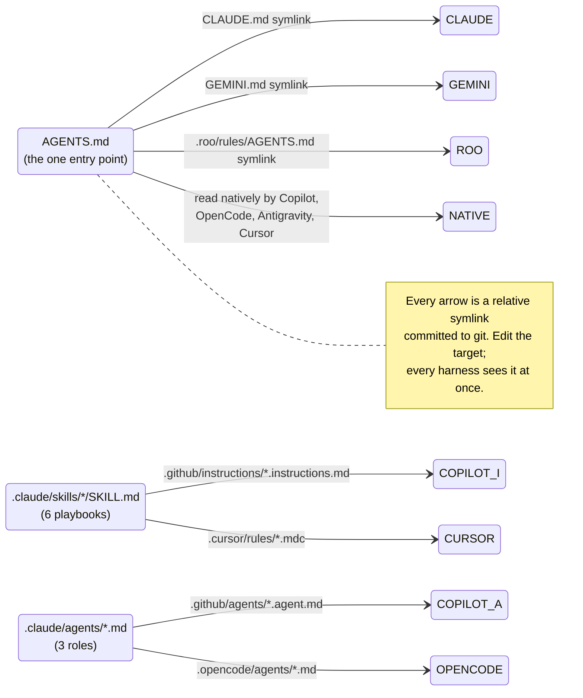

# Working on this repo with an AI coding agent

This repo carries a set of **skills** (task playbooks) and **agents** (role definitions) written for
Claude Code. They are ordinary Markdown with YAML frontmatter, and every other harness in use here
reads them too — through committed relative symlinks, so there is exactly **one** copy of each
document and no second one to go stale.



## Skills

| Skill | Read it when |
| --- | --- |
| [`authz-procedure`](../.claude/skills/authz-procedure/SKILL.md) | Adding, renaming or re-gating a cratestack RPC procedure or a `Permission`. Nine places move together |
| [`authz-migration`](../.claude/skills/authz-migration/SKILL.md) | Anything under `migrations/` or `migrations-usage/` |
| [`authz-verify`](../.claude/skills/authz-verify/SKILL.md) | Before claiming a Rust change here is verified |
| [`authz-release-verify`](../.claude/skills/authz-release-verify/SKILL.md) | After merging — "is it actually live?" |
| [`governance-pr`](../.claude/skills/governance-pr/SKILL.md) | Opening any PR or issue here |
| [`usage-query-perf`](../.claude/skills/usage-query-perf/SKILL.md) | A usage/spend query is slow, or you are about to propose an index or a storage change |

## Agents

| Agent | Role |
| --- | --- |
| [`authz-implementer`](../.claude/agents/authz-implementer.md) | Implements one scoped backend story, verifies it against a real database, opens a governance PR |
| [`authz-verifier`](../.claude/agents/authz-verifier.md) | **Read-only.** Runs the checks, resolves citations, reports what is true. Makes no edits |
| [`docs-curator`](../.claude/agents/docs-curator.md) | Writes and maintains the docs under this repo's citation/diagram/no-duplication rules |

## The link map

Every path on the left is a symlink; the target is the real file.

| Harness | Path | → target |
| --- | --- | --- |
| Claude Code | `CLAUDE.md` | `AGENTS.md` |
| Claude Code | `.claude/skills/*/SKILL.md`, `.claude/agents/*.md` | *(the originals)* |
| Antigravity / Gemini CLI | `GEMINI.md` | `AGENTS.md` |
| Roo | `.roo/rules/AGENTS.md` | `../../AGENTS.md` |
| VS Code Copilot | `.github/instructions/<skill>.instructions.md` | `../../.claude/skills/<skill>/SKILL.md` |
| VS Code Copilot | `.github/agents/<agent>.agent.md` | `../../.claude/agents/<agent>.md` |
| OpenCode | `.opencode/agents/<agent>.md` | `../../.claude/agents/<agent>.md` |
| Cursor | `.cursor/rules/<skill>.mdc` | `../../.claude/skills/<skill>/SKILL.md` |

`.github/copilot-instructions.md` stays a **real file**: it carries the AI-governance stanza managed
by `ADORSYS-GIS/ai-governance` between its `BEGIN`/`END` markers, plus a pointer to `AGENTS.md`. Do
not replace it with a symlink — the governance tooling rewrites it in place.

## What each harness picks up, verified against current docs (2026-09-03)

| Harness | Reads without configuration | Notes |
| --- | --- | --- |
| **Claude Code** | `CLAUDE.md`, `.claude/skills/`, `.claude/agents/` | The originals live here |
| **VS Code Copilot** | `AGENTS.md` (auto-detected in the workspace root), `.github/copilot-instructions.md`, `.github/instructions/**` (searched recursively) | `CLAUDE.md` is also read, behind the `chat.useClaudeMdFile` setting; nested `AGENTS.md` behind `chat.useNestedAgentsMdFiles` |
| **GitHub Copilot custom agents** | `.github/agents/<name>.agent.md` | Frontmatter is `description` (+ optional `name`, `tools`, `model`, `target`). Our files carry `name`/`description`/`model`; `model: sonnet` is a Claude-Code value and Copilot ignores or defaults it. Known upstream quirk: the CLI rejects an **array** `model:` that VS Code accepts — ours is a plain string, so both load |
| **OpenCode** | `AGENTS.md` (project root, walking up), falling back to `CLAUDE.md`; agents from `.opencode/agents/` | Older builds looked in `.opencode/agent/` (singular). If yours does: `ln -s agents .opencode/agent` |
| **Antigravity / Gemini** | `GEMINI.md`, and `AGENTS.md` natively since v1.20.3 | Both are read and merged, with `GEMINI.md` winning a conflict — here they are the same file, so there is nothing to conflict |
| **Cursor** | `AGENTS.md` in the project root and subdirectories; project rules from `.cursor/rules/*.mdc` | A `.md` in `.cursor/rules` is ignored — it must be `.mdc` **and** carry frontmatter, which our `SKILL.md` files do. Cursor's own keys are `description`/`globs`/`alwaysApply`; ours supply `description`, which makes each one an agent-requested rule rather than an always-on one |
| **Roo** | `.roo/rules/**` | Pre-existing; `.roo/commands/` holds its own slash commands |

## Adding a skill or an agent

1. Write the real file under `.claude/skills/<name>/SKILL.md` or `.claude/agents/<name>.md`, with
   `name` and `description` frontmatter. The description is what a harness matches against, so make
   it say *when to use this*, not just what it is about.
2. Create the symlinks:

   ```bash
   ln -s "../../.claude/skills/<name>/SKILL.md" ".github/instructions/<name>.instructions.md"
   ln -s "../../.claude/skills/<name>/SKILL.md" ".cursor/rules/<name>.mdc"
   # or, for an agent:
   ln -s "../../.claude/agents/<name>.md" ".github/agents/<name>.agent.md"
   ln -s "../../.claude/agents/<name>.md" ".opencode/agents/<name>.md"
   ```

3. Add it to the tables above **and** to [`AGENTS.md`'s Skills and agents section](../AGENTS.md#skills-and-agents).
4. Verify the links resolve — `git` stores the relative target string, so a wrong depth is committed
   silently:

   ```bash
   for f in .github/instructions/* .github/agents/* .opencode/agents/* .cursor/rules/* GEMINI.md CLAUDE.md; do
     [ -e "$f" ] && echo "OK   $f -> $(readlink "$f")" || echo "BROKEN $f"
   done
   ```

**Never copy a skill into a harness directory.** The symlink is the whole point: two copies is the
exact failure this repo has paid for repeatedly — most recently the MCP tool list living in three
places, two of which nothing derived (#670, #672).
