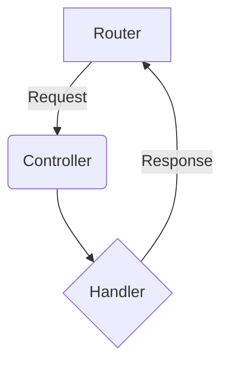

# API Architecture

## Why?
Well hello there! So, you're wondering why we cooked up this new API architecture? Great question! We wanted to build something super solid, easy to grow, and a joy to work with. Our old way of doing things was getting a bit tangled, so we decided to create a clean, clear structure that separates different parts of our app. This way, finding what you need is a breeze, and adding new features won't feel like solving a puzzle. Think of it as tidying up our digital house to make it a wonderful place to live and build in!

## Actual
Here’s the grand tour of how it all works! We've set up a neat flow where every request that comes in is handled in a series of simple, organized steps. It all starts with our main router, which is like a friendly traffic cop directing requests to the right place. From there, it goes to a specific controller, which then passes it to a handler to do the actual work.

Here’s a little drawing to show you the journey of a request:

This setup keeps everything tidy and makes it clear where to find the logic for each API endpoint. Fun, right?

## Constraints
To keep our beautiful new architecture in tip-top shape, we have a few friendly rules:

*   **Stick to the pattern:** All new API endpoints should follow the `router -> controller -> handler` flow.
*   **Keep controllers slim:** Controllers are just for routing. The real brainpower should live in the handlers.
*   **One feature, one handler:** Each handler should focus on doing one thing and doing it well.

Following these little guidelines will help us keep the codebase clean and happy!

## Findings
Putting this new structure together has been quite an adventure! We’ve learned that a little bit of planning up front saves a ton of headaches later. By separating our concerns, we've made the whole system easier to test and debug. Plus, it’s just so much more pleasant to navigate! We're feeling super optimistic about how this will help us grow and build even more amazing things.

## How to?
Ready to jump in and add your own magic? Awesome! Here’s how you can extend the API:

1.  **Create a new handler:** Write a new function in the `handlers.rs` file to contain your business logic.
2.  **Add a controller function:** Create a new function in `controllers.rs` that calls your new handler.
3.  **Wire it up in the router:** Add a new route in `routers.rs` and point it to your new controller function.

And that’s it! You’ve just extended the API. High five!
