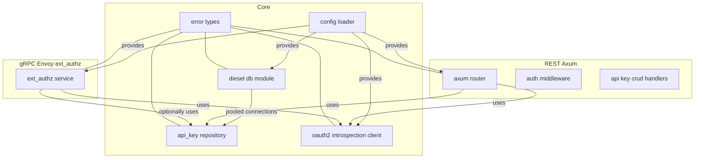
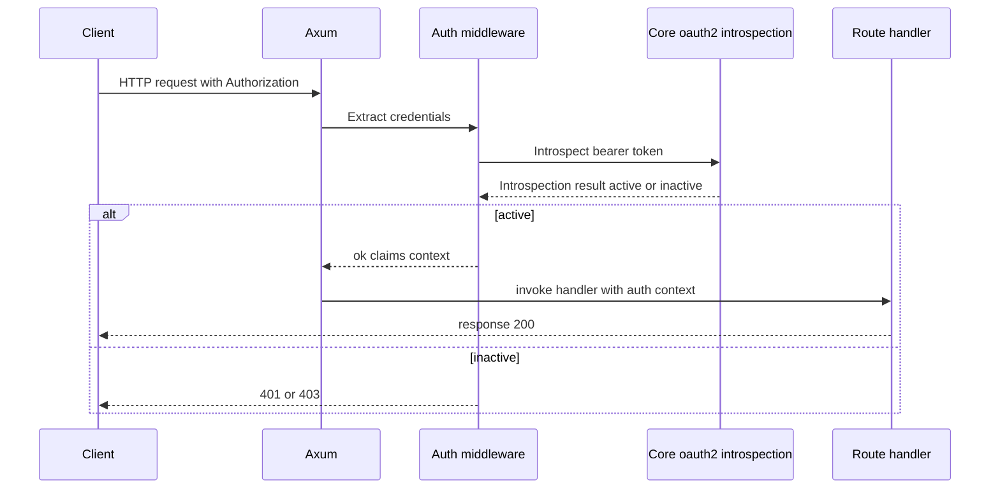
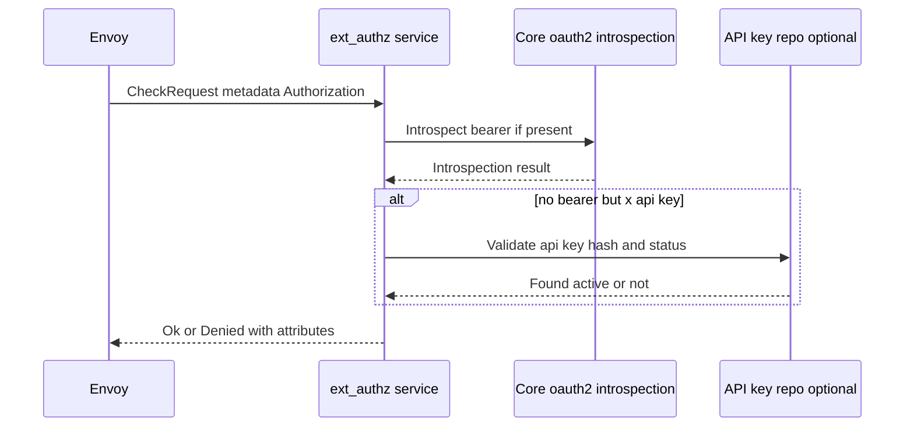
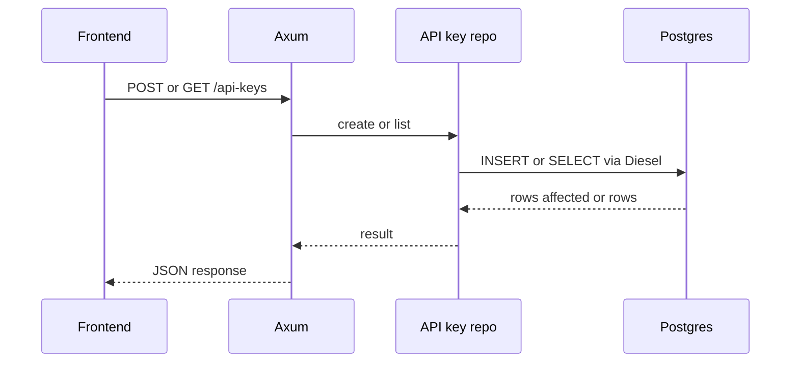
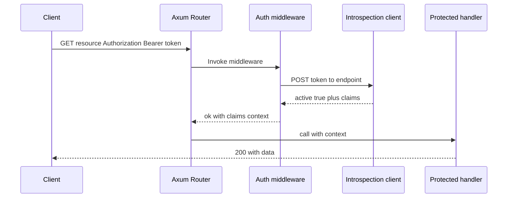
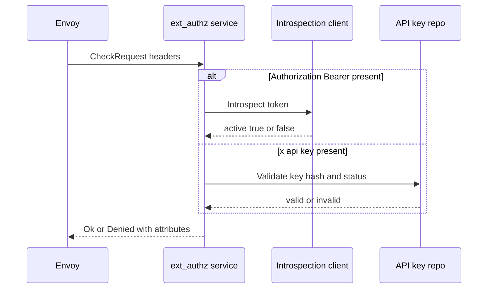

# Postgres Persistence and OAuth2 Introspection Architecture

## Why?

We need a secure, scalable foundation for two credential types:
- API keys: persist and manage lifecycle in Postgres with server-side hashing, enabling revocation, expiration, and metadata-driven policy.
- OAuth2 Bearer tokens: validate online via an Introspection endpoint to support resource server authorization without managing an IdP locally.

A single application will host:
- REST server (Axum) for frontend-facing management APIs and authenticated routes.
- gRPC server (Envoy ext_authz) for high-performance authorization decisions at the edge.

Both servers share core logic for:
- DB access and repository patterns (Diesel).
- OAuth2 token introspection client.
- Config parsing and centralized error handling.

## Actual
### High-level Components

Core modules and references:
- Config: [crates/lightbridge-authz-core/src/config/mod.rs](crates/lightbridge-authz-core/src/config/mod.rs)
- Error: [crates/lightbridge-authz-core/src/error.rs](crates/lightbridge-authz-core/src/error.rs)
- Core Library: [crates/lightbridge-authz-core/src/lib.rs](crates/lightbridge-authz-core/src/lib.rs)
- REST crate: [crates/lightbridge-authz-rest/src/lib.rs](crates/lightbridge-authz-rest/src/lib.rs)
- gRPC crate: [crates/lightbridge-authz-grpc/src/lib.rs](crates/lightbridge-authz-grpc/src/lib.rs)
- Proto crate: [crates/lightbridge-authz-proto/src/lib.rs](crates/lightbridge-authz-proto/src/lib.rs)
- Config file: [config/default.yaml](config/default.yaml)

### Data Flows

- REST request with Authorization header

- Envoy ext_authz gRPC flow

- API key CRUD via REST

### DI and Wiring
- A single bootstrap builds:
  - Config object from YAML.
  - DB pool in Core DB module.
  - Repository struct with pooled connections.
  - OAuth2 introspection client with HTTP client and timeouts.
  - REST router with state injection of repo plus introspection handle.
  - gRPC ext_authz service with shared handles.

## Constraints
- Diesel and Postgres: use Diesel stable with async via diesel_async. Follow Diesel guidance for async pooling with bb8.
- Pooling: bb8 chosen for Diesel async pooled connections due to first class integration in diesel_async pooled_connection module and broad usage.
- Migrations: use diesel_migrations with embedded migrations by default for reproducible deploys; optional runtime migration execution at start.
- Introspection without client secret: endpoint must accept bearer-only introspection. Security considerations:
  - Restrict egress to trusted IdP endpoints.
  - Prefer mTLS or private connectivity to IdP when available.
  - Enforce request timeouts and circuit breaking.
  - Avoid logging tokens. Redact sensitive headers in tracing.
  - Consider short lived cache for positive results with expiry not exceeding token exp.

## Findings
### Dependency Plan at Workspace Level
Proposed crates to add at workspace level; exact versions to pin during implementation after verification:
- axum ~0.7
- hyper ~1
- http ~1
- tower ~0.5
- tower-http ~0.5
- tokio ~1 with full or selected features
- serde ~1 with derive
- serde_yaml ~0.9
- tracing ~0.1
- tracing-subscriber ~0.3
- thiserror ~1
- diesel ~2 with postgres, chrono, uuid features as needed
- diesel-derive-enum if a Rust enum maps to Postgres enum for status
- diesel_migrations ~2
- diesel_async ~0.5 targeting Postgres and bb8 integration
- bb8 ~0.8
- reqwest ~0.12 or hyper client with tower if preferred
- uuid ~1
- time ~0.3 or chrono ~0.4 align with Diesel features
- url ~2
- async-trait ~0.1 if trait objects across async are needed
- tokio-stream ~0.1
- once_cell ~1 if lazy statics are needed

All dependencies declared under [workspace.dependencies] in [Cargo.toml](Cargo.toml). Individual crates use workspace = true.

### Database Schema
Table api_keys:
- id uuid primary key
- key_hash text or bytea depending on hashing output representation
- created_at timestamptz not null default now
- expires_at timestamptz null
- metadata jsonb null
- status enum active or revoked or a varchar constrained domain

Status mapping:
- Prefer a Postgres enum type api_key_status with values active and revoked. If using diesel-derive-enum, derive mapping cleanly. Alternatively map as text with a Rust enum and manual From Sql and To Sql.

Hashing of API keys:
- Store only a hash. Recommend Argon2id with strong params leveraging rust crate argon2. Bcrypt acceptable but Argon2id provides better resistance to GPU attacks. Store hashed value and needed parameters salt, cost in PHC string format in key_hash text.
- On create:
  - Generate random key material for plaintext value to show once.
  - Hash with Argon2id, store PHC string.
- On validate:
  - Hash provided key and verify using constant time verification of PHC string.

Crate implications:
- Add argon2 ~0.5 and rand ~0.8. These will be added at workspace level.

### Error Mapping
- Diesel errors map to core Error variants for:
  - NotFound
  - UniqueViolation
  - Connection and Pool errors
  - Migration errors
- Reqwest or HTTP client errors map to:
  - Transport
  - Timeout
  - InvalidResponse
- Use core Result and Error in [crates/lightbridge-authz-core/src/error.rs](crates/lightbridge-authz-core/src/error.rs). Extend the Error enum with variants for Db, Migration, Pool, Http, IntrospectionInactive, and ApiKeyRevoked as needed, following project rules.

## How to?
### Stepwise Implementation Plan
1. Extend configuration
   - Update [config/default.yaml](config/default.yaml) to include:
     - database: url dsn, pool size, max lifetime, tls mode
     - oauth2: introspection url, timeout, tls options, headers if any
   - Parse into Core config types in [crates/lightbridge-authz-core/src/config/mod.rs](crates/lightbridge-authz-core/src/config/mod.rs)

2. Workspace dependencies and features
   - Add planned crates under [workspace.dependencies] in [Cargo.toml](Cargo.toml)
   - Reference in crate Cargo.toml files using workspace = true

3. Core DB module
   - In core:
     - Module db with:
       - Pool builder bb8 with diesel_async Postgres
       - Connection type alias
       - run_migrations function using diesel_migrations embedded migrations
     - Create migrations folder with schema for api_keys table
     - Generate schema.rs via Diesel or keep minimal hand written mappings
     - models.rs with ApiKey model and NewApiKey

4. API key repository
   - Repository trait and implementation:
     - create, list, get by id, revoke, find by hash verify
   - Use Argon2id for hashing and verification

5. OAuth2 introspection client
   - Client struct with base url, timeouts
   - Request builder to send token to introspection endpoint using POST or configured method
   - Response model capturing active field, sub, scope, exp and custom claims map
   - Optional LRU cache design with ttl based on exp not implemented initially

6. REST wiring
   - In [crates/lightbridge-authz-rest/src/lib.rs](crates/lightbridge-authz-rest/src/lib.rs):
     - Build Router with state repo and introspection client
     - Routes:
       - POST /api-keys: create returns plaintext once and metadata
       - GET /api-keys: list with pagination
     - Auth middleware:
       - Extract bearer
       - Call introspection
       - Attach claims to request extensions
       - Deny on inactive or errors

7. gRPC wiring
   - In [crates/lightbridge-authz-grpc/src/lib.rs](crates/lightbridge-authz-grpc/src/lib.rs):
     - Implement Envoy ext_authz service
     - Extract Authorization from headers
       - If Bearer present, introspect
       - Else if x api key present, validate via repo
     - Return Ok with attributes or Denied with reason

8. Tests
   - tests directory per crate:
     - Core db tests using test database and migrations
     - Repository tests covering create, revoke, expiration
     - Introspection tests using a mock server to simulate active and inactive
     - REST smoke tests for routes
     - gRPC smoke tests for ext_authz happy and deny paths

### REST auth flow diagram

### gRPC ext_authz flow diagram

## Constraints
- Diesel async and bb8 selected for compatibility and ecosystem maturity.
- Embedded migrations ensure consistent deploys; provide a CLI flag later to run migrations at startup if desired.
- No client secret for introspection mandates secure transport and network controls; apply timeouts, retries with backoff, and strict redaction.

## Conclusion
Decisions:
- Diesel with diesel_async and bb8 for Postgres, embedded migrations by default.
- Argon2id for API key hashing stored as PHC in key_hash.
- Reqwest based introspection client with strict timeouts and redaction.
- Shared core modules consumed by both Axum REST and gRPC ext_authz.
- Centralized error mapping through core Error and Result.

Trade offs:
- Online introspection adds latency; mitigated with tight timeouts and optional caching design.
- Embedded migrations simplify deployment but require rebuild to change schema; acceptable given operational simplicity.

Open questions with defaults:
- Postgres enum vs text for status: default to Postgres enum via diesel-derive-enum, fall back to text if migrations or compatibility constrain.
- Introspection response schema variance: default to RFC 7662 fields, allow passthrough map for vendor specific claims.

References:
- Error handling: [crates/lightbridge-authz-core/src/error.rs](crates/lightbridge-authz-core/src/error.rs)
- Config entry point: [config/default.yaml](config/default.yaml)
