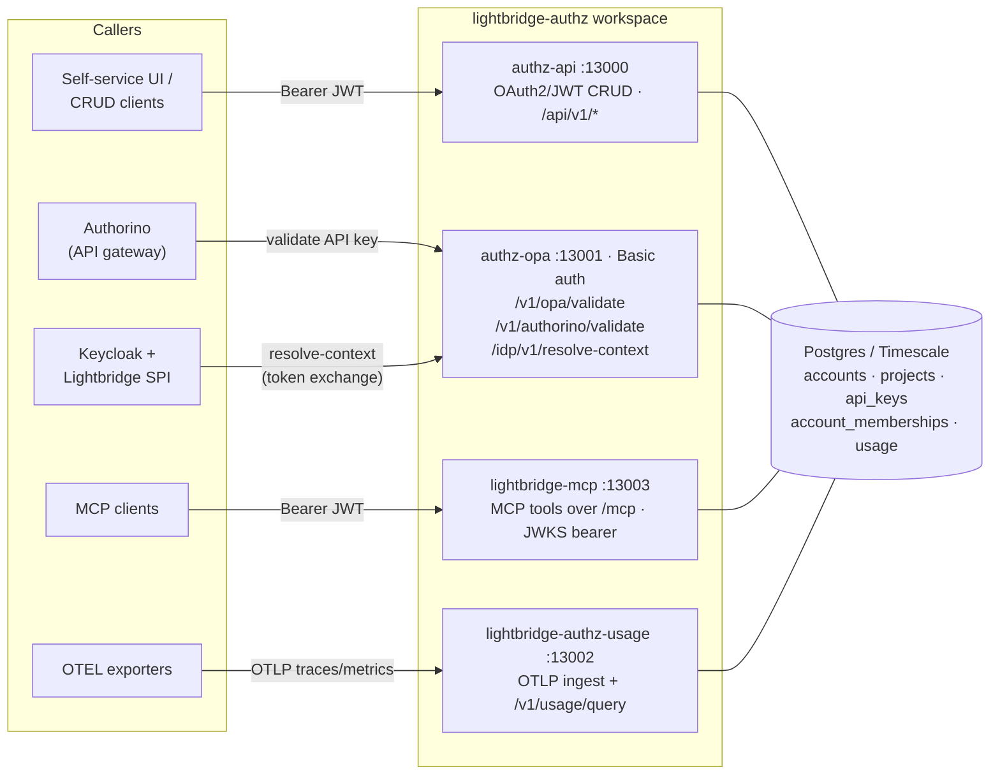
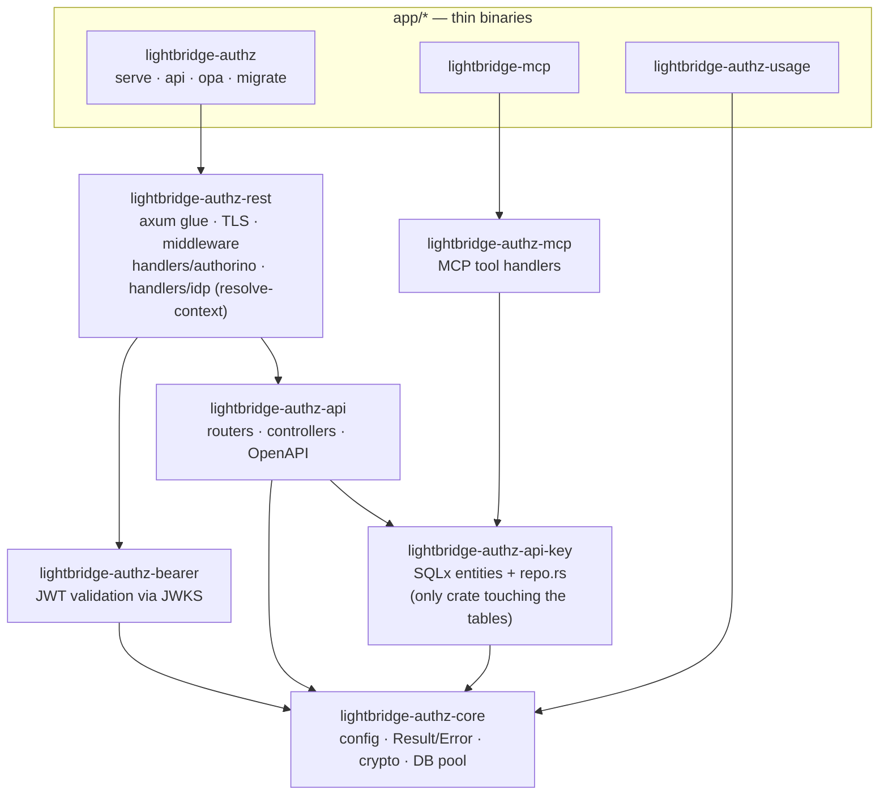
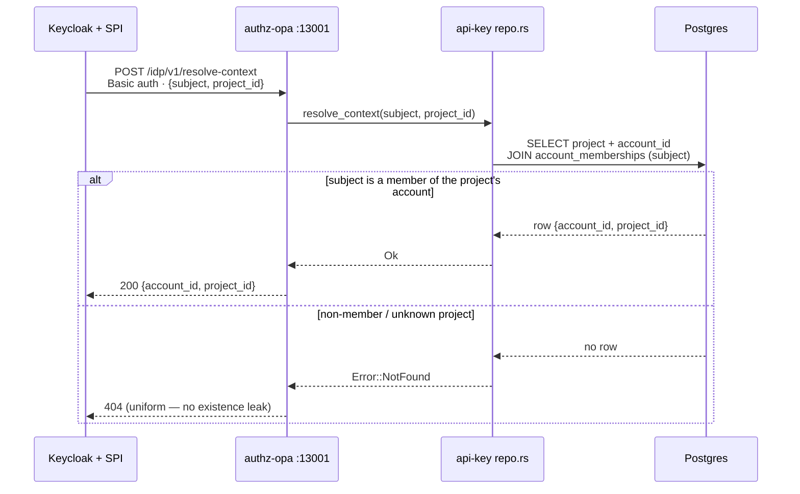
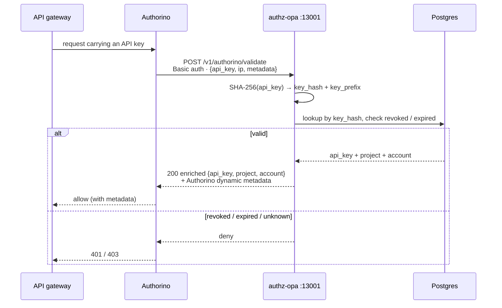

# Architecture

`lightbridge-authz` is a Rust (edition 2024) Cargo **workspace**: thin `app/*` binaries over layered
`crates/*`, deployed as several services that share one Postgres/Timescale database. A request takes one
of four roles.

## Services & callers

The **OPA / validation server** (`authz-opa`) is the internal, Basic-auth surface with **three**
responsibilities: API-key validation for Authorino, dynamic-metadata enrichment, and — since the
resolve-by-project work — the IdP **`/idp/v1/resolve-context`** endpoint the Keycloak SPI calls during a
`project_id` token exchange.

Ports are the host-exposed Compose ports; inside containers services bind `:3000`/`:3001`/`:3002`. All
local TLS is self-signed — use `curl -k`.

## Crate layering

`app/*` are thin entrypoints; the logic lives in `crates/*`. Only `lightbridge-authz-api-key` talks to the
`accounts`/`projects`/`api_keys` tables, and every error funnels through the centralized `Result`/`Error`
in `-core`.

## Flow: IdP token exchange → `resolve-context`

The Keycloak adapter ([lightbridge-keycloak-spi](https://github.com/adorsys-gis/lightbridge-keycloak-spi))
resolves `(subject, project_id)` to tenant context during a token exchange and seals it into the JWT. The
endpoint is Basic-auth protected (the pair is enumerable) and membership-enforced; every miss is a uniform
`404`. See [ADR-0001](adr/0001-resolve-context-by-subject-and-project.md).

## Flow: Authorino API-key validation

Authorino (not end users) calls the validation surface with the presented key. Only `key_hash`
(SHA-256) + `key_prefix` are stored — the plaintext `secret` is returned **only** on create/rotate — so
validation hashes the presented key and looks it up.

> `allowed_models` NULL or `[]` means "all models allowed". The two migration sets are independent:
> `migrations/` (authz) and `migrations-usage/` (usage/Timescale).
