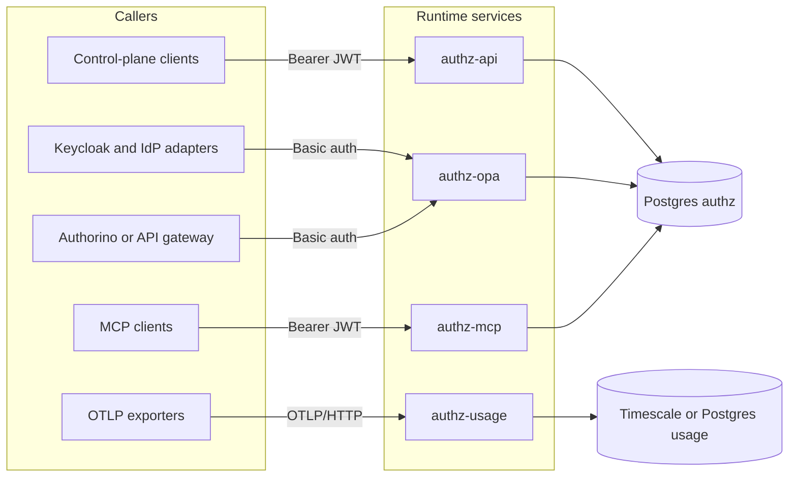
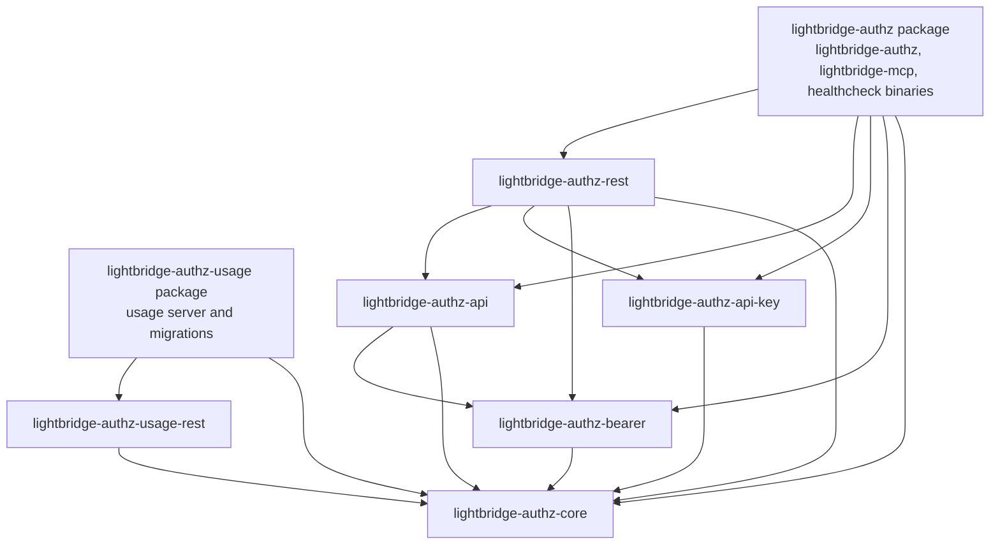
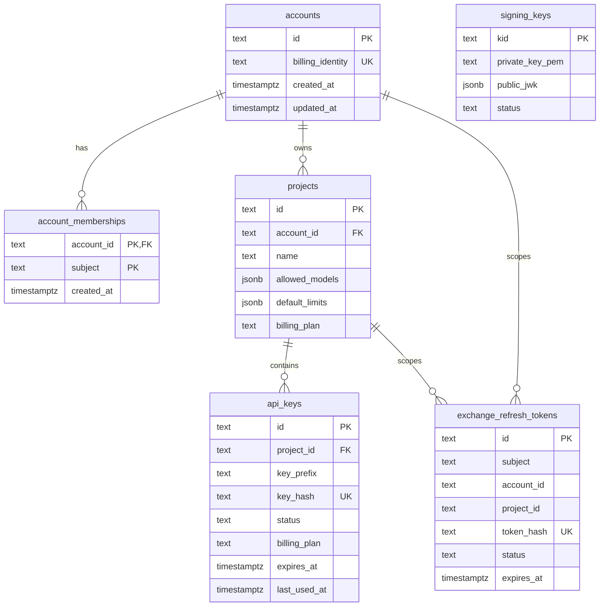
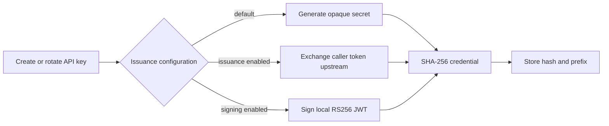
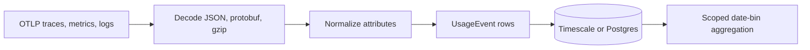

# Architecture

This document maps the architecture implemented by the repository today. The proposed replacement
architecture and migration sequence are documented in
[ADR-0002](adr/0002-consolidate-workspace-around-bounded-contexts.md).

## Runtime services

The workspace produces four runtime surfaces backed by two databases.

| Service | Authentication | Responsibilities |
| --- | --- | --- |
| `authz-api` | OAuth2/JWT bearer | Account, project, and API-key CRUD; optional OIDC discovery, JWKS, and token exchange |
| `authz-opa` | HTTP Basic | RFC 7662-style API-key introspection and subject/project context resolution |
| `authz-mcp` | OAuth2/JWT bearer | Nineteen MCP tools, OAuth metadata, and dynamic client-registration proxying |
| `authz-usage` | None | OTLP/HTTP trace, metric, and log ingestion plus aggregated usage queries |

The services are deployed independently even where they share the same binary or database. This is
the security and scaling boundary that must be preserved during restructuring.

## Cargo workspace

The workspace has eight active packages. Package edges are shown below; development-only edges
are omitted.

The package names do not consistently match their responsibilities:

- `lightbridge-authz-core` contains domain DTOs, configuration, SQLx pool handling, errors, API-key
  hashing, TLS serving, and tracing.
- `lightbridge-authz-api-key` persists accounts, memberships, projects, API keys, signing keys, and
  refresh tokens.
- `lightbridge-authz-rest` contains application behavior in addition to HTTP transport code.
- The MCP module in `lightbridge-authz` still depends on REST types and handlers to reuse
  application behavior, which preserves a transport-to-transport dependency until the application
  layer is extracted.
- Migration code lives as modules in the authz and usage binary packages.
- `lightbridge-authz-proto` remains in the source tree but is not an active workspace member.

## Authz data model

The authz database contains:

- `accounts`
- `account_memberships`
- `projects`
- `api_keys`
- `signing_keys`
- `exchange_refresh_tokens`

Relationships and notable behavior:

Account creation adds the caller as an account member. Account updates keep the current caller in
the membership set. A database trigger deletes an account if its final membership is removed.

`projects.allowed_models` uses these semantics:

- SQL `NULL`: all models are allowed.
- Empty JSON array: no models are allowed.
- Non-empty JSON array: only the listed models are allowed.

`api_keys.billing_plan` stores the **id** of the plan the key is minted on, chosen per key at
creation. The plan catalogue is defined entirely by the operator through `billing.plans` — there
is no plan table or entity. Each plan is `{ id, name, limits }`: a stable `id` (what the key
stores and `CreateApiKey` names), a UI `name`, and optional rate/usage `limits`
(`requests_per_second` / `requests_per_day` / `requests_per_month` / `concurrent_requests`). The
catalogue is an inline YAML sequence, or a single `BILLING_PLANS` JSON-array env var for
fully-env setups. `CreateApiKey` must name a configured `id` or the request is rejected with
`400 Bad Request`; rotation preserves the existing key's plan. Token introspection returns the
key's `billing_plan` (id) plus the resolved `billing_plan_name` and `billing_plan_limits`.

## Credential lifecycle

One API operation can currently create three materially different credential forms:

1. A random opaque API-key secret.
2. An access token obtained from an upstream OAuth2 token-exchange endpoint.
3. A locally signed RS256 JWT.

All three are hashed with SHA-256 and stored in `api_keys`. Only the plaintext credential returned
by create or rotate leaves the service. Local JWT signing also stores the private signing key in the
authz database and publishes OIDC discovery and JWKS documents.

## Validation and identity flows

### API-key introspection

`POST /v1/authorino/validate/introspect` accepts form-encoded RFC 7662-style input. The service:

1. Hashes the presented credential.
2. Loads the API-key row by hash.
3. Rejects unknown, revoked, or expired keys using `{"active": false}`.
4. Updates `last_used_at` and `last_ip` for active keys.
5. Loads project and account context.
6. Returns the enriched introspection response.

### Subject and project context resolution

`POST /idp/v1/resolve-context` resolves a subject and project to account/project context. The query
joins `projects` to `account_memberships`; an unknown project and a non-member both return the same
`404`. See [ADR-0001](adr/0001-resolve-context-by-subject-and-project.md).

### Native token exchange

When local signing and token exchange are both enabled, `POST /oauth2/token` supports:

- RFC 8693 token exchange using an upstream bearer token and requested `project_id`.
- Refresh-token rotation for scopes that include `offline_access`.

The access JWT is locally signed. Refresh-token secrets are random and only their hashes are
persisted.

## MCP surface

The MCP server exposes the seventeen admin CRUD operations plus two API-key validation tools. It
calls the same `AuthzStore` interface as HTTP controllers, but constructs the implementation through
the REST package.

It also exposes public OAuth metadata and proxies dynamic client registration to a configured
upstream registration endpoint. Public registration URLs are currently derived from forwarded or
host headers when present.

## Usage pipeline

The usage service accepts OTLP/HTTP protobuf or JSON for traces, metrics, and logs, with optional
gzip encoding. It merges resource, scope, and record attributes and searches compatibility aliases
for account, project, API-key, user, model, token, and cost dimensions.

The usage schema becomes a Timescale hypertable when the extension is available and requests a
thirty-day retention policy. The query endpoint always aggregates by time bucket and can group by
tenant, user, model, metric, and signal dimensions.

## Deployment and operations

The repository provides:

- One multi-stage Dockerfile that builds all binaries.
- Compose services for Postgres, Timescale, Keycloak, TLS generation, API, OPA, MCP, usage,
  migrations, Jaeger, and MCP Inspector.
- Separate Helm subcharts plus an umbrella chart.
- Public health, startup, and readiness probes on every Rust service.
- A standalone TCP healthcheck binary included in every runtime image.
- Rootless Buildah and sccache-based CI builds.

Application-level TLS is used by the Rust services in local and chart configuration. The proposed
architecture must decide explicitly whether TLS remains in-process or terminates at the platform
boundary.

## Known architectural debt

- Domain DTOs derive transport-specific OpenAPI schemas.
- The central error type combines domain, SQLx, configuration, and HTTP response concerns.
- Validation writes usage metadata synchronously for every active credential.
- The usage ingest and query routes have no application authentication.
- Debug logging can include complete normalized usage attributes.
- Credential status is stored as free-form text.
- Documentation and route contracts have drifted after the introspection and token-exchange work.
- Default workspace tests do not execute feature-gated database and token-exchange scenarios.

These findings motivate ADR-0002; they are not all addressed by documentation changes alone.
