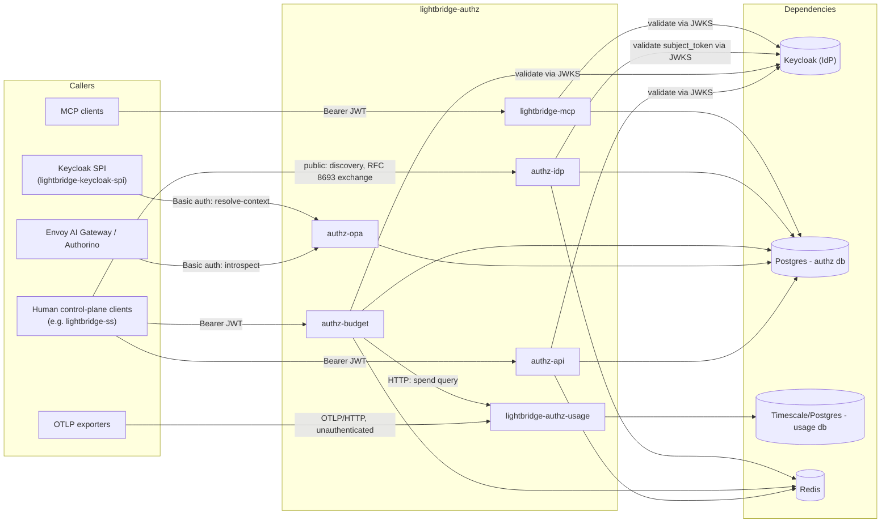
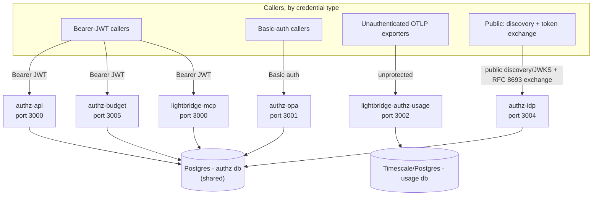

# Architecture

Front door for the system-level architecture docs. If you are new to this repository, read this
page first, then follow the links below into whichever area you need next.

This repo builds **API-key management plus usage analytics** as six independently deployable
services sharing two databases. See the root [`AGENTS.md`](../../AGENTS.md) for build/test
commands and repo-wide conventions; this directory is about *shape*, not commands.

## Context: who calls this system, and what it depends on

Notes grounded in code, not intent:

- **Envoy/Authorino never talks to `authz-api`.** The data-plane gate (`docs/governance-model-and-enforcement.md`)
  calls `authz-opa`'s Basic-auth-protected introspection endpoint only.
- **The Keycloak SPI adapter is also a Basic-auth caller of `authz-opa`**, not of `authz-api`: it
  resolves `{subject, project_id} -> {account_id, project_id}` at token-exchange time via
  `POST /idp/v1/resolve-context` (`crates/lightbridge-authz-rest/src/handlers/idp.rs`) and a dumb
  protocol mapper copies the result into the JWT it issues. `authz-api` and `lightbridge-mcp`
  independently validate whatever JWT they receive against Keycloak's JWKS — the SPI call and the
  JWKS validation are two separate relationships with Keycloak, not one.
- **`authz-budget` carries the budget domain's RPC procedures off `authz-api`** (hard cutover, see
  [`budget.md`](./budget.md#service-boundary-authz-budget-hard-cutover)) — it validates bearer JWTs
  against the same Keycloak JWKS, reads/writes the same `authz` Postgres database, has its own
  Redis-backed rate limiting, and calls `lightbridge-authz-usage`'s spend-query endpoint over HTTP
  the same way `authz-api` used to before the move.
- **`authz-idp` is the sole owner of the OIDC discovery/JWKS/token-exchange surface.** The public
  issuer has been cut over to it and `authz-api` no longer mounts the same routes (see
  [`services.md`](./services.md#authz-idp)). Every route it mounts is public because the presented
  token/assertion is itself the credential; it validates an RFC 8693 `subject_token` against
  Keycloak's JWKS. The accepted browser/device roadmap is not yet a deployed grant surface; see
  [`../oauth-oidc-standards-roadmap.md`](../oauth-oidc-standards-roadmap.md).
- **Redis is `authz-api`/`authz-budget`/`authz-idp`-only** today: `authz-idp` requires it at
  startup even if token exchange is disabled; when exchange is enabled it backs the
  `private_key_jwt` replay-tracking store (`crates/lightbridge-authz-rest/src/lib.rs`).
  `authz-opa`, `lightbridge-mcp`, and `lightbridge-authz-usage` have no Redis dependency.
- **`lightbridge-authz-usage` splits ingest and query auth (#347)** — `/v1/otel/{traces,metrics,logs}`
  stays unprotected (its caller is an AI Envoy/OpenTelemetry exporter outside this repo's deploy
  surface); `/usage/v1/usage/query` and `/usage/v1/spend/query` moved to a separate listener that
  requires and verifies a client certificate (mTLS) — see `UsageServerGroup` in
  `crates/lightbridge-authz-usage/src/config.rs`. Neither route has an ownership check on
  `scope_id`/`account_id` — mTLS authenticates the caller, not what it's entitled to see. Safe
  only because the service is not externally routable in the deployed topology regardless; see
  `docs/architecture/deployment.md`.

## Containers: the six deployables

`authz-api`, `authz-opa`, `authz-budget`, and `authz-idp` are **the same compiled binary**
(`lightbridge-authz`) run with different subcommands (`api` / `opa` / `budget` / `idp`) from the
same `runtime` container-image target — they are four deployables, not four images.
`lightbridge-mcp` and `lightbridge-authz-usage` are each their own binary and image target
(`mcp-runtime`, `usage-runtime`). See [`docs/architecture/services.md`](./services.md) for routes
and [`docs/architecture/deployment.md`](./deployment.md) for how the images are built, signed, and
promoted.

Local ports (`compose.yaml`, matching the health-check URLs in the root `AGENTS.md`): API `13000`,
OPA `13001`, usage `13002`, MCP `13003`, idp `13004`, budget `13005` — all mapped to the
in-container ports shown above.

## Where the rest of the picture lives

| Doc | Answers |
| --- | --- |
| [`services.md`](./services.md) | Per-service responsibility, protection, routes (grounded in router source), and the crate layering behind `authz-api`/`authz-opa`. |
| [`deployment.md`](./deployment.md) | How code reaches production: CI/CD chain, image signing, the image-updater promotion gate (and its silent-failure mode), Helm chart shape. |
| [`data-model.md`](./data-model.md) | Entity relationships, the account/project/membership model, identifier format (CUID2). |
| [`budget.md`](./budget.md) | The budget domain: ledger, policy engine, self-service refill/review — distinct from the Envoy-side rate limiting `governance-model-and-enforcement.md` describes. |
| [`auth-flows.md`](./auth-flows.md) | Credential lifecycle, introspection, `resolve-context`, native RFC 8693 token exchange (including today's refresh-token hardening and RFC 7009 revocation), MCP auth. |
| [`../oauth-oidc-standards-roadmap.md`](../oauth-oidc-standards-roadmap.md) | Implemented OAuth/OIDC surface, standards gaps, and the ordered Authorization Code + PKCE, device-flow, lifecycle, and hardening roadmap. |
| [`../rbac.md`](../rbac.md) | JWT claim → permission mapping; which permission gates which operation. |
| [`../governance-model-and-enforcement.md`](../governance-model-and-enforcement.md) | The Envoy/Authorino data plane: how a request actually gets rate-limited or refused at the gateway. |
| [`../auth-reference.md`](../auth-reference.md) | Field-by-field dictionary for JWT claims, config keys, and RPC/HTTP shapes. |
| [`../token-exchange-integration.md`](../token-exchange-integration.md) | Task guide for integrating a client against native token exchange. |
| [`../platform-guides.md`](../platform-guides.md) | Per-platform Helm install/config/deploy commands. |
| [`../rfc/0001-budget-refill.md`](../rfc/0001-budget-refill.md) | The original design proposal for the budget domain. |
| [`../adr/`](../adr/) | Every accepted architecture decision, numbered. |

This directory documents **shape and rationale** ("how is this structured, and why"). It
deliberately does not restate field-by-field contracts or step-by-step task instructions — those
live in the reference and integration docs linked above.
