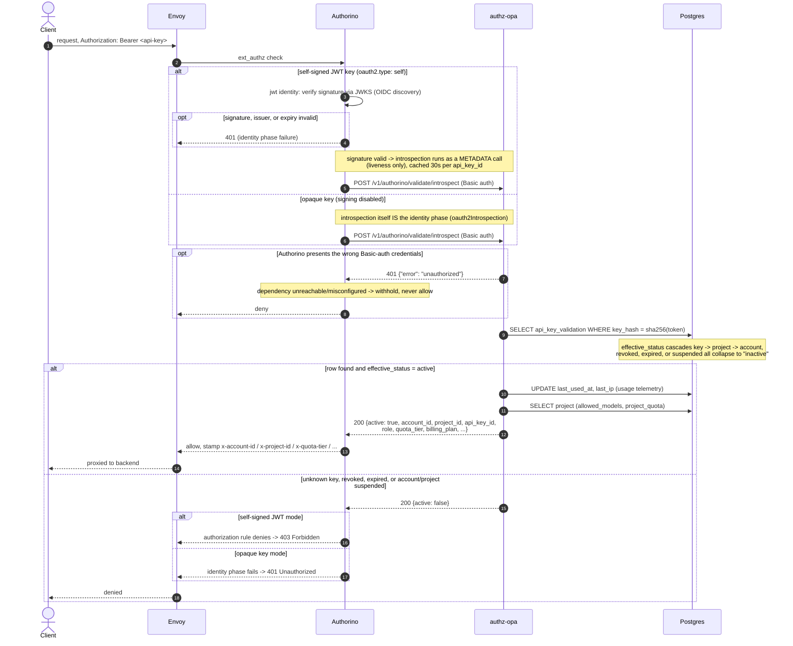
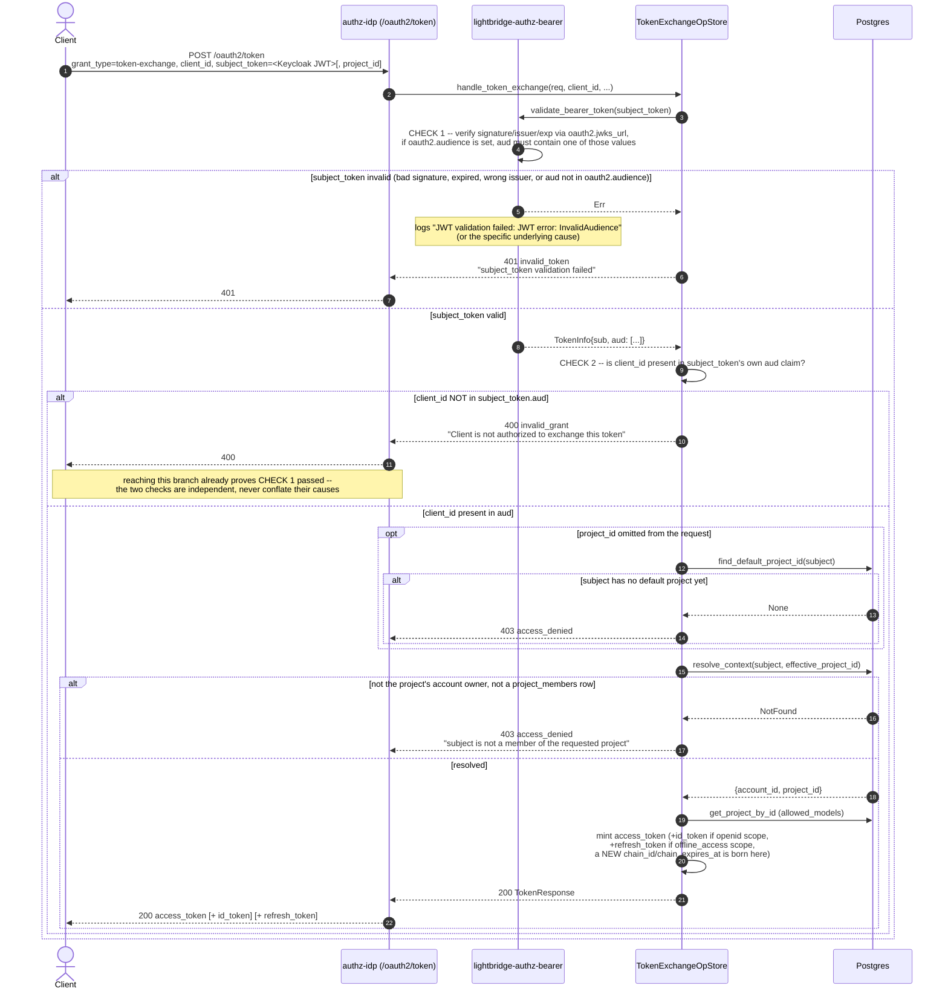
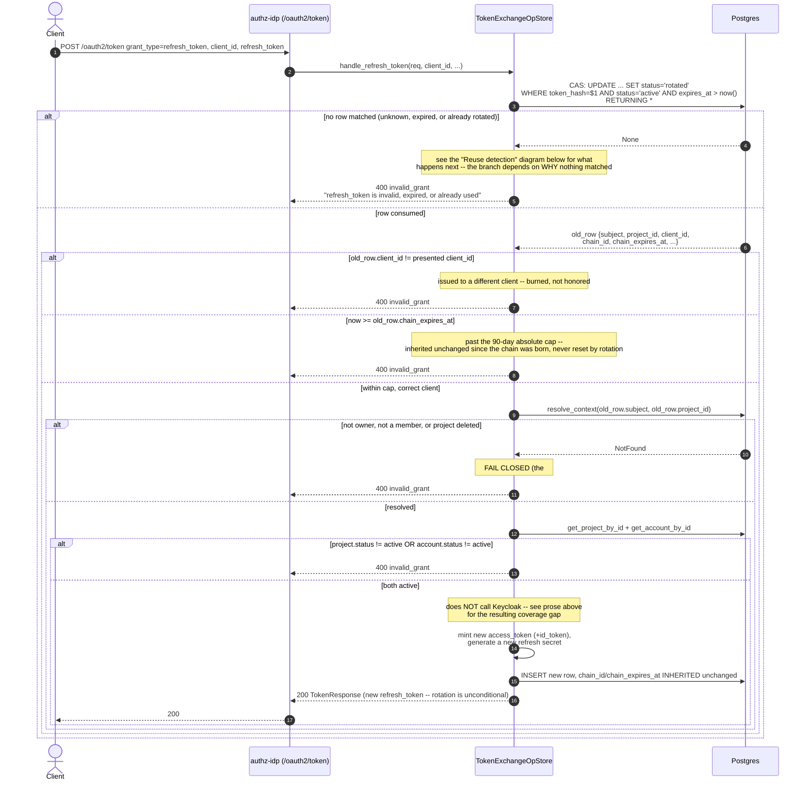
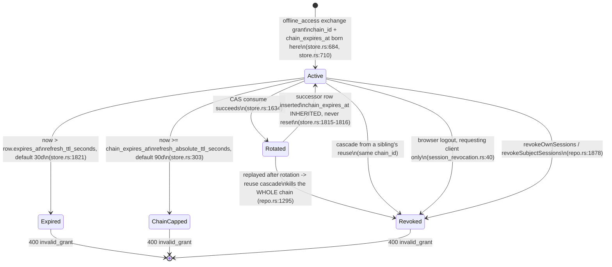
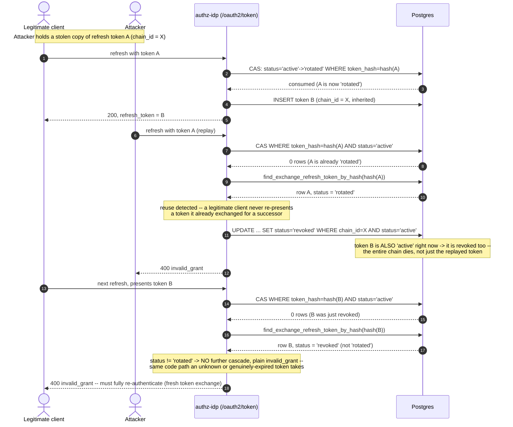
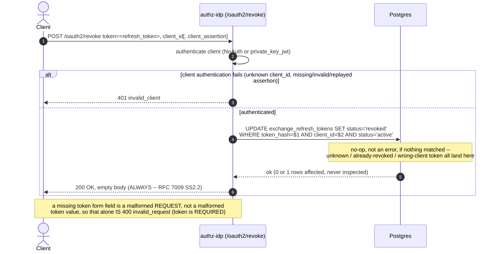
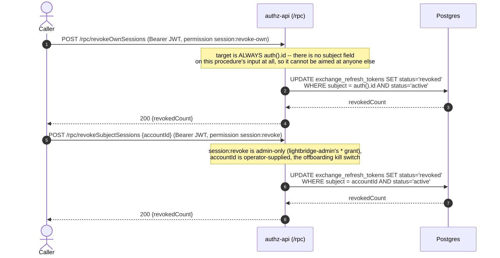
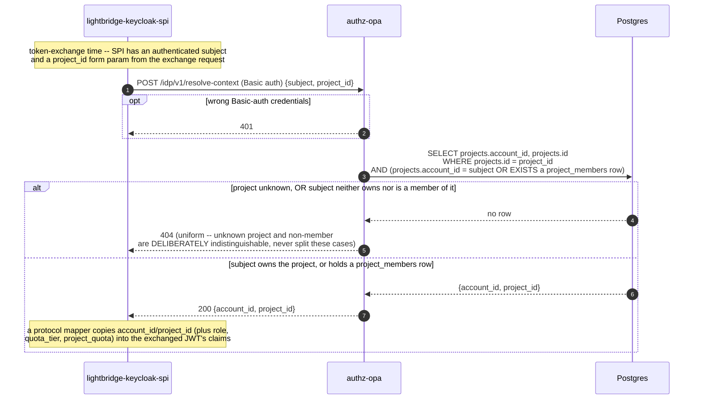

# Auth flows

How credentials move through this system and, more importantly, what happens to a request when
one of the moving parts is unreachable, unresolvable, or lying. Every protected service on the
platform sits downstream of one of the flows below, so the failure-mode question — *does the
unavailable branch become the permissive branch?* — is the organizing question of this document,
not an afterthought (see `AGENTS.md`'s "Spend review attention here instead" section, item 1).

This is not a field dictionary and not a task guide — those already exist and this document
deliberately does not restate them:

- [`docs/auth-reference.md`](../auth-reference.md) — config keys, discovery-document fields,
  endpoint inventory, field-by-field lookup.
- [`docs/token-exchange-integration.md`](../token-exchange-integration.md) — "how do I integrate
  against `/oauth2/token`", worked requests, Keycloak client setup.
- [`docs/oauth-oidc-standards-roadmap.md`](../oauth-oidc-standards-roadmap.md) — the current
  `authz-idp` OAuth/OIDC implementation inventory and what remains before browser
  Authorization Code + PKCE or device authorization is available.

The native exchange/revocation routes below are served by **`authz-idp`**, not `authz-api`.
They are a narrow RFC 8693/refresh/RFC 7009 surface, not a browser authorization-code or device
server. For the current standards gap and delivery order, use the roadmap above.

## 1. API key validation — the gateway path

Envoy's `ext_authz` filter calls Authorino before a request ever reaches a backend. Authorino, in
turn, calls this service's one remaining validation route,
`POST /v1/authorino/validate/introspect` (RFC 7662-shaped, Basic-auth protected;
`crates/lightbridge-authz-rest/src/handlers/introspect.rs`,
`crates/lightbridge-authz-rest/src/routers/mod.rs`). The two earlier routes
(`/v1/opa/validate`, `/v1/authorino/validate`) were removed and are locked out by a regression
test (`introspect_endpoint_should_exist_in_opa_openapi`,
`crates/lightbridge-authz-rest/src/lib.rs:1788-1807`) — see `docs/authorino-usage.md` if you find
older references to them.

There are two identity-plane shapes, because whether introspection *is* the identity check or
just a liveness check afterward depends on how the key is minted
(`docs/authorino-usage.md`'s "AuthConfig wiring" section):

- **Self-signed JWT keys** (`oauth2.type: self`, the enterprise default): Authorino's `jwt`
  identity verifies the signature via this service's own JWKS (`GET /.well-known/jwks.json`,
  discovered from `GET /.well-known/openid-configuration`). Introspection then runs as a
  **metadata** call — liveness only, cached 30s per `api_key_id` — and a separate authorization
  `patternMatching` rule gates on `active == true`.
- **Opaque keys** (signing disabled): Authorino's `oauth2Introspection` identity calls the same
  endpoint directly — one call both authenticates and returns context.

That split matters for which HTTP status a caller sees on a bad key, and it is why the diagram
below branches on it explicitly.

Every branch that hits this endpoint funnels through one function,
`validate_api_key_context` (`crates/lightbridge-authz-rest/src/handlers/opa.rs`): hash the
presented key, read the `api_key_validation` view (a single indexed read that has already
collapsed the `key → project → account` status cascade in SQL — revoking a key or suspending its
project/account takes effect on the *next* request, because the row, not a cache, is the source
of truth), then two more reads for usage telemetry and `allowed_models`/`project_quota`.

`active: false` is a `200`, not an error — RFC 7662 has no "invalid token" status code, and this
service never invents one; the *caller's* interpretation of `active: false` (401 vs 403) is
entirely Authorino's, decided by which phase the check ran in. The response-header stamping
(`x-account-id`, `x-quota-tier`, `x-project-quota`, `x-billing-plan`, ...) and the rate-limit rules
that key on them are `docs/governance-model-and-enforcement.md`'s territory, not this document's —
linked in "See also" below.

## 2. RFC 8693 token exchange

`POST /oauth2/token`, `grant_type=urn:ietf:params:oauth:grant-type:token-exchange`
(`crates/lightbridge-authz-rest/src/token_exchange.rs`,
`crates/lightbridge-authz-rest/src/oauth2_op/store.rs::handle_token_exchange`). A Keycloak-issued
bearer token comes in as `subject_token`; a project-scoped access token (plus optional `id_token`/
`refresh_token`) comes out.

**The highest-value thing to understand about this flow: there are two independent audience
checks, and they run in that order, checking two different things.** Confusing them is the single
most time-consuming failure mode in this flow — see `docs/token-exchange-integration.md`'s "How to
debug" section, born from exactly that confusion.

1. **Bearer validation** (`crates/lightbridge-authz-bearer/src/lib.rs`) — is this JWT valid *for
   this deployment at all*? Signature/issuer/expiry against `oauth2.jwks_url`, and — if
   `oauth2.audience` is configured — the token's `aud` claim must contain one of those
   server-level values. Failure here never reaches the second check: `401 invalid_token` /
   `"subject_token validation failed"`, and the real cause is logged at `ERROR` in
   `lightbridge-authz-bearer` even though the response body stays generic — an audience mismatch
   specifically logs `JWT validation failed: JWT error: InvalidAudience`
   (`authkestra_resource`'s `ValidationError::Jwt` wrapping `jsonwebtoken`'s own `Display`).
2. **The exchange's own client-binding check** (`oauth2_op/store.rs:222-227`) — is the *specific
   OAuth2 `client_id` presented in this exchange request* one this subject token was actually
   issued for? `token_info.aud.iter().any(|a| a == &client_id)`. Failure here: `400 invalid_grant`
   / `"Client is not authorized to exchange this token"`.

Reaching check 2's failure means check 1 already passed — a `400 invalid_grant` here is never a
symptom of a broken JWKS or wrong issuer; it means the token is genuinely valid, just not scoped
to the client asking for it (a Keycloak audience-mapper gap, almost always).

`project_id` is optional (PR #309, merged today): an omitted value resolves to the subject's own
auto-provisioned default project (`StoreRepo::find_default_project_id`) rather than being
rejected. A subject with zero projects yet resolves identically to an unknown/non-member project
— both are `403 access_denied`, deliberately indistinguishable, so this endpoint never leaks
"you have no projects" any more than it leaks "that project doesn't exist" (same non-leaking rule
`resolve_context` follows in §6).

## 3. Refresh grant — as hardened today

`POST /oauth2/token`, `grant_type=refresh_token`
(`oauth2_op/store.rs::handle_refresh_token`). As of PR #316 (merged today) this closes three gaps
a security review found, all sharing one new `exchange_refresh_tokens.chain_id`/`chain_expires_at`
column pair:

- **Re-validation.** Before #316, the only DB read on refresh was an unfiltered
  `get_project_by_id` — a subject removed from the project's roster, or whose account/project was
  suspended, could keep refreshing forever. Worse, a project that could not be resolved fell
  through to `allowed_models = None`, which this codebase reads as "no restriction" — a real
  fail-*open* bug on a deleted project. Refresh now re-runs the same `resolve_context`
  ownership/membership check the exchange grant uses, plus the account/project `status == active`
  cascade, and refuses (`invalid_grant`) on any resolution failure instead of falling through.
- **The 90-day absolute chain cap.** Each rotation used to reset the token's own `expires_at` to
  `now() + refresh_ttl_seconds` (30 days by default) with nothing bounding how many times that
  could repeat — a session that kept refreshing before every expiry never actually ended.
  `chain_expires_at` is set once, when the chain is born at the initial exchange, and every
  rotation **inherits it unchanged**. `refresh_absolute_ttl_seconds` defaults to 7,776,000 seconds
  (90 days; `crates/lightbridge-authz-core/src/config/mod.rs:561-573`) — this is what makes a
  session bounded rather than perpetually renewable.
- **Rotation is unconditional.** Every successful refresh both consumes the presented token
  (single-use, via a compare-and-swap `UPDATE ... WHERE status = 'active' ... RETURNING`) and
  mints a brand-new refresh token in its place. There is no "reuse the same refresh token"
  path.

The honest limit, stated plainly rather than implied: **refresh does not call Keycloak.** No
Keycloak credential is held at refresh time, so a subject *disabled in Keycloak* — as opposed to
removed from this service's own project roster — is bounded only by the 90-day cap and an
operator's explicit revoke action (§5), not by anything this check does.

## 3a. A refresh token's lifecycle, as a state machine

§2 and §3 above show how a chain is born and how one rotation proceeds. This is the same thing
viewed as states rather than steps, because **every way a refresh token dies is a transition into
a terminal state, and all of them return the identical wire response**. That is the single most
important operational fact about this subsystem and it is invisible in a sequence diagram.

### Why this view matters more than it looks

**Five distinct causes collapse into one indistinguishable response.** `Expired`, `ChainCapped`,
`Revoked`-by-reuse, `Revoked`-by-logout and "no such token at all" are all
`400 invalid_grant`, and the wire deliberately cannot tell them apart — an oracle here would leak
whether a given token ever existed. The cost is paid at debugging time. The
"Which failure means what" table at the end of this document maps each response back to its
causes; this diagram is the same information keyed by *state* rather than by response.

**Unreachable by design**, stated explicitly per this repo's "draw the state machine, don't just
describe it" rule (see ADR-0020's own state diagram for the sessions equivalent): there is no
transition out of `Expired`, `ChainCapped` or `Revoked`. Nothing anywhere un-revokes a chain or
extends a cap — `Rotated -> Active` is the ONLY edge that continues a lineage, and it inherits
`chain_expires_at` rather than recomputing it.

**Only ONE of those transitions logs anything.** The reuse cascade warns
(`refresh token reuse detected ...`), and the graced-replay path warns. Every other death is
silent: `handle_refresh_token`'s plain `invalid_grant` arm emits no log line at all. So a user
reporting "my CLI suddenly asks me to log in again" produces, server-side, *the absence of
evidence*. When diagnosing, reason from the state machine and the row's `status` column, not from
the logs.

**`Rotated -> Active` is where the 90-day cap lives.** A chain that keeps refreshing before every
individual `expires_at` would otherwise live forever; `chain_expires_at` is set once at birth and
inherited unchanged (never recomputed) precisely so that rotation cannot extend it.

**`Rotated -> Revoked` deliberately kills more than the replayed token.** The successor — which was
never itself replayed — dies too. That is the point: RFC 6819 §5.2.2.3 treats a replay as evidence
the family is compromised, so the family dies, not just the member. A 30-second grace window
(`refresh_reuse_grace_seconds`) exempts a client racing itself; see §4.

**Not shown here, because it is not a chain state at all:** since #631 a refresh token is verified
(signature/`aud`/`typ`) *before* the database is consulted, against `purpose = 'refresh'` signing
keys only. A token that fails that check never reaches any state above — it is refused with the
same `400 invalid_grant`, which is why a signing-key cutover looks identical to a revoked chain
from the client's side.

## 4. Reuse detection / theft cascade

RFC 6819 §5.2.2.3: a refresh token being presented a *second* time, after it was already
rotated away, is the strongest signal this codebase has that a token was stolen — a legitimate
client never re-presents a token it already exchanged for a successor. When the CAS in §3 matches
no row, `revoke_chain_on_reuse` (`oauth2_op/store.rs:618-652`) looks the hash up again to decide
*why* it matched nothing:

- row's `status == "rotated"` → this exact token was already consumed by someone → reuse →
  **revoke the entire chain** (`UPDATE ... SET status='revoked' WHERE chain_id = $1 AND status =
  'active'`), which also kills whatever token *succeeded* it, even though that successor was
  never itself replayed.
- anything else (`status == "revoked"` already, `status == "active"` but simply expired, or no
  row at all for an unknown hash) → plain `invalid_grant`, **no cascade**.

The asymmetry is the point: an attacker who never triggers reuse (steals a token and never gets a
chance to replay an already-superseded one) is not detected by this mechanism at all — it is a
tripwire on a specific race, not a general theft detector. The 90-day cap and manual revocation
(§5) are what bound the undetected case.

## 5. Revocation

Two independent surfaces, both ending at the same `exchange_refresh_tokens` row flip. There is no
access-token revocation anywhere in this system: access tokens are stateless self-signed JWTs with
no server-side record to flip, so revocation only ever touches refresh-token rows.

### 5a. RFC 7009 — `POST /oauth2/revoke`

Client-scoped, client-authenticated (public `client_id` alone, or `private_key_jwt` for a
confidential client — never `client_secret_basic`/`_post`, ADR-0011 Decision 6), no bearer token
involved (`crates/lightbridge-authz-rest/src/token_exchange.rs:438-509`).

**The counter-intuitive part, RFC 7009 §2.2:** an unknown token, an already-revoked token, or a
token issued to a *different* client than the one authenticating the request is **also** `200 OK`
— never an error. This is deliberate: it denies an attacker an oracle for probing whether a given
token string is currently valid, or which client it belongs to. The *only* error this endpoint
ever returns is client-authentication failure itself, which happens entirely before the token is
even looked up.

**`revocation_endpoint` is deliberately absent from `/.well-known/openid-configuration`** — not an
oversight, and not fixable from this side. `authkestra_op::handlers::discovery::OidcDiscovery`
(0.5.0) has no field to carry it in, even though `/oauth2/revoke` itself is real, mounted, and
live the moment the router merges in. Filed upstream:
[`marcjazz/authkestra#220`](https://github.com/marcjazz/authkestra/issues/220)
(`crates/lightbridge-authz-rest/src/signing.rs:446-456`). A client integrating revocation needs
the hardcoded path `{issuer}/oauth2/revoke`.

### 5b. Bearer + RBAC — `revokeOwnSessions` / `revokeSubjectSessions`

Two RPC procedures over the same mechanism, gated by permission rather than client identity
(`crates/lightbridge-authz-rest/src/lib.rs:1139-1198`; permission wiring in
`docs/rbac.md`'s session-revocation section — not duplicated here).

`session:revoke-own` is granted to every default role, including the otherwise strictly read-only
`lightbridge-viewer` — logging yourself out is self-protective, not a write capability. Both
procedures return a count (not an error) when the target has zero active sessions — nothing to
revoke is success, not failure, the same idempotent posture RFC 7009 takes above.

## 6. Identity context resolution

`POST /idp/v1/resolve-context` (Basic-auth protected;
`crates/lightbridge-authz-rest/src/handlers/idp.rs`, repo method `resolve_context` in
`crates/lightbridge-authz-api-key/src/repo.rs:638-674`). This is what the `lightbridge-keycloak-spi`
IdP adapter calls at token-exchange time, on Keycloak's own side, to resolve which
account/project a human's project selection maps to before a dumb protocol mapper copies the
result into JWT claims — stateless, no store, one query.

The query is deliberately a single statement with one `NotFound` branch: authorized when `subject`
is the project's account owner **or** holds *any* `project_members` row on it (not lead-gated —
this is a read, the same visibility boundary `Project`'s own `@@allow("read", ...)` uses). An
unknown `project_id` and a known project the subject cannot see must resolve identically, so this
endpoint can never be used to enumerate which projects exist by trying ids and watching the status
code change.

The practical consequence, stated in `docs/governance-model-and-enforcement.md` too and worth
repeating here because it is this endpoint's direct effect: **switching project means requesting a
new token, not sending a different header.** Project context is sealed in at exchange time, not
read per request.

## Which failure means what

| Flow | HTTP | `error` / body | Cause | Cascade? |
|---|---|---|---|---|
| §1 gateway | `200 {"active": true, ...}` | — | key hashes to a row whose cascaded status is active | — |
| §1 gateway | `200 {"active": false}` | — | unknown key, revoked, expired, or its project/account is suspended | — |
| §1 gateway | `401` (opaque-key mode) or `403` (JWT mode) | Authorino-side, not from this service | `active: false` interpreted by whichever phase introspection ran in | — |
| §1 gateway | `401 {"error": "unauthorized"}` | from `authz-opa` itself | wrong Basic-auth credentials on the introspection call | — |
| §2 exchange | `401 invalid_token` | `"subject_token validation failed"` | bearer validation failed: bad signature, expired, wrong issuer, or `aud` not in `oauth2.audience` (CHECK 1) | no |
| §2 exchange | `400 invalid_grant` | `"Client is not authorized to exchange this token"` | subject token valid, but `client_id` absent from its own `aud` claim (CHECK 2) | no |
| §2 exchange | `403 access_denied` | `"subject is not a member of the requested project"` | no `project_id` given and no default project yet, or the resolved project is unknown/non-member | no |
| §3 refresh | `400 invalid_grant` | `"refresh_token is invalid, expired, or already used"` | unknown hash, genuinely expired, wrong client, past the 90-day cap, or project/account resolution/suspension failure | no, unless the row's prior status was `rotated` — see §4 |
| §3 refresh | `400 invalid_grant` | `"refresh_token is invalid, expired, or already used"` | **Since #631:** the presented JWT failed signature/`aud`/`typ` verification against the `purpose = 'refresh'` signing keys — checked BEFORE the database, so no chain state is involved at all. Indistinguishable on the wire from every row above | no |
| §4 reuse | `400 invalid_grant` (attacker's replay) | same message as above | CAS found the row already `rotated` — a token already exchanged for a successor was replayed | **yes — entire chain revoked**, including the live successor |
| §5a revoke | `200 OK`, empty body | — | ALWAYS, for a live token, unknown token, already-revoked token, or wrong-client token (RFC 7009 §2.2) | flips one row, no cascade |
| §5a revoke | `401 invalid_client` | `"Client authentication failed"` | unknown `client_id`, or missing/invalid/replayed client assertion | no |
| §5a revoke | `400 invalid_request` | `"token is required"` | missing `token` form field — a malformed request, not a malformed token value | no |
| §5b RPC revoke | `200 {revokedCount}` | — | `revokedCount` may legitimately be `0` — nothing to revoke is success | flips every active row for the target subject |
| §5b RPC revoke | `401` / `403` | RBAC gate | missing bearer, or caller lacks `session:revoke-own`/`session:revoke` | no |
| §6 resolve-context | `200 {account_id, project_id}` | — | subject owns or is a member of `project_id` | — |
| §6 resolve-context | `404` | — | unknown `project_id`, or subject is not a member (uniform, indistinguishable on purpose) | — |
| §6 resolve-context | `401` | — | wrong Basic-auth credentials | — |

## See also

- [`docs/auth-reference.md`](../auth-reference.md) — config keys, discovery-document field
  derivation, the full endpoint inventory.
- [`docs/token-exchange-integration.md`](../token-exchange-integration.md) — worked
  `/oauth2/token` requests, Keycloak client setup, scope semantics. Its "Revocation" section is
  current; its "Refresh" section predates #316 and omits the absolute cap, re-validation, and
  reuse cascade entirely — use §3–§4 above instead until it's reconciled.
- [`docs/rbac.md`](../rbac.md) — the full RBAC model, permission strings, session-revocation
  permission grants.
- [`docs/governance-model-and-enforcement.md`](../governance-model-and-enforcement.md) — what
  happens *after* §1's response headers are stamped: the Envoy `BackendTrafficPolicy` rule
  families that key on them.
- [`docs/authorino-usage.md`](../authorino-usage.md) — the Authorino `AuthConfig` wiring for both
  identity-plane shapes described in §1.
- [`docs/adr/0011-authz-issues-a-full-oidc-token-object.md`](../adr/0011-authz-issues-a-full-oidc-token-object.md) —
  why token issuance goes through `authkestra_engine::TokenManager`, the client-registry model,
  and the claim-propagation rules §2–§3 assume.
