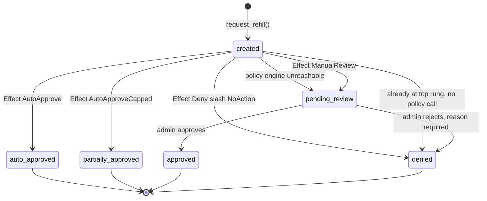
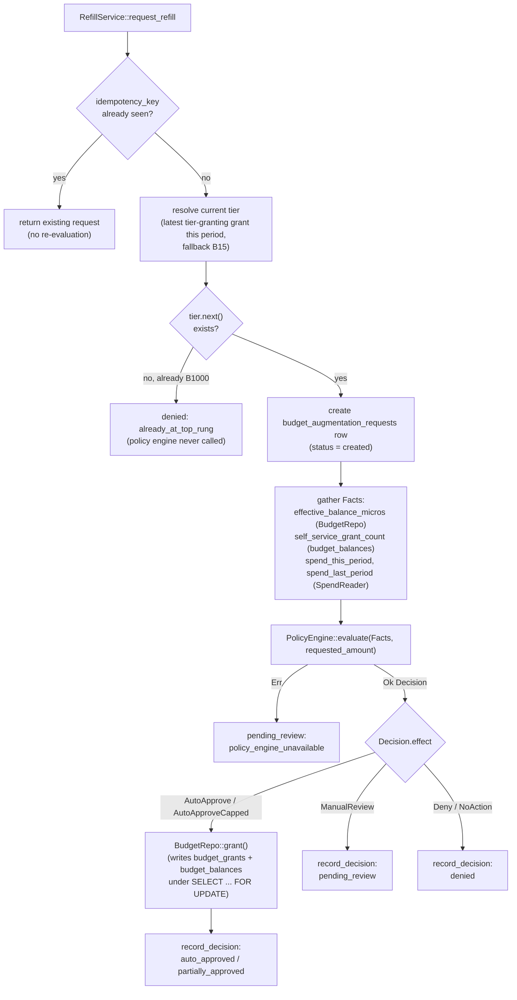

# Budget domain

The budget domain (`crates/lightbridge-authz-budget/`) is a per-account ledger of budget grants, a
hot-swappable rule-data policy engine that decides self-service refill requests, and the
self-service refill + admin review orchestration built on top. It is upstream of, and today has no
effect on, the Envoy/Authorino-side rate limiting described in
[`docs/governance-model-and-enforcement.md`](../governance-model-and-enforcement.md). For the table
shapes, see [`data-model.md`](./data-model.md#budget-domain-schema); this document covers
behavior.

Design background: [ADR-0007](../adr/0007-refill-decisions-rule-data-then-opa-wasm.md) (why
rule-data first, OPA-Wasm later, behind one contract), [ADR-0008](../adr/0008-refills-are-discrete-budget-tiers.md)
(why refills are discrete tiers), [ADR-0009](../adr/0009-budget-grants-are-an-immutable-ledger.md)
(why grants are an immutable ledger), [ADR-0010](../adr/0010-budget-domain-uses-procedures-not-cratestack-models.md)
(why this domain is hand-written procedures, not cratestack models), the original proposal in
[`docs/rfc/0001-budget-refill.md`](../rfc/0001-budget-refill.md), and the full engine-swap contract
in [`docs/budget-decision-contract.md`](../budget-decision-contract.md).

## Service boundary: `authz-budget` (hard cutover)

Every `budget:*`-gated RPC procedure moved off `authz-api` onto its own `authz-budget`
microservice — same binary (`lightbridge-authz`), a `budget` subcommand, own address/port/TLS
(`config::BudgetServer`), own container in `compose.yaml`. **Hard cutover, not the transitional
duplication `authz-idp` still carries**: `authz-api` no longer serves any budget op-id at all, on
either the unary `/rpc/{op_id}` path or a `/rpc/batch` frame — see
[`services.md`](./services.md#authz-budget) for the full route table and the exact 15 procedures
that moved.

**Why one `Procedures` impl, not a second schema/crate.** cratestack's `include_server_schema!`
macro emits a single `cratestack_schema` module per crate — "the schemas are mutually-exclusive
within a single crate" (`cratestack-macros`' own module doc). Splitting the budget procedures into
a genuinely separate schema/generated-client would mean a second crate with its own
`schema/budget.cstack`, which is exactly the "new crate" shape the split deliberately avoided.
Instead, `authz-budget` reuses the SAME generated `ProcedureRegistry`/`Procedures` type
`authz-api` does, mounted at a different path (`/budget`, fixed, not `ApiServer.rpc_base_path`)
and restricted at the routing layer by `RpcScope` (`crates/lightbridge-authz-rest/src/rpc_authorize.rs`):

- `RpcScope::Crud` (authz-api) refuses every `budget:*` op-id.
- `RpcScope::Budget` (authz-budget) refuses everything else.

Enforced in **two** places, mirroring how the permission gate itself is already dual-enforced: the
outer `rpc_authorize` Axum middleware (unary calls, and a fast 404 before even looking at the
bearer token) and `CratestackAuthProvider::authenticate` (every op, including once per `/rpc/batch`
frame — the only place a batch frame's own op-id is visible at all, which is what closes the batch
bypass a middleware-only check would leave open). Both derive `is_budget_op_id` from the same
`required_permission` map `rpc_authorize.rs` already used for the permission gate, not a second
hand-maintained list — a future budget permission is automatically scoped correctly the moment its
`required_permission` entry lands.

Authorization is unchanged by the move: every procedure keeps its exact permission from
[`docs/rbac.md`](../rbac.md), default-deny stays default-deny, and the self-vs-admin split
(`budget:read-own`'s procedures take no target field, structurally incapable of reading anyone
else's budget) survives verbatim — the split only changes which host and path prefix serves a
call, never what a caller needs to hold to make it.

## Augmentation request lifecycle

`budget_augmentation_requests` carries the exact state machine from the RFC's "Domain (ADR-0009)"
section:

Notes the diagram can't carry:

- `evaluating`, `cancelled`, `expired`, and `applied` are declared in the `CHECK` constraint
  (`migrations/20260804000002_budget_augmentation_requests.sql`) and the Rust
  `AugmentationStatus` enum (`crates/lightbridge-authz-budget/src/augmentation.rs`) as part of the
  full state machine the RFC specifies, but nothing in the current orchestration
  (`RefillService::request_refill`) ever writes them — `created` moves straight to a terminal
  status in one call. They exist for a request-handling shape (async evaluation, request
  cancellation/expiry, an explicit "applied" step) that hasn't been built yet.
- `Effect::AutoApprove` → `auto_approved`; `Effect::AutoApproveCapped` → `partially_approved` (a
  grant is written for the capped amount in both cases). `Effect::Deny`/`Effect::NoAction` both
  map to `denied` — `NoAction` has no defined meaning for an actively-submitted, awaiting-outcome
  request.
- The `pending_review` → `approved`/`denied` transition is guarded by `WHERE status =
  'pending_review'` in the update SQL (`REQUEST_UPDATE_REVIEW_SQL`), so a losing concurrent review
  action (two admins racing an approve and a reject) gets zero rows back and a loud
  `BudgetError::AlreadyReviewed`, never a silent overwrite. `review.rs` additionally takes a
  per-request Postgres advisory lock (`pg_advisory_xact_lock`) around the whole approve/reject
  operation — added after the row guard alone was measured to still let an `approve()` commit a
  grant after losing the race to a concurrent `reject()` on roughly 3 of every 4 runs, since
  `approve()`'s own read-before-grant window is slower than `reject()`'s single `UPDATE`.
- A rejection (`denied` via admin review) must carry a non-empty `rejection_reason`, validated in
  Rust before any write.

## Refill decision flow

`Facts` is gathered fresh for every request (`RefillService::load_facts`) — nothing is cached
across calls. `spend_this_period`/`spend_last_period` come from a `SpendReader`, which reads
`usage_events` in the **separate** usage database (see "Spend dependency" below); everything else
comes from this service's own `budget_grants`/`budget_balances` tables.

Per ADR-0007 ("OPA decides; this service mutates"), a `PolicyEngine` implementation is required to
be a pure function of `Facts` — no I/O, no clock reads, no state fetching. The host (`RefillService`)
loads every fact, locks the balance row, evaluates, and applies atomically; the engine itself never
touches the database.

## The immutable ledger (ADR-0009)

`budget_grants` is append-only, enforced by a `BEFORE UPDATE`/`BEFORE DELETE` trigger that raises
on any attempted mutation — including for the `postgres` superuser, which is what actually makes
this hold in every environment (a companion `REVOKE UPDATE, DELETE ... FROM PUBLIC` is documented
as having no observable effect locally/in CI, since the dev/CI connection is a superuser that
bypasses `GRANT`/`REVOKE` entirely; it only matters for a deployment where the application
connects as a non-superuser role).

**A correction is a new row, never an `UPDATE`.** Revoking or fixing an already-committed grant
means inserting a `source = 'correction'` row with a (possibly negative) `amount_micros` that
compensates the original — the only source allowed a negative amount, and it must be non-zero.
`budget_grants.revoked_at` exists only for importing already-superseded historical data at insert
time; it is not how a live grant gets revoked.

`budget_balances` is the current-balance projection per `(budget_account_id, period)` — a real
table (not a Postgres `MATERIALIZED VIEW`), updated **transactionally, in lockstep** with every
grant insert (`BudgetRepo::grant`: bootstrap the balance row if absent, `SELECT ... FOR UPDATE` to
lock it, insert the grant, update the balance, commit). It is fully rebuildable from
`budget_grants` alone by replay (`REBUILD_ALL_BALANCES_SQL` in `repo.rs`), which is what proves the
projection is correct rather than merely convenient. Each `source` value buckets into exactly one
of five `*_total_micros` columns (`base`/`migration` → `base_total_micros`,
`self_service` → `self_service_total_micros` + increments `self_service_grant_count`,
`admin`/`manual_approval`/`promotion` → `admin_total_micros`, `automatic` →
`automatic_total_micros` + increments `automatic_grant_count`, `refund` → `refund_total_micros`);
`correction` adjusts only `effective_budget_micros` directly, never a named bucket, since crediting
it to one would misattribute the adjustment to whatever it's compensating for.

## The discrete tier ladder (ADR-0008)

Refills move an account up one fixed rung at a time, not by an arbitrary requested amount:

`B15` ($15) → `B30` → `B60` → `B120` → `B250` → `B500` → `B1000` ($1,000)

`BudgetTier::next()` returns `None` at `B1000` — the top rung has nothing above it, and
`request_refill` denies with `already_at_top_rung` without ever calling the policy engine in that
case. A refill request always asks for exactly `current_tier.next()`'s amount; there is no
"request $200" free-form path.

**Reset-not-add semantics**: refilling moves an account to the next rung's absolute amount, it
does not add the rung's amount on top of whatever is left. `RefillService::current_tier` resolves
"the tier this account is currently on" from the most recent *tier-representing* grant this period
(sources `base`/`self_service`/`automatic`/`admin`/`manual_approval`/`promotion` — deliberately
excluding `correction`/`refund`, neither of which represents a tier), falling back to `B15` if no
such grant exists yet, or if the most recent one doesn't match any known rung amount exactly (a
defensive fallback, not an expected case).

## What is actually live versus merely implemented

This section exists so nobody assumes a designed feature is a working one — confirmed by reading
`refill.rs`, `rule_data.rs`, the seeded policy migration, and the RPC schema directly, as of this
document's date.

**Live and reachable from the frontend today:**

- Self-service refill (`requestBudgetRefill`): the first two self-service refills in a period
  auto-approve; the third and beyond go to `pending_review`.
- The admin review queue (`listPendingAugmentationRequests`, `approveAugmentationRequest`,
  `rejectAugmentationRequest`).

See [`docs/budget-refill-ui-contract.md`](../budget-refill-ui-contract.md) for the RPC shapes these
present to the `lightbridge-ss` frontend.

**Implemented in code, not actually reachable:**

- **`Effect::AutoApproveCapped` never fires under the seeded policy.** The active policy revision
  seeded by `migrations/20260804000001_budget_policy_sets_and_revisions.sql` (mirrored in
  `rule_data.rs::default_rule_set_json()`) has exactly one rule —
  `self_service_grant_count < 2` → `auto_approve` — with `default_effect: manual_review`. No rule
  in the shipped policy uses `auto_approve_capped`, so `RecordedDecision::PartiallyApproved` and
  the `partially_approved` status are exercised by tests
  (`rule_data.rs::auto_approve_capped_clamps_to_the_rule_cap`) but never by a live decision unless
  a different policy revision is activated.
- **Billing-plan → starting-tier mapping (ADR-0008) is unimplemented.** ADR-0008 says the billing
  plan determines the starting rung; that mapping does not exist anywhere in this codebase.
  `RefillService::current_tier` defaults every account with no qualifying grant history this
  period to `BudgetTier::B15`, the lowest rung, regardless of plan — flagged explicitly in
  `refill.rs`'s own module doc comment as "a deliberate, flagged simplification for follow-up, not
  something this PR is claiming is fully solved." An enterprise-plan account starts at the same
  rung as a free-plan one and has to refill repeatedly, one rung at a time, to reach where it
  should have started.
- **Policy administration has no UI.** `activateBudgetPolicy`, `getBudgetPolicyStatus`, and
  `simulateBudgetPolicy` exist as permission-gated RPC procedures
  (`crates/lightbridge-authz-api/schema/authz.cstack`) and are exercised by tests, but nothing in
  the frontend calls them.
- **The OPA-Wasm phase (ADR-0007's second engine) was never started.** `RuleDataEngine` is the only
  `PolicyEngine` implementation that exists; the trait boundary is designed to accept a second one
  without changing callers, but no work toward it has begun.

**RPC surface, as of `origin/main` at the time this document was written:** all 15 procedures below
are reachable on `authz-budget` (`POST /budget/rpc/{op_id}`) and refused (404) on `authz-api` —
see "Service boundary" above.

- Policy lifecycle: `activateBudgetPolicy` (`budget:policy-activate`), `getBudgetPolicyStatus`
  (`budget:policy-read`), `simulateBudgetPolicy` (`budget:policy-simulate`),
  `createBudgetPolicyRevision` (`budget:policy-write`).
- Self-service refill + admin review: `requestBudgetRefill` (`budget:self-refill`),
  `listPendingAugmentationRequests` / `approveAugmentationRequest` / `rejectAugmentationRequest`
  (all `budget:review`; `listPendingAugmentationRequests` paginated by `createdAt`, oldest-first,
  cursored via `after` — #296).
- Direct balance/ledger/history reads: `getMyBudgetBalance` / `listMyBudgetGrants` /
  `listMyAugmentationRequests` (`budget:read-own` — no target field, structurally scoped to the
  caller's own account; `listMyAugmentationRequests` returns the caller's own request history in
  ANY status, newest-first, cursored via `before` — #295), `getBudgetBalance` (`budget:read`) /
  `listBudgetGrants` (`budget:audit-read`) (both admin, arbitrary-target).
- Direct admin grant/revoke: `grantBudget` (`budget:grant`), `revokeBudgetGrant`
  (`budget:revoke`).

See [`docs/rbac.md`](../rbac.md) for the authoritative permission table and the full self-vs-admin
reasoning; the list here is derived from `rpc_authorize.rs`'s `required_permission` map, not
maintained by hand.

## Spend dependency: which reader is active, and what happens when spend data is unavailable

`Facts.spend_this_period`/`spend_last_period` come from a `SpendReader`
(`crates/lightbridge-authz-budget/src/spend.rs`), which is one of two implementations, chosen once
at server startup (`start_budget_server` in `crates/lightbridge-authz-rest/src/lib.rs` — this
selection moved here from `start_api_server` along with the rest of the budget domain's RPC
surface; the two functions build it identically):

- **`UsageServiceSpendReader`** — calls `lightbridge-authz-usage`'s `/usage/v1/spend/query`
  endpoint over HTTPS for the account/period being evaluated, instead of querying `usage_events`
  directly. Used when `Config.usage_service` is set. Presents a client certificate for mTLS
  (#347) — see "Security posture" below.
- **`UnavailableSpendReader`** — never touches the network; always reports `Spend::Unavailable`.
  Used when `Config.usage_service` is `None`.

This inverted a prior direct-database dependency: before the PR that introduced
`UsageServiceSpendReader`, this crate's `TimescaleSpendReader` opened its own connection straight
to the usage-events database and ran `SELECT SUM(total_cost) ...` against `usage_events` itself —
two services querying one service's tables. `lightbridge-authz-usage` owns `usage_events`; it now
owns the query too, and `UsageServiceSpendReader` calls it like any other client would.

**⚠️ This inversion is a breaking config-key rename, and it needs a companion change in
`ai-helm-values` to keep working in production.** As of the PR that introduced this section, prod's
`api` component Helm values (`environments/prod/values/lightbridge-app.yaml` in the separate
`ai-helm-values` repo) replaced `config.yaml` **wholesale** with a full inline document setting
`usage_database.url: "${USAGE_DATABASE_URL}"`, pointed at the in-cluster
`lightbridge-main-db-rw.converse.svc.cluster.local` Postgres instance's `usage` database via the
`lightbridge-usage-db-role` credential — i.e. prod was running a real `TimescaleSpendReader`. Once
this repo's `Config` type drops the `usage_database` field, that stale key in prod's YAML is
silently ignored (unknown YAML keys don't fail config load), `Config.usage_service` reads as
`None`, and `start_budget_server` degrades to `UnavailableSpendReader` — **every spend-dependent
refill decision routes to manual review** until `ai-helm-values` is updated to set `usage_service`
instead (just a `base_url` — no credential, see "Security posture" below). This degrades safely
(fails closed, never opens a bypass) but is a real operational regression for self-service refill
until that companion change ships — see the PR that introduced this section for the exact diff
needed.

**Security posture: mTLS (#347), stated plainly.** `lightbridge-authz-usage` splits its TLS
surface across two listeners (`UsageServerGroup::usage`/`::query` in
`crates/lightbridge-authz-usage/src/config.rs`): the ingest listener stays unauthenticated (its
caller is an AI Envoy/OpenTelemetry exporter outside this repo's deploy surface, so it cannot be
given a client certificate without a coordinated change there — out of #347's scope), while the
query listener — carrying both `/usage/v1/usage/query` and `/usage/v1/spend/query` — **requires
and verifies a client certificate**. `UsageServiceSpendReader` presents one via
`Config.usage_service.client_cert_path`/`client_key_path`, reusing this pod's own TLS cert rather
than minting a separate client-only one, since the deployed `authz-tls` cert already carries both
`serverAuth` and `clientAuth` in its `extendedKeyUsage` (confirmed against the live cluster:
`kubectl -n converse get certificate authz-tls -o yaml` shows `usages: [server auth, client
auth]`). This authenticates "a legitimate lightbridge workload holding a CA-signed cert", not a
specific caller identity — `authz-api` and `authz-budget` present the identical certificate, since
both load it from the same mounted `authz-tls` Secret. A rejected/missing/expired client
certificate is a TLS handshake failure, indistinguishable from "unreachable" to this reader, and
resolves to `Spend::Unavailable` exactly like every other HTTP failure mode below — never a silent
bypass. `lightbridge-authz-usage` also stays `ClusterIP`-only with no ingress regardless, same as
before #347 (see `AGENTS.md`'s Security Notes) — mTLS is a second, independent layer, not a
replacement for the network boundary.

**This repo's own tracked config is what local runs and tests exercise.**
`config/default.yaml`/`.docker/authz/container.yaml` set `usage_service` pointed at
`authz-usage`/`localhost:13006` respectively (the mTLS-required query listener's port, `3006`/host
`13006` — distinct from the ingest listener's `3002`/`13002`), with `insecure_skip_verify: true`
for server-certificate verification (both serve a self-signed cert chain, matching `AGENTS.md`'s
Security Notes) and `client_cert_path`/`client_key_path` set to this pod's own TLS cert/key. The
general trap named in earlier revisions of this doc still applies in the other direction now:
prod's values repo can and does override the entire `config.yaml` wholesale, so this repo's own
defaults say nothing about what's actually running in prod until the config keys agree — and
`ai-helm-values` needs its own companion change to add the `query` listener block and the
`client_cert_path`/`client_key_path` fields before this lands there (see the PR that introduced
this section for the exact deploy-ordering requirement).

**This fails closed, not open.** `Spend` is a two-variant enum (`Known(i64)` /
`Unavailable`) specifically so a policy rule can never mistake "we don't know" for "spent zero".
When a rule-data `Condition::Threshold` references a spend-backed field
(`spend_this_period_micros`/`spend_last_period_micros`) and that fact is `Spend::Unavailable`,
`rule_data.rs::resolve_field` returns an error that aborts evaluation entirely
(`EvalAbort::FieldUnavailable`), and `abort_decision` maps that straight to
`Effect::ManualReview` with reason code `required_fact_unavailable` — never to `auto_approve`, and
never silently coerced to `Spend::Known(0)` (verified by
`rule_data.rs::spend_unavailable_for_a_referenced_field_routes_to_manual_review_not_auto_approve`).
`UsageServiceSpendReader` extends this same fail-closed rule to every way its HTTP call to
`lightbridge-authz-usage` can go wrong — unreachable, timeout, non-2xx status, or a body that
doesn't parse all resolve to `Spend::Unavailable`, never a propagated error and never
`Spend::Known(0)` (see that reader's doc comment and
`crates/lightbridge-authz-budget/tests/usage_service_spend_reader_tests.rs`, one test per failure
mode).

One important qualifier: **the currently-seeded policy doesn't reference spend at all** — its one
rule keys on `self_service_grant_count`, not on either spend field — so today, an unavailable
`SpendReader` doesn't change any live refill outcome; it would only matter the moment a policy
revision is activated that adds a spend-based rule. At that point the behavior above is what
governs it.
