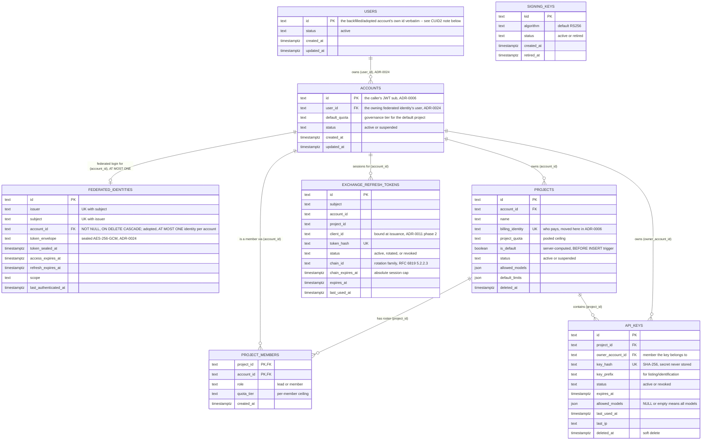
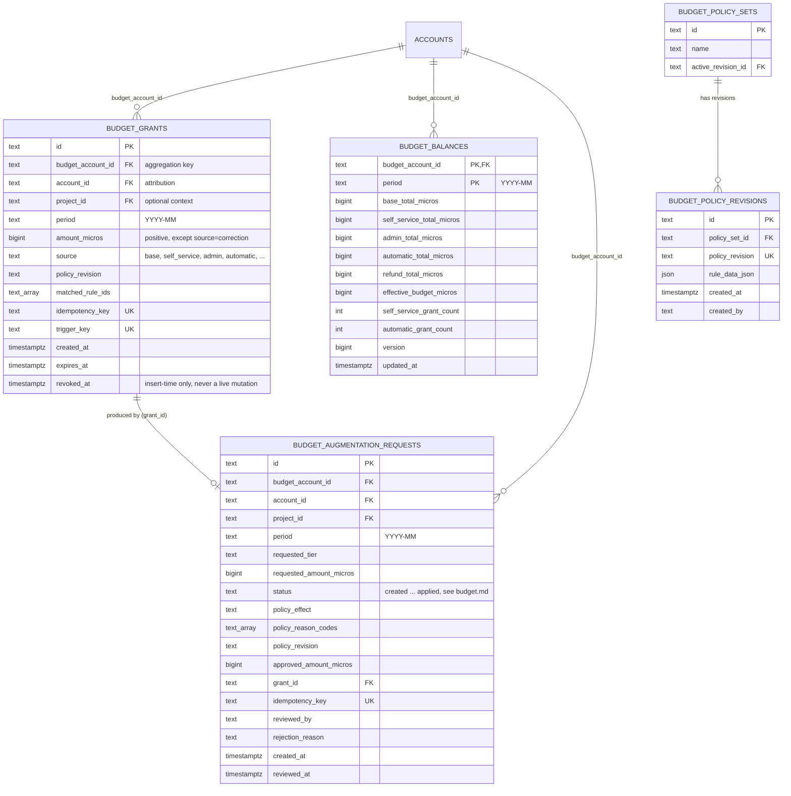

# Data model

This document describes the Postgres schema behind `authz-api`/`authz-opa` (`migrations/`) and,
separately, the Timescale-compatible usage schema (`migrations-usage/`). For how these tables are
actually enforced at the gateway, see
[`docs/governance-model-and-enforcement.md`](../governance-model-and-enforcement.md). For request
flows through the tables below, see [`auth-flows.md`](./auth-flows.md).

## The one fact that explains most of this schema

**`accounts.id` IS the caller's JWT `sub`.** One account is one person; there is no account-level
membership of any kind, and `account_memberships` (the table this repo used from
`20260304000001_account_memberships.sql` through `20260722000001_account_membership_roles.sql`)
was dropped entirely in the ADR-0006 migration batch
(`migrations/20260727000004_accounts_id_becomes_subject.sql`,
`migrations/20260727000005_drop_account_memberships.sql`). See
[ADR-0006](../adr/0006-project-membership-supersedes-account-roles.md) for the full rationale.

**Amended by [ADR-0024](../adr/0024-we-own-our-users-accounts-are-federated-identities.md)
(corrected 2026-08-25 — see that ADR's "Correction" section):** `accounts.id` is still the
caller's stored `sub`, unchanged, but it is no longer *the* defining identity — a `sub` is only
unique within one issuer, so the same real person authenticating through two issuers would
otherwise collide or fork silently. The defining identity is now `users.id`; an account is a
**federated identity** ("one account = one federated identity; a person may hold several"),
reached only through an adopted account — there is no longer a way for a federated identity to
exist without one. Every table/paragraph below this note is otherwise exactly as ADR-0006 left it
— see the "Users and federated identities" section further down for what's new.

**Amended again by [ADR-0026](../adr/0026-one-identity-may-own-many-accounts.md) (2026-08-30):**
one identity may now own SEVERAL accounts. The ownership edge is `accounts.user_id -> users.id` —
already present since ADR-0024 and always 1:N-capable; what pinned it to 1:1 was the
`accounts_set_user` trigger forcing `NEW.user_id := NEW.id`, relaxed by
`migrations/20260830000001_accounts_owned_by_users.sql`. Concretely:

- An identity's **first** account is its **anchor**: it keeps `id = subject`, because
  `federated_identities` adopts an account by matching `accounts.id == subject`. Exactly one
  anchor per identity, still enforced by `federated_identities_account_uidx`.
- **Subsequent** accounts get a minted CUID2 `id` and inherit the anchor's `user_id`. They anchor
  no identity; they are owned tenants.
- So `accounts.user_id` is always the owner's anchor-account id — which is always `auth().id`.
  That is why the ownership policies read `userId == auth().id` rather than introducing a separate
  `auth().userId`, and it is a load-bearing invariant, pinned by
  `accounts_user_id_is_always_a_home_account_id`.

Membership as a concept still lives entirely at the **project** level (`project_members`), and
everything that used to be an account-level property that could legitimately vary per *billing
relationship* (`billing_identity`) moved to `projects` too — a single person can bill different
projects to different parties (e.g. a consultant with three client projects, each invoiced
separately). Note `project_members.account_id` still references an account, and the roster
policies still compare it against `auth().id`, so a roster may only name an **anchor** account —
`addProjectMember` refuses a secondary one rather than writing a row that could never grant access
(ADR-0026 D5).

## Core authz schema

Notes that don't survive a schema dump:

- **`projects.billing_identity`** is `UNIQUE` — "who is paying" is a per-project fact, not a
  per-account one (`migrations/20260727000002_projects_billing_identity_and_quota.sql`). It moved
  off `accounts` in the same ADR-0006 batch that dropped `accounts.billing_identity`
  (`migrations/20260727000003_accounts_drop_billing_identity_add_default_quota.sql`), which also
  added `accounts.default_quota` — the governance tier for work in the account's own default
  project, which has no roster to hang a `project_members.quota_tier` row on.
- **`projects.is_default`** is never client-suppliable. It is computed by a `BEFORE INSERT`
  trigger (`set_project_is_default`, `migrations/20260725000001_default_account_project.sql`) —
  the account's first project becomes its default — and guarded against a concurrent-insert race by
  a partial unique index (`projects_account_id_default_uidx`). A default project cannot be hard
  deleted (`model.Project.delete` and `deleteAccountPermanently` both refuse when `is_default` is
  true).
- **`project_members`** has a composite primary key `(project_id, account_id)` and is explicitly
  barred from cratestack's migration generator — see the `ProjectMember` model comment in
  `crates/lightbridge-authz-api/schema/authz.cstack` and the ADR-0038 section below. Unlike the
  now-dropped `account_memberships`, there is no prune-on-empty trigger: a project with zero
  members (every default project, forever) is a normal, expected state, not an error condition.
- **`api_keys.owner_account_id`** answers "which member does this key belong to", which is
  different from "which project does this key belong to" — a project lead who is not the key's
  owner can still mint keys for other members. This is what lets introspection resolve the owning
  member's `project_members.quota_tier` (surfaced through the `api_key_validation` view as
  `owner_quota_tier`), which Authorino stamps as `x-quota-tier` for per-member rate limiting. A key
  owned by the project's own account (no roster row) has a `NULL` tier — no per-member ceiling,
  bounded only by the pooled `project_quota`
  (`migrations/20260731000001_api_keys_owner_account.sql`).
- **`api_keys.key_hash`** is a SHA-256 hex digest; the plaintext secret is never stored and is
  returned only in the create/rotate response body.
- **`exchange_refresh_tokens`** backs the human-plane refresh grant (ADR-0011). `status` moves
  through `active` → `rotated` (superseded by a newer token in the same chain) or `revoked`
  (explicit revocation, or reuse-detection). `chain_id`/`chain_expires_at`
  (`migrations/20260815000001_exchange_refresh_tokens_add_chain.sql`, merged 2026-08-15) implement
  RFC 6819 §5.2.2.3 reuse-detection: every token minted across one rotation chain shares a
  `chain_id`, so replaying an already-rotated (superseded) token can revoke the *whole chain* in
  one `UPDATE ... WHERE chain_id = $1 AND status = 'active'`, not just the replayed row — and
  `chain_expires_at` is an absolute session ceiling set once at chain birth, independent of each
  token's own shorter TTL, so rotating before expiry can't produce an unbounded session.
  `client_id` (`migrations/20260814000003_exchange_refresh_tokens_add_client_id.sql`) binds a
  refresh token to the client it was issued to, rejecting presentation by a different client.
  Rotation itself is a CAS (`SELECT ... FOR UPDATE`) — see the ADR-0038 exception list below.
- **`signing_keys`** rotates under `pg_advisory_xact_lock` for cross-replica-safe JWT key rotation
  (`ensure_active_signing_key` in `crates/lightbridge-authz-api-key/src/repo.rs`); at most one row
  may hold `status = 'active'` at a time, enforced by a partial unique index.

### Users and federated identities (ADR-0024, corrected 2026-08-25)

- **`accounts.user_id`** is `NOT NULL`, populated by a `BEFORE INSERT` trigger
  (`accounts_set_user`, `migrations/20260825000001_users_and_federated_identities.sql`) that mints
  a `users` row on the fly for any insert that doesn't already supply one — so
  `StoreRepo::create_account` and every raw-SQL `INSERT INTO accounts (id)` fixture across the
  workspace needed zero changes. Every pre-existing account was backfilled the same way its trigger
  handles new ones: `users.id := accounts.id` (an id-reuse of the already-stored subject, not a new
  mint — see the CUID2 section below).
- **`federated_identities`** is keyed by `(issuer, subject)` — `UNIQUE (issuer, subject)` is the
  federation key itself. `account_id` is **`NOT NULL`** and **adopted at most once**: a subject
  matching a pre-existing `accounts.id` adopts that account; a subject with no matching account is
  REFUSED outright (`Error::Forbidden` — there is no mint-a-user branch any more, corrected
  2026-08-25, see ADR-0024's "Correction" section), and any subsequent issuer presenting the
  *same already-adopted* subject value is also refused (`23505` → `Error::Conflict`, unique index
  unchanged), never silently merged onto someone else's projects/budget. `ON DELETE CASCADE` on
  `account_id` (also corrected 2026-08-25, from the original `SET NULL`): deleting an account
  removes its adopted federated identity, required because `account_id` is now `NOT NULL` — the
  person (`users` row) itself is unaffected, since the user is derived, not stored on this row.
  There is no `federated_identities.user_id` column any more; the owning `users` row is always
  DERIVED via `federated_identities.account_id -> accounts.user_id -> users.id`.
- **`federated_identities.token_envelope`** holds the sealed Keycloak token set (refresh token + a
  non-access-token claims snapshot — never the access token, never the raw ID token JWT) —
  AES-256-GCM via `lightbridge_authz_core::crypto::{seal,open}`, under a key wholly separate from
  the one protecting the short-lived RP state cookie. See ADR-0024 for the full envelope format and
  rotation posture (an unopenable envelope is treated as "no stored token", never deleted).
  **Deliberately absent from `authz.cstack`** — see the ADR-0038 table below.

## Budget domain schema

The budget domain (`crates/lightbridge-authz-budget/`) hosts its own tables, referencing
`accounts`/`projects` but otherwise self-contained. Behavior is covered in
[`budget.md`](./budget.md); this is the shape only.

- **`budget_grants`** is the append-only ledger (ADR-0009): a `BEFORE UPDATE`/`BEFORE DELETE`
  trigger (`budget_grants_forbid_mutation`) makes every row immutable, including for the
  `postgres` superuser — the accompanying `REVOKE UPDATE, DELETE ... FROM PUBLIC` is documented
  belt-and-suspenders only (superusers bypass `GRANT`/`REVOKE`, so it has no effect under this
  repo's local/CI connection string; the trigger is what actually enforces append-only
  everywhere).
- **`budget_balances`** is a real table (not a Postgres `MATERIALIZED VIEW`) maintained
  transactionally in lockstep with each grant insert — not a periodic refresh — and fully
  rebuildable by replaying `budget_grants` from scratch.
- **`budget_policy_sets`/`budget_policy_revisions`** model exactly one named policy set with a
  history of revisions and one active pointer at a time; activation is validated before the
  pointer moves, so a bad revision never displaces a good one.
- **`budget_augmentation_requests`** is a *separate* ledger from `budget_grants` — decisions about
  requests (including refusals), not money-granting events. See `budget.md` for the full
  request lifecycle.

Full behavior — the ledger's replay/correction discipline, the policy engine contract, and what's
actually live versus merely implemented — is in [`budget.md`](./budget.md).

## The usage side: a separate database

`usage_events` (`migrations-usage/`) is **not** in the schema above — it lives in its own
Timescale-compatible database (`lightbridge-authz-usage`'s own `DATABASE_URL`, provisioned
independently from the authz Postgres instance), ingested via unprotected OTLP/HTTP
(`/v1/otel/traces`, `/v1/otel/metrics`) and queried via `/usage/v1/usage/query`. It carries
`account_id`/`project_id` as plain `TEXT` columns with no foreign key back into `accounts`/
`projects` — there is no live referential relationship, only a shared convention of which id
format each column holds. The budget domain reads spend directly from this table
(`crates/lightbridge-authz-budget/src/spend.rs`); see `budget.md`'s "spend dependency" section for
what happens when this database is unavailable or unconfigured.

## Two cross-cutting rules that have each already caused a production bug

### CUID2 ids (ADR-0039)

Every id this service *mints* — `projects.id`, `api_keys.id`, budget grant/ledger/policy-revision
ids, token-exchange session ids, signing `kid`, JWT `jti` — goes through the one chokepoint,
`lightbridge_authz_core::cuid::cuid2()` (re-exported from the `cuid` crate). See
[ADR-0039](https://github.com/ADORSYS-GIS/webank-context/blob/master/decisions/0039-cuid2-is-the-house-id-format.md)
(hosted in the sibling `webank-context` repo, not this one).

Ids are **opaque strings**. In practice that means:

- **Never shape-validate an id** — no regex, no parse, no length check, no `starts_with('c')`/
  hyphen branching. This repo already shipped and had to fix exactly this failure mode once:
  cratestack's generated `Cuid` schema scalar rejected any id not starting with `'c'`, which broke
  for any account id that doesn't happen to be CUID2-shaped (e.g. a `sub` from an IdP that mints
  UUIDs). Regression test:
  `list_projects_filtered_by_a_cuid2_account_id_is_accepted` in
  `crates/lightbridge-authz-rest/tests/rpc_it_tests.rs:786` (doc comment at line 778).
- **Never sort or paginate by id** — CUID2 has no ordering guarantee. Use `created_at`.
- **Store as `TEXT`** — no native `uuid` columns, no `DEFAULT gen_random_uuid()`.

The boundary this bans is **minting**, not **storing**. `accounts.id` is the caller's JWT `sub` —
an id this service does not mint, sourced from whatever IdP is configured — and it is kept exactly
as issued, whatever shape it has. The same applies to any OIDC claim this service reads and
forwards (`jti`, `sub`, `aud`, `iss` from an external token): read, never rewritten, never
regenerated into CUID2 form.

**ADR-0024 extends this, it doesn't bend it.** `users.id` is always the backfilled/
trigger-provisioned account's own id verbatim — an id-reuse of an already-stored subject, which is
"storing", not "minting", so it needs no exception of its own. Since the 2026-08-25 Correction there
is no longer a code path that mints a `users` row without an `accounts` row alongside it, so
`users.id` is *only ever* an account id, never a fresh `cuid2()`. `federated_identities.id` is the
one id in this pair still minted fresh, through the same one chokepoint, `cuid2()`, as everything
else in this section.

### ADR-0038 / cratestack

[ADR-0038](https://github.com/ADORSYS-GIS/webank-context/blob/master/decisions/0038-cratestack-is-the-only-database-api.md)
(also in `webank-context`) makes cratestack's generated model client the only sanctioned database
API estate-wide, and bans new hand-written SQL and direct `sqlx` dependencies. **This repo is the
estate's largest documented exception.** New schema goes through
`crates/lightbridge-authz-api/schema/authz.cstack` and cratestack's migration generator where
possible; four cases are genuinely not migratable today, so nobody re-derives this list from
scratch:

| Table / concern | Why it's an exception |
| --- | --- |
| `signing_keys` | Rotated under `pg_advisory_xact_lock` for cross-replica-safe JWT key rotation — a coordination primitive cratestack's generated CRUD has no way to express. |
| `project_members` | Composite primary key `(project_id, account_id)`; cratestack's schema only models it as a relation target with a synthetic `id`, explicitly barred from the migration generator. |
| `exchange_refresh_tokens` | Refresh-token rotation is a compare-and-swap (`SELECT ... FOR UPDATE`), not a plain CRUD write. |
| `federated_identities` (ADR-0024) | Carries a sealed credential (`token_envelope`); must be structurally unreachable from any generated read path, same class as `signing_keys` — modelling it, even `@@allow`-less, would still leave it reachable as a relation target. |
| `lightbridge-authz-usage`'s `usage_events` queries | Dynamic `QueryBuilder`-assembled aggregates against the Timescale-backed table, driven by caller-selected dimensions/filters. |

This repo runs `cratestack-pg` 0.5.1; ADR-0038's own capability findings were verified against
0.7.8 — re-verify any capability claim against 0.5.1 before relying on it here. The two-major
`sqlx` split (this repo's `sqlx = "0.9"` against cratestack's own internal `sqlx` 0.8) is load-
bearing and out of scope to unwind (`app/lightbridge-authz/Cargo.toml`).
