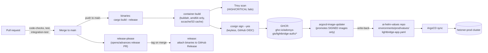

# Deployment

How code in this repository reaches production, and the one failure mode in that chain that is
silent by design — everything reports green while prod keeps running old code.

> **This page is the topology. The procedure is
> [`docs/runbooks/release-and-rollout.md`](../runbooks/release-and-rollout.md)** — what to run, in
> what order, to answer *"is my change live?"*, including the `/version` check, the live image list,
> the ArgoCD destination, and the two currently-broken links in the chain (#666's chart publishing,
> and ADR-0031 being accepted but not yet implemented).

## CI/CD chain



Source: `.github/workflows/ci.yml` (jobs `binaries`, `container-build`, `release-please`,
`release`) and `.github/actions/container-build/action.yml`.

- `binaries` and `container-build` run only on `push` to `main` (`if: github.ref ==
  'refs/heads/main' && github.event_name == 'push'`) — a branch's own CI never builds or publishes
  an image, only a merge does.
- **`main` is one concurrency lane, and later pushes cancel earlier ones.** `ci.yml:21-23` declares
  `group: ci-${{ … || github.ref_name }}` with `cancel-in-progress: true`; for `main` that key is
  `ci-main`. Two merges in quick succession cancel the first merge's run, so `container-build` never
  reaches `cosign sign` and **that commit gets no image at all**. Nothing goes red — the run is
  `cancelled`. The *content* still ships inside the later commit's image, but `sha-<commit>` is not
  a tag that exists for every commit on `main`; do not build a rollback procedure that assumes it
  does.
- `container-build` is a 3-way matrix, one image per deployable image target: `runtime` →
  `ghcr.io/adorsys-gis/lightbridge-authz` (serves both `authz-api` and `authz-opa`), `mcp-runtime`
  → `ghcr.io/adorsys-gis/lightbridge-authz-mcp`, `usage-runtime` →
  `ghcr.io/adorsys-gis/lightbridge-authz-usage`. Each is tagged (among others) `sha-<full commit
  SHA>` (`docker/metadata-action`'s `type=sha,format=long`).
- Every pushed image is **keyless-signed with cosign** in the same job, by digest, using GitHub
  OIDC (`sigstore/cosign-installer` + `cosign sign --yes "${IMAGE_REF}@${DIGEST}"`,
  `permissions: id-token: write`). The signing identity is this workflow file at this ref
  (`…/lightbridge-authz/.github/workflows/ci.yml@refs/heads/main`, issuer
  `token.actions.githubusercontent.com`).
- `release-please` and `release` handle the GitHub Release (binary tarball attached to the tag) —
  they do not touch container images or the deploy repo at all.
- **Charts are a third, separate clock, and it has been stopped since `v5.0.0`.**
  `.github/workflows/helm-oci.yml` fires on `push: tags: ["v*"]` only, and release-please cuts that
  tag with `secrets.RELEASE_PLEASE_TOKEN || secrets.GITHUB_TOKEN` (`ci.yml:311`). A tag created with
  `GITHUB_TOKEN` does not fire a `push: tags` workflow (GitHub's recursive-workflow guard), so
  `v6.0.0`–`v9.0.0` were tagged and **no chart was published for any of them** — prod sat on chart
  `5.0.0`, four majors behind, with nothing red anywhere. `10.0.0` exists only because
  `helm-oci.yml` was dispatched by hand.
  [lightbridge-authz#666](https://github.com/ADORSYS-GIS/lightbridge-authz/issues/666) is open;
  the recovery procedure is in
  [`runbooks/release-and-rollout.md` Step 7](../runbooks/release-and-rollout.md#step-7--the-chart-is-a-separate-currently-broken-pipeline).

## Continuous delivery to prod: the image-updater hop, and its silent-failure mode

Image promotion into production is **not** a job in this repository's CI. It happens in the
cluster: `argocd-image-updater` (a CRD-based operator, `ImageUpdater` custom resources in
`ai-helm/charts/imageupdater`) polls GHCR, and **only promotes an image if a cosign signature for
its exact digest exists**. On a match it writes the new `sha-<commit>` tag back into
`ai-helm-values/environments/prod/values/lightbridge-app.yaml`
(`global.authz.image.{repository,version}` and `global.authz_mcp.image.{repository,version}`),
which ArgoCD then syncs.

**This is the failure mode to know about, because nothing in the normal path surfaces it:** if
`cosign sign` is skipped or fails for a given digest — a runner hiccup, a permissions regression, a
workflow edit that drops `id-token: write` — the image itself still builds and pushes
successfully, Trivy still scans it, the CI run still goes green, and GHCR still serves the tag. The
*only* thing missing is the signature, and `argocd-image-updater` silently declines to promote it.
Prod keeps running whatever was last successfully signed, with no error anywhere pointing at the
actual cause. This has happened in practice — traced back to an exhausted GitHub Actions
artifact-storage quota that broke the upload step feeding `container-build`, several steps upstream
of signing.

**How to check whether a specific commit's image is promotable**, verified working: resolve the
digest for its `sha-<commit>` tag from the GHCR manifests API, then check whether a signature
manifest exists for that digest.

```bash
REPO="adorsys-gis/lightbridge-authz"          # or -mcp / -usage
TAG="sha-<full commit SHA>"

TOKEN=$(curl -s -u "$GHCR_USER:$GHCR_PAT" \
  "https://ghcr.io/token?scope=repository:${REPO}:pull" | jq -r .token)

DIGEST=$(curl -s -D - -o /dev/null \
  -H "Authorization: Bearer ${TOKEN}" \
  -H "Accept: application/vnd.oci.image.index.v1+json" \
  "https://ghcr.io/v2/${REPO}/manifests/${TAG}" \
  | grep -i '^docker-content-digest:' | tr -d '\r' | awk '{print $2}')

SIG_TAG="${DIGEST/:/-}.sig"

curl -s -o /dev/null -w "%{http_code}\n" \
  -H "Authorization: Bearer ${TOKEN}" \
  "https://ghcr.io/v2/${REPO}/manifests/${SIG_TAG}"
# 200 = signed, promotable. 404 = unsigned, argocd-image-updater will never pick it up.
```

`$GHCR_USER`/`$GHCR_PAT` need `read:packages` on the (private) GHCR packages — a GitHub Actions
`GITHUB_TOKEN` scoped to this repo works for images this repo pushes.

**On `lightbridge-authz-usage`'s pin:** this page previously recorded that the usage image was *not*
covered by `argocd-image-updater` and drifted several releases behind. As of **2026-09-03** all
three images are pinned at the same commit in production (`ab11479`), so either that gap has been
closed or the pin was set by hand at the same value. Do not infer coverage from either statement —
read the live list, per
[`runbooks/release-and-rollout.md` Step 3](../runbooks/release-and-rollout.md#step-3--did-the-promotion-land-in-ai-helm-values).
The underlying rule stands: **if you are adding a new deployable to the fleet, image-updater
coverage does not extend to it automatically** — check the `ImageUpdater` CR list explicitly.

## Helm chart structure

`charts/lightbridge-authz-stack` is the umbrella chart; `Chart.yaml` declares four subchart
dependencies, each aliased and independently toggleable:

| Alias | Subchart | Deployable |
| --- | --- | --- |
| `api` | `charts/lightbridge-authz` | `authz-api` |
| `opa` | `charts/lightbridge-authz` (same chart, second alias) | `authz-opa` |
| `usage` | `charts/lightbridge-authz-usage` | `lightbridge-authz-usage` |
| `mcp` | `charts/lightbridge-mcp` | `lightbridge-mcp` |

`api` and `opa` are two aliases of the **same** `lightbridge-authz` chart — consistent with them
being the same image run with a different `args:` subcommand (see above), configured differently
per alias in the umbrella chart's values.

> **Migration mechanism — read this before ADR-0031.**
> [`ADR-0031`](../adr/0031-migrations-run-in-init-containers.md) (2026-09-02, **Accepted**)
> supersedes ADR-0016 on paper and says migrations run in an **init container** on every component.
> **The chart has not been changed.** `charts/lightbridge-authz/values.yaml:129` still declares
> `controllers.migrate` as a `type: job` on `sync-wave: "1"`, and production runs five such Jobs
> (`lightbridge-{api,opa,idp,budget,usage}-migrate-*`, verified 2026-09-03) with zero init
> containers on `lightbridge-api-main`. So the paragraph below describes what is deployed, and
> ADR-0031's two failure classes are still reachable today. ADR-0031's *other* half —
> expand/contract, where a migration may only add and code requiring the new shape ships one
> release later — needs no chart change and should be followed now.

Schema migrations run as `controllers.migrate` in `charts/lightbridge-authz/values.yaml` (built on
the `bjw-s/common` v4 app-template library). Per ADR-0016
(`docs/adr/0016-migrate-job-sync-wave-not-hook.md`) this is deliberately **not** a Helm hook — it
used to be `helm.sh/hook: post-install,post-upgrade`, but ArgoCD runs that as a PostSync hook that
only fires once every non-hook resource (including the main Deployment) is already Healthy, which
deadlocks the moment a migration is itself a precondition for the new pods' readiness probe
(confirmed live in prod 2026-08-19: zero `Job` objects anywhere in the synced tree). It is instead
an ordinary, ArgoCD-tracked `Job` annotated `argocd.argoproj.io/sync-wave: "1"`, one wave earlier
than `main`'s wave `"2"`, so it runs regardless of whether the Deployment's pods are, or will ever
be, ready. Its `suffix` folds the image tag and the rendered config data into the Job name (a
config-only change would otherwise re-render the same Job name with a different, immutable
`spec.template` and fail the whole app's sync — hit twice in prod 2026-08-24, #480); Kubernetes'
native Job-controller GC (`ttlSecondsAfterFinished: 604800`, 7 days) keeps a completed Job
inspectable instead of a Helm hook-delete policy cleaning it up. It reuses the ambient config map
and shares the same image as the `api`/`opa` alias it's attached to. This runs as part of the
shared `lightbridge-authz` chart, not as a separate migration chart — see "Corrections to prior
docs" below.

For actual install/config/deploy commands per platform (macOS+Docker Desktop, Linux, TLS
provisioning via the built-in job vs. cert-manager, ingress vs. internal-only OPA), see
[`../platform-guides.md`](../platform-guides.md) — this doc does not duplicate those steps.

## Corrections to prior docs

- The root `AGENTS.md` used to describe "A brand-new `lightbridge-migrate` chart (aliased
  `migration` under `charts/lightbridge-authz-stack`) runs `lightbridge-authz migrate` ... as a
  `pre-install/pre-upgrade` job." No such chart or alias exists in
  `charts/lightbridge-authz-stack/Chart.yaml` (its six dependencies are `api`, `opa`, `idp`,
  `budget`, `usage`, `mcp`). The actual migration job is `controllers.migrate` inside the shared
  `lightbridge-authz` chart (see above) — an ArgoCD sync-wave-ordered `Job` (ADR-0016), not a Helm
  hook of any kind. This has since been corrected in `AGENTS.md`'s own "Helm / deployment notes"
  section; this note is left here as the historical record of the discrepancy.
