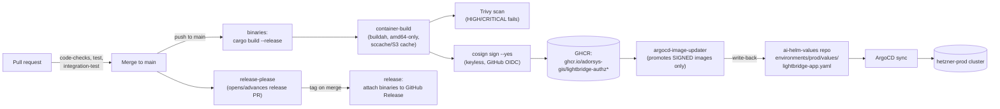

# Deployment

How code in this repository reaches production, and the one failure mode in that chain that is
silent by design — everything reports green while prod keeps running old code.

## CI/CD chain



Source: `.github/workflows/ci.yml` (jobs `binaries`, `container-build`, `release-please`,
`release`) and `.github/actions/container-build/action.yml`.

- `binaries` and `container-build` run only on `push` to `main` (`if: github.ref ==
  'refs/heads/main' && github.event_name == 'push'`) — a branch's own CI never builds or publishes
  an image, only a merge does.
- `container-build` is a 3-way matrix, one image per deployable image target: `runtime` →
  `ghcr.io/adorsys-gis/lightbridge-authz` (serves both `authz-api` and `authz-opa`), `mcp-runtime`
  → `ghcr.io/adorsys-gis/lightbridge-authz-mcp`, `usage-runtime` →
  `ghcr.io/adorsys-gis/lightbridge-authz-usage`. Each is tagged (among others) `sha-<full commit
  SHA>` (`docker/metadata-action`'s `type=sha,format=long`).
- Every pushed image is **keyless-signed with cosign** in the same job, by digest, using GitHub
  OIDC (`sigstore/cosign-installer` + `cosign sign --yes "${IMAGE_REF}@${DIGEST}"`,
  `permissions: id-token: write`). The signing identity is this workflow file at this ref
  (`…/lightbridge-authz/.github/workflows/ci.yml@refs/heads/main`, issuer
  `token.actions.githubusercontent.com`).
- `release-please` and `release` handle the GitHub Release (binary tarball attached to the tag) —
  they do not touch container images or the deploy repo at all.

## Continuous delivery to prod: the image-updater hop, and its silent-failure mode

Image promotion into production is **not** a job in this repository's CI. It happens in the
cluster: `argocd-image-updater` (a CRD-based operator, `ImageUpdater` custom resources in
`ai-helm/charts/imageupdater`) polls GHCR, and **only promotes an image if a cosign signature for
its exact digest exists**. On a match it writes the new `sha-<commit>` tag back into
`ai-helm-values/environments/prod/values/lightbridge-app.yaml`
(`global.authz.image.{repository,version}` and `global.authz_mcp.image.{repository,version}`),
which ArgoCD then syncs.

**This is the failure mode to know about, because nothing in the normal path surfaces it:** if
`cosign sign` is skipped or fails for a given digest — a runner hiccup, a permissions regression, a
workflow edit that drops `id-token: write` — the image itself still builds and pushes
successfully, Trivy still scans it, the CI run still goes green, and GHCR still serves the tag. The
*only* thing missing is the signature, and `argocd-image-updater` silently declines to promote it.
Prod keeps running whatever was last successfully signed, with no error anywhere pointing at the
actual cause. This has happened in practice — traced back to an exhausted GitHub Actions
artifact-storage quota that broke the upload step feeding `container-build`, several steps upstream
of signing.

**How to check whether a specific commit's image is promotable**, verified working: resolve the
digest for its `sha-<commit>` tag from the GHCR manifests API, then check whether a signature
manifest exists for that digest.

```bash
REPO="adorsys-gis/lightbridge-authz"          # or -mcp / -usage
TAG="sha-<full commit SHA>"

TOKEN=$(curl -s -u "$GHCR_USER:$GHCR_PAT" \
  "https://ghcr.io/token?scope=repository:${REPO}:pull" | jq -r .token)

DIGEST=$(curl -s -D - -o /dev/null \
  -H "Authorization: Bearer ${TOKEN}" \
  -H "Accept: application/vnd.oci.image.index.v1+json" \
  "https://ghcr.io/v2/${REPO}/manifests/${TAG}" \
  | grep -i '^docker-content-digest:' | tr -d '\r' | awk '{print $2}')

SIG_TAG="${DIGEST/:/-}.sig"

curl -s -o /dev/null -w "%{http_code}\n" \
  -H "Authorization: Bearer ${TOKEN}" \
  "https://ghcr.io/v2/${REPO}/manifests/${SIG_TAG}"
# 200 = signed, promotable. 404 = unsigned, argocd-image-updater will never pick it up.
```

`$GHCR_USER`/`$GHCR_PAT` need `read:packages` on the (private) GHCR packages — a GitHub Actions
`GITHUB_TOKEN` scoped to this repo works for images this repo pushes.

**Known gap, not fixed here:** `lightbridge-authz-usage`'s image is **not** covered by
`argocd-image-updater` today — only the `authz`/`authz_mcp` image pins are wired into
`ai-helm-values`. The usage service's prod pin is set by hand and has, in practice, drifted several
releases behind what CI publishes. If you are adding a new deployable to the fleet, do not assume
image-updater coverage extends to it automatically — check the `ImageUpdater` CR list explicitly.

## Helm chart structure

`charts/lightbridge-authz-stack` is the umbrella chart; `Chart.yaml` declares four subchart
dependencies, each aliased and independently toggleable:

| Alias | Subchart | Deployable |
| --- | --- | --- |
| `api` | `charts/lightbridge-authz` | `authz-api` |
| `opa` | `charts/lightbridge-authz` (same chart, second alias) | `authz-opa` |
| `usage` | `charts/lightbridge-authz-usage` | `lightbridge-authz-usage` |
| `mcp` | `charts/lightbridge-mcp` | `lightbridge-mcp` |

`api` and `opa` are two aliases of the **same** `lightbridge-authz` chart — consistent with them
being the same image run with a different `args:` subcommand (see above), configured differently
per alias in the umbrella chart's values.

Schema migrations run as a Helm hook `Job` (`controllers.migrate` in
`charts/lightbridge-authz/values.yaml`, built on the `bjw-s/common` v4 app-template library),
annotated `helm.sh/hook: post-install,post-upgrade` with `ttlSecondsAfterFinished: 300` so a
completed job self-cleans instead of blocking the next deploy if ArgoCD's own hook-delete-policy
cleanup doesn't fire. It reuses the ambient config map and shares the same image as the `api`/`opa`
alias it's attached to. This runs as part of the shared `lightbridge-authz` chart, not as a
separate migration chart — see "Corrections to prior docs" below.

For actual install/config/deploy commands per platform (macOS+Docker Desktop, Linux, TLS
provisioning via the built-in job vs. cert-manager, ingress vs. internal-only OPA), see
[`../platform-guides.md`](../platform-guides.md) — this doc does not duplicate those steps.

## Corrections to prior docs

- The root `AGENTS.md` describes "A brand-new `lightbridge-migrate` chart (aliased `migration`
  under `charts/lightbridge-authz-stack`) runs `lightbridge-authz migrate` ... as a
  `pre-install/pre-upgrade` job." No such chart or alias exists in
  `charts/lightbridge-authz-stack/Chart.yaml` today (its four dependencies are `api`, `opa`,
  `usage`, `mcp` only). The actual migration job is `controllers.migrate` inside the shared
  `lightbridge-authz` chart (see above), hooked `post-install,post-upgrade`, not
  `pre-install,pre-upgrade`. Flagged for `AGENTS.md` maintenance separately; not corrected here
  since `AGENTS.md` is outside this PR's file scope.
