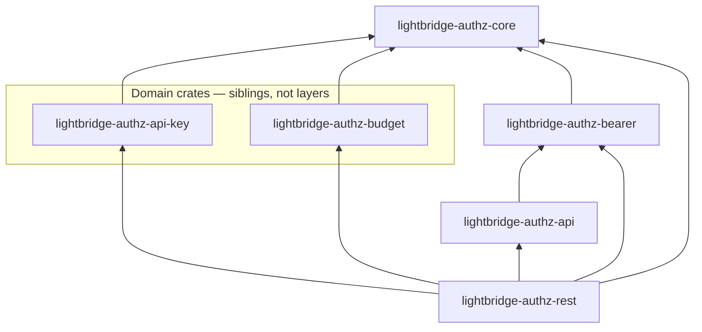

# Services

Per-service responsibility, protection, and routes — each grounded in the router source
(`crates/lightbridge-authz-rest/src/{lib.rs,routers,handlers,signing.rs,token_exchange.rs}`,
`app/lightbridge-authz/src/mcp.rs`, `crates/lightbridge-authz-usage/src/{lib.rs,routers}`), not
copied from prose. Where a route in an existing doc did not match the router source at the time of
writing, the code wins — see "Corrections to prior docs" at the end.

## `authz-api`

**Responsibility:** account/project/API-key CRUD. Two other surfaces that used to live here have
each moved off as a hard cutover, not a transitional duplication: the budget domain's RPC
procedures onto `authz-budget` (see below), and OIDC discovery/JWKS + RFC 8693 token exchange +
RFC 7009 revocation onto `authz-idp` (see its section below) — the public `auth.ai.camer.digital`
ingress now routes directly to `authz-idp`, and `build_api_router` no longer mounts
`signing::well_known_router`/`token_exchange::token_exchange_router` at all.
**Owns:** the `authz` Postgres database (all tables), plus Redis (mandatory — `start_api_server`
refuses to start without `redis.url` configured; see AGENTS.md's "Redis is a mandatory dependency"
house rule) for rate limiting. `authz-api` still bootstraps/reads the shared `signing_keys` table
(`signing::bootstrap_signing_key`) — unrelated to the OIDC surface it no longer serves; that key
backs the self-signed JWTs `AuthzStoreImpl` mints when issuing/rotating an API key.

Router assembly: `build_api_router` in `crates/lightbridge-authz-rest/src/lib.rs`.

| Route | Method | Protection | Notes |
| --- | --- | --- | --- |
| `/`, `/healthz`, `/healthz/startup`, `/healthz/ready` | GET | none | `/healthz/ready` checks DB reachability. |
| `/rpc/{op_id}` | POST | Bearer JWT, then `rpc_authorize` RBAC gate (`RpcScope::Crud`), then cratestack's own per-model `@@allow` | The generated CRUD surface (accounts, projects, api-keys, project members) plus the hand-written procedures below. Any `budget:*`-gated op-id 404s here — moved to `authz-budget`. |
| `/rpc/batch` | POST | same as above, per-frame | Batched RPC calls; each frame is authorized individually (#165), including the out-of-scope check — a batch frame aimed at a budget op-id 404s too (`CratestackAuthProvider::authenticate`, not merely the outer gate). |

A request to `/.well-known/*` or `/oauth2/{token,revoke}` here is not a public route and falls
through to the RPC router's own fallback, which `rpc_authorize` fail-closes to `403` for an
unmapped op-id — no bearer token required (see `authz-idp` below for where these routes actually
live now).

Hand-written procedures reachable only via `/rpc/{op_id}` (not cratestack-generated —
`crates/lightbridge-authz-api/schema/authz.cstack` declares them, `Procedures` in
`crates/lightbridge-authz-rest/src/lib.rs` implements them):

- Session revocation: `revokeOwnSessions` (self-service "log out everywhere," no subject field on
  the input — structurally incapable of targeting anyone else), `revokeSubjectSessions` (admin
  offboarding kill switch, gated on `session:revoke`) — see [`auth-flows.md`](./auth-flows.md) and
  [`../rbac.md`](../rbac.md).

`build_api_router`'s outermost layer on the RPC surface is `rpc_authorize::rpc_authorize` —
rejected there with `403`/`404` before the request consumes idempotency/rate-limit budget or
reaches cratestack's own membership `@@allow` dispatch. The wire codec is CBOR-primary/JSON-
secondary in production, JSON-only in dev/CI (`AGENTS.md`, `server.api.codec`).

## `authz-budget`

**Responsibility:** the budget domain's RPC procedures — policy lifecycle, self-service refill,
the admin review queue, and direct balance/ledger reads/writes — carried off `authz-api` as a hard
cutover, the same shape `authz-idp` below now also is. See
[`budget.md`](./budget.md) for the full domain writeup and
[`../rbac.md`](../rbac.md) for the permission mapping.
**Owns:** nothing of its own — reads/writes the same `authz` Postgres database as `authz-api`
(`budget_grants`, `budget_balances`, `budget_policy_sets`/`budget_policy_revisions`,
`budget_augmentation_requests`), plus Redis (mandatory — `start_budget_server` refuses to start
without `redis.url` configured; see AGENTS.md's "Redis is a mandatory dependency" house rule) for
rate limiting (its own key-prefixed token buckets, isolated from `authz-api`'s).

Router assembly: `build_budget_router` in `crates/lightbridge-authz-rest/src/lib.rs`.

| Route | Method | Protection | Notes |
| --- | --- | --- | --- |
| `/`, `/healthz`, `/healthz/startup`, `/healthz/ready` | GET | none | Same probe wiring as every other server (`probe_router`), `/healthz/ready` checks DB reachability. |
| `/budget/rpc/{op_id}` | POST | Bearer JWT, then `rpc_authorize` RBAC gate (`RpcScope::Budget`), then cratestack's own per-model `@@allow` | Mounted under a **fixed** `/budget` prefix (not the configurable `rpc_base_path` `authz-api` uses — see `config::BudgetServer`'s doc comment). Any non-`budget:*` op-id 404s here, including the whole CRUD surface. |
| `/budget/rpc/batch` | POST | same as above, per-frame | Same per-frame scope + permission enforcement as `authz-api`'s batch endpoint. |

Reachable procedures (all hand-written — ADR-0010 — declared in
`crates/lightbridge-authz-api/schema/authz.cstack`, implemented on the same `Procedures` type
`authz-api` uses; `RpcScope::Budget` is what actually restricts this server to only these 15):

- Policy lifecycle: `activateBudgetPolicy`, `getBudgetPolicyStatus`, `simulateBudgetPolicy`,
  `createBudgetPolicyRevision`.
- Self-service refill + admin review: `requestBudgetRefill`, `listPendingAugmentationRequests`,
  `approveAugmentationRequest`, `rejectAugmentationRequest`.
- Direct balance/ledger/history reads: `getMyBudgetBalance`, `listMyBudgetGrants`,
  `listMyAugmentationRequests`, `getBudgetBalance`, `listBudgetGrants`.
- Direct admin grant/revoke: `grantBudget`, `revokeBudgetGrant`.

Every procedure keeps its exact `docs/rbac.md`-mandated permission unchanged by the move — the
split only changes *which host and path prefix* serves it, not what a caller needs to hold to call
it. `authz-budget` constructs its own `AuthzStoreImpl`/cratestack pool/idempotency store the same
way `authz-api` does, purely because `Procedures::new` requires them as a type-level obligation
(the CRUD op-ids they back are never actually dispatchable here) — see `build_budget_router`'s doc
comment for why this is not a real dependency on the CRUD domain.

## `authz-idp`

**Responsibility:** OIDC broker server (ADR-0012) — the sole owner of the discovery/JWKS/token-
exchange surface, carried off `authz-api` as a hard cutover (see `authz-api` above). Requires
`oauth2.type: self`; refuses to start otherwise (`start_idp_server` rejects the external-issuance
path outright — this server only ever serves the self-signed-JWT surface).
**Owns:** nothing of its own — reads/writes the same `signing_keys` table as `authz-api` and
`lightbridge-mcp` via `StoreRepo`, and is a third concurrent bootstrapper against it
(`signing::bootstrap_signing_key`); plus Redis, mandatory unconditionally (not only when
`oauth2.token_exchange.enabled`) — see AGENTS.md's "Redis is a mandatory dependency" house rule.
`start_idp_server` refuses to start with no `redis.url` configured, regardless of whether token
exchange is enabled; when it is enabled, that same Redis instance also backs the `private_key_jwt`
client-assertion replay-protection store (ADR-0011, Decision 6).

**The sole owner of this surface, not a duplicate.** ADR-0012 Phase 1 ran this router alongside
`authz-api`'s own (now-removed) copy of the same routes while the public issuer
(`auth.ai.camer.digital`, a live, trusted `iss` in every in-circulation API-key JWT) still routed
through `authz-api`. That ingress has since been repointed directly at `authz-idp`, and
`authz-api`'s copy of `well_known_router`/`token_exchange_router` was removed in the same change
(`crates/lightbridge-authz-rest/tests/idp_server_tests.rs`'s
`api_router_no_longer_serves_well_known_idp_still_does` proves the split). `authz-idp` resolving
`auth.ai.camer.digital` is now load-bearing on its own, no same-surface fallback on `authz-api`.

Router assembly: `build_idp_router`/`start_idp_server` in `crates/lightbridge-authz-rest/src/lib.rs`.
The implemented surface below is intentionally narrower than the accepted ADR-0019/ADR-0021
browser roadmap: `/authorize`, Authorization Code + PKCE, Keycloak browser-session brokering, and
the device endpoints are not mounted yet. See
[`docs/oauth-oidc-standards-roadmap.md`](../oauth-oidc-standards-roadmap.md) for the canonical
implementation status and conformance sequence.

| Route | Method | Protection | Notes |
| --- | --- | --- | --- |
| `/`, `/healthz`, `/healthz/startup`, `/healthz/ready` | GET | none | Same probe wiring as every other server (`probe_router`), `/healthz/ready` checks DB reachability. |
| `/.well-known/openid-configuration` | GET | none | Only mounted when `oauth2.type: self` (`signing::well_known_router`), reading the same `signing_keys` rows `authz-api` bootstraps/reads for its own (unrelated) API-key JWT signer. |
| `/.well-known/jwks.json` | GET | none | Same gate as above. |
| `/oauth2/token` | POST | none (credential is the presented token/assertion) | RFC 8693 token exchange + `refresh_token` grant. Only mounted when `oauth2.token_exchange.enabled` — but `redis.url` is required for this server to start at all regardless of that flag (`start_idp_server` errors at startup otherwise). `project_id` is an optional form param. |
| `/oauth2/revoke` | POST | none (credential is the presented token) | RFC 7009. Absent from `/.well-known/openid-configuration` pending an upstream `authkestra-op` `OidcDiscovery` field. |

Deliberately thin next to `authz-api`: no RPC CRUD surface, no budget domain, no idempotency/rate-
limit layers — `well_known_router`/`token_exchange_router` need none of that, and every route this
server mounts is public by design (`config::IdpServer`'s doc comment; no `basic_auth` block, unlike
`OpaServer`).

## `authz-opa`

**Responsibility:** validates presented API-key secrets, resolves subject+project context for the
Keycloak IdP adapter, and records usage telemetry (`last_used_at`, `last_ip`) on every successful
validation. This is the only service Envoy/Authorino ever calls.
**Owns:** nothing of its own — reads the same `authz` Postgres database as `authz-api`, read-mostly
plus telemetry writes.

Router assembly: `build_opa_router` in `crates/lightbridge-authz-rest/src/lib.rs`, protected routes
in `crates/lightbridge-authz-rest/src/routers/mod.rs::opa_router`.

| Route | Method | Protection | Notes |
| --- | --- | --- | --- |
| `/`, `/healthz`, `/healthz/startup`, `/healthz/ready` | GET | none | |
| `/v1/opa/docs`, `/v1/opa/openapi.json` | GET | none | The one server in this repo that still publishes Swagger UI/OpenAPI — see `AGENTS.md`. |
| `/v1/authorino/validate/introspect` | POST | Basic auth | Form-encoded, RFC 7662-shaped. Hashes the presented secret, loads `api_keys` by hash, rejects unknown/revoked/expired/suspended (account or project) as `{"active": false}`, updates telemetry, returns enriched context. |
| `/idp/v1/resolve-context` | POST | Basic auth | `{subject, project_id} -> {account_id, project_id}`. A project resolves when the subject owns its account or holds a `project_members` row for it (ADR-0006); non-member and unknown-project are the same uniform `404`, deliberately, so the endpoint never leaks which projects exist. |

**Correction to prior docs:** `AGENTS.md` and the pre-existing `docs/architecture.md` describe a
`POST /v1/opa/validate` "minimal validation endpoint." No such route exists in
`crates/lightbridge-authz-rest/src/routers/mod.rs` — the only validation route mounted today is
`/v1/authorino/validate/introspect`. Flagged for AGENTS.md maintenance separately; not corrected
here since AGENTS.md is outside this PR's file scope.

## `lightbridge-mcp`

**Responsibility:** exposes the CRUD/validation surface as MCP tools over streamable HTTP, plus
OAuth discovery metadata and dynamic client-registration proxying for MCP clients. Derives caller
identity from the JWT (no subject in tool input).
**Owns:** nothing of its own — calls the same `AuthzStoreImpl` the REST handlers use, backed by the
same `authz` Postgres database, via `crates/lightbridge-authz-rest`.

Router assembly: `app/lightbridge-authz/src/mcp.rs` (search around line 1607).

| Route | Method | Protection | Notes |
| --- | --- | --- | --- |
| `/`, `/healthz`, `/healthz/startup`, `/healthz/ready` | GET | none | |
| `/.well-known/oauth-authorization-server` | GET | none | Proxied OAuth authorization-server metadata. |
| `/.well-known/openid-configuration` | GET | none | |
| `/oauth/register` | POST | none | Proxies dynamic client registration to a configured upstream registration endpoint. Public registration URLs are derived from forwarded/host headers when present. |
| `/mcp` | (streamable HTTP) | Bearer JWT (`bearer_auth` middleware, `nest_service`) | The MCP tool surface itself. Stateless (`with_stateful_mode(false)`) so it works safely behind multi-replica round-robin — see the multi-replica gotcha this repo already hit. |

The tool set is generated from `#[tool]`-annotated methods on the MCP handler in `mcp.rs`, not
duplicated here — the exact set drifts easily and this table would go stale faster than the code;
read the `#[tool]` annotations directly if you need the current list. The budget domain is **not**
exposed over MCP today — only over `authz-api`'s `/rpc/*` surface.

## `lightbridge-authz-usage`

**Responsibility:** ingests OTLP/HTTP traces, metrics, and logs (JSON or protobuf, optional gzip),
normalizes attributes across compatibility aliases, and serves a single aggregated usage-query
endpoint.
**Owns:** the usage database — a Timescale hypertable when the extension is available, plain
Postgres table otherwise, independent of the `authz` database.

Router assembly: `crates/lightbridge-authz-usage/src/{lib.rs,routers/mod.rs}`. Split across two
listeners since #347 (`UsageServerGroup` in `crates/lightbridge-authz-usage/src/config.rs`): the
ingest listener (`usage`) and the mTLS-required query listener (`query`) each serve their own
health probes, plus whatever routes are theirs below.

| Route | Method | Listener | Protection | Notes |
| --- | --- | --- | --- | --- |
| `/`, `/healthz`, `/healthz/startup`, `/healthz/ready` | GET | both | none | Each listener serves its own copy. |
| `/usage/v1/usage/docs` | GET | `usage` (ingest) | none | OpenAPI/Swagger UI covering the whole service, including the query listener's routes. |
| `/v1/otel/traces` | POST | `usage` (ingest) | **none** | OTLP trace ingest; caller is an AI Envoy/OpenTelemetry exporter outside this repo's deploy surface. |
| `/v1/otel/metrics` | POST | `usage` (ingest) | **none** | OTLP metric ingest. |
| `/v1/otel/logs` | POST | `usage` (ingest) | **none** | OTLP log ingest. |
| `/usage/v1/usage/query` | POST | `query` | **mTLS (#347)** | Scoped, date-bin-aggregated usage query; TLS-layer client-cert requirement, no `scope_id` ownership check. |
| `/usage/v1/spend/query` | POST | `query` | **mTLS (#347)** | Summed spend for an account/period, called by `lightbridge-authz-budget`'s `UsageServiceSpendReader`. |

This service has no application-level authentication anywhere on its data-plane routes — mTLS on
the `query` listener authenticates the caller (any workload holding a CA-signed cert), not which
`scope_id`/`account_id` it's entitled to see, and the `usage` (ingest) listener has none at all.
That ownership gap is a known, accepted one today — see [`README.md`](./README.md)'s
context-diagram notes and [`deployment.md`](./deployment.md) for why it is currently safe (network
topology, not application auth) and what would need to change before it could be routed
externally.

## Crate layering behind `authz-api` / `authz-opa`

Both server binaries above are assembled from the same Cargo workspace. The dependency edges below
are the ones each crate's own `Cargo.toml` declares — not transitive closures — verified against
the manifests directly.

- **`core`** is the shared foundation: domain DTOs, config loading, the SQLx pool, crypto (API-key
  hashing), errors, TLS serving, tracing, and the CUID2 chokepoint (`cuid::cuid2()`).
- **`api-key`** persists accounts, projects, project members, API keys, signing keys, and exchange
  refresh tokens — hand-written SQLx (ADR-0038 exception), not cratestack.
- **`budget`** is a **sibling of `api-key`, not a layer beneath `api`** (ADR-0010): it owns its own
  persistence (`BudgetRepo`, `AugmentationRepo`), and `rest` calls it directly from hand-written
  `Procedures` methods, deliberately bypassing the cratestack model-generation path `api` uses for
  the CRUD surface. `api` has no dependency edge on `budget` or `api-key` at all — confirmed by
  `crates/lightbridge-authz-api/Cargo.toml`, which lists only `cratestack`, `serde`, and
  `lightbridge-authz-bearer`.
- **`bearer`** validates JWT bearer tokens via JWKS; both `api` (transitively) and `rest` depend on
  it directly.
- **`api`** owns `schema/authz.cstack` and the cratestack-generated CRUD models, RPC router, and
  `ProcedureRegistry` trait — the schema-first codegen layer. It does not persist anything itself.
- **`rest`** is the only crate that assembles a real Axum server: it wires `api`'s generated router,
  `api-key`'s repository, `bearer`'s validation, and `budget`'s procedures together with TLS,
  middleware, and the OPA/MCP-specific handlers.
- **`proto`** (`crates/lightbridge-authz-proto`) is not a workspace member — it exists in the
  source tree but is not built or depended on by anything (`Cargo.toml`'s `[workspace] members`).

Two further packages sit outside this diagram: the `lightbridge-authz` package (produces the
`lightbridge-authz` and `lightbridge-mcp` binaries; depends on `rest`, `api`, `api-key`, `bearer`,
`core`) and the `lightbridge-authz-usage` package (produces the usage binary; depends on the
sibling `lightbridge-authz-usage-rest` crate — note the crate directory is
`crates/lightbridge-authz-usage` but its declared package name is
`lightbridge-authz-usage-rest` — and `core`). Both are independent of the diagram above; the usage
service shares no crate with `authz-api`/`authz-opa`/`lightbridge-mcp` beyond `core`.

`authz-budget` (and `authz-idp` before it) adds no node to this diagram at all — it is the same
`lightbridge-authz` binary, gated behind its own `Commands::Budget` subcommand
(`app/lightbridge-authz/src/main.rs`), calling `build_budget_router`/`start_budget_server` in the
same `rest` crate that already depended on `budget`/`api-key`/`api`/`bearer`/`core` for
`authz-api`. Splitting the *service* did not require splitting a single crate — see
[`budget.md`](./budget.md), "Why one `Procedures` impl, not a second schema/crate", for why the
RPC-surface split is enforced at the routing layer (`RpcScope`) instead.
