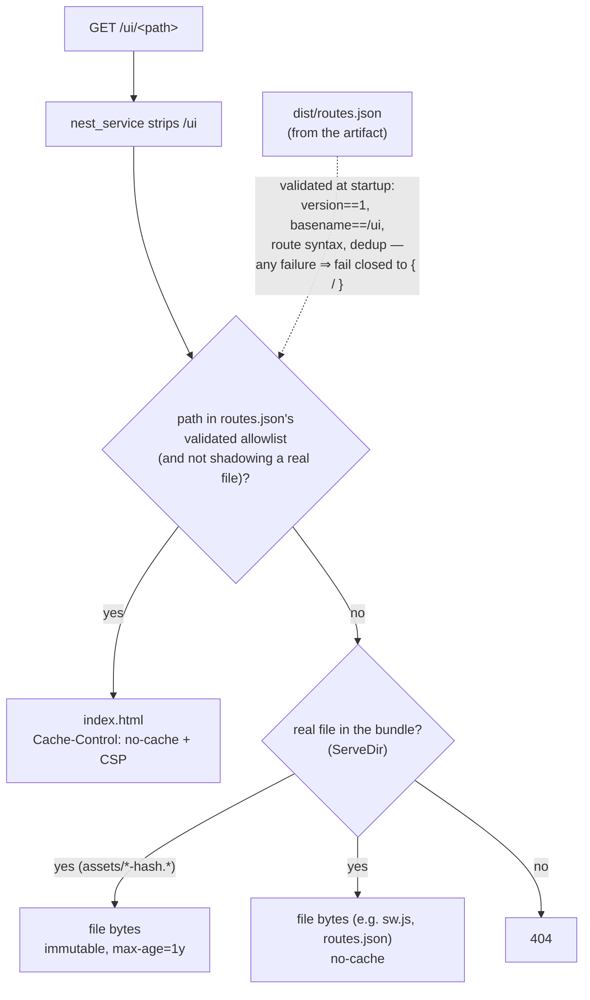
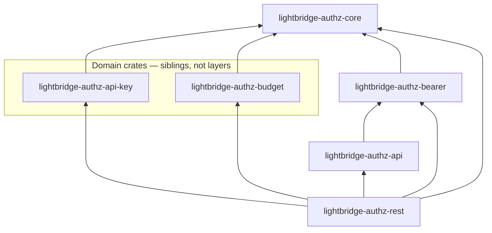

# Services

Per-service responsibility, protection, and routes — each grounded in the router source
(`crates/lightbridge-authz-rest/src/{lib.rs,routers,handlers,signing.rs,token_exchange.rs}`,
`app/lightbridge-authz/src/mcp.rs`, `crates/lightbridge-authz-usage/src/{lib.rs,routers}`), not
copied from prose. Where a route in an existing doc did not match the router source at the time of
writing, the code wins — see "Corrections to prior docs" at the end.

## `authz-api`

**Responsibility:** account/project/API-key CRUD. Two other surfaces that used to live here have
each moved off as a hard cutover, not a transitional duplication: the budget domain's RPC
procedures onto `authz-budget` (see below), and OIDC discovery/JWKS + RFC 8693 token exchange +
RFC 7009 revocation onto `authz-idp` (see its section below) — the public `auth.ai.camer.digital`
ingress now routes directly to `authz-idp`, and `build_api_router` no longer mounts
`signing::well_known_router`/`token_exchange::token_exchange_router` at all.
**Owns:** the `authz` Postgres database (all tables), plus Redis (mandatory — `start_api_server`
refuses to start without `redis.url` configured; see AGENTS.md's "Redis is a mandatory dependency"
house rule) for rate limiting. `authz-api` still bootstraps/reads the shared `signing_keys` table
(`signing::bootstrap_signing_key`) — unrelated to the OIDC surface it no longer serves; that key
backs the self-signed JWTs `AuthzStoreImpl` mints when issuing/rotating an API key.

Router assembly: `build_api_router` in `crates/lightbridge-authz-rest/src/lib.rs`.

| Route | Method | Protection | Notes |
| --- | --- | --- | --- |
| `/`, `/healthz`, `/healthz/startup`, `/healthz/ready` | GET | none | `/healthz/ready` checks DB reachability. |
| `/rpc/{op_id}` | POST | Bearer JWT, then `rpc_authorize` RBAC gate (`RpcScope::Crud`), then cratestack's own per-model `@@allow` | The generated CRUD surface (accounts, projects, api-keys, project members) plus the hand-written procedures below. Any `budget:*`-gated op-id 404s here — moved to `authz-budget`. |
| `/rpc/batch` | POST | same as above, per-frame | Batched RPC calls; each frame is authorized individually (#165), including the out-of-scope check — a batch frame aimed at a budget op-id 404s too (`CratestackAuthProvider::authenticate`, not merely the outer gate). |

A request to `/.well-known/*` or `/oauth2/{token,revoke}` here is not a public route and falls
through to the RPC router's own fallback, which `rpc_authorize` fail-closes to `403` for an
unmapped op-id — no bearer token required (see `authz-idp` below for where these routes actually
live now).

Hand-written procedures reachable only via `/rpc/{op_id}` (not cratestack-generated —
`crates/lightbridge-authz-api/schema/authz.cstack` declares them, `Procedures` in
`crates/lightbridge-authz-rest/src/lib.rs` implements them):

- Session revocation: `revokeOwnSessions` (self-service "log out everywhere," no subject field on
  the input — structurally incapable of targeting anyone else), `revokeSubjectSessions` (admin
  offboarding kill switch, gated on `session:revoke`) — see [`auth-flows.md`](./auth-flows.md) and
  [`../rbac.md`](../rbac.md).

`build_api_router`'s outermost layer on the RPC surface is `rpc_authorize::rpc_authorize` —
rejected there with `403`/`404` before the request consumes idempotency/rate-limit budget or
reaches cratestack's own membership `@@allow` dispatch. The wire codec is CBOR-primary/JSON-
secondary in production, JSON-only in dev/CI (`AGENTS.md`, `server.api.codec`).

## `authz-budget`

**Responsibility:** the budget domain's RPC procedures — policy lifecycle, self-service refill,
the admin review queue, and direct balance/ledger reads/writes — carried off `authz-api` as a hard
cutover, the same shape `authz-idp` below now also is. See
[`budget.md`](./budget.md) for the full domain writeup and
[`../rbac.md`](../rbac.md) for the permission mapping.
**Owns:** nothing of its own — reads/writes the same `authz` Postgres database as `authz-api`
(`budget_grants`, `budget_balances`, `budget_policy_sets`/`budget_policy_revisions`,
`budget_augmentation_requests`), plus Redis (mandatory — `start_budget_server` refuses to start
without `redis.url` configured; see AGENTS.md's "Redis is a mandatory dependency" house rule) for
rate limiting (its own key-prefixed token buckets, isolated from `authz-api`'s).

Router assembly: `build_budget_router` in `crates/lightbridge-authz-rest/src/lib.rs`.

| Route | Method | Protection | Notes |
| --- | --- | --- | --- |
| `/`, `/healthz`, `/healthz/startup`, `/healthz/ready` | GET | none | Same probe wiring as every other server (`probe_router`), `/healthz/ready` checks DB reachability. |
| `/budget/rpc/{op_id}` | POST | Bearer JWT, then `rpc_authorize` RBAC gate (`RpcScope::Budget`), then cratestack's own per-model `@@allow` | Mounted under a **fixed** `/budget` prefix (not the configurable `rpc_base_path` `authz-api` uses — see `config::BudgetServer`'s doc comment). Any non-`budget:*` op-id 404s here, including the whole CRUD surface. |
| `/budget/rpc/batch` | POST | same as above, per-frame | Same per-frame scope + permission enforcement as `authz-api`'s batch endpoint. |

Reachable procedures (all hand-written — ADR-0010 — declared in
`crates/lightbridge-authz-api/schema/authz.cstack`, implemented on the same `Procedures` type
`authz-api` uses; `RpcScope::Budget` is what actually restricts this server to only these 15):

- Policy lifecycle: `activateBudgetPolicy`, `getBudgetPolicyStatus`, `simulateBudgetPolicy`,
  `createBudgetPolicyRevision`.
- Self-service refill + admin review: `requestBudgetRefill`, `listPendingAugmentationRequests`,
  `approveAugmentationRequest`, `rejectAugmentationRequest`.
- Direct balance/ledger/history reads: `getMyBudgetBalance`, `listMyBudgetGrants`,
  `listMyAugmentationRequests`, `getBudgetBalance`, `listBudgetGrants`.
- Direct admin grant/revoke: `grantBudget`, `revokeBudgetGrant`.

Every procedure keeps its exact `docs/rbac.md`-mandated permission unchanged by the move — the
split only changes *which host and path prefix* serves it, not what a caller needs to hold to call
it. `authz-budget` constructs its own `AuthzStoreImpl`/cratestack pool/idempotency store the same
way `authz-api` does, purely because `Procedures::new` requires them as a type-level obligation
(the CRUD op-ids they back are never actually dispatchable here) — see `build_budget_router`'s doc
comment for why this is not a real dependency on the CRUD domain.

## `authz-idp`

**Responsibility:** OIDC broker server (ADR-0012, ADR-0019, ADR-0023) — the sole owner of the
discovery/JWKS/token-exchange/browser-SSO surface, carried off `authz-api` as a hard cutover (see
`authz-api` above). Requires `oauth2.type: self`; refuses to start otherwise (`start_idp_server`
rejects the external-issuance path outright — this server only ever serves the self-signed-JWT
surface). **It is a full IdP (ADR-0023): every route below is mounted unconditionally, on every
deployment — there is no reduced-surface configuration.**
**Owns:** nothing of its own — reads/writes the same `signing_keys` table as `authz-api` and
`lightbridge-mcp` via `StoreRepo`, and is a third concurrent bootstrapper against it
(`signing::bootstrap_signing_key`). Three dependencies are hard startup requirements, checked in
this order (①→⑤, `start_idp_server`):

1. `oauth2.type: self` + `oauth2.signing` present.
2. `redis.url` present (mandatory unconditionally — see AGENTS.md's "Redis is a mandatory
   dependency" house rule; presence-only, no startup-time `PING`). Backs the Keycloak RP-leg's
   `user_code` rate limiting and, when token exchange runs, the `private_key_jwt` client-assertion
   replay-protection store (ADR-0011, Decision 6).
3. `oauth2.relying_party` present and valid (ADR-0023) — `KeycloakRelyingParty::new` validates its
   shape offline (timeout, TTL, base64url 32-byte state key, exact callback URL/path); never dials
   Keycloak at startup.
4. `oauth2.token_exchange` present, `enabled: true`, and `openid` ∈ `allowed_scopes` (ADR-0023,
   OIDC Discovery 1.0 §3).

**The sole owner of this surface, not a duplicate.** ADR-0012 Phase 1 ran this router alongside
`authz-api`'s own (now-removed) copy of the same routes while the public issuer
(`auth.ai.camer.digital`, a live, trusted `iss` in every in-circulation API-key JWT) still routed
through `authz-api`. That ingress has since been repointed directly at `authz-idp`, and
`authz-api`'s copy of `well_known_router`/`token_exchange_router` was removed in the same change
(`crates/lightbridge-authz-rest/tests/idp_server_tests.rs`'s
`api_router_no_longer_serves_well_known_idp_still_does` proves the split). `authz-idp` resolving
`auth.ai.camer.digital` is now load-bearing on its own, no same-surface fallback on `authz-api`.

Router assembly: `build_idp_router`/`start_idp_server` in `crates/lightbridge-authz-rest/src/lib.rs`.
Unlike the prior revision of this doc, the surface below is no longer narrower than the accepted
ADR-0019/ADR-0021 browser roadmap: `/authorize` (Authorization Code + PKCE), the Keycloak
browser-session brokering routes, and the device-authorization endpoints are all implemented and,
since ADR-0023, always mounted. See
[`docs/oauth-oidc-standards-roadmap.md`](../oauth-oidc-standards-roadmap.md) for the canonical
conformance-sequence status of each grant.

**Human plane, plus a disjoint machine plane on the same `/oauth2/token` route (ADR-0030, #534).**
`authz-idp` is the OIDC broker for people — browser SSO, RFC 8628 device pairing, and the token
exchange those flows land in — but `/oauth2/token` also serves RFC 6749 §4.4 `client_credentials`
(M2M): intercepted before upstream dispatch (mirroring the pre-existing device-code intercept),
`private_key_jwt`-only (`OauthClientType::Service`, behaviorally identical to `Confidential`),
minting `sub = "svc:<client_id>"` with no `roles` claim — so a machine token holds zero permissions
against every RPC op-id by the same "no roles claim -> empty `PermissionSet`" mechanism every other
zero-role caller already goes through. There is no separate route or enable flag for this grant: it
rides the always-mounted `/oauth2/token` handler and is advertised in discovery unconditionally,
in the same block as the token-exchange/refresh grants (`signing.rs:838-848`), never gated on
whether any `oauth2.clients` entry actually lists it.

Since lightbridge-authz#607 the human-plane browser/device leg renders
no HTML at all: the pages are a React SPA, `apps/authz-ui` in the `converse-frontends`
monorepo, built on the estate's `ui-web` design system and served same-origin under `/ui` as a
digest-pinned, assets-only OCI artifact (ADR-0029) — the pin is the single `ARG AUTHZ_UI_REF=` at
the top of `./Dockerfile`, and pin + Rust handoff + `/ui` allowlist are one rollback unit, not
three independently revertible pieces. `GET /device/verify` is a pure `303` handoff into the SPA's
entry route; every decision downstream (`POST /device/verify`, `POST /device/verify/continue`) also
`303`s, never renders; `GET /device/verify/context` is the one JSON escape hatch, feeding the SPA's
confirmation screen exactly the two values (`user_code`, `client_id`) the deleted server-rendered
page used to print. `/ui` itself is a route ALLOWLIST, not a catch-all — see that row below. Three
surfaces still render HTML server-side (`check_session_iframe`, `claim_redeem`, `end_session`) —
each for a reason specific to it (a protocol artifact, a script-free CSP as the actual security
property, and a not-yet-migrated legacy page respectively), tracked for eventual migration rather
than an oversight. All protocol decisions — every redirect, `Set-Cookie`, and ID-token verification
— stay in this Rust codebase regardless (ADR-0029 Decision 5); the SPA is presentation only.

The whole device pairing, end to end — every human-facing response from Rust is a `303`; the SPA
renders, Rust decides:

```mermaid
sequenceDiagram
    participant CLI as Device client (CLI)
    participant Browser
    participant SPA as apps/authz-ui<br/>(served at /ui, allowlisted)
    participant Rust as authz-idp (Rust)<br/>relying_party.rs
    participant KC as Keycloak

    CLI->>Rust: POST /oauth2/device_authorization
    Rust-->>CLI: user_code + verification_uri (/device/verify)
    Note over CLI: prints the URL; starts polling POST /oauth2/token

    Browser->>Rust: GET /device/verify?user_code=X
    Rust-->>Browser: 303 /ui/device?user_code=X (sanitised, percent-encoded)
    Browser->>SPA: GET /ui/device → entry form (native <form>)
    Browser->>Rust: POST /device/verify {user_code}
    alt code unknown / expired / consumed (uniform)
        Rust-->>Browser: 303 /ui/device/invalid
    else code pending
        Rust-->>Browser: 303 /ui/device/confirm<br/>Set-Cookie: __Host-authz_device_confirm
    end
    Browser->>SPA: GET /ui/device/confirm
    SPA->>Rust: fetch GET /device/verify/context (cookie-bound)
    Rust-->>SPA: 200 {user_code, client_id} — or uniform 404 without the cookie
    Browser->>Rust: POST /device/verify/continue (cookie cross-checked)
    Rust-->>Browser: 303 Keycloak authorization URL
    Browser->>KC: login
    KC-->>Browser: 302 /idp/callback?code=…
    Browser->>Rust: GET /idp/callback (verify, mark code approved)
    Rust-->>Browser: 303 /ui/device/success (cookie cleared)
    CLI->>Rust: POST /oauth2/token (poll)
    Rust-->>CLI: tokens
```

And how a `GET /ui/<path>` is answered since #598 — allowlist first, real files always, never a
catch-all (`static_assets.rs`):



| Route | Method | Protection | Notes |
| --- | --- | --- | --- |
| `/`, `/healthz`, `/healthz/startup`, `/healthz/ready` | GET | none | Same probe wiring as every other server (`probe_router`), `/healthz/ready` checks DB reachability. |
| `/.well-known/openid-configuration`, `/.well-known/oauth-authorization-server` | GET | none | `signing::well_known_router`, unconditional. `DiscoveryCapabilities::full_idp()` (ADR-0023): `grant_types_supported` always advertises token-exchange, `refresh_token`, `client_credentials` (ADR-0030, #534 — unconditional, same block as token-exchange/refresh, never gated on a route mount), `device_code`, and `authorization_code`; `authorization_endpoint`, `response_types_supported: ["code"]`, `response_modes_supported: ["query"]`, and `code_challenge_methods_supported: ["S256"]` are always present (#471). |
| `/.well-known/jwks.json` | GET | none | Same router, reads the shared `signing_keys` table. |
| `/authorize` | GET | none (redirects to Keycloak login) | ADR-0019 Authorization Code + PKCE. Mandatory PKCE for every client type (#471), exact-match `redirect_uris` only. |
| `/device/verify`, `/device/verify/continue` | GET, POST | none (rate-limited by caller IP, not authenticated) | `/device/verify` hands off to the SPA (lightbridge-authz#598: a 303 to `/ui/device`, RFC 8628 `verification_uri_complete`'s `user_code` prefill forwarded and sanitised) rather than rendering a page itself; `/device/verify/continue` still redirects on to Keycloak. |
| `/device/verify/context` | GET | none (bound to the `__Host-authz_device_confirm` cookie `/device/verify` sets — see below) | Added by #598: what the SPA's `/ui/device/confirm` route fetches to render the confirmation the deleted server-rendered page used to print (`user_code`, `client_id`, never `device_code`). Uniform `404` for every absence (no cookie, wrong code, wrong `provider_id`); `503` only for a store outage. |
| `/idp/callback` | GET | none | The fixed Keycloak OAuth2 redirect target both `/authorize` and `/device/verify` route through. |
| `/oauth2/token` | POST | none (credential is the presented token/assertion) | RFC 8693 token exchange + `authorization_code` + `refresh_token` + RFC 8628 device-code grants, all unconditional (ADR-0023), plus RFC 6749 §4.4 `client_credentials` (M2M, ADR-0030, #534): `private_key_jwt`-only, intercepted before upstream dispatch via `client_credentials_token_endpoint`, mints `sub = "svc:<client_id>"` with no `roles` claim (zero RBAC permissions), never a refresh or ID token. `project_id` is an optional form param. |
| `/oauth2/device_authorization` | POST | none | RFC 8628 device-authorization endpoint, unconditional. |
| `/oauth2/revoke` | POST | none (credential is the presented token) | RFC 7009. |
| `/ui/*` | GET | none | The hosted-login SPA build, path-scoped under `/ui` (ADR-0021 Decision 10 follow-up). Since lightbridge-authz#598, `/ui` is a route ALLOWLIST sourced from the artifact's own `dist/routes.json`, not a whole-subtree catch-all: only the manifest's listed paths resolve to `index.html`, a real file under `assets/` still serves regardless, and every other `/ui/*` path (like any path outside `/ui` matching no protocol route above) is a plain `404`. The bundle is built in `converse-frontends` (`apps/authz-ui`) and consumed here as a digest-pinned OCI artifact, not built in this repo (ADR-0029). |

Deliberately thin next to `authz-api`: no RPC CRUD surface, no budget domain, no idempotency/rate-
limit tower layers on the protocol routes — every route this server mounts is public by design
(`config::IdpServer`'s doc comment; no `basic_auth` block, unlike `OpaServer`). The one exception is
the Keycloak RP-leg's `user_code` lookups, which consult the same Redis-backed rate-limit store
`authz-api`/`authz-budget` use for their tower layer, just called directly rather than layered.

## `authz-opa`

**Responsibility:** validates presented API-key secrets, resolves subject+project context for the
Keycloak IdP adapter, and records usage telemetry (`last_used_at`, `last_ip`) on every successful
validation. This is the only service Envoy/Authorino ever calls.
**Owns:** nothing of its own — reads the same `authz` Postgres database as `authz-api`, read-mostly
plus telemetry writes.

Router assembly: `build_opa_router` in `crates/lightbridge-authz-rest/src/lib.rs`, protected routes
in `crates/lightbridge-authz-rest/src/routers/mod.rs::opa_router`.

| Route | Method | Protection | Notes |
| --- | --- | --- | --- |
| `/`, `/healthz`, `/healthz/startup`, `/healthz/ready` | GET | none | |
| `/v1/opa/docs`, `/v1/opa/openapi.json` | GET | none | The one server in this repo that still publishes Swagger UI/OpenAPI — see `AGENTS.md`. |
| `/v1/authorino/validate/introspect` | POST | Basic auth | Form-encoded, RFC 7662-shaped. Hashes the presented secret, loads `api_keys` by hash, rejects unknown/revoked/expired/suspended (account or project) as `{"active": false}`, updates telemetry, returns enriched context. |
| `/idp/v1/resolve-context` | POST | Basic auth | `{subject, project_id} -> {account_id, project_id}`. A project resolves when the subject owns its account or holds a `project_members` row for it (ADR-0006); non-member and unknown-project are the same uniform `404`, deliberately, so the endpoint never leaks which projects exist. |
| `/idp/v1/authorize-usage-scope` | POST | Basic auth | `{issuer, subject, scope, scope_id} -> 200` or uniform `404` (#570). The ownership authority `lightbridge-authz-usage`'s query listener calls for `account`/`project` usage-query scopes — same non-oracle convention and same real, Postgres-backed predicate as `resolve-context`. |

**Correction to prior docs:** `AGENTS.md` and the pre-existing `docs/architecture.md` describe a
`POST /v1/opa/validate` "minimal validation endpoint." No such route exists in
`crates/lightbridge-authz-rest/src/routers/mod.rs` — the only validation route mounted today is
`/v1/authorino/validate/introspect`. Flagged for AGENTS.md maintenance separately; not corrected
here since AGENTS.md is outside this PR's file scope.

## `lightbridge-mcp`

**Responsibility:** exposes the **whole** `authz-api` + `authz-budget` RPC surface as MCP tools over
streamable HTTP, plus OAuth discovery metadata and dynamic client-registration proxying for MCP
clients. Derives caller identity from the JWT (no subject in tool input).
**Owns:** nothing of its own — calls the same `AuthzStoreImpl` the REST handlers use and the same
`Procedures` registry the two RPC routers mount, backed by the same `authz` Postgres database, via
`crates/lightbridge-authz-rest`.

Router assembly: `app/lightbridge-authz/src/mcp.rs` (`build_mcp_router`).

| Route | Method | Protection | Notes |
| --- | --- | --- | --- |
| `/`, `/healthz`, `/healthz/startup`, `/healthz/ready` | GET | none | |
| `/.well-known/oauth-authorization-server` | GET | none | Proxied OAuth authorization-server metadata. |
| `/.well-known/openid-configuration` | GET | none | |
| `/oauth/register` | POST | none | Proxies dynamic client registration to a configured upstream registration endpoint. Public registration URLs are derived from forwarded/host headers when present. |
| `/mcp` | (streamable HTTP) | Bearer JWT (`bearer_auth` middleware, `nest_service`) | The MCP tool surface itself. Stateless (`with_stateful_mode(false)`) so it works safely behind multi-replica round-robin — see the multi-replica gotcha this repo already hit. |

### The tool set (lightbridge-authz#645)

Two families, both registered onto one `ToolRouter` and both gated by the same `call_tool` check:

- **Hand-written tools** — `#[tool]`-annotated methods on the handler in `mcp.rs` (accounts,
  projects, API keys, roster, the two OPA validation tools). Several do more than their RPC twin
  (`rotate-api-key` accepts a name/expiry/grace period the `keyId`-only `rotateApiKey` procedure
  cannot express) or have no RPC twin at all (`validate-api-key`).
- **Procedure tools** — declared in `app/lightbridge-authz/src/mcp_procedure_tools.rs`, one per RPC
  procedure the hand-written set does not already cover. Each takes the procedure's OWN generated
  `Args` struct as its tool arguments (`{"args": {...}}`, byte-identical to the RPC request body)
  and returns its own `Output`, so input/output shapes match the RPC surface by construction rather
  than by transcription. They dispatch through the shared `Procedures` registry via the generated
  `invoke_with_db`, which is what evaluates the schema's `@allow` clauses.

**The budget domain IS exposed over MCP** (this reverses the pre-#645 note here). That does not
weaken the hard `authz-api`/`authz-budget` listener cutover: MCP is not an RPC listener, and the
scope every budget procedure's `@allow` clause checks is derived **per tool** from
`rpc_authorize::is_budget_op_id`, the same predicate `RpcScope::permits` uses to split the two
routers. See [`docs/rbac.md`](../rbac.md#the-mcp-surface-serves-both-halves-one-scope-per-tool) for
the sequence/state diagrams and the full tool table.

Permissions are **not** a second table here: `mcp_rbac::tool_gate` maps a tool to its op-id and asks
`rpc_authorize::required_permission`. `app/lightbridge-authz/tests/mcp_parity_tests.rs` fails the
build when a reachable RPC op-id has no tool, when a tool's gate differs from the REST permission
for its op-id, or when a tool claims an op-id the REST surface fail-closes.

## `lightbridge-authz-usage`

**Responsibility:** ingests OTLP/HTTP traces, metrics, and logs (JSON or protobuf, optional gzip),
normalizes attributes across compatibility aliases, and serves a single aggregated usage-query
endpoint.
**Owns:** the usage database — a Timescale hypertable when the extension is available, plain
Postgres table otherwise, independent of the `authz` database.

Router assembly: `crates/lightbridge-authz-usage/src/{lib.rs,routers/mod.rs}`. Split across two
listeners since #347 (`UsageServerGroup` in `crates/lightbridge-authz-usage/src/config.rs`): the
ingest listener (`usage`) and the mTLS-required query listener (`query`) each serve their own
health probes, plus whatever routes are theirs below.

| Route | Method | Listener | Protection | Notes |
| --- | --- | --- | --- | --- |
| `/`, `/healthz`, `/healthz/startup`, `/healthz/ready` | GET | both | none | Each listener serves its own copy. |
| `/usage/v1/usage/docs` | GET | `usage` (ingest) | none | OpenAPI/Swagger UI covering the whole service, including the query listener's routes. |
| `/v1/otel/traces` | POST | `usage` (ingest) | **none** | OTLP trace ingest; caller is an AI Envoy/OpenTelemetry exporter outside this repo's deploy surface. |
| `/v1/otel/metrics` | POST | `usage` (ingest) | **none** | OTLP metric ingest. |
| `/v1/otel/logs` | POST | `usage` (ingest) | **none** | OTLP log ingest. |
| `/usage/v1/usage/query` | POST | `query` | **mTLS (#347) + Bearer JWT + ownership (#570/#603/#605)** | Scoped, date-bin-aggregated usage query. On top of the TLS-layer client-cert requirement, the handler requires `Authorization: Bearer <end-user token>` (JWKS-validated) and, for `scope=account`/`scope=project`, checks the token's subject owns the scope via `authz-opa`'s `POST /idp/v1/authorize-usage-scope`; `scope=user` is self-ownership from the token, `scope=all` requires `usage:read-all`, `scope=api_key` is always refused. |
| `/usage/v1/spend/query` | POST | `query` | **mTLS (#347)** | Summed spend for an account/period, called by `lightbridge-authz-budget`'s `UsageServiceSpendReader`; refuses any request carrying an `Authorization` header (#603). |

This service's ingest listener (`usage`) has no application-level authentication at all — its
caller is an AI Envoy/OpenTelemetry exporter outside this repo's deploy surface. The `query`
listener's mTLS authenticates the caller (any workload holding a CA-signed cert), not by itself
which `scope_id`/`account_id` it's entitled to see — but `/usage/v1/usage/query` now closes that
gap with the bearer/ownership check in the row above; `/usage/v1/spend/query` remains a
service-to-service route with no per-caller ownership check by design (its only legitimate caller,
`authz-budget`, asks about any account). See [`README.md`](./README.md)'s context-diagram notes and
[`deployment.md`](./deployment.md) for the network-topology posture (`ClusterIP`-only, no ingress)
that remains the primary containment for the ingest listener and for `/usage/v1/spend/query`.

## Crate layering behind `authz-api` / `authz-opa`

Both server binaries above are assembled from the same Cargo workspace. The dependency edges below
are the ones each crate's own `Cargo.toml` declares — not transitive closures — verified against
the manifests directly.



- **`core`** is the shared foundation: domain DTOs, config loading, the SQLx pool, crypto (API-key
  hashing), errors, TLS serving, tracing, and the CUID2 chokepoint (`cuid::cuid2()`).
- **`api-key`** persists accounts, projects, project members, API keys, signing keys, and exchange
  refresh tokens — hand-written SQLx (ADR-0038 exception), not cratestack.
- **`budget`** is a **sibling of `api-key`, not a layer beneath `api`** (ADR-0010): it owns its own
  persistence (`BudgetRepo`, `AugmentationRepo`), and `rest` calls it directly from hand-written
  `Procedures` methods, deliberately bypassing the cratestack model-generation path `api` uses for
  the CRUD surface. `api` has no dependency edge on `budget` or `api-key` at all — confirmed by
  `crates/lightbridge-authz-api/Cargo.toml`, which lists only `cratestack`, `serde`, and
  `lightbridge-authz-bearer`.
- **`bearer`** validates JWT bearer tokens via JWKS; both `api` (transitively) and `rest` depend on
  it directly.
- **`api`** owns `schema/authz.cstack` and the cratestack-generated CRUD models, RPC router, and
  `ProcedureRegistry` trait — the schema-first codegen layer. It does not persist anything itself.
- **`rest`** is the only crate that assembles a real Axum server: it wires `api`'s generated router,
  `api-key`'s repository, `bearer`'s validation, and `budget`'s procedures together with TLS,
  middleware, and the OPA/MCP-specific handlers.
- **`proto`** (`crates/lightbridge-authz-proto`) is not a workspace member — it exists in the
  source tree but is not built or depended on by anything (`Cargo.toml`'s `[workspace] members`).

Two further packages sit outside this diagram: the `lightbridge-authz` package (produces the
`lightbridge-authz` and `lightbridge-mcp` binaries; depends on `rest`, `api`, `api-key`, `bearer`,
`core`) and the `lightbridge-authz-usage` package (produces the usage binary; depends on the
sibling `lightbridge-authz-usage-rest` crate — note the crate directory is
`crates/lightbridge-authz-usage` but its declared package name is
`lightbridge-authz-usage-rest` — and `core`). Both are independent of the diagram above; the usage
service shares no crate with `authz-api`/`authz-opa`/`lightbridge-mcp` beyond `core`.

`authz-budget` (and `authz-idp` before it) adds no node to this diagram at all — it is the same
`lightbridge-authz` binary, gated behind its own `Commands::Budget` subcommand
(`app/lightbridge-authz/src/main.rs`), calling `build_budget_router`/`start_budget_server` in the
same `rest` crate that already depended on `budget`/`api-key`/`api`/`bearer`/`core` for
`authz-api`. Splitting the *service* did not require splitting a single crate — see
[`budget.md`](./budget.md), "Why one `Procedures` impl, not a second schema/crate", for why the
RPC-surface split is enforced at the routing layer (`RpcScope`) instead.
