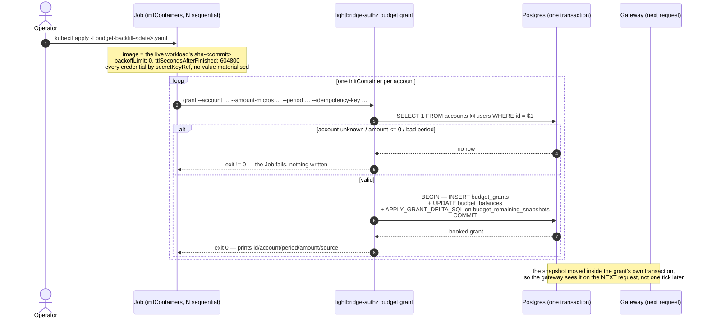
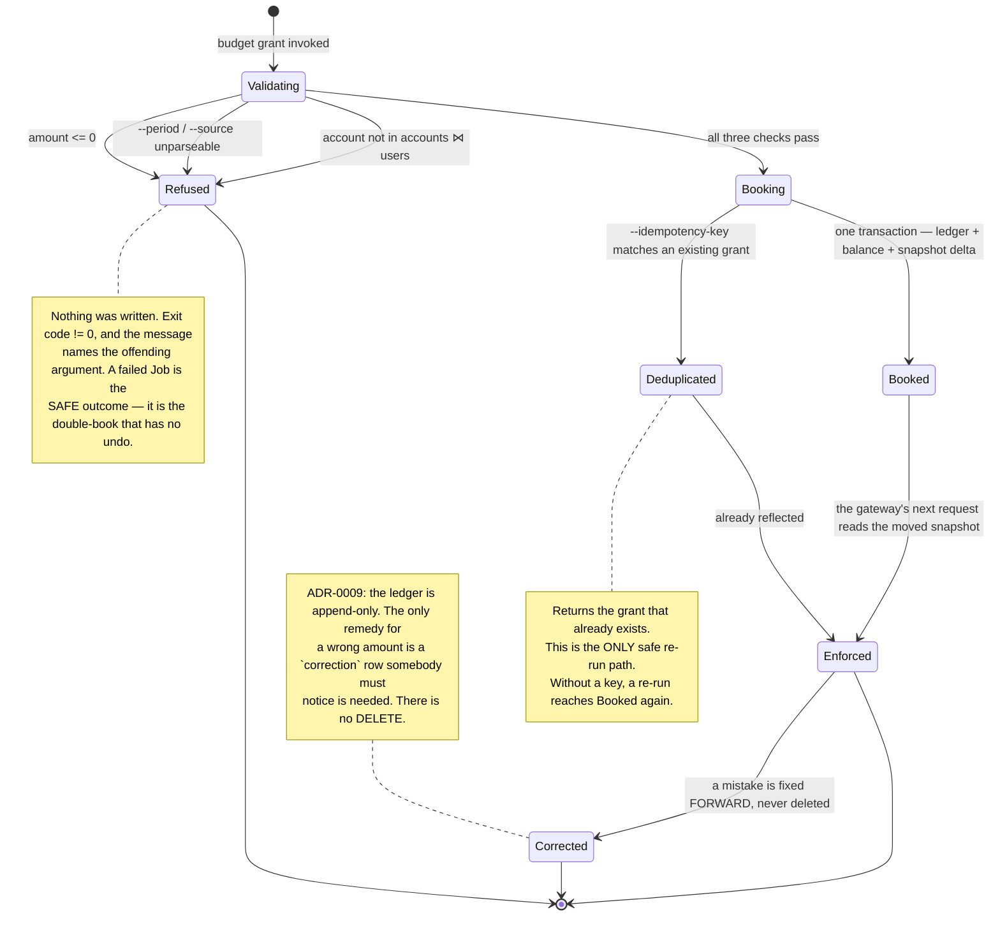

# `lightbridge-authz budget grant` — booking a grant without a browser

The operator surface for putting money into one account's ledger from a Job or a `kubectl exec`,
with **no server, no bearer token and no raw SQL**. Added in
[#695](https://github.com/ADORSYS-GIS/lightbridge-authz/pull/695) (`b0b7904`) and first used the
same evening to backfill seven production accounts — see
[ADR-0034 §15.7](./adr/0034-dynamic-budget-limiter.md#157-operational-record--enforcing-in-production-since-2026-09-04).

Read this beside, not instead of:

- [`docs/rbac.md` → Bootstrap runbook](./rbac.md#bootstrap-runbook-the-first-admin) — the same
  argument, applied to platform roles rather than to money. This command is its sibling.
- [ADR-0009](./adr/0009-budget-grants-are-an-immutable-ledger.md) — why the ledger is append-only
  and why nothing here ever writes `budget_balances`.
- [`docs/runbooks/budget-remaining-snapshot.md`](./runbooks/budget-remaining-snapshot.md) — what a
  grant does to the gateway's view of the account, and how fast.

---

## Why a CLI when `grantBudget` already exists

`grantBudget` (`authz.cstack`) is the normal path, and this command delegates to the **same**
`BudgetRepo::grant` transaction it does. What the RPC cannot do is run unattended:

- its `@allow` requires `auth().permBudgetGrant`, which comes from a platform role on a **human**
  subject;
- [ADR-0030](./adr/0030-client-credentials-is-a-first-class-authz-idp-grant.md) is explicit that a
  `client_credentials` token mints `sub = "svc:<client_id>"`, carries **no** `roles` claim, and
  therefore holds zero permissions against every RPC op-id.

So the service-credential pattern a Job would use has no credential that can call it. The CLI adds a
**caller** to the domain layer, not a second writer. It is emphatically not a licence to
`UPDATE budget_balances` — that is exactly what ADR-0009 exists to forbid, and what a hand-written
`INSERT` would silently desynchronise from the ADR-0034 §15 snapshot.

> **Never write the ledger with raw SQL.** One grant is three coupled writes in one transaction —
> the `budget_grants` row, the `budget_balances` projection, and the
> `budget_remaining_snapshots` delta that the gateway reads on the very next request. A `psql`
> `INSERT` performs the first and skips the other two: the console and the limiter then disagree
> about the same account's money, and nothing is red anywhere.

---

## The command

```bash
lightbridge-authz budget --config-path /etc/lightbridge/config.yaml grant \
  --account <accounts.id> \
  --amount-micros 8000000 \
  --period 2026-09 \
  --source automatic \
  --reason "why this money exists" \
  --idempotency-key budget-backfill-2026-09-<accounts.id>
```

On success it prints one line and exits `0`:

```
granted id=<cuid2> account=<id> period=2026-09 amount_micros=8000000 source=automatic
```

| Flag | Required | Meaning |
|---|---|---|
| `--account` | yes | The **budget** account id — `budget_grants.budget_account_id`, i.e. an `accounts.id`. |
| `--amount-micros` | yes | Integer micro-USD, **positive**. No default: the amount an account receives is a decision, not something to inherit. |
| `--period` | yes | `YYYY-MM`, UTC. **No "current month" default** — the month a grant lands in is exactly what an operator running this at 23:58 UTC must state rather than inherit from the clock. |
| `--source` | no (`admin`) | A `budget_grants.source` variant. `admin` = an operator did this. Pass `automatic` when the grant **stands in for a schedule run**, so `budget_balances` buckets it the way that schedule would have. |
| `--reason` | no | Recorded on the row. Write it down — that is most of what an append-only ledger is for. |
| `--idempotency-key` | no | See below. Supply it for anything retryable, which is every Job. |

### What it refuses, before writing anything

| Refusal | Why |
|---|---|
| An `--account` that does not resolve through `accounts ⋈ users` | The same `known_account` predicate `GET /budget/v1/remaining` applies. A typo must not become a ledger row nothing will ever read. The error names the id — an operator reading a failed Job's log needs to know which of seven arguments was wrong. |
| `--amount-micros <= 0` | Only a `correction` may be negative (`budget_grants_amount_sign_chk`), and booking one is the reset scheduler's job. |
| An unparseable `--period` or `--source` | Fail before the transaction, not inside it. |

Every failure exits non-zero, so a Job reporting success really did write the row.

### Idempotency

`--idempotency-key` makes a re-run **return the grant that already exists** instead of booking a
second one. Without it, a re-run books again — both behaviours are pinned by tests
(`the_same_idempotency_key_never_books_twice`, `without_an_idempotency_key_a_rerun_books_again`), the
second one deliberately, so nobody reads the first as "safe to re-run unconditionally".

This matters more here than almost anywhere else in the repo: ADR-0009 makes the ledger append-only,
so **a double grant has no undo** — only a compensating `correction` row that somebody has to notice
is needed. Use a key that encodes the intent and the period, e.g.
`budget-backfill-2026-09-<account-id>`, so a re-applied manifest is a no-op rather than a gift.

---

## The $8-vs-$15 rule: match the operative schedule, not the policy default

**Grant the amount the live reset schedule targets, not the policy's `starting_amount_micros`.**

The reset scheduler ([ADR-0032](./adr/0032-budget-reset-schedules.md)) in `mode: reset` computes
`delta = target − remaining` and books that difference. So if the operative schedule targets $8 and
you grant $15, the next run books a **negative `correction` row** for −$7 and claws it back. The
account is not better funded; the ledger just acquires a correction nobody asked for, and the
account's history stops being readable at a glance.

Worked example, 2026-09-04: the live schedule was `"Refill $8"` — `scope billing_plan=free`,
cadence `weekly`, `mode reset`, `amount_micros 8000000`, `next_run_at 2026-09-07`. ADR-0015's policy
`starting_amount_micros` was $15. The seven backfilled accounts were granted **$8 with
`--source automatic`**, which made the 2026-09-07 run a no-op for five of them (`delta = 0`, and a
zero row is rejected by `budget_grants_amount_sign_chk` so nothing is written) and a small top-up for
the two with spend. **No correction rows.** A $15 grant would have produced seven.

Before you pick a number:

1. Read the account's winning schedule — `getEffectiveResetSchedule`, gated at `budget:read`, not at
   `budget:schedule-manage`.
2. If it is in `mode: reset`, grant **its** `amount_micros` and pass `--source automatic`.
3. If no schedule covers the account, the policy default is the right number and `--source admin`
   is the honest label.

---

## The Job pattern

Same shape as the `rbac grant` bootstrap Job: the **live workload's own image**, config and
credentials by `secretKeyRef` only, and no shell anywhere.





Four properties of that Job that are not incidental:

- **Sequential `initContainers`, not a shell loop.** The runtime image is distroless: there is no
  shell to loop in. One `initContainer` per account also means a failure stops at the account that
  failed, with its own log.
- **`backoffLimit: 0`.** A retried Job re-runs every grant. That is safe only because of
  `--idempotency-key`, and even so the correct response to a failure is to read the log, not to let
  Kubernetes try again.
- **The image is the live workload's `sha-<commit>` tag**, so the ledger write is performed by
  exactly the code that is serving traffic. Check the tag exists before you write the manifest — a
  cancelled `main` CI run publishes no image for its commit
  ([release-and-rollout.md Step 1](./runbooks/release-and-rollout.md#step-1--did-a-ci-run-for-this-commit-survive)).
- **`ttlSecondsAfterFinished`** so the record of the run survives long enough to be read, and then
  goes away on its own.

---

## Verifying a grant landed

Do not reach for `GET /budget/v1/remaining?fresh=true` from outside the cluster: a NetworkPolicy
restricts that listener to Authorino, and weakening it for a read is not worth it. Recompute the
same arithmetic from both authoritative sources instead, which is a **stronger** check than asking
the endpoint that stores the answer:

- **ceiling** — `RemainingService::effective_balance`'s expiry/revocation-aware sum over
  `budget_grants`;
- **spend** — `usage_events` for the period.

If both match the stored snapshot field for field, the snapshot is not merely self-consistent; it
agrees with a live recompute. That is how the 2026-09-04 backfill was verified
([#695 evidence comment](https://github.com/ADORSYS-GIS/lightbridge-authz/pull/695#issuecomment-5545535000)).

## Security posture, stated plainly

- **Not a privilege escalation — a different trust root.** Anyone who can run this already holds the
  database password and could write `budget_grants` by hand. The command's value is that they no
  longer have to.
- **Not reachable over the network.** No listener, no route, no RPC registration. Reaching it means
  a Job or an exec with the DB secret mounted — the same bar `migrate` and `rbac grant` sit behind.
- **Prints no secret.** Only the booked grant's id, account, period, amount and source.
