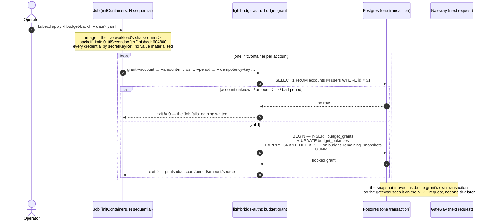
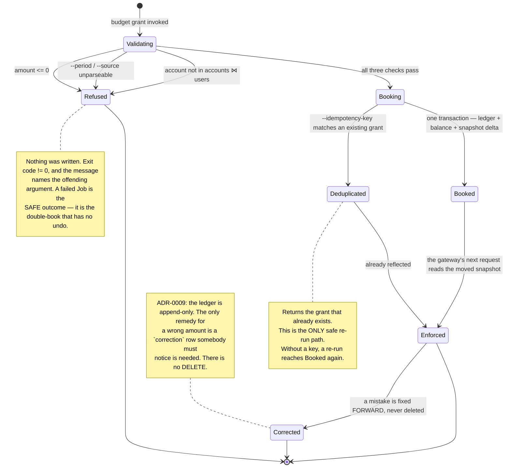
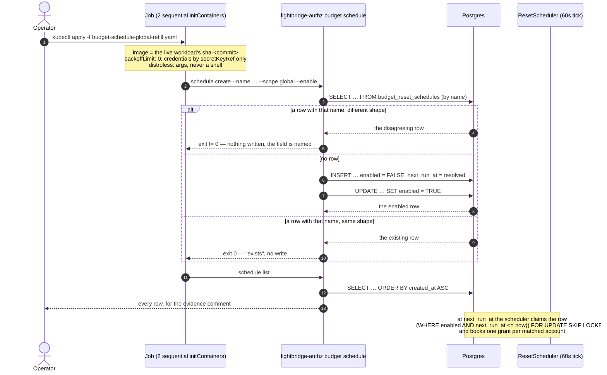
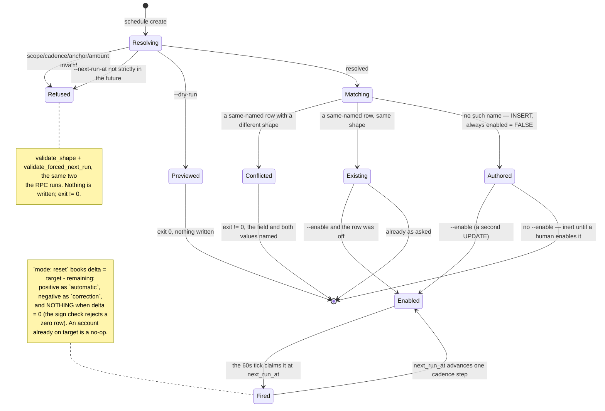

# `lightbridge-authz budget` — moving money, and the rules that move it, without a browser

The operator surface for putting money into one account's ledger from a Job or a `kubectl exec`,
with **no server, no bearer token and no raw SQL**. Added in
[#695](https://github.com/ADORSYS-GIS/lightbridge-authz/pull/695) (`b0b7904`) and first used the
same evening to backfill seven production accounts — see
[ADR-0034 §15.7](./adr/0034-dynamic-budget-limiter.md#157-operational-record--enforcing-in-production-since-2026-09-04).

> **Since [#697](https://github.com/ADORSYS-GIS/lightbridge-authz/issues/697), this command is for
> LEGACY accounts and operator repairs only.** Account creation now books its own starting grant —
> one `automatic` grant for the current period, worth what `effective_schedule(account)` would
> reset the account to, idempotent on `budget-start-<period>-<account id>` — so no account created
> after that change needs a backfill. See
> [ADR-0015 Decision 9](./adr/0015-refill-amounts-are-admin-configured-policy-ranges.md#amendment-2026-09-05--decision-9-the-starting-grant-is-booked-at-account-creation).
> What is still this command's job: accounts created before it, an account whose creation-time
> booking failed (the handler logs `error!` and returns the account rather than orphaning a second
> one — reuse the SAME `budget-start-<period>-<id>` key to repair it exactly once), and any
> deliberate operator grant.

Two commands live here:

| Command | Writes | Read |
|---|---|---|
| `budget grant` | one `budget_grants` row for **one** account | this page, top to bottom |
| `budget schedule create` / `list` | one `budget_reset_schedules` row, governing **many** accounts | [the schedule section](#budget-schedule--authoring-the-rule-instead-of-the-money) |

Read this beside, not instead of:

- [`docs/rbac.md` → Bootstrap runbook](./rbac.md#bootstrap-runbook-the-first-admin) — the same
  argument, applied to platform roles rather than to money. This command is its sibling.
- [ADR-0009](./adr/0009-budget-grants-are-an-immutable-ledger.md) — why the ledger is append-only
  and why nothing here ever writes `budget_balances`.
- [`docs/runbooks/budget-remaining-snapshot.md`](./runbooks/budget-remaining-snapshot.md) — what a
  grant does to the gateway's view of the account, and how fast.

---

## Why a CLI when `grantBudget` already exists

`grantBudget` (`authz.cstack`) is the normal path, and this command delegates to the **same**
`BudgetRepo::grant` transaction it does. What the RPC cannot do is run unattended:

- its `@allow` requires `auth().permBudgetGrant`, which comes from a platform role on a **human**
  subject;
- [ADR-0030](./adr/0030-client-credentials-is-a-first-class-authz-idp-grant.md) is explicit that a
  `client_credentials` token mints `sub = "svc:<client_id>"`, carries **no** `roles` claim, and
  therefore holds zero permissions against every RPC op-id.

So the service-credential pattern a Job would use has no credential that can call it. The CLI adds a
**caller** to the domain layer, not a second writer. It is emphatically not a licence to
`UPDATE budget_balances` — that is exactly what ADR-0009 exists to forbid, and what a hand-written
`INSERT` would silently desynchronise from the ADR-0034 §15 snapshot.

> **Never write the ledger with raw SQL.** One grant is three coupled writes in one transaction —
> the `budget_grants` row, the `budget_balances` projection, and the
> `budget_remaining_snapshots` delta that the gateway reads on the very next request. A `psql`
> `INSERT` performs the first and skips the other two: the console and the limiter then disagree
> about the same account's money, and nothing is red anywhere.

---

## The command

```bash
lightbridge-authz budget --config-path /etc/lightbridge/config.yaml grant \
  --account <accounts.id> \
  --amount-micros 8000000 \
  --period 2026-09 \
  --source automatic \
  --reason "why this money exists" \
  --idempotency-key budget-backfill-2026-09-<accounts.id>
```

On success it prints one line and exits `0`:

```
granted id=<cuid2> account=<id> period=2026-09 amount_micros=8000000 source=automatic
```

| Flag | Required | Meaning |
|---|---|---|
| `--account` | yes | The **budget** account id — `budget_grants.budget_account_id`, i.e. an `accounts.id`. |
| `--amount-micros` | yes | Integer micro-USD, **positive**. No default: the amount an account receives is a decision, not something to inherit. |
| `--period` | yes | `YYYY-MM`, UTC. **No "current month" default** — the month a grant lands in is exactly what an operator running this at 23:58 UTC must state rather than inherit from the clock. |
| `--source` | no (`admin`) | A `budget_grants.source` variant. `admin` = an operator did this. Pass `automatic` when the grant **stands in for a schedule run**, so `budget_balances` buckets it the way that schedule would have. |
| `--reason` | no | Recorded on the row. Write it down — that is most of what an append-only ledger is for. |
| `--idempotency-key` | no | See below. Supply it for anything retryable, which is every Job. |

### What it refuses, before writing anything

| Refusal | Why |
|---|---|
| An `--account` that does not resolve through `accounts ⋈ users` | The same `known_account` predicate `GET /budget/v1/remaining` applies. A typo must not become a ledger row nothing will ever read. The error names the id — an operator reading a failed Job's log needs to know which of seven arguments was wrong. |
| `--amount-micros <= 0` | Only a `correction` may be negative (`budget_grants_amount_sign_chk`), and booking one is the reset scheduler's job. |
| An unparseable `--period` or `--source` | Fail before the transaction, not inside it. |

Every failure exits non-zero, so a Job reporting success really did write the row.

### Idempotency

`--idempotency-key` makes a re-run **return the grant that already exists** instead of booking a
second one. Without it, a re-run books again — both behaviours are pinned by tests
(`the_same_idempotency_key_never_books_twice`, `without_an_idempotency_key_a_rerun_books_again`), the
second one deliberately, so nobody reads the first as "safe to re-run unconditionally".

This matters more here than almost anywhere else in the repo: ADR-0009 makes the ledger append-only,
so **a double grant has no undo** — only a compensating `correction` row that somebody has to notice
is needed. Use a key that encodes the intent and the period, e.g.
`budget-backfill-2026-09-<account-id>`, so a re-applied manifest is a no-op rather than a gift.

---

## The $8-vs-$15 rule: match the operative schedule, not the policy default

**Grant the amount the live reset schedule targets, not the policy's `starting_amount_micros`.**

The reset scheduler ([ADR-0032](./adr/0032-budget-reset-schedules.md)) in `mode: reset` computes
`delta = target − remaining` and books that difference. So if the operative schedule targets $8 and
you grant $15, the next run books a **negative `correction` row** for −$7 and claws it back. The
account is not better funded; the ledger just acquires a correction nobody asked for, and the
account's history stops being readable at a glance.

Worked example, 2026-09-04: the live schedule was `"Refill $8"` — `scope billing_plan=free`,
cadence `weekly`, `mode reset`, `amount_micros 8000000`, `next_run_at 2026-09-07`. ADR-0015's policy
`starting_amount_micros` was $15. The seven backfilled accounts were granted **$8 with
`--source automatic`**, which made the 2026-09-07 run a no-op for five of them (`delta = 0`, and a
zero row is rejected by `budget_grants_amount_sign_chk` so nothing is written) and a small top-up for
the two with spend. **No correction rows.** A $15 grant would have produced seven.

Before you pick a number:

1. Read the account's winning schedule — `getEffectiveResetSchedule`, gated at `budget:read`, not at
   `budget:schedule-manage`.
2. If it is in `mode: reset`, grant **its** `amount_micros` and pass `--source automatic`.
3. If no schedule covers the account, the policy default is the right number and `--source admin`
   is the honest label.

The creation-time starting grant applies the *same* three steps in code
(`lightbridge_authz_budget::starting_grant`), so a hand-run grant and an automatic one can never
disagree about the amount. If you find yourself picking a different number here than
`getEffectiveResetSchedule` reports, one of the two is wrong — settle that before writing.

> **Amendment, 2026-09-05 ([#702](https://github.com/ADORSYS-GIS/lightbridge-authz/issues/702)).**
> Step 3 — "if no schedule covers the account, the policy default is the right number" — is now
> **unreachable in production**, because a `global`-scoped `mode: reset` schedule at $8
> (`"Global refill $8"`, weekly, ISO weekday 1, `next_run_at` on the same 2026-09-07 tick as
> `"Refill $8"`) covers every account from its first second. That closes the gap this section
> warns about at its root: a brand-new account has no `billing_plan`, so the plan-scoped schedule
> could not cover it and $15 fired, to be clawed back by a −$7 `correction` the first window after
> it acquired a free-plan project. The policy `starting_amount_micros` is deliberately **left at
> $15**: it is the answer to "what if there is no schedule at all", which is the state the estate
> returns to the moment somebody disables the global row, and lowering it would also lower the
> `fail_closed_floor_micros <= starting_amount_micros` headroom `rule_data::validate` enforces.
> See [`budget schedule`](#budget-schedule--authoring-the-rule-instead-of-the-money) below.

---

## The Job pattern

Same shape as the `rbac grant` bootstrap Job: the **live workload's own image**, config and
credentials by `secretKeyRef` only, and no shell anywhere.





Four properties of that Job that are not incidental:

- **Sequential `initContainers`, not a shell loop.** The runtime image is distroless: there is no
  shell to loop in. One `initContainer` per account also means a failure stops at the account that
  failed, with its own log.
- **`backoffLimit: 0`.** A retried Job re-runs every grant. That is safe only because of
  `--idempotency-key`, and even so the correct response to a failure is to read the log, not to let
  Kubernetes try again.
- **The image is the live workload's `sha-<commit>` tag**, so the ledger write is performed by
  exactly the code that is serving traffic. Check the tag exists before you write the manifest — a
  cancelled `main` CI run publishes no image for its commit
  ([release-and-rollout.md Step 1](./runbooks/release-and-rollout.md#step-1--did-a-ci-run-for-this-commit-survive)).
- **`ttlSecondsAfterFinished`** so the record of the run survives long enough to be read, and then
  goes away on its own.

---

## `budget schedule` — authoring the rule instead of the money

Added in [#702](https://github.com/ADORSYS-GIS/lightbridge-authz/issues/702). Same argument as
`grant`, one level up: `createBudgetResetSchedule` and `updateBudgetResetSchedule` are
`@allow`-gated on `auth().permBudgetScheduleManage`, a permission that reaches a subject through a
platform role on a **human** identity, and [ADR-0030](./adr/0030-client-credentials-is-a-first-class-authz-idp-grant.md)
gives a `client_credentials` service token no `roles` claim at all. A Job has no credential that
can call either procedure — so the CLI adds a caller to `ResetScheduleRepo`, never a second writer.
Same `validate_shape`, same window derivation (`reset_schedule_resolve::resolve_next_run_at`, which
`ResetScheduleRepo::create` itself calls), same `INSERT`/`UPDATE`.

```bash
lightbridge-authz budget --config-path /etc/lightbridge/config.yaml schedule create \
  --name 'Global refill $8' \
  --scope global \
  --cadence weekly --anchor 1 --run-at-utc 00:00 \
  --amount-micros 8000000 \
  --mode reset \
  --next-run-at 2026-09-07T00:00:00Z \
  --enable
```

```
created id=<cuid2> name="Global refill $8" scope=global scope_id=- cadence=weekly anchor=1 run_at_utc=00:00 amount_micros=8000000 mode=reset enabled=false next_run_at=2026-09-07T00:00:00+00:00 last_run_at=-
enabled id=<cuid2> name="Global refill $8" scope=global scope_id=- cadence=weekly anchor=1 run_at_utc=00:00 amount_micros=8000000 mode=reset enabled=true  next_run_at=2026-09-07T00:00:00+00:00 last_run_at=-
```

**Two lines, not one, and that is the contract.** The domain layer creates every schedule
**disabled** (ADR-0032 D8, and the migration's own `DEFAULT FALSE`): a misconfigured `global` row
grants across the entire estate, so authoring and enabling are separate writes. `--enable` performs
the second one explicitly, through the same `ResetScheduleRepo::update` the RPC uses. Omit it and
the row sits inert until a human enables it in the console.

`budget schedule list` prints every row, enabled or not, oldest first — the read-only check to run
before and after. It writes nothing.

| Flag | Required | Meaning |
|---|---|---|
| `--name` | yes | Also the **idempotency key** on this path (see below). |
| `--scope` | yes | `global` \| `billing_plan` \| `account`. |
| `--scope-id` | for the two scoped kinds | A `projects.billing_plan` value, or an `accounts.id`. Must be **absent** for `global`; supplying it is refused. |
| `--cadence` | yes | `daily` \| `weekly` \| `monthly`. |
| `--anchor` | for `weekly`/`monthly` | ISO weekday `1..=7` (Monday = 1), or day-of-month `1..=28` (28, so no month silently skips). Absent for `daily`. |
| `--run-at-utc` | no (`00:00`) | `HH:MM`, UTC. |
| `--amount-micros` | yes | Integer micro-USD. `reset` clamps **to** it (`0` is meaningful); `top_up` adds it and must be positive. |
| `--mode` | yes | `reset` \| `top_up`. |
| `--next-run-at` | no | RFC 3339, strictly in the future. Forces the **first** window instead of deriving it from the cadence, then the schedule returns to its own grid. |
| `--enable` | no | The explicit second write. |
| `--dry-run` | no | Resolve and print; write nothing. |

### Idempotency is on `--name`, and a disagreement is a refusal

`budget_reset_schedules` has no `idempotency_key` column — a schedule is a configured policy, not
a ledger entry — so the **name** is the natural key here. Three outcomes, all exit-`0`-or-not:

- **No row with that name** → create (disabled), then enable if asked. Prints `created` (+ `enabled`).
- **A row with that name and the same shape** → prints `exists`, writes nothing, converges `enabled`
  only if `--enable` was passed and the row is off. A retried Job and a re-applied manifest land here.
- **A row with that name and a *different* shape** → **exits non-zero**, naming the field and both
  values (`amount_micros is 8000000, wanted 15000000`). "Already done" must mean the same thing was
  done, or the check is theatre. Nothing is rewritten: `create` never mutates an existing schedule's
  scope, cadence, amount or mode. Changing one of those is a console/RPC edit, deliberately.

The shape compared is scope, scope id, cadence, anchor, run time, amount and mode — not
`enabled`, `next_run_at` or `last_run_at`, which are state rather than configuration.

### Precedence: what a `global` schedule does and does not take over

`account > billing_plan > global`, ties broken by the oldest enabled schedule
(`effective_schedule::winning_schedule`). So adding a `global` row is **additive at the bottom**:

- an account on the `free` plan keeps being governed by `"Refill $8"`
  (`scope billing_plan=free`) — the global row never displaces it;
- an account with **no project** has no `billing_plan` at all (a plan reaches an account through
  `projects.billing_plan` and `api_keys.billing_plan`; there is no `accounts.billing_plan` column),
  so the global row is what covers it — from its first second, which is the point.

Both halves are pinned by `starting_grant_tests::the_plan_schedule_still_wins_and_global_is_only_the_fallback`,
deliberately with two *different* amounts so the test cannot pass by coincidence.

The consequence for [ADR-0015 Decision 5](./adr/0015-refill-amounts-are-admin-configured-policy-ranges.md):
once an enabled `global` schedule exists, `effective_schedule` returns `Some` for **every** account,
so `PolicyEngine::starting_amount_micros` — whose only production reader is
`starting_grant.rs`'s `StartingAmount::PolicyDefault` branch — becomes unreachable. It stays in the
policy as the answer to "what if there is no schedule at all", which is exactly the state the estate
returns to if somebody disables the global row.

### The two-step, drawn





### What it does not do

- **It never deletes or re-shapes a schedule.** Both are console/RPC operations with a human behind
  them; a Job that could silently re-price the estate's weekly refill is a worse tool than no tool.
- **It never writes `budget_grants`.** Enabling a schedule does not backfill anything — the first
  money moves at `next_run_at`. Repairing an account *now* is `budget grant`, above.
- **It prints no secret.** A schedule row carries none.

## Verifying a grant landed

Do not reach for `GET /budget/v1/remaining?fresh=true` from outside the cluster: a NetworkPolicy
restricts that listener to Authorino, and weakening it for a read is not worth it. Recompute the
same arithmetic from both authoritative sources instead, which is a **stronger** check than asking
the endpoint that stores the answer:

- **ceiling** — `RemainingService::effective_balance`'s expiry/revocation-aware sum over
  `budget_grants`;
- **spend** — `usage_events` for the period.

If both match the stored snapshot field for field, the snapshot is not merely self-consistent; it
agrees with a live recompute. That is how the 2026-09-04 backfill was verified
([#695 evidence comment](https://github.com/ADORSYS-GIS/lightbridge-authz/pull/695#issuecomment-5545535000)).

## Security posture, stated plainly

- **Not a privilege escalation — a different trust root.** Anyone who can run this already holds the
  database password and could write `budget_grants` by hand. The command's value is that they no
  longer have to.
- **Not reachable over the network.** No listener, no route, no RPC registration. Reaching it means
  a Job or an exec with the DB secret mounted — the same bar `migrate` and `rbac grant` sit behind.
- **Prints no secret.** Only the booked grant's id, account, period, amount and source.
