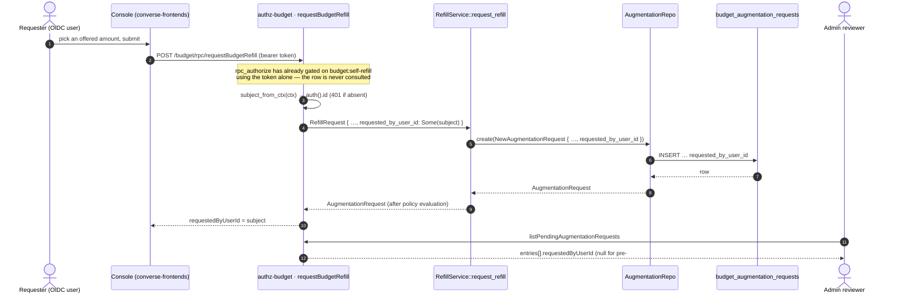

# Budget refill UI contract

Audience: whoever picks up the `lightbridge-ss` (converse-frontends) side of Story #191. This repo
(`lightbridge-authz`) owns the RPC surface; the self-service refill UI lives in a different repo and
this repo's PRs cannot produce the screenshot evidence #191's own Verification section requires — see
that story for the full picture. This doc orients a frontend engineer on the RPC shapes and the
behaviors that need explicit copy, without duplicating the schema.

**⚠️ Breaking change: these six RPCs, and every other `budget:*`-gated procedure, moved off
`authz-api` onto a separate `authz-budget` service, mounted under a fixed `/budget` path prefix
(`POST /budget/rpc/{op_id}` instead of `POST /rpc/{op_id}`) — see
[`docs/architecture/budget.md`](./architecture/budget.md#service-boundary-authz-budget-hard-cutover).
This is a hard cutover: `authz-api` no longer serves these op-ids at all. A generated client
pointed at `authz-api`'s base URL will get `404` on every one of them. `converse-frontends` needs a
second cratestack client instance configured with `authz-budget`'s base URL + `/budget` prefix —
see the tracking issue filed in `ADORSYS-GIS/converse-frontends` for the exact URLs.**

Source of truth: `crates/lightbridge-authz-api/schema/authz.cstack` (search for
`AugmentationRequest`, `AugmentationRequestPage`, `requestBudgetRefill`,
`getMyBudgetRefillLadder`, `MyBudgetRefillLadder`, `listPendingAugmentationRequests`,
`approveAugmentationRequest`, `rejectAugmentationRequest`, `listMyAugmentationRequests`) is the
authoritative field list. This doc explains what those fields *mean*; if it and the schema ever
disagree, the schema wins.

## The six RPCs

All six require a bearer token (OIDC user session token). None accept an "act on behalf of"
parameter — the reviewing/requesting identity is always the authenticated caller.

### `requestBudgetRefill` — self-service ask for more budget

```
mutation requestBudgetRefill(args: {
  budgetAccountId: string
  accountId: string
  projectId?: string
  period: string                 // "YYYY-MM", the calendar month being refilled
  idempotencyKey?: string
  requestedAmountMicros: string  // required; must be a member of getMyBudgetRefillLadder's
                                  // allowedAmountsMicros for this same period
}): AugmentationRequest
```

- `budgetAccountId` / `accountId`: today these are always the same value (the caller's own account
  — see the schema's own doc comment for why two separate-looking fields both carry it). Pass the
  signed-in user's account id for both.
- `period`: the calendar month the refill applies to, e.g. `"2026-08"`. Almost always "the current
  month" from the UI's perspective.
- `requestedAmountMicros`: the caller-chosen amount, as a micro-USD decimal string (ADR-0015). Must
  be one of the values `getMyBudgetRefillLadder` returns in `allowedAmountsMicros`; an amount
  outside that set is refused with a `BadRequest` before an `AugmentationRequest` row is ever
  created or the policy engine is ever consulted. **Required** — call `getMyBudgetRefillLadder`
  first to populate the picker this value comes from.
- `idempotencyKey`: **generate and send one on every submit.** The client, not the server, owns
  idempotency keys here — a double-click or a retried request with the same key returns the
  original outcome instead of being evaluated twice. Use a fresh UUID/cuid per logical user action
  (one click = one key), not a fixed constant.
- Returns an `AugmentationRequest` — see "Response shape" below for what to render from it.
- The authenticated caller is recorded on the row as `requestedByUserId` — see "The requester"
  below.

Requires the caller to hold `budget:self-refill`. A caller who lacks it gets a `403`; the UI should
not normally let a user reach this action if their role doesn't carry it, but should still handle a
`403` gracefully (generic "you don't have permission" messaging) rather than assuming it can't
happen.

### `getMyBudgetRefillLadder` — the amounts currently on offer (read), before submitting

```
procedure getMyBudgetRefillLadder(args: {
  period: string        // "YYYY-MM", the calendar month to preview
}): MyBudgetRefillLadder
```

```
type MyBudgetRefillLadder {
  budgetAccountId: string
  period: string
  allowedAmountsMicros: string[]   // strictly ascending micro-USD decimal strings, e.g.
                                    // ["6000000", "15000000", "30000000"] for $6/$15/$30
}
```

**Exists so a UI can render an amount picker without hand-maintaining its own copy of the offered
set.** `allowedAmountsMicros` is the exact set `requestBudgetRefill.requestedAmountMicros` will be
checked against for this `period` — pass one of these values back, unmodified, as the mutation's
`requestedAmountMicros`.

No target field — always the caller's own budget account, the same self-scoping guarantee
`getMyBudgetBalance`/`listMyBudgetGrants` already give (`crates/lightbridge-authz-rest/src/lib.rs`'s
`get_my_budget_refill_ladder` derives `budgetAccountId` from the authenticated subject, never a
caller-supplied field). Requires `budget:self-refill` — the SAME permission `requestBudgetRefill`
requires, not the broader `budget:read-own` the balance/grant-history reads use, since this exists
to serve one screen alongside that mutation rather than general budget visibility.

**Deliberately does not preview a policy decision.** It calls no policy engine and returns no
reason codes or cap prediction — `allowedAmountsMicros` describes what `request_refill` will
*accept as a candidate amount*, not what it is guaranteed to *grant*. Policy can still route an
actual submission to `pending_review`, cap it, or (much less commonly) deny it — see
`requestBudgetRefill`'s response and the Status values table below for what a real submission can
come back as. **UI copy must not imply this preview is a guarantee of the outcome.**

**⚠️ Also does not describe live enforcement.** A successful refill changes the ledger; whether
that changes anything a request gateway actually enforces is a separate, currently-open gap — see
"Today, a refill has no gateway effect at all" below. A UI showing this picker should disclose that
gap, not just the offered amounts, or a caller who refills and sees no change in what they can
actually do may reasonably conclude the product is broken.

**Historical note:** before #387, this response also carried `currentTier`/`currentTierAmountMicros`/
`nextTier`/`nextTierAmountMicros`/`ladder` — a snapshot of the pre-ADR-0015 `BudgetTier` ladder,
kept additive alongside `allowedAmountsMicros` only while a frontend consumer still read them.
Those fields, and the tier-progression concept behind them ("you are here, this is next"), no
longer exist: ADR-0015's amounts are a flat, admin-configured set with no rung ordering, so there
is nothing left to preview a "next" position for.

### `listPendingAugmentationRequests` — the admin review queue (read)

```
procedure listPendingAugmentationRequests(args: {
  budgetAccountId?: string
  after?: string          // cursor: an ISO-8601 `createdAt`, from a previous call's `nextCursor`
  limit?: number           // defaults to 20, clamped to a max of 50
}): AugmentationRequestPage   // { entries: AugmentationRequest[], nextCursor?: string }
```

Omit `budgetAccountId` (or pass `null`) for the whole cross-account queue (an admin's global view);
pass a specific account id to scope to one account. Requires `budget:review`.

**Paginated, oldest-first** (⚠️ this queue keeps its pre-existing order — it is a FIFO queue, not a
ledger, so the longest-waiting request surfaces first, unchanged by adding pagination). Omitting
`after`/`limit` entirely reproduces the exact pre-pagination "whole queue from the start" behavior,
just capped to one page. To fetch the next page, pass the previous response's `nextCursor` back as
`after`; `nextCursor` is `null`/absent once there is nothing further. Note the cursor field is
`after`, not `before` — deliberately different from `listMyAugmentationRequests` below, because this
list walks oldest-to-newest while that one walks newest-to-oldest.

### `approveAugmentationRequest` — approve a queued request

```
mutation approveAugmentationRequest(args: {
  requestId: string
}): AugmentationRequest
```

Grants the requested amount and returns the updated row. Requires `budget:review`. Idempotent
against retries/double-clicks and safe against a concurrent reject on the same request (server-side
locking — the UI does not need to do anything special here beyond normal "disable the button while
in flight" hygiene).

### `rejectAugmentationRequest` — reject a queued request

```
mutation rejectAugmentationRequest(args: {
  requestId: string
  reason: string        // required, non-empty
}): AugmentationRequest
```

`reason` is mandatory — the form must not let a reviewer submit a rejection with an empty reason
field. The server validates this too (both in the schema and at the service layer), but a
client-side check gives the reviewer immediate feedback instead of a round-trip error.

### `listMyAugmentationRequests` — the caller's own request history (read)

```
procedure listMyAugmentationRequests(args: {
  before?: string          // cursor: an ISO-8601 `createdAt`, from a previous call's `nextCursor`
  limit?: number            // defaults to 20, clamped to a max of 50
}): AugmentationRequestPage    // { entries: AugmentationRequest[], nextCursor?: string }
```

No target field at all — always the signed-in caller's own history, in **every** status
(`pending_review`, `auto_approved`, `approved`, `denied`, ...), not just the still-queued requests
`listPendingAugmentationRequests` returns. This is the "did my refill go through" screen: a user
who submitted a refill and navigated away can come back and see what happened to it, without
needing `budget:review`. Requires `budget:read-own` — the same permission `getMyBudgetBalance`/
`listMyBudgetGrants` use, granted to every default role including `lightbridge-viewer`.

**Paginated, newest-first**, matching `listMyBudgetGrants`'s own convention: pass the previous
response's `nextCursor` back as `before` to page further into the past; `nextCursor` is
`null`/absent once there is nothing further.

## Response shape: `AugmentationRequest`

The fields a UI actually needs to render, in plain terms (the schema has the exhaustive list):

| Field | Meaning for the UI |
| --- | --- |
| `status` | See "Status values" below — drives which screen/message to show. |
| `requestedTier` | A best-effort `BudgetTier` label for the requested amount, e.g. `"b-30"` — falls back to `"b-15"` for an amount (e.g. ADR-0015's $6 floor) the enum has no exact variant for. Not usually shown raw to a user; `requestedAmountMicros` is the authoritative value, this is a display convenience only. |
| `requestedAmountMicros` | The dollar amount as a decimal string in **micro-USD** (divide by 1,000,000 for dollars). String, not a number — see "Why amounts are strings" below. |
| `approvedAmountMicros` | Set only once a grant happened (`auto_approved` / `partially_approved` / `approved`); same micro-USD string encoding. `null` otherwise. |
| `policyReasonCodes` | Machine-readable reason codes (e.g. `"within_unaided_allowance"`, `"unaided_allowance_exhausted"`, `"policy_engine_unavailable"`). Useful for debugging/support tooling; not designed to be shown to an end user verbatim — write your own copy per code, or fall back to a generic message for codes you don't have copy for yet. An amount outside `allowedAmountsMicros` never reaches this field at all — it is refused as a request-level `BadRequest` before any `AugmentationRequest` row exists. |
| `rejectionReason` | Present only when `status == "denied"` **and a human rejected it** (as opposed to a policy denial — see below). Always show this verbatim when present; see "Rejection reasons" below. |
| `grantId` | Present when a grant was actually issued. Not usually shown directly, but its presence/absence is a reliable way to tell "did this produce money" apart from `status` alone if you want a belt-and-suspenders check. |
| `requestedByUserId` | **Who asked.** The token subject of the caller that submitted the request — the counterpart to `reviewedBy` (who decided it). Nullable, permanently: see "The requester" below before rendering it. |
| `createdAt` / `reviewedAt` | Timestamps for queue/history views. |

## The requester (`requestedByUserId`)

`AugmentationRequest.requestedByUserId` is the subject of the authenticated caller at the moment
`requestBudgetRefill` ran. It is stamped server-side from the token; there is no client-supplied
requester field and there will not be one, so the value always means "this person asked", never
"this person was named as the asker".

Three rules for rendering it:

1. **`null` means unknown, not "nobody" and not the account.** Requests created before this field
   existed carry `null` and nothing can reconstruct them. Render an explicit sentinel
   ("Unknown — requested before this was recorded") rather than a blank cell, and never fall back
   to the account id: showing the account in a "Requester" column is exactly the confusion the
   earlier console column was removed for.
2. **It is a raw subject id, not a display name.** Resolving it to a name/email is a separate
   admin-only batch RPC (`resolveUserProfiles`, story A2) reading `federated_identities`; until a
   screen calls it, show the id truncated or nothing at all — not a fabricated label.
3. **It is not `reviewedBy`.** The requester is set at creation and never changes; the reviewer is
   set only when a human decides a `pending_review` request. Both can be present on the same row,
   and they are usually different people. An auto-approved request has a requester and no reviewer.

An idempotent retry (same `idempotencyKey`) returns the original row, so the requester recorded is
whoever submitted first — a retry never rewrites it.

It is an **audit** field. No authorization decision reads it: who may request, review, or read is
decided from the caller's own token (`budget:self-refill` / `budget:review` / `budget:read-own`),
never from a value stored on the row. Do not build client-side gating on it either.

### Where the requester comes from



### What the field looks like over a request's lifetime

```mermaid
stateDiagram-v2
    [*] --> Unattributed: row written before #646<br/>(requested_by_user_id NULL)
    [*] --> Attributed: requestBudgetRefill<br/>(requested_by_user_id = auth().id)

    Unattributed --> Unattributed: record_decision / record_review<br/>(stays NULL — never backfilled)
    Attributed --> Attributed: record_decision / record_review<br/>(reviewed_by is written; requester untouched)

    note right of Unattributed
        Terminal by design. No source can
        reconstruct a historical requester,
        so NULL is permanent, not a to-do.
    end note
    note right of Attributed
        Write-once. There is no transition
        that changes the requester — an
        idempotent retry returns this row
        rather than re-stamping it.
    end note
```



### Why amounts are strings

`requestedAmountMicros`/`approvedAmountMicros` are decimal strings, not numbers. This is
deliberate: the generated TypeScript client types the schema's `Int` as a plain JS `number`, which
silently loses precision above 2^53 — a real risk for a micro-USD integer. Parse them with a
big-number-safe method (`BigInt(...)`, or divide as a string-aware decimal) rather than
`Number(...)` if you need arbitrary precision; for display purposes at realistic budget amounts,
`Number(...) / 1_000_000` is fine in practice, but don't round-trip the raw string through `Number`
for anything that gets sent back to an API.

## Status values and what to show

| `status` | What happened | What the UI should say |
| --- | --- | --- |
| `auto_approved` | Granted immediately, in full. | "You've been granted $X." Pair with the token-refresh-delay note below. |
| `partially_approved` | Granted, but capped below the requested tier by policy. | Same as `auto_approved`, but the granted amount (`approvedAmountMicros`) may be less than what was requested (`requestedAmountMicros`) — show the actual granted amount, not the requested one. |
| `pending_review` | Queued for a human. Not denied, not granted yet. | "Your request is under review" — explicitly NOT "denied" and NOT "granted". Avoid implying a timeline the system doesn't promise (see #191: "admins will action the queue promptly enough... if not, that's a policy problem, not an engineering one" — don't paper over a slow queue with a UI promise). |
| `denied` | Refused — either by policy or by a human reviewer. | If `rejectionReason` is present, show it verbatim (a human rejected it). If not, this was a policy-level refusal — show a clear, specific message from your own reason-code copy table (`policyReasonCodes`), not a generic "denied". |
| `approved` | A queued request was approved by a reviewer and granted. | Same messaging as `auto_approved`/`partially_approved` — from the end user's perspective these all mean "you got more budget," just via different paths. |
| `created` / `evaluating` | Transient states the RPC surface should never actually return to a caller (every procedure here only returns after evaluation/review has completed) — if you see one, treat it as unexpected and log it, don't build a screen for it. |
| `cancelled` / `expired` / `applied` | Not produced by `requestBudgetRefill`/`approveAugmentationRequest`/`rejectAugmentationRequest` (the only RPCs that write a status) — reserved for later phases (queue expiry, the Phase 6a/6b gateway-apply step). `listMyAugmentationRequests` would surface one if it ever existed, but none can today. No UI needed yet. |

## Two behaviors that will look like bugs and are not

Both are called out explicitly in #191 and must be **stated in the UI**, not just documented here.

### 1. A refill grants the full new tier, not a delta

Moving up a rung replaces the period's effective budget with the **new tier's full amount** — it
does not add to whatever was left. A user at $40-of-$50 who refills to the $100 rung has $100 for
the rest of the period, not $110 ($50 + $60 shortfall made up), and their prior $40 of spend this
period no longer counts against the new ceiling.

**UI implication:** show something like "You now have $100 for the rest of this period" — an
absolute statement — never a running total that implies addition. If you show spend-so-far
alongside the new ceiling, make clear the ceiling reset, not accumulated.

### 2. Today, a refill has no gateway effect at all — not "until the next token refresh," none

**Present-tense, as of this writing: a successful `requestBudgetRefill` changes the ledger and
nothing else.** A `grantId` on an `auto_approved`/`approved` response means the grant is
**recorded**, full stop. Nothing at the gateway reads the budget ledger — `requestBudgetRefill`
does not write `x-quota-tier`, does not touch `project_members.quota_tier` or
`projects.project_quota`, and no code path anywhere in this repo writes a budget-tier claim to
Keycloak (confirmed against `crates/lightbridge-authz-budget/src/refill.rs`,
`crates/lightbridge-authz-rest/src/lib.rs`'s `Procedures` impl, and
[`docs/governance-model-and-enforcement.md`](./governance-model-and-enforcement.md)'s "A second,
newer budget system exists and is not yet connected here" section, which states this in full: *"…
has zero effect on anything this document describes: it does not write `x-quota-tier` … and
nothing in §3's header pipeline reads from it."*). **There is no token-refresh delay to describe,
because there is no path from a grant to gateway enforcement at all yet** — describing this as "it
takes effect on your next token refresh" would be actively wrong: refreshing changes nothing, since
nothing downstream of the ledger is watching it.

**UI implication:** immediately after a successful refill, say so plainly and do not promise a
timeline for enforcement — e.g. "Granted. This increases your recorded budget; it does not change
what's enforced yet." Do not show a success state that implies the user can go spend the new amount
soon, on refresh or otherwise, and do not use language like "takes effect on your next login" —
that promises something the system does not do today and would itself generate the "it didn't
work" support ticket per #191's own risk callout, just delayed instead of immediate.

**Planned (not yet implemented) — for context, not for present-tense UI copy.** Connecting the
ledger to gateway enforcement is a two-phase, both-still-open plan:

- **Phase 6a** — re-key the enforcement `BackendTrafficPolicy` rules from the current per-plan
  rules onto the `x-budget-tier` ladder (ADR-0008). Runbook:
  [`docs/runbooks/budget-tier-rekey-cutover.md`](./runbooks/budget-tier-rekey-cutover.md).
- **Phase 6b** — write the granted tier back to Keycloak (a group attribute or similar) so it
  reaches a token's claims at all, which is the precondition for "takes effect on refresh" ever
  becoming true.

Full picture, including the "quick reference — what governs what" table showing the budget ledger's
row as not-yet-live:
[`docs/governance-model-and-enforcement.md`](./governance-model-and-enforcement.md).

## Rejection reasons must always be shown

Per #191's own implementation note: "a rejection without a visible reason turns into a support
conversation." Whenever `status == "denied"` and `rejectionReason` is non-null, surface it verbatim
to the user — don't summarize, don't truncate silently, don't hide it behind a "contact support"
link. If `rejectionReason` is null but `status == "denied"`, that's a policy-level refusal (see the
status table above) — use `policyReasonCodes` to pick an appropriate message instead.

## Paper trail

This RPC surface was built across a PR sequence in `lightbridge-authz` implementing Story #191
(epic #188):

- #213 — augmentation-request ledger and repository
- #214 — self-service refill orchestration (`RefillService`)
- #215 — admin review queue (`ReviewService`)
- the PR that added this doc — wires both into the RPC surface described above
- #646 — persists the requester (`requested_by_user_id`, migration
  `20260902000004_budget_augmentation_requests_add_requested_by.sql`) and exposes it as
  `AugmentationRequest.requestedByUserId`

If this doc doesn't answer a question you have, #191's own body (acceptance criteria,
implementation notes, the two "will look like bugs" behaviors) and the PRs above are the next place
to look — the Rust implementation and its doc comments (particularly
`crates/lightbridge-authz-budget/src/refill.rs` and `review.rs`) are the actual source of truth for
edge-case behavior this doc simplifies for a frontend audience.

## Known gap: no internal/API-key-client refusal yet

#191's acceptance criteria call for `requestBudgetRefill` to be refused for an internal/API-key
client ("refills are OIDC users only"). That refusal is **not implemented** as of this RPC surface
landing — see the PR description for the investigation and the tracking follow-up issue. This
doesn't change anything about how the UI should call these RPCs (a real end-user session token
works exactly as described above); it's called out here so nobody building against this contract
assumes that acceptance criterion is already enforced server-side.

---

## Budget reset schedules (ADR-0032, story #651)

Six more procedures on the same `authz-budget` service and the same `/budget/rpc/{op_id}` prefix.
A **reset schedule** is a standing, operator-authored rule — *"reset remaining to $2.00 every day at
00:00 UTC for every account on the `free` plan"* — that a background task in `authz-budget`
executes, writing one grant per matching budget account per window into the same append-only ledger
every other grant goes to.

Source of truth is again `crates/lightbridge-authz-api/schema/authz.cstack` (search for
`BudgetResetSchedule`, `listBudgetResetSchedules`, `createBudgetResetSchedule`,
`updateBudgetResetSchedule`, `deleteBudgetResetSchedule`, `runBudgetResetScheduleNow`,
`getEffectiveResetSchedule`); the decisions behind them are
[`docs/adr/0032-budget-reset-schedules.md`](./adr/0032-budget-reset-schedules.md).

### The procedures

| Procedure | Permission | Notes |
| --- | --- | --- |
| `listBudgetResetSchedules({})` → `BudgetResetSchedule[]` | `budget:schedule-manage` | Every schedule, enabled or not, oldest first. Unpaginated — this is configuration, not a ledger. |
| `createBudgetResetSchedule({ name, scopeKind, scopeId?, cadence, anchor?, runAtUtc?, amountMicros, mode, nextRunAt? })` → `BudgetResetSchedule` | `budget:schedule-manage` | **Always created disabled.** There is no `enabled` input field to set. `nextRunAt` forces the first window onto a specific instant; it must be in the future. |
| `updateBudgetResetSchedule({ id, …all optional… , enabled?, nextRunAt? })` → `BudgetResetSchedule` | `budget:schedule-manage` | Partial. The only way to flip `enabled`. `nextRunAt` forces the next window and outranks the cadence re-seed. |
| `deleteBudgetResetSchedule({ id })` → `{ id, deleted }` | `budget:schedule-manage` | Removes the future; grants already written stay in the ledger forever. |
| `runBudgetResetScheduleNow({ id, dryRun })` → `BudgetResetScheduleRunResult` | `budget:schedule-manage` | `dryRun: true` writes **nothing**: no grant, no `nextRunAt` advance, no `lastRunAt`. |
| `getEffectiveResetSchedule({ budgetAccountId })` → `{ schedule?, nextRunAt? }` | **`budget:read`** | Deliberately NOT `budget:schedule-manage` — this is what a budget card calls. |

### `BudgetResetSchedule`

```
{
  id: string
  name: string
  scopeKind: "global" | "billing_plan" | "account"
  scopeId?: string        // null for global; a billing-plan name, or an account id
  cadence: "daily" | "weekly" | "monthly"
  anchor?: number         // ISO weekday 1..7 (weekly), day of month 1..28 (monthly), null (daily)
  runAtUtc: string        // "HH:MM", always UTC
  amountMicros: string    // integer micro-USD as a string — see "Why amounts are strings" above
  mode: "reset" | "top_up"
  enabled: boolean
  nextRunAt: string       // ISO-8601
  lastRunAt?: string
  createdBy?: string
  createdAt: string
  updatedAt: string
}
```

`scopeKind`/`cadence`/`mode` are plain strings carrying the exact wire values above, the same
convention `Decision.effect` already uses. A cadence sentence renders straight off these fields:
*"Reset remaining to $2.00 every day at 00:00 UTC"*.

### The four behaviors that need explicit copy

**1. `reset` clamps BOTH ways.** `delta = amount − (effectiveBudget − spendToDate)`. When an
account has MORE remaining than the target, the schedule writes a **negative** row — `source:
"correction"`, the compensating entry the append-only ledger defines — and remaining lands exactly
on the target. A reset is not only a top-up with a ceiling; it can take budget away, and the UI
copy must say so before anyone enables a global one. An account already exactly on target gets no
row at all.

**2. Only the most specific schedule fires.** Precedence is `account` > `billing_plan` > `global`;
at equal specificity the oldest wins; disabled schedules are invisible to precedence. So an account
covered by all three sees exactly one grant, from the account-scoped one — and disabling that
override silently hands the account back to the plan schedule. A list view should say which
schedule actually governs which accounts rather than implying all matching ones apply.

**3. Preview before enabling, and mean it.** `runBudgetResetScheduleNow({ id, dryRun: true })`
returns `entries: [{ budgetAccountId, remainingMicros, deltaMicros }]` — the exact rows a real run
would write, from the exact same code path — plus `deferredAccountIds` (accounts whose spend could
not be read; they would get nothing) and `supersededAccountIds` (accounts a more specific schedule
covers). Show the first ~25 entries and the two id counts. `deltaMicros` is never zero.

`runBudgetResetScheduleNow` with `dryRun: false` fires the schedule's **pending window** — the same
`triggerKey` the scheduled tick would have used — so a manual fire followed by the tick catching up
cannot double-grant.

**4. An operator can force the next execution onto a date.** `nextRunAt` is optional on both
`createBudgetResetSchedule` and `updateBudgetResetSchedule`. Set it and that instant becomes the
schedule's window verbatim; omit it and the cadence decides, exactly as before. Two rules the UI
must carry:

- **It must be strictly in the future.** A past (or exactly-now) instant is a `400` whose message
  names the rule — a backdated window would fire on the very next 60-second tick, across every
  account the schedule matches, before anyone had dry-run it. Validate client-side too, so the
  operator sees it before the round trip.
- **It is a ONE-OFF, not a new grid.** Once the forced window fires, the schedule returns to its own
  cadence at its own `runAtUtc`. A daily schedule forced onto `2026-09-15T09:30Z` next fires
  `2026-09-16T00:00Z`, not `2026-09-16T09:30Z`; a Wednesday-anchored weekly schedule forced onto a
  Tuesday is back on Wednesday afterwards. A list view can therefore render a `nextRunAt` that is
  **off the cadence grid** — that row is a forced one, and saying so is more honest than letting the
  reader infer a cadence that does not exist.

Forcing a date does **not** bypass create-disabled: a new schedule is still created disabled and a
human still has to enable it.

### The honest caption (required)

> Schedules change the ledger balance and the minted budget tier; gateway rate limits still follow
> the plan buckets until lightbridge-authz Phase 6a lands.

This is the same gap ["Today, a refill has no gateway effect at all"](#2-today-a-refill-has-no-gateway-effect-at-all--not-until-the-next-token-refresh-none)
above documents, and it applies identically to reset schedules. A fired schedule changes
`budget_balances` and the `budget_tier` claim minted at token exchange; it does not change what a
request experiences at the Envoy gateway. Do not ship a schedules screen without this line.

### Auditing what fired

Every scheduled grant is visible through `listBudgetGrants` with no new procedure:

- `source: "automatic"` for a top-up or a reset-up, `source: "correction"` for a reset-down.
- `triggerKey` is `"<scheduleId>:<windowStartIso>:<budgetAccountId>"` — filter or group on the
  leading segment to see everything one schedule ever did.
- `reason` carries the schedule's name and the window, e.g.
  `budget reset schedule 'free plan daily' (reset) for window 2026-09-03T00:00:00+00:00`.
