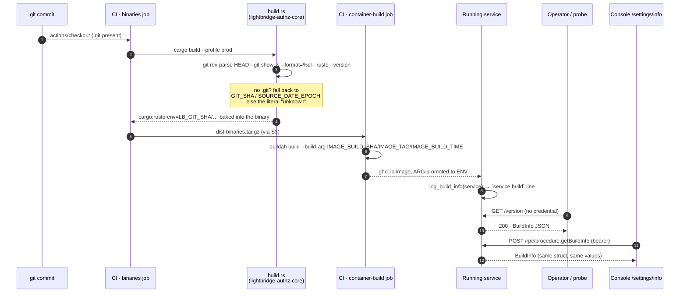

# Build info — what is this thing actually running? (#573)

Every `lightbridge-authz` process reports one build stamp on four surfaces, all reading the same
value so they cannot disagree:

| surface | who may read it | where |
| --- | --- | --- |
| `GET /version` | anyone — unauthenticated, beside `/healthz` | every service listener |
| `getBuildInfo()` RPC | any authenticated caller | `authz-api`, `authz-budget` |
| `lightbridge-authz --version` / `lightbridge-authz version` | the operator at a shell | CLI |
| `service.build` log line | whoever reads the logs | once, at startup |

Source of truth: <https://github.com/ADORSYS-GIS/lightbridge-authz/issues/573>.

## The shape

```jsonc
{
  "service": "authz-api",              // which listener answered
  "version": "0.8.1",                  // workspace crate version (release-please owns it)
  "gitSha": "c3a3b6aaf3422af743cab5eb3013b3fd91be3c93",
  "gitShortSha": "c3a3b6a",
  "gitCommitDate": "2026-09-02T23:00:21+02:00",
  "gitDirty": false,                   // uncommitted changes at compile time (never true in CI)
  "rustcVersion": "rustc 1.98.0 (88d9e12ae 2026-08-18)",
  "buildTime": "2026-09-03T04:10:53Z", // when the BINARY was compiled
  "imageBuildSha": "…",                // nullable — the commit the IMAGE build ran at
  "imageTag": "ghcr.io/adorsys-gis/lightbridge-authz:<sha>", // nullable
  "imageBuildTime": "2026-09-03T05:12:00Z"                   // nullable
}
```

Field names are `camelCase` on the wire because both consumers are TypeScript: the console's
`/settings/info` screen deserializes the same shape from `GET /version` and from the RPC procedure.

### Two clocks, deliberately kept apart

* **Compile time** — `service` aside, everything down to `buildTime` is frozen into the binary by
  `crates/lightbridge-authz-core/build.rs`. It cannot drift from the code that is executing.
* **Run time** — the three `image*` fields are read from the environment
  (`IMAGE_BUILD_SHA`, `IMAGE_TAG`, `IMAGE_BUILD_TIME`), because the image does not exist yet while
  the binary is compiling: CI builds binaries in the `binaries` job and the image in
  `container-build`, later. Both Dockerfiles declare them as `ARG`s and promote them to `ENV`.

### Unknown is said out loud

The image fields are nullable and come back as `null` outside a container — a local `cargo run`, a
test. Null, not `""` and not a plausible-looking placeholder.

The compile-time fields cannot be null (`build.rs` always emits *something*), so they carry the
literal string `"unknown"` when neither git nor the environment could answer. `/version` reporting
`"gitSha": "unknown"` means exactly what it says.

### Why not the image digest?

Because a digest cannot be baked into the artifact it identifies — adding it changes it.
`imageTag` carries the immutable `:<commit-sha>` tag instead, which resolves to exactly one digest,
and argocd-image-updater promotes by digest against that same tag.

## Interaction: how a stamp reaches a reader



Backing code:

| participant / edge | file:line |
| --- | --- |
| `build.rs` git → env → `unknown` ladder | `crates/lightbridge-authz-core/build_probe.rs:41` (`resolve`), `:73` (`resolve_commit_date`) |
| the `env!` reads that assemble the struct | `crates/lightbridge-authz-core/src/build_info.rs:113` (`build_info`) |
| runtime image env | `crates/lightbridge-authz-core/src/build_info.rs:101` (`env_opt`) |
| `GET /version` on api/opa/idp/budget | `crates/lightbridge-authz-rest/src/lib.rs` — `probe_router` |
| `GET /version` on both usage listeners | `crates/lightbridge-authz-usage/src/lib.rs` — `health_routes` |
| `GET /version` on `lightbridge-mcp` | `app/lightbridge-authz/src/mcp.rs` — the `public` router |
| `getBuildInfo` procedure | `crates/lightbridge-authz-rest/src/lib.rs` — `Procedures::get_build_info` |
| its authorization exemption | `crates/lightbridge-authz-rest/src/rpc_permission_map.rs:42` (`AUTHENTICATED_ONLY_OP_IDS`) |
| CLI `--version` / `version` | `app/lightbridge-authz/src/utils/cli.rs`, `app/lightbridge-authz/src/main.rs` |
| `service.build` startup line | `crates/lightbridge-authz-core/src/build_info.rs` — `log_build_info` |
| image ARGs | `Dockerfile.dist`, `Dockerfile`, `.github/actions/container-build/action.yml` |

## Lifecycle: what state a single field can be in

```mermaid
stateDiagram-v2
    [*] --> Compiling

    state "build.rs resolves a field" as Compiling
    Compiling --> FromGit: git answered
    Compiling --> FromEnv: no .git, but GIT_SHA / SOURCE_DATE_EPOCH set
    Compiling --> Unknown: neither answered

    state "baked: real value" as FromGit
    state "baked: real value (env fallback)" as FromEnv
    state "baked: the literal \"unknown\"" as Unknown

    FromGit --> Baked
    FromEnv --> Baked
    Unknown --> Baked

    state "in the binary, immutable" as Baked
    Baked --> ImageStamped: container-build passes --build-arg
    Baked --> NoImage: run outside a container

    state "image* = real values" as ImageStamped
    state "image* = null" as NoImage

    ImageStamped --> Served
    NoImage --> Served

    state "readable on all four surfaces" as Served
    Served --> [*]

    note right of Unknown
        Reachable ONLY from a build context
        without .git and without the env
        fallbacks — i.e. a bare `docker build`
        of ./Dockerfile with no --build-arg.
        CI never reaches it: actions/checkout
        leaves .git in place.
    end note

    note right of NoImage
        `cargo run`, `cargo test`, and any
        image built without the build-args.
        There is no transition from NoImage
        back to ImageStamped: the image
        identity is fixed when the image is
        built, never patched at runtime.
    end note
```

The state nothing can enter: **"baked with a fabricated value"**. Every path out of `Compiling`
either carries a real value or the `unknown` sentinel; there is no branch that invents one. That is
the property the `build_probe.rs` unit tests pin down
(`crates/lightbridge-authz-core/src/build_info.rs`, `mod tests`).

## Reading it

```bash
# Unauthenticated, any listener:
curl -sS https://auth.ai.camer.digital/version | jq

# In-cluster, per service:
kubectl -n lightbridge exec deploy/lightbridge-api -- lightbridge-authz version

# One line, no jq:
lightbridge-authz --version
```

Local ports (see `AGENTS.md` for the full probe list):

```bash
curl -k https://localhost:13000/version   # authz-api
curl -k https://localhost:13002/version   # authz-usage (ingest)
curl -k https://localhost:13004/version   # authz-idp
curl -k https://localhost:13005/version   # authz-budget
```

## Adding a new service

1. Give it a `SERVICE_*` constant next to its router (`&'static str`, not config — one binary serves
   several listeners, and the router is the only thing that knows which one answered).
2. Mount `/version` on its public router.
3. Call `lightbridge_authz_core::log_build_info(SERVICE_X)` in its `start_*` function.
4. Add a router test asserting `service` is the new name. The budget test
   (`crates/lightbridge-authz-rest/tests/budget_router_tests.rs`,
   `version_endpoint_reports_the_budget_service_not_the_api`) is the template: it exists precisely
   because a mislabelled service is invisible until someone tries to diagnose a version skew.
