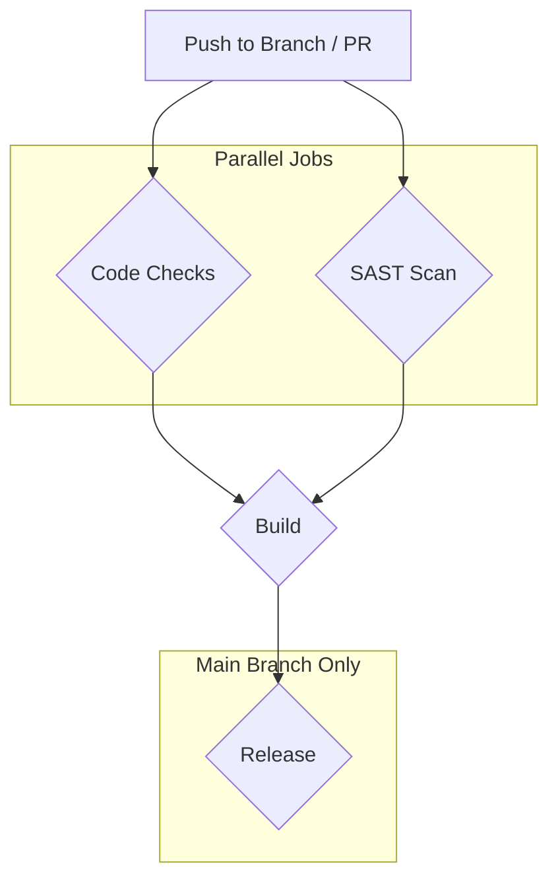

# CI/CD Architecture for Lightbridge Authz

This document outlines the CI/CD pipeline and pre-commit hook configuration for the Lightbridge Authz Rust project.

## Why?

A robust CI/CD pipeline is essential for maintaining code quality, ensuring stability, and automating the release process. By integrating automated checks and builds, we can catch errors early, enforce coding standards, and streamline the delivery of new versions.

## Actual

### GitHub Actions Workflow

The CI/CD pipeline is built using GitHub Actions and consists of several jobs that run in a coordinated manner to test, build, and release the project.

#### Workflow Diagram



### Pre-commit Hooks

To ensure code quality before it's even committed, we'll use pre-commit hooks. This helps catch issues locally, reducing the feedback loop and preventing broken code from entering the repository.

## How to?

### GitHub Actions

The workflow is defined in a YAML file located at `.github/workflows/ci.yml`.

#### SAST - `cargo-deny`

For Static Application Security Testing (SAST), we'll use `cargo-deny`. It's a comprehensive tool that checks for security vulnerabilities, license compatibility, and unwanted dependencies.

**Justification:** While `cargo-audit` is excellent for checking vulnerabilities, `cargo-deny` provides a more holistic view of the project's dependencies, which is crucial for maintaining a secure and compliant codebase.

#### Code Checks

This job ensures the code is well-formatted, free of common errors, and adheres to best practices. It runs the following checks:
- `cargo check`: Checks the code for errors without compiling it.
- `cargo fmt -- --check`: Ensures the code is formatted according to the project's style.
- `cargo clippy -- -D warnings`: Lints the code for common mistakes and style issues, treating all warnings as errors.

#### Build

The build job compiles the project in release mode, ensuring that the code not only passes the checks but also builds successfully.

#### Release

The release job is triggered only on pushes to the `main` branch. It creates a GitHub release and attaches the compiled binaries for easy distribution.

#### Workflow Configuration

```yaml
# .github/workflows/ci.yml
name: CI/CD Pipeline

on:
  push:
    branches: [ "main" ]
  pull_request:
    branches: [ "main" ]

jobs:
  sast:
    name: SAST Scan
    runs-on: ubuntu-latest
    steps:
      - uses: actions/checkout@v3
      - name: Install Rust
        uses: actions-rs/toolchain@v1
        with:
          toolchain: stable
      - name: Run cargo-deny
        uses: EmbarkStudios/cargo-deny-action@v1

  code-checks:
    name: Code Checks
    runs-on: ubuntu-latest
    steps:
      - uses: actions/checkout@v3
      - name: Install Rust
        uses: actions-rs/toolchain@v1
        with:
          toolchain: stable
          components: clippy, rustfmt
      - name: Run cargo check
        run: cargo check --all-targets --all-features
      - name: Run cargo fmt
        run: cargo fmt -- --check
      - name: Run cargo clippy
        run: cargo clippy --all-targets --all-features -- -D warnings

  build:
    name: Build
    needs: [sast, code-checks]
    runs-on: ubuntu-latest
    steps:
      - uses: actions/checkout@v3
      - name: Install Rust
        uses: actions-rs/toolchain@v1
        with:
          toolchain: stable
      - name: Build release binary
        run: cargo build --release --all-targets --all-features
      - name: Upload artifact
        uses: actions/upload-artifact@v3
        with:
          name: release-binary
          path: target/release/<your-binary-name> # TODO: Replace with your binary name

  release:
    name: Release
    if: github.ref == 'refs/heads/main' && github.event_name == 'push'
    needs: build
    runs-on: ubuntu-latest
    steps:
      - uses: actions/checkout@v3
      - name: Download artifact
        uses: actions/download-artifact@v3
        with:
          name: release-binary
      - name: Create Release
        id: create_release
        uses: actions/create-release@v1
        env:
          GITHUB_TOKEN: ${{ secrets.GITHUB_TOKEN }}
        with:
          tag_name: ${{ github.run_number }}
          release_name: Release ${{ github.run_number }}
          draft: false
          prerelease: false
      - name: Upload Release Asset
        uses: actions/upload-release-asset@v1
        env:
          GITHUB_TOKEN: ${{ secrets.GITHUB_TOKEN }}
        with:
          upload_url: ${{ steps.create_release.outputs.upload_url }}
          asset_path: ./<your-binary-name> # TODO: Replace with your binary name
          asset_name: <your-binary-name> # TODO: Replace with your binary name
          asset_content_type: application/octet-stream
```

### Pre-commit Hooks

For managing pre-commit hooks, we'll use the `pre-commit` framework. It's a multi-language tool that is easy to set up and use.

#### Configuration

The configuration is stored in a `.pre-commit-config.yaml` file in the root of the repository.

```yaml
# .pre-commit-config.yaml
repos:
-   repo: https://github.com/pre-commit/pre-commit-hooks
    rev: v4.3.0
    hooks:
    -   id: check-yaml
    -   id: end-of-file-fixer
    -   id: trailing-whitespace
-   repo: local
    hooks:
    -   id: cargo-check
        name: cargo check
        description: Check the package for errors.
        entry: cargo check
        language: rust
        types: [rust]
        pass_filenames: false
    -   id: cargo-fmt
        name: cargo fmt
        description: Format files with rustfmt.
        entry: cargo fmt
        language: rust
        types: [rust]
    -   id: cargo-clippy
        name: cargo clippy
        description: Lint files with clippy.
        entry: cargo clippy -- -D warnings
        language: rust
        types: [rust]
        pass_filenames: false
```

To get started with `pre-commit`, you need to install it and then set up the git hooks:

```bash
# Install pre-commit
pip install pre-commit

# Set up the git hook scripts
pre-commit install
```

Now, the hooks will run automatically on every commit.

## Conclusion

This CI/CD architecture provides a solid foundation for developing a high-quality Rust application. It automates the process of checking, testing, building, and releasing the code, allowing the development team to focus on writing features.