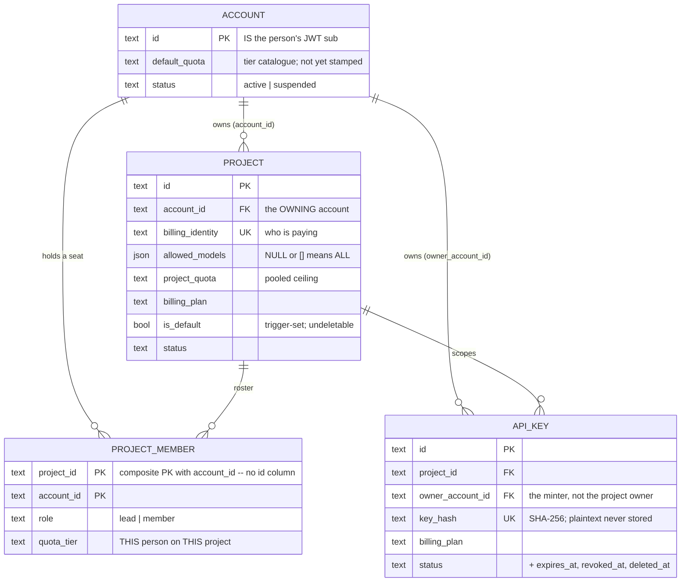
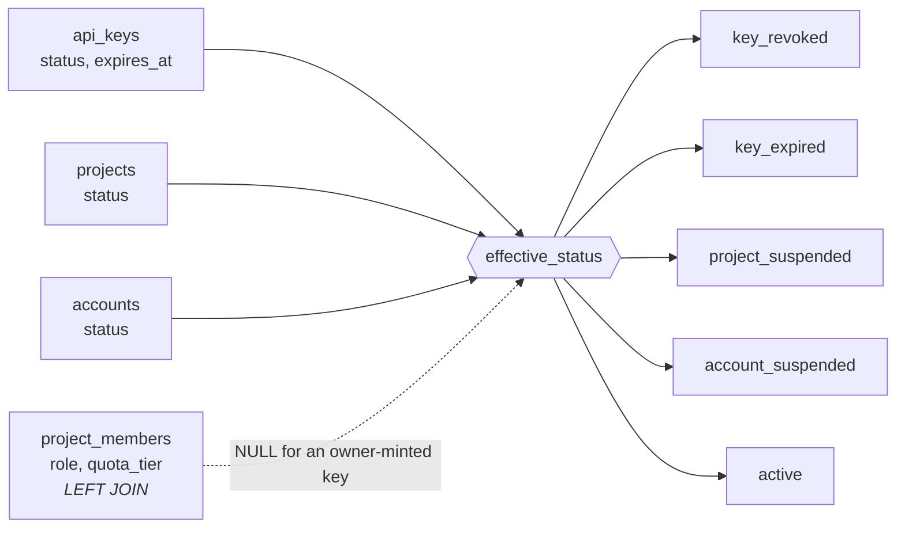
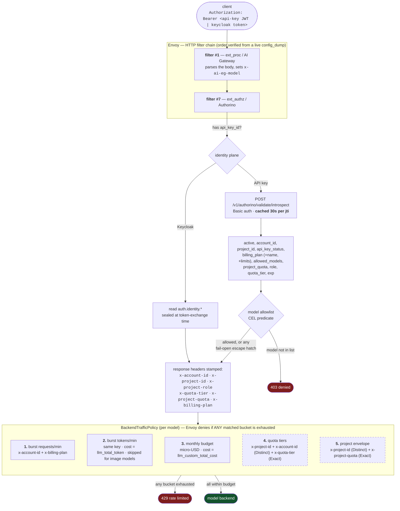

# The governance model, and how it is actually enforced

How accounts, projects, members and API keys are modelled, and how a request carrying one of them
gets rate-limited, model-restricted or refused at the gateway. Written to be readable end-to-end by
someone who has seen neither the database nor the Envoy config.

Companion to [`rbac.md`](./rbac.md) (which permission gates which *operation* on the authz API) and
[ADR-0006](./adr/0006-project-membership-supersedes-account-roles.md) (why the model is shaped this
way). This document is about the **data plane**: what happens to an inference request.

> **Read the "Where this is not yet true" section before trusting any of the enforcement
> walkthroughs.** Parts of this chain are live; one link is built but not yet configured, and the
> document says which.

---

## 1. The entities



> The owning account of a project normally holds **no** `PROJECT_MEMBER` row. Ownership and roster
> membership are separate standings, which is why an owner's `quota_tier` is legitimately `NULL`.

### Account — a person

| Column | Notes |
|---|---|
| `id` | **Is the person's JWT `sub`.** Not a surrogate key. |
| `default_quota` | Governance tier for their own default project. Validated against an operator-configured catalogue at write time (config, not a DB table). |
| `status` | `active`/`suspended`. Server-managed. |

One account is one person. There is **no account-level membership of any kind** — that concept
existed until ADR-0006 and was removed entirely, table and all.

Because `accounts.id` *is* the subject, `createAccount` succeeds exactly once per person; a second
call is a `409 Conflict`, not a second row. There is no way for a caller to choose their own account
id, which would otherwise be an impersonation primitive.

### Project — a shared goal, and the unit of billing

| Column | Notes |
|---|---|
| `id`, `name` | |
| `account_id` | The **owning** account. Not the same thing as being on the roster. |
| `billing_identity` | **Unique.** Who is paying. Lives here, not on the account, so one person can bill projects to different parties (a consultant with three clients). |
| `allowed_models` | JSON list. `NULL` or `[]` both mean **all models allowed**. |
| `project_quota` | The *pooled* ceiling, shared by everyone on the project. Tier catalogue value. |
| `billing_plan` | The plan tier (`free`, `pro`, `enterprise`, `internal`, `service`). |
| `is_default` | Server-computed by a `BEFORE INSERT` trigger; an account's first project. Undeletable. |
| `status` | `active`/`suspended`. |

Every account gets a **default project** automatically — "you, working alone". It has no roster by
construction: nothing ever inserts a member row for it. That is not enforced by a special case; it
falls out of the data model, which is why no policy anywhere branches on `is_default`.

### ProjectMember — a seat on a roster

| Column | Notes |
|---|---|
| `project_id`, `account_id` | **Composite primary key.** There is no `id` column. |
| `role` | `lead` or `member` (DB `CHECK`). |
| `quota_tier` | This specific person's ceiling on this specific project. Set by a lead. |

Two things about this table surprise people:

**Ownership and membership are separate standings.** The project's owning account normally holds
*no* member row. So "is this caller allowed?" is `projects.account_id = subject OR EXISTS(member
row)`, and an owner's `quota_tier` is legitimately `NULL` — meaning no per-member ceiling applies to
them, only the pooled one.

**The schema's `ProjectMember.id` is synthetic.** cratestack requires exactly one scalar `@id` per
model, but the real table has none. The model exists mainly so `@@allow` policies on `Project`/
`ApiKey` can traverse into it (`members.some.accountId == auth().id`). Consequences: the generic
`model.ProjectMember.*` verbs are fail-closed at the RBAC gate, and the roster is read through the
`listProjectRoster` procedure, which synthesises the id as `"<project>:<account>"`.

### ApiKey — delegated spending power

| Column | Notes |
|---|---|
| `id`, `project_id`, `name` | |
| `key_hash` | SHA-256 of the secret. **The plaintext is never stored** — returned only on create/rotate. |
| `key_prefix` | For identification in listings. |
| `owner_account_id` | **Which member the key belongs to**, set from the acting subject on create/rotate. |
| `allowed_models` | Inherited from the project at mint time (into the JWT), not stored per key. |
| `billing_plan` | |
| `status`, `expires_at`, `revoked_at`, `deleted_at` | |
| `last_used_at`, `last_ip` | Usage telemetry, updated on validation. |

`owner_account_id` is the newest and least obvious column. A key is project-scoped, but **creating
one is lead-gated**, so the minter is either the owning account or a lead. Attributing the key to
the *project owner* instead of the actual minter would let a lead's keys escape the lead's own
per-member ceiling. It is `NOT NULL` deliberately: an unattributable key is precisely the case where
"whose ceiling applies?" has no answer.

### The `api_key_validation` view

Introspection reads one indexed view rather than assembling the picture with joins per request:

```sql
SELECT api_key_id, key_hash, project_id, account_id,
       api_key_status, project_status, account_status, expires_at,
       effective_status,                              -- the cascade, resolved by the DB
       owner_account_id, owner_role, owner_quota_tier -- LEFT JOIN project_members
FROM   api_key_validation WHERE key_hash = $1
```



`effective_status` collapses the whole chain — `key_revoked` → `key_expired` → `project_suspended` →
`account_suspended` → `active`. **Suspending an account instantly invalidates every key beneath
it**, because the cascade is computed in SQL, not reconstructed in application code.

The owner columns are a `LEFT JOIN`, so `owner_role`/`owner_quota_tier` are `NULL` for an
owner-minted key. That is a meaningful value, not a missing one.

---

## 2. The two identity planes

Everything downstream depends on which of these a request arrives on.

**The API-key plane.** A machine caller presents a key. The key *is* a self-signed JWT carrying
`api_key_id`, `project_id`, `account_id`, `allowed_models`, `sub`, `jti`, `exp`. Authorino
recognises it by `api_key_id` being present.

**The Keycloak plane.** A human, via opencode/LibreChat. Project context is sealed into the token at
**token-exchange time** by the `lightbridge-keycloak-spi` adapter, which calls
`POST /idp/v1/resolve-context` (Basic-auth protected) and a protocol mapper copies the result into
claims.

The practical consequence of the second: **switching project means requesting a new token, not
sending a different header.**

---

## 3. How a request gets governed



> Rule families **4** and **5** are drawn dashed: the header pipeline feeding them is live, but
> `tiers: []` / `projectEnvelope: {}` mean they do not currently render. See §5.


### Why introspection and not claims

An earlier plan was to put everything in claims and reduce introspection to a single active-check.
It was **rejected after measuring**: introspection is 3 round trips, cached 30s per key by
Authorino. At ~100 keys that is ~27 DB ops/sec against a store measured at 600–1000 rps.

Paying it buys a property claims cannot: **a quota or roster change takes effect within 30 seconds**,
rather than waiting for the key to be rotated. Claims freeze at mint time.

That is why `project_quota`, `role` and `quota_tier` ride on the introspection response, while
`allowed_models` is *also* in the JWT (it is stamped at mint time and used for the header path).

### Absence-safety, and why every header falls back to `""`

Every CEL expression guards each level with `has()` under `&&` short-circuit. Evaluating an absent
parent is a hard "no such key" error that **drops the header entirely** — a failure mode that has
bitten this config before. A dropped header is worse than an empty one: an empty value simply
matches no `Exact` selector, so the rule does not apply and the plan-level limits still govern.

The allowlist predicate fails **open** in three directions, deliberately: no `api_key_id` (human
identity), allowlist absent or empty (`NULL`/`[]` means all models — or introspection is down), or
no `x-ai-eg-model` (a non-model route).

---

## 4. Walkthroughs

### 4.1 A member exceeds their per-member tier but has personal quota left

Ana is a `member` on project *Atlas* with `quota_tier: t-s`. She also has her own default project
with `default_quota: t-m`.

She calls with an Atlas API key:

1. Introspection returns `project_id: atlas`, `quota_tier: t-s`, `project_quota: t-l`,
   `account_id: ana`.
2. Headers: `x-project-id: atlas`, `x-quota-tier: t-s`, `x-project-quota: t-l`,
   `x-account-id: ana`.
3. Rule family 4 matches `(atlas, ana, t-s)` — **exhausted → 429**.

Her personal quota does **not** rescue her, and that is the intended semantics: the tier bounds what
*this person may spend on this project*. Her own default project is a different `x-project-id`, so a
key minted there lands in a different bucket entirely.

The rule keys on `x-project-id` **and** `x-account-id` as `Distinct`, so Ana's exhaustion does not
affect her colleagues — each member gets their own counter within the tier.

### 4.2 A caller requests a model outside the project allowlist

Project *Atlas* has `allowed_models: ["gpt-4.1-mini"]`. The request asks for `gpt-4.1`.

1. ext_proc (filter #1) sets `x-ai-eg-model: gpt-4.1`.
2. Authorino (filter #7) evaluates the predicate: allowlist present, non-empty, header present, and
   `"gpt-4.1" in ["gpt-4.1-mini"]` is **false** → all four escape hatches fail → **denied**.

The ordering is the whole trick, and it was verified against a live `config_dump` rather than
assumed — an earlier assessment declared this impossible because it assumed Authorino ran first.

Note what is *not* checked: `allowed_models` is the **project's**, read live from introspection. A
lead narrowing the allowlist takes effect within the 30s cache window, without rotating keys.

### 4.3 A lead removes a member; the member keeps using a key from that project

Ben is removed from *Atlas* by a lead. He still holds an Atlas API key he minted.

Here it matters exactly what "the key" is:

- The key row is **not** deleted. `removeProjectMember` deletes the roster row, nothing else.
- `api_key_validation` still resolves: the key is active, the project is active, the account is
  active → `effective_status: active`.
- **The key keeps working.**

What *does* change: `owner_role` and `owner_quota_tier` become `NULL` (the `LEFT JOIN` finds no
row), so `x-quota-tier` empties and Ben falls back to the **pooled** project envelope and plan
limits. He loses his per-member ceiling — which, if his tier was *tighter* than the pool, actually
**loosens** his limits.

He also immediately loses API access to the project through the authz API itself (`get_project`
returns `NotFound`), so he cannot mint new keys or read the roster — but the existing key is a
bearer credential against the gateway, and nothing revoked it.

> **This is a real gap, not a designed behaviour.** If you need removal to cut off existing keys,
> `removeProjectMember` must also revoke keys where `owner_account_id` = the removed member. See
> §5.

### 4.4 An account is suspended

Immediate and total. `api_key_validation.effective_status` becomes `account_suspended` for **every**
key under every project of that account, because the cascade is a SQL `CASE` over the joined status
columns. Introspection returns `{"active": false}` and Authorino rejects.

Worst-case propagation is the 30s introspection cache.

### 4.5 A key is rotated

`rotateApiKey` revokes the old key and mints a new one **in one transaction**. The new key's
`owner_account_id` is the **rotating** subject, not inherited from the old key — rotation re-mints
for whoever performs it, so the per-member ceiling follows the person doing the rotating.

### 4.6 An owner-minted key

The project owner mints a key. They hold no roster row, so `owner_quota_tier` is `NULL` and
`x-quota-tier` is `""`, which matches no `Exact` selector. Rule family 4 does not apply; they are
bounded by the project envelope (family 5) and their plan limits (1–3).

This is correct, not a hole: the owner is not a roster seat, and the pooled ceiling is what bounds
the project as a whole.

### 4.7 A human on the Keycloak plane

Claire signs in through opencode and exchanges for project *Atlas*. `x-project-id` and
`x-account-id` come from **claims**, not introspection (there is no `api_key_id`). The model
allowlist predicate **skips entirely** — its first escape hatch is "no `api_key_id`".

So: **the model allowlist is not enforced on the human plane.** See §5.

### 4.8 Introspection is unavailable

The allowlist predicate's first two clauses (`!has(...)`) are true → the request is **allowed**, and
every `x-project-*` header falls back to `""` → tier and envelope rules do not match → the caller
falls through to plan-level limits keyed on `x-account-id` + `x-billing-plan`.

Deliberately fail-open on *governance*, not on *authentication* — the key must still validate.

### 4.9 A key whose billing plan is not in the configured catalogue

Introspection logs a warning and omits `billing_plan_name`/`billing_plan_limits`. The key still
validates. Downstream, `x-billing-plan` carries an id no plan rule matches, so **no plan rate limit
applies**. Reconcile the catalogue with keys still in use; the warning is the only signal.

---

## 5. Where this is not yet true

Stated plainly, because most of these fail *silently*.

### The tier and envelope rules are not configured

`charts/ai-models/values.yaml` still carries `tiers: []` and `projectEnvelope: {}`. With those
defaults **neither rule family renders at all**. The header pipeline described in §3 is live end to
end, but there is currently **no rule to match `x-quota-tier` against**.

So walkthrough 4.1 describes what happens *once a tier menu is configured*, not what happens today.
Today Ana falls through to plan limits. Populating those two values is the remaining step, and it is
a chart change, not code.

### The model allowlist does not apply to humans

Walkthrough 4.7. The predicate is gated on `api_key_id`, and the Keycloak plane has no allowlist
source — `resolve-context` returns account/project context, not `allowed_models`. A human can reach
any model their plan allows, regardless of the project they are working in.

### Removing a member does not revoke their keys

Walkthrough 4.3. Arguably the most surprising gap for an operator: revoking someone's *access* does
not revoke their *credentials*.

### `x-project-role` is stamped but unused

Nothing consumes it. It is populated for completeness and future policy; no rule keys on it today.

### The `internal` plane has no project context

The LibreChat / k8s-service-account AuthConfig has no `metadata:` block, so `x-project-*` there is
always empty, mirroring its existing `x-billing-plan` behaviour.

### Per-model budget counters are per-route

Envoy Gateway namespaces the monthly-budget counter **per HTTPRoute**, so despite a model-agnostic
descriptor the budget is enforced per model, not shared (a heavy user held ~29 separate counters).
The shared fix exists behind `sharedBudget.enabled`.

---

## 6. Quick reference — what governs what

| Bound | Source of truth | Reaches the gateway via | Live today? |
|---|---|---|---|
| Plan burst + budget | Keycloak group attribute / key's `billing_plan` | `x-billing-plan` | yes |
| Model allowlist | `projects.allowed_models` | introspection → CEL predicate | API keys only |
| Pooled project ceiling | `projects.project_quota` | introspection → `x-project-quota` | header yes, **rule not configured** |
| Per-member ceiling | `project_members.quota_tier` | introspection → `x-quota-tier` | header yes, **rule not configured** |
| Key validity cascade | `api_key_validation.effective_status` | introspection `active` | yes |
| Account's own default-project tier | `accounts.default_quota` | *not currently stamped* | no |

`accounts.default_quota` deserves a note: it is settable and validated, but nothing reads it at the
gateway. A person's default project has no roster, so there is no `quota_tier` row for it — the
field was meant to fill that gap and is not yet wired.
