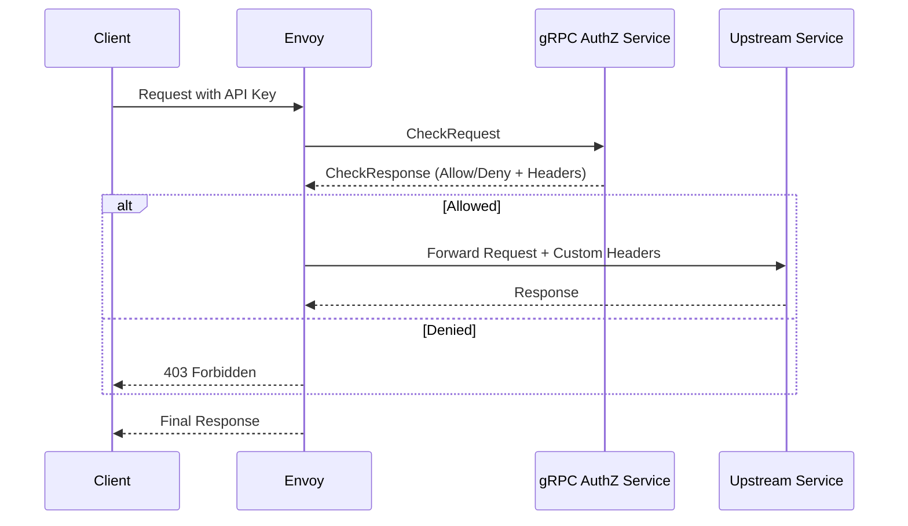

# gRPC External Authorization Service

## Why?

To provide a flexible and performant way to authorize requests at the edge using Envoy's external authorization feature. This service will centralize API key validation and ACL management, allowing for consistent policy enforcement across all services behind the gateway.

## Actual

The gRPC external authorization service will be a standalone component that integrates with Envoy. It will expose a gRPC endpoint that Envoy can call for each incoming request to determine if it's authorized.

### Integration with Envoy

Envoy will be configured with an `ext_authz` filter that points to our gRPC service. For each request, Envoy will send a `CheckRequest` to the service. The service will then process the request and return a `CheckResponse` indicating whether the request is allowed or denied.

### Authorization Request Flow

1.  An incoming request hits the Envoy proxy.
2.  The `ext_authz` filter intercepts the request and sends a `CheckRequest` to the gRPC authorization service. This request contains the original request's headers, method, and path.
3.  The gRPC service extracts the API key from the request headers (e.g., `Authorization: Bearer <key>` or `x-api-key: <key>`).
4.  The service validates the API key against its database.
5.  If the key is valid, the service retrieves the associated ACLs.
6.  The service constructs a `CheckResponse` with an "Allow" status and attaches the ACLs as custom headers (e.g., `x-custom-lightbridge-authz-acl: "read:users"`).
7.  If the key is invalid or missing, the service returns a `CheckResponse` with a "Deny" status.
8.  Envoy receives the `CheckResponse`. If allowed, it adds the custom headers to the original request and forwards it to the upstream service. If denied, it returns a 403 Forbidden response to the client.

### API Key Extraction and Validation

The service will look for an API key in the following headers, in order:
1.  `Authorization` (with `Bearer` prefix)
2.  `x-api-key`
3.  `x-api-key-*` (e.g., `x-api-key-public`)

Once found, the key will be validated against the data store to ensure it is active and not expired.

### ACL Attachment

Upon successful validation, the service will fetch the ACLs associated with the API key. These ACLs will be added to the response headers that are sent back to Envoy. The upstream services can then use these headers to enforce fine-grained access control.

The headers will be prefixed with `x-custom-lightbridge-authz-` to avoid collisions with other headers.

## Constraints

- The service must be highly available and have low latency to avoid impacting the overall request time.
- The communication between Envoy and the gRPC service should be secured (e.g., using mTLS).

## How to?

The implementation will involve:
1.  Defining the gRPC service using Protocol Buffers.
2.  Implementing the gRPC server logic in Rust.
3.  Integrating with the existing database schema for API keys and ACLs.
4.  Adding configuration options to the main application to enable and configure the gRPC service.
