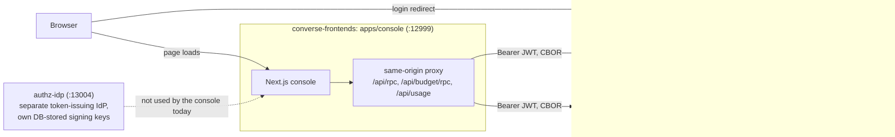
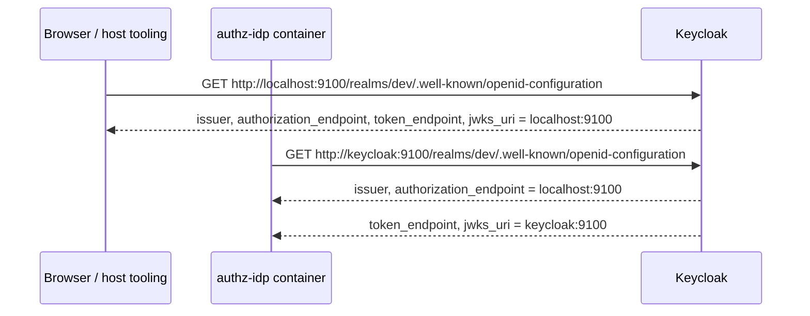

# Local Testing Guide

Everything you need to run the whole platform locally and prove it works — backend and frontend
console. Written for someone who just cloned the repo.

## Prerequisites

| Tool | Needed for |
| --- | --- |
| Docker + Docker Compose | The whole backend (`just up`) |
| Rust (stable toolchain) | `cargo` commands, `just all-checks` |
| [`just`](https://github.com/casey/just) | Every command in this guide |
| Node + `pnpm` | The console and the `authz-idp` login page (both live in the separate `converse-frontends` repo — see below) |

## How the pieces talk

The console is the only browser-facing origin. It proxies API calls same-origin and talks to
Keycloak directly for login. `authz-idp` is a **separate token-issuing IdP for the AI data plane**
(API-key/agent tokens) — the console does not go through it today.



`authz-api`/`authz-budget` trust **only** Keycloak's JWKS (`oauth2.jwks_url`,
`crates/lightbridge-authz-bearer/src/lib.rs:225-230`). `authz-idp` mints its own tokens with a
signing keypair generated on first startup and stored in the DB
(`crates/lightbridge-authz-api-key/src/repo.rs:2601` `ensure_active_signing_key`). These are two
independent trust roots today — a token from one is not valid against the other.

## 1. Backend

```bash
just up
```

This builds and starts every service defined in `compose.yaml` — 12 long-running containers plus
three one-shot jobs (`authz-tls` cert generation, `authz-migrate`, `authz-usage-migrate`) that run
once and exit.

| Service | Host port(s) | Purpose |
| --- | --- | --- |
| `authz-api` | 13000 | CRUD + budget-domain client surface (RPC) |
| `authz-opa` | 13001 | Authorino/OPA validation (basic auth) |
| `authz-usage` | 13002 (ingest), 13006 (query, mTLS-only) | OTEL ingest / usage query |
| `authz-idp` | 13004 | OIDC broker (discovery, JWKS, token exchange, device grant) |
| `authz-budget` | 13005 | Budget-domain RPC |
| `authz-mcp` | 13003 | MCP streamable HTTP |
| `keycloak` | 9100 | Identity provider, admin console |
| `postgresql` | 5432 | Primary DB |
| `redis` | 6379 | Rate limiting + replay protection |
| `timescaledb` | 5433 | Usage-events DB |
| `jaeger` | 16686 (UI), 4317/4318 (OTLP) | Traces |
| `mcp-inspector` | 6274, 6277 (loopback only) | MCP debugging UI |
| `adminer` (optional) | 18080 | DB browser |

Source: `compose.yaml:174-454`.

Check health on every authz service (routes shared by every server,
`crates/lightbridge-authz-rest/src/lib.rs:2237-2251`):

```bash
curl -k https://localhost:13000/healthz
```

```bash
curl -k https://localhost:13001/healthz
```

```bash
curl -k https://localhost:13002/healthz
```

```bash
curl -k https://localhost:13003/healthz
```

```bash
curl -k https://localhost:13004/healthz
```

```bash
curl -k https://localhost:13005/healthz
```

Each also has `/healthz/ready` (DB readiness) and `/healthz/startup`.

**`-k` is mandatory, not a convenience.** All six services are HTTPS-only with self-signed certs
minted by the `authz-tls` job (`compose.yaml:1-70`). That job only (re)generates a cert if one
isn't already sitting in the `authz_tls` volume, so on a fresh volume you get a cert whose SAN
names the in-network service (e.g. `DNS:authz-api`, from `issue_leaf`'s `subjectAltName=DNS:%s`,
`compose.yaml:42`) — never `localhost`. On this repo's currently-running dev stack the cert
predates that SAN and carries none at all (`subject=CN=lightbridge-authz-api`, verified live via
`openssl s_client -connect localhost:13000 | openssl x509 -noout -text`). Either way, hostname
verification against `localhost` can never pass — every HTTP client needs certificate verification
disabled locally, not just `curl`. If you ever need a clean cert, `just destroy` removes the volume
(destructive: also drops the DB).

## 2. Keycloak / identity

Realm `dev` is imported from `.docker/keycloak_config/realm.json` on every Keycloak start.

| User | Password | Role | Grants |
| --- | --- | --- | --- |
| `test@admin` | `test` | `lightbridge-admin` | `*` (everything) |
| `test@editor` | `test` | `lightbridge-editor` | `account:create/read`, `project:*`, `apikey:*`, `budget:self-refill`, `budget:read-own` |
| `test@viewer` | `test` | `lightbridge-viewer` | `account:create/read`, `project:read`, `apikey:read`, `budget:read-own` |

Source: `.docker/keycloak_config/realm.json:15-72`, role→permission mapping at
`config/default.yaml:237-252` / `docs/rbac.md:130-141,209-210`.

Keycloak admin console: `http://localhost:9100` (`admin` / `password`).

**RBAC consequence:** the budget admin review queue (`listPendingAugmentationRequests`,
`approveAugmentationRequest`, `rejectAugmentationRequest`) is gated at `budget:review`, which only
`lightbridge-admin`'s `*` grant includes (`docs/rbac.md:268`). Logging in as `test@editor` or
`test@viewer` and getting `403` there is correct behavior, not a bug.

## 3. The issuer model

An OIDC issuer has two independent aspects, and this repo splits them into two config fields
(`config/default.yaml:132-143`, `.docker/authz/container.yaml:131-146`):

| Field | Question it answers | Local value |
| --- | --- | --- |
| `oauth2.federation.issuer` | **Identity** — what the browser is redirected to, what every token's `iss` claim carries, what `authz-idp` validates discovery's own `issuer` against | `http://localhost:9100/realms/dev` |
| `oauth2.federation.discovery_url` | **Location** — where `authz-idp`'s own container dials OIDC discovery from *inside* the Docker network (optional; defaults to `issuer`) | `http://keycloak:9100/realms/dev` |

Without this split, `authz-idp` would try to dial discovery at `localhost:9100` from inside its
own container — connection refused, surfacing as `502` on `GET /authorize` (see Troubleshooting).

Verified live by fetching `/.well-known/openid-configuration` from the host and from inside the
compose network:



| Dialled from | `issuer` / `authorization_endpoint` | `token_endpoint` / `jwks_uri` |
| --- | --- | --- |
| Host (`localhost:9100`) | `localhost:9100` | `localhost:9100` |
| In-network (`keycloak:9100`) | `localhost:9100` | `keycloak:9100` |

Frontend URLs (issuer, browser-redirect endpoint) stay pinned to the one external address
regardless of who's asking; backchannel URLs (token, JWKS — never hit by a browser) resolve to
whatever host actually dialled them. This is what makes `federation.issuer=localhost:9100` +
`discovery_url=keycloak:9100` coherent: `authz-idp` fetches discovery in-network and gets a
`token_endpoint`/`jwks_uri` it can actually reach, while the `issuer` field it validates against
stays the one fixed value every token's `iss` also carries.

This split is guaranteed by config, not by a Keycloak default: `compose.yaml`'s `keycloak`
service sets `KC_HOSTNAME: "http://localhost:9100"` and `KC_HOSTNAME_BACKCHANNEL_DYNAMIC: "true"`.
Verified against the running stack — dialled from the host, every endpoint is `localhost:9100`;
dialled from inside the compose network, `issuer` and `authorization_endpoint` stay
`localhost:9100` while `token_endpoint` and `jwks_uri` become `keycloak:9100`.

`oauth2.relying_party.issuer` no longer exists on this branch — `federation.issuer` is the single
source of the identity issuer.

## 4. Console (frontend)

The console lives in a **separate repo**, `converse-frontends`, at `apps/console` (Next.js;
replaces the earlier Expo-based self-service app).

```bash
pnpm install
```

Run from `converse-frontends/apps/console`. Three things need to be right — each was a real,
debugged failure:

1. **Keycloak issuer + client.** `keycloak.issuer: http://localhost:9100/realms/dev`,
   `keycloak.clientId: test-client` — the "alternative dev realm" this repo ships (the console's
   own README documents this as a supported option). A token minted from a different issuer string
   gets `401 unable to resolve caller identity` from `authz-api` — that's ADR-0025 issuer pinning,
   not a bug.
2. **HTTPS backend URLs, TLS verification disabled.** `backendUrl: https://localhost:13000`,
   `budgetUrl: https://localhost:13005` (HTTPS, not HTTP), and the dev server needs
   `NODE_TLS_REJECT_UNAUTHORIZED=0` because of the no-SAN-for-`localhost` certs from section 1.
3. **`apiBasePath: '/'`.** `authz-api`'s `server.api.rpc_base_path` is unset in this repo's config
   (`config/default.yaml:12-17`, `.docker/authz/container.yaml:13-15`), so the RPC surface is
   mounted at the root (`/rpc/<op_id>`), not under `/api`. A console pointed at `/api` gets `404`.

All three are already set correctly in `converse-frontends/apps/console/config.local-authz.yaml`
(committed as a ready-made local override). Launch with:

```bash
PORT=12999 CONSOLE_CONFIG=./config.local-authz.yaml NODE_TLS_REJECT_UNAUTHORIZED=0 pnpm --filter console dev
```

`CONSOLE_CONFIG` lets you point at that override without touching the committed default
`config.yaml` (which targets `converse-frontends`' own bundled dev realm instead). The console also
needs a `SESSION_SECRET` env var (32+ chars) — generate one with `openssl rand -base64 48`.

**Keycloak callback registration.** For the console to complete `authorization_code` + PKCE against
`test-client`, its redirect URIs (`http://localhost:3000/*`, `http://localhost:12999/*`) must be
registered on that client. Both are already registered in
`.docker/keycloak_config/realm.json` alongside the Expo app's `http://localhost:8081/*`, so a fresh
`just up` needs no manual Keycloak step. If your realm predates this and you do not want to
re-import, add them by hand: Keycloak admin (`http://localhost:9100`, `admin`/`password`) → realm
`dev` → Clients → `test-client` → Valid Redirect URIs.

## 5. The `authz-idp` login page (`/ui`)

The page `authz-idp` serves at `https://localhost:13004/ui/` is **not built in this repo**. Its
source home is `converse-frontends`' `apps/authz-ui`; this repo consumes the built bundle as a
digest-pinned, assets-only OCI image (ADR-0028). There is exactly one pin, the `ARG AUTHZ_UI_REF=`
line at the top of `./Dockerfile`.

### Just run it

`just up` builds the root `Dockerfile`, which pulls the pinned bundle and bakes it into
`/app/static`. Nothing extra to do:

```bash
just up
curl -ks -o /dev/null -w '%{http_code}\n' https://localhost:13004/ui/    # 200
curl -ksI https://localhost:13004/ui/ | grep -i '^cache-control'         # cache-control: no-cache
```

If the GHCR package is private, `docker login ghcr.io -u <you> -p <PAT with read:packages>` once,
first. (It is expected to be public, like `…/converse-frontends/console`.)

### Iterating on the page itself (cross-repo loop)

Do **not** rebuild the container for every UI change. Point `authz-idp` at a locally built
`dist/` instead. Both the local config and the container config read the same env var,
`IDP_STATIC_DIR`.

```bash
# 1. Build the bundle in your converse-frontends checkout (sibling to this repo)
cd ../converse-frontends
pnpm install
pnpm --filter authz-ui build:web        # -> apps/authz-ui/dist/{index.html,sw.js,assets/*}

# 2a. Bare cargo run (no container): config/default.yaml's static_dir honours IDP_STATIC_DIR
cd ../lightbridge-authz
IDP_STATIC_DIR="$(cd ../converse-frontends && pwd)/apps/authz-ui/dist" \
  cargo run --bin lightbridge-authz -- idp

# 2b. Or against the compose stack: bind-mount over the baked-in bundle. Add to a local
#     compose override (do not commit) — the container path is /app/static:
#       services:
#         authz-idp:
#           volumes:
#             - ../converse-frontends/apps/authz-ui/dist:/app/static:ro
#     then: just up-no-build authz-idp
```

Two things to know while iterating:

- **The service worker.** `apps/authz-ui` ships a real service worker (`sw.js`) that precaches the
  content-hashed bundle. A stale SW is the usual explanation for "my change isn't showing" —
  unregister it in DevTools → Application → Service Workers, or use a private window. The SW is
  disabled in that app's `vite dev` server on purpose, so `pnpm --filter authz-ui dev` never has
  this problem; only real production builds do.
- **The CSP.** Every `/ui` response carries `default-src 'self'; frame-ancestors 'none'`
  (`crates/lightbridge-authz-rest/src/static_assets.rs`). No inline `<script>` will run. If a UI
  change works under `vite dev` and breaks here, check the browser console for a CSP violation
  before anything else.

### Shipping a UI change

The UI ships first and must be backward-compatible; the **pin bump in `./Dockerfile` is the
deploy** (ADR-0028). Merge in `converse-frontends`, read the published digest from that repo's
`authz-ui-image` workflow run summary, update the two lines under `ARG AUTHZ_UI_REF=` here, open a
PR. `it-idp` proves `/ui/` still serves.

## 6. What you can actually test, honestly

| Area | Status | Notes |
| --- | --- | --- |
| API-key CRUD | Working | `createAccount`, `Project.create`, `createApiKey`, `ApiKey.list`, `listMyExpiringApiKeys` all verified `200` |
| Budget | Working | `getBudgetPolicyStatus({policySetId: "budget-refill"})` returns the active revision `budget-policy-v2-adr0015` (`migrations/20260819000001_budget_policy_adr0015_amounts.sql:26-49`); `listPendingAugmentationRequests` `200` as `test@admin` |
| Graphs / usage charts | **Not working locally** | Two independent reasons — see below |

Usage/spend charts don't render locally, for two unrelated reasons:

1. **Backend:** the usage query listener (`:13006`) requires mTLS
   (`AGENTS.md`'s "Security Notes"; `crates/lightbridge-authz-usage/src/config.rs`), and the
   console's proxy makes a plain `fetch()` with no client certificate — leaving `usageUrl` unset in
   the console config is the *correct* local setting (`config.local-authz.yaml`'s own comment:
   "the plain-HTTP proxy cannot reach it, so `/api/usage` answers `503`").
2. **Frontend:** independent of the backend, the console's usage dashboards and the budget hero on
   `/` have **no query client wired up at all yet** — `packages/api-rest` has zero importers
   (`converse-frontends/apps/console/README.md`, "Known gaps"). This is a scaffold gap, not
   something environment or config can work around.

Both surface as an inline "unwired"/offline status line, never a fake zero — that's deliberate
(same README section). The console repo's `wiremock` stub (`docker compose up -d wiremock`, port
18888) is useful for clicking through `/`, `/manage`, and `/api-keys` without a real backend, but it
does **not** produce usage/budget charts either, for the same "no query client" reason — there is
nothing in that repo today for wiremock to stand in for on that surface.

## 7. Automated suites

From `justfile`:

```bash
just it-tests
```

DB-backed persistence tests (`lightbridge-authz-api-key`, `lightbridge-authz-budget`,
`lightbridge-authz-rest`, `--features it-tests`).

```bash
just it-idp
```

11-section end-to-end coverage of the whole IdP surface (`.docker/it/idp_it.py`): health probes,
`/` + SPA static assets, discovery, JWKS, `/authorize` negatives, browser SSO (including the OIDC
Session Management `session_state` hash contract), `check_session_iframe`, the device grant, native
RFC 8693 token exchange, RFC 7662 introspection, and revocation.

```bash
just it-servers
```

JWT/auth coverage for `authz-api`/`authz-mcp`, basic-auth coverage for `authz-opa`, unprotected
usage-ingest checks, and health-probe checks across every server.

```bash
just it-authorino
```

End-to-end Keycloak → CRUD → Authorino-style validation.

```bash
just all-checks
```

`cargo fmt` + `cargo deny check` + `cargo fix` + `cargo clippy --all-targets --all-features -D
warnings` + `cargo check --all-targets --all-features` — the actual CI gate.

On a memory-constrained machine, cap link-step concurrency (`AGENTS.md`'s "If a build exhausts your
machine's memory"):

```bash
CARGO_BUILD_JOBS=4 cargo check --all-targets
```

## 8. Troubleshooting

| Symptom | Cause | Fix |
| --- | --- | --- |
| `401 unable to resolve caller identity` | Token's `iss` doesn't match `oauth2.federation.issuer` | Point the client at the exact issuer string in `config/default.yaml`/`.docker/authz/container.yaml` — ADR-0025 issuer pinning, not a bug |
| `404` on `/api/rpc/...` | Console/client `apiBasePath` set to `/api` | `authz-api`'s `rpc_base_path` is unset, so ops live at the root — use `apiBasePath: '/'` |
| `406 Not Acceptable` | Request sent `Accept: application/json` (most JSON HTTP clients default to this) | ADR-0013 made CBOR the only codec and deleted the JSON variant; `Accept` is validated *before* `Content-Type`, so a naive all-JSON client hits `406` here, not `415` (`docs/adr/0013-cbor-is-the-only-transport-codec.md:91-97`) |
| `415 Unsupported Media Type` | Valid `Accept: application/cbor` but `Content-Type: application/json` body | Send CBOR, not JSON, as the request body |
| TLS/cert errors from any non-`curl` client | The generated certs' SAN (if present) names the in-network service, never `localhost`; the currently-running dev volume's cert has no SAN at all | Disable certificate verification for local use (`curl -k`, `NODE_TLS_REJECT_UNAUTHORIZED=0`, etc.) — see section 1 (Backend) |
| `502 sign-in unavailable` on `authz-idp` `/authorize` | The relying party can't reach `oauth2.federation.discovery_url` from inside the Docker network | Confirm `discovery_url` is the in-network Keycloak address (`http://keycloak:9100/realms/dev`), not `localhost` |
| `just it-idp` fails at the browser-flow section | The RP's `callback_url` is `https://localhost:13004/...`, unreachable from inside the `it-idp` test container | Expected to be handled automatically — `idp_it.py`'s `to_in_network()` (`.docker/it/idp_it.py:303-320`) rewrites the callback to the in-network `authz-idp` address before following it |
| Connection refused on 13000–13003, 9100, 5432, 5433 or 6379 — while `docker compose ps` shows every container healthy, and 13004/13005 still answer | You ran a `just it-*` target. `compose.it.yaml` applies `ports: !reset []` to 11 services (`compose.it.yaml:4-34`), un-publishing their host ports so the test runner reaches them over the Docker network instead. `authz-idp` and `authz-budget` are **not** in that list, which is why those two keep working and the failure looks selective rather than total | `just up` re-applies the base compose file and restores every published port. Nothing is broken and no data is lost — the containers were reachable in-network the whole time |

## See also

- [`docs/architecture.md`](architecture.md) — full service/caller topology
- [`docs/rbac.md`](rbac.md) — JWT claim → permission mapping
- [`docs/authorino-usage.md`](authorino-usage.md) — Authorino/OPA integration
- [`docs/budget-decision-contract.md`](budget-decision-contract.md), [`docs/budget-refill-ui-contract.md`](budget-refill-ui-contract.md) — budget domain
- `AGENTS.md` — full repo conventions, house rules, and architecture notes
