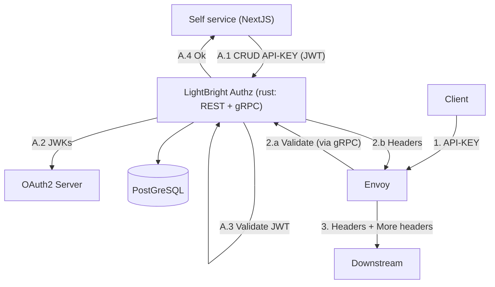

# Overall

## Graph

```mermaid
flowchart TD
    s["Self service (NextJS)"] -- "A.1 CRUD API-KEY (JWT)" --> l["LightBright Authz (rust: REST + gRPC)"]
    l -- "A.2 JWKs" --> o["OAuth2 Server"]
    l -- "A.3 Validate JWT" --> l
    l -- "A.4 Ok" --> s

    l --> b[(PostGreSQL)]
    a["Client"] -- " 1. API-KEY " --> g["Envoy"]
    g -- " 2.a Validate (via gRPC) " --> l
    l -- " 2.b Headers " --> g
    g -- " 3. Headers + More headers " --> d["Downstream"]


```
