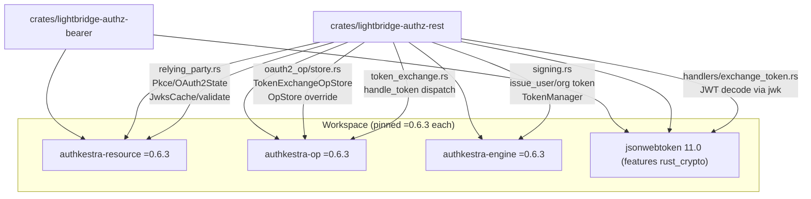

# Plan — authkestra family migration 0.6.3 → 0.7.0 (lockstep)

Status: **draft for maintainer review** · Date: 2026-08-31 · Source of truth:
`Cargo.toml` authkestra pin block (the `0.6.1/0.6.2` → `0.6.3` history), crates.io
`authkestra-{engine,op,resource}` version 0.7.0, this repo's `signing.rs` /
`oauth2_op/store.rs` / `lightbridge-authz-bearer` / `relying_party.rs` / `token_exchange.rs`.

This plan turns the **authkestra family** upgrade into concrete PR slices, names the
security-sensitive seams that decide the blast radius, and consolidates every
maintainer-reserved decision so none gets settled by accident in code.

> **Scope guard.** This is the *authkestra* family **only** — `authkestra-resource`,
> `authkestra-op`, `authkestra-engine`, and the coupled `jsonwebtoken` requirement string.
> It does **not** touch the **cratestack** family (`=0.9.4`) or the directly-pinned **sqlx** /
> axum / redis / etc. dependencies. Do not widen the diff past these four manifest lines.

---

## 1. The connection map (what the authkestra family touches)

Verified against the workspace manifests and the source that names these crates — this is the
complete blast radius a 0.6.3 → 0.7.0 bump can affect.



### Crate-level consumers

| Consumer | Crate(s) | What it consumes / the seam |
| --- | --- | --- |
| `lightbridge-authz-bearer` | `authkestra-resource`, `jsonwebtoken` | **JWT/JWKS validation** — `JwksCache`, `ValidationConfig`, `validate_jwt_generic` (in `src/lib.rs`), plus `jsonwebtoken::{Algorithm, Validation, decode_header}` for the `kid` presence check. |
| `lightbridge-authz-rest` | `authkestra-op`, `authkestra-engine`, `authkestra-resource`, `jsonwebtoken` | **Token minting** (`signing.rs` → `TokenManager::issue_*_with_extra`), **RFC 8693 exchange** (`oauth2_op/store.rs` → `OpStore::handle_token_exchange`/`handle_refresh_token` overrides), **RP leg / discovery** (`relying_party.rs`), **grant dispatch** (`token_exchange.rs` → `handle_token`), **JWT decode** (`handlers/exchange_token.rs`). |

### Code-level seams (in order of migration risk)

1. **`oauth2_op/store.rs` — `TokenExchangeOpStore`.** The single most load-bearing seam. It is a
   full hand-written reimplementation of RFC 8693 exchange/refresh, overriding
   `OpStore::handle_token_exchange` and `OpStore::handle_refresh_token`. Any signature/contract
   change to those defaulted trait methods, `TokenManager`, `TokenResponse`, `RefreshToken`,
   or the `store::OpStore` trait in 0.7.0 lands here first. Note: delegation to
   `default_handle_token_exchange` was deliberately rejected (stored in this file's header) — a
   0.7.0 change that makes the default *usable* does **not** automatically justify re-delegating.
2. **`signing.rs` — `TokenManager` minting.** Calls `TokenManager::new_asymmetric`,
   `issue_user_token_with_extra`/`issue_id_token_with_extra`, `take_jti` (CUID2 `jti`), and
   `authkestra_engine::auth::state::Identity`. This is where the `jti`-override contract (PR #215,
   CUID2 ADR-0039) and the `scope`-flattening behavior live on our side.
3. **`lightbridge-authz-bearer/src/lib.rs` — `JwksCache`/`validate_jwt_generic`.** Validates
   bearer tokens against Keycloak JWKS. The `kid`-presence check and the multi-value
   `audience` matching are thin Rust-side layers around `authkestra-resource` — mostly stable,
   but `ValidationConfig`/`JwksCache` API changes surface here.
4. **`relying_party.rs` — `Pkce`/`OAuth2State`/`ProviderMetadata`/discovery.** The RP leg. Two
   inline comments pin behavior to **"as of authkestra-engine 0.6.3"** — `ProviderMetadata`
   missing a RFC 8414 revocation field, and `ProviderMetadata::discover` URL derivation. These
   are version-sensitive and must be re-checked against 0.7.0.
5. **`token_exchange.rs` — `handle_token` dispatch.** Mirrors `authkestra_op::handlers::token`
   internals (`TokenRequest`, `authenticate_client`, `extract_credential`, `resolve_client_id`,
   `PresentedCredential`). Several `pub(crate)`-to-`authkestra-op` items are mirrored here because
   they are unreachable downstream — if 0.7.0 makes them public OR changes their shape, the mirror
   may shrink or must be re-verified.
6. **`handlers/exchange_token.rs` — `jsonwebtoken` decode.** Uses `jsonwebtoken::jwk::Jwk`,
   `DecodingKey`, `decode`. Coupled to whatever major `authkestra-*` resolves.

---

## 2. Ground truth (verified 2026-08-31)

- **Current pin (all three): `=0.6.3`.** Lockfile resolves `authkestra-*` at exactly `0.6.3`;
  `jsonwebtoken` at exactly `11.0.0`.
- **Latest publish (all three): `0.7.0`, cut today (2026-08-31)** — same-day as this plan. This
  is a **minor** (semver) bump, but authkestra's history (0.5.x → 0.6.x) showed breaking store-type
  changes inside a minor, so it must be treated as potentially breaking, not a no-op.
- **`authkestra-engine` 0.7.0 feature surface changed:** default is now
  `["token","rustls-aws-lc-rs"]` and it adds new feature families (`captcha`, `totp`, `webauthn`,
  `session`, `sql-*`). This repo only needs the `token` module — do **not** enable the new defaults
  blindly; verify which features `=0.7.0` pulls in and whether the `rustls-aws-lc-rs` default
  changes the crypto backend this repo's signing path actually uses.
- **`authkestra-op` 0.7.0 default is `["rustls-aws-lc-rs"]`** with `redis` / `sqlx-*` optional.
  This repo builds its own `RedisClientAssertionStore` — confirm the constructor signature under
  0.7.0 (same check the 0.5.4 bump required).
- **The lockstep rule is load-bearing:** all three `authkestra-*` lines share one upstream
  `[workspace.package] version` and currently use **exact `=` pins** (the `0.5.x` drift
  #404/#406 fix). Move all three together, or none.
- **`jsonwebtoken` is coupled to the family**: `lightbridge-authz-bearer` and `authkestra-*` must
  stay on the same `jsonwebtoken` **major**. The repo's documented gate is
  `grep -A1 '^name = "jsonwebtoken"' Cargo.lock` showing exactly ONE `11.x` entry. Check whether
  `authkestra` 0.7.0 still targets jsonwebtoken `11` before assuming the `11.0` pin holds.

---

## 3. PR slices

Ordered so each slice compiles and the workspace stays green throughout. **Each slice lands alone;
never combine two slices expecting to revert together.**

### Slice 0 — Recon on 0.7.0 (no code change; must clear before any bump)

- Fetch `authkestra` 0.7.0 CHANGELOGs and, per the repo's own house rule, ground-truth against
  upstream's GitHub compare API (like the 0.5.4→0.5.5 check) rather than trusting changelog prose.
- Answer these four gates before touching a version line:
  1. Does `authkestra-op` 0.7.0 still expose `OpStore::handle_token_exchange` /
     `handle_refresh_token` as overridable with unchanged signatures?
  2. Does `authkestra-engine` 0.7.0 keep `TokenManager` + `issue_*_with_extra` + `take_jti`
     unchanged (the CUID2 `jti` contract)?
  3. Which `jsonwebtoken` major does each 0.7.0 crate require? If it moved off `11`, the direct
     `jsonwebtoken = "11.0"` requirement must move with it (this is the coupling that broke
     `main` three times — #159/#166/#170).
  4. Which features does `=0.7.0` activate by default, and do they change this repo's crypto
     backend (rustls-provider / jsonwebtoken backend)? Declare the specific features explicitly if
     defaults would pull in `rustls-aws-lc-rs` where today it is `ring`-based.

- **Exit criterion:** a written verdict on gates 1–4 with line-level evidence. **Do not proceed to
  Slice 1 on "it might be fine".**

### Slice 1 — Manifest bump (compile only)

- In root `Cargo.toml`, move all three lines to `=0.7.0` together:
  `authkestra-resource`, `authkestra-op`, `authkestra-engine`.
- Adjust `jsonwebtoken` requirement / features ONLY if Slice 0 gate 3 says the major moved.
- If Slice 0 gate 4 says defaults changed the backend, encode the required feature set explicitly
  on the direct pins.
- Run `cargo check --workspace` (and `CARGO_BUILD_JOBS=4` if the machine is small). Fix compile
  breaks only — no behavioral rework yet.
- **Exit criterion:** `cargo check --workspace` green; `cargo metadata` confirms a single
  `authkestra-*` version each; `grep '^name = "jsonwebtoken"' Cargo.lock` shows one entry.

### Slice 2 — Seam-by-seam verification (the security-relevant part)

For **each** seam in §1, confirm behavior is preserved, not just that it compiles. The decisive
tests are named per seam below. **If a seam needed a code change in Slice 1, this slice adds the
regression test that would have caught it while it was still broken — prove the test fails on the
old code path before re-verifying.**

| Seam | Decisive test / gate |
| --- | --- |
| `oauth2_op/store.rs` exchange | RFC 8693 exchange flow tests in `crates/lightbridge-authz-rest/tests/` (token exchange path: subject-token validation via JWKS, not our own key; `account_id`/`project_id`/`quota_tier` claims stamped at mint time). |
| `oauth2_op/store.rs` refresh | REFUSED-not-defaulted on lookup failure; rotation via `rotate_exchange_refresh_token` CAS. |
| `signing.rs` minting | CUID2 `jti` (`lgbr:`-prefixed, never UUIDv4) still honored; `scope` still flattened; id-token claims unchanged. |
| `bearer` JWKS validation | `missing_kid_falls_back_to_first_key_in_authkestra_but_this_service_rejects_it` (this service must still reject a missing `kid` even though authkestra falls back). |
| `relying_party.rs` RP leg | PKCE/state round-trip; the RFC 8414 revocation-field comment (pinned to "as of 0.6.3") re-checked — if 0.7.0 added the field, decide whether to wire it (this is the #220 story) or leave the now-stale comment. |
| `token_exchange.rs` dispatch | Every grant type the repo registers still dispatches; `client_credentials` still *rejectable* for an unregistered client. |
| `exchange_token.rs` decode | JWT `jwk::Jwk` decode still works against the same issuer. |

- **Exit criterion:** every seam's decisive test passes AND at least one of them was demonstrated to
  catch a deliberately-broken seam during this migration (i.e., the tests are live, not green-by-rot).

### Slice 3 — Full gates (the repo's own commands, not reconstructions)

```bash
# Static + lint + check (the repo's canonical gate)
just all-checks

# Unit/contract tests
cargo test -p lightbridge-authz-rest

# Database-backed integration (needs compose postgres + redis up)
just it-tests
just it-idp        # OIDC/browser/device/token-exchange/revocation end-to-end against authz-idp
just it-servers    # JWT+authn coverage across API/MCP, basic-auth OPA, usage, probes
```

- **Exit criterion:** all of the above green **locally**, and the repo's own CI (self-hosted
  runner, `cargo clippy -- -D warnings`, `cargo check --all-targets --all-features`) green on the
  branch. No skipped tests: confirm a non-zero test count for the suites that gate this migration.

---

## 4. Decision register — reserved for the maintainer

These are **human decisions**, pulled out so none is settled silently in code:

- **[D1] Whether 0.7.0 is treated as breaking** — the 0.6.x precedent (unusable
  `#[non_exhaustive]` store types without constructors) says verify-don't-assume. If Slice 0 finds
  a real breaking change on any seam, the "bump" becomes a rework story and should be scoped
  against the seam, not the family.
- **[D2] The `relying_party.rs` revocation-endpoint field** — `relying_party.rs` pins a behavior
  to "as of authkestra-engine 0.6.3" and `signing.rs` carries a stale "revocation_endpoint is
  absent on purpose" callout. If 0.7.0 finally models RFC 8414 `revocation_endpoint`, wiring it in
  is a **separate** decision (it was explicitly deferred past earlier bumps to avoid conflicting
  with in-flight `signing.rs` rewrites). Do not fold it into this migration.
- **[D3] Delegation vs. reimplementation in `store.rs`** — even if 0.7.0 makes
  `default_handle_token_exchange` more reusable, re-delegating is a behavior change to the auth
  boundary. Keep the override unless the maintainer explicitly re-decides otherwise (see that
  file's header for the two independent reasons delegation is currently rejected).
- **[D4] crypto backend / rustls provider** — 0.7.0's defaults carry `rustls-aws-lc-rs`. If the
  repo's signing path currently relies on the `ring`-based `jsonwebtoken::rust_crypto` backend,
  the maintainer must choose whether to follow authkestra to `aws-lc-rs` or to pin the older
  backend explicitly. This is a supply-chain and binary-size decision, not a mechanical one.

---

## 5. Do NOT (anti-scope)

- Do **not** bump the cratestack family or any other workspace dep in these PRs — keep the diff to
  the four manifest lines from §1 (scope guard).
- Do **not** remove the exact `=` pins — they are the documented defence against the Dependabot
  lockfile-only float that broke `main` at #404/#406. A caret here is a regression.
- Do **not** let `just all-checks`' green stand in for the seam tests in Slice 2 — compile-clean is
  also what a papered-over fix produces. The gates are the seam tests, the RPC/exchange it-tests,
  and `just it-idp`.
- Do **not** open the PR as a blank issue/PR — use the dev-ticket form and the PR template, fill the
  AI Usage Declaration, link this plan + crates.io + upstream compare as source of truth, and attach
  verification evidence per the repo's [AI governance doctrine](https://adorsys-gis.github.io/ai-governance/).
