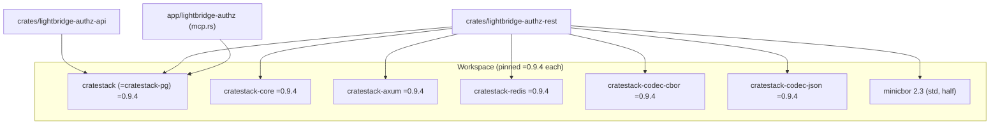

# Plan — cratestack family migration 0.9.4 → 0.10.0 (lockstep)

Status: **draft for maintainer review** · Date: 2026-08-31 · Source of truth:
`Cargo.toml` cratestack pin block (the 0.8.12 → 0.9.4 history), crates.io
`cratestack-{core,axum,pg,redis,codec-cbor,codec-json}` version 0.10.0, and this repo's
`schema/authz.cstack` + `auth_provider.rs` / `rpc_authorize.rs` / `codec.rs` / `rpc_it_tests.rs`.

This plan turns the **cratestack family** upgrade into concrete PR slices, names the
security-sensitive seams that decide the blast radius, and consolidates every
maintainer-reserved decision so none gets settled by accident in code.

> **Scope guard.** This is the *cratestack* family **only** — the six workspace-declared lines
> (`cratestack-core`, `cratestack-axum`, `cratestack-redis`, `cratestack` = `cratestack-pg`,
> `cratestack-codec-cbor`, `cratestack-codec-json`) plus the directly-pinned companion
> **`minicbor`** that this repo depends on for the decode-side codec. It does **not** touch the
> **authkestra** family (`=0.6.3`), **sqlx**, or anything else. Do not widen the diff past these
> seven manifest lines.

---

## 1. The connection map (what the cratestack family touches)

Verified against the workspace manifests and the source that names these crates — the complete
blast radius a 0.9.4 → 0.10.0 bump can affect. Note the cratestack family is **twelve** crates in
the lockfile (the six declared lines plus `cratestack-client-rust`, `-macros`, `-parser`,
`-policy`, `-sql`, `-sqlx` transitively) — all share one upstream workspace version and all will
bump together.



### Crate-level consumers

| Consumer | Cratestack crates | What it consumes / the seam |
| --- | --- | --- |
| `lightbridge-authz-api` | `cratestack` (pg) | **Schema codegen** — `include_server_schema!` over `schema/authz.cstack`; produces the generated model/router/procedure client this and the other crates consume. Any schema/parser/policy/SQL change in the bump lands here first and changes the generated surface for everyone. |
| `lightbridge-authz-rest` | `cratestack-core`, `-axum`, `-redis`, `-pg`, `-codec-cbor`, `-codec-json`, `minicbor` | **The RPC/CRUD runtime**: `rpc_router`/`model_router` call sites in `lib.rs`, the per-op-id RBAC gate (`rpc_authorize.rs` + `auth_provider.rs`'s `CratestackAuthProvider`), the CBOR wire codec (`codec.rs`'s `LenientCborCodec`), Redis rate limiting/idempotency (`ratelimit_redis.rs`, `oauth2_op/*store.rs`), and the hand-written `Procedures` (ADR-0010). |
| `app/lightbridge-authz` | `cratestack` (pg) | **MCP CRUD tools** (`mcp.rs`) build `schema::Cratestack` over cratestack's pool — the generated schema client + `CratestackContext`. |

### Code-level seams (in order of migration risk)

1. **`/rpc/batch` authentication (the "FOURTH OCCURRENCE"/`RESOLVED` seam).** `auth_provider.rs`'s
   `CratestackAuthProvider` + `rpc_authorize.rs` were reworked against cratestack 0.8.4's
   once-per-envelope `CachedAuthProvider` contract; since then the coarse per-op-id RBAC gate moved
   into `authz.cstack`'s `@allow`/`@@allow` clauses, driven off
   `rpc_authorize::MAPPED_OP_ID_PERMISSIONS` (kept in sync by the generated `schema_policy_sync`
   CI test). **This is the highest-yield seam**: any change in 0.10.0 to `AuthProvider`/
   `CachedAuthProvider`, `/rpc/batch` dispatch, or `@allow`/`@@allow` policy evaluation semantics
   lands here and is security-critical.
2. **`schema/authz.cstack` + schema codegen.** `@allow`/`@@allow`/`@deny`/`@@deny` clauses, model
   `@@id`/relation filter forms, procedure declarations. The 0.9.4 pin block records that the
   field-level `@allow`/`@deny` → parse-error change (0.8.7) and `@computed` resolvers (0.8.11)
   were both checked against this schema (zero hits). Re-run those greps against 0.10.0 semantics.
3. **`codec.rs` — `LenientCborCodec`.** Wraps `CborCodec` for the wire-level `undefined`→`null`
   decode normalization (the encode-side was deleted in 0.8.6 when upstream fixed it). Any change
   to `cratestack_codec_cbor::CborCodec` decode behavior is the risky spot. Pinned by the byte-level
   (`0xf6` vs `0x80`) regression tests in `codec.rs`.
4. **`rpc_router` / `model_router` call sites (`lib.rs`).** The 0.8.11 bump added a `resolvers`
   parameter (`()` here since no `@computed` fields). If 0.10.0 changes the router signature
   again, both `build_api_router` and `build_budget_router` call sites change.
5. **cratestack-redis (`ratelimit_redis.rs`, `oauth2_op/client_assertion_store.rs`,
   `device_store.rs`).** `RateLimitStore`/`RedisRateLimitStore` and `RedisIdempotencyStore`
   constructors + behavior. The 0.4.16 connection-per-call fix history makes this a known
   flake-spot.
6. **`app/lightbridge-authz/src/mcp.rs`.** The generated cratestack client + `CratestackContext`
   projection for the MCP CRUD tools.

---

## 2. Ground truth (verified 2026-08-31)

- **Current pin: `=0.9.4` (all six declared lines); lockfile confirms all twelve cratestack crates
  at `0.9.4`** (the transitive `-client-rust`, `-macros`, `-parser`, `-policy`, `-sql`, `-sqlx`
  too). Companion `minicbor = "2.3"` (`features = ["std","half"]`).
- **Latest publish: `0.10.0`, cut today (2026-08-31)**, same-day as this plan — the family jumped
  `0.9.4 → 0.10.0` with no intermediate 0.9.x. This is a **minor** (semver) bump, but cratestack's
  history shows breaking changes inside minors (0.8.4 `/rpc/batch`, 0.8.7 `@allow` parse-error,
  0.8.11 router-signature/`@computed`), so it must be treated as potentially breaking.
- **`rust-version` for 0.10.0 is `1.98.0`, edition 2024** — verify the workspace toolchain / CI
  nightly-msrv can compile it (this repo's own `rust-version` and the pinned toolchain must be
  `1.98.0` or newer).
- **gRPC/protobuf is already gone** — `cratestack-pg` 0.9.x and 0.10.0 list no `grpc` feature
  (present only through 0.8.4), matching the Cargo.toml note that cratestack removed it (`#655`).
  Not a migration concern.
- **The lockstep rule is load-bearing — and larger than the six declared lines.** All twelve
  lockfile crates share one upstream workspace version. Dependabot is grouped on `cratestack*`
  into one PR; the exact `=` pins make a silent lockfile-only float fail resolution. Move all six
  declared lines together, and confirm the six transitive crates follow.
- **Two prior Dependabot drift incidents** (0.5.1-left-behind via the `{ package = ... }` table
  shape; and the `cratestack` ≈ `cratestack-pg` line being the one repeatedly left behind) are the
  exact failure to guard against when bumping by hand.

---

## 3. PR slices

Ordered so each slice compiles and the workspace stays green throughout. **Each slice lands alone;
never combine two slices expecting to revert together.**

### Slice 0 — Recon on 0.10.0 (no code change; must clear before any bump)

- Fetch cratestack's 0.10.0 CHANGELOG, and ground-truth the Rust-facing entries against upstream's
  git/compare API (per the repo's house rule — changelog prose is not evidence).
- Answer these five gates before touching a version line:
  1. Does `AuthProvider`/`CachedAuthProvider` and `/rpc/batch` dispatch keep the exact contract
     `auth_provider.rs`/`rpc_authorize.rs` are built on (once-per-envelope `authenticate`, per-frame
     `@@allow` re-entry)? Any change is a security-relevant rework, not a version bump.
  2. Does `@allow`/`@@allow`/`@deny` / `@@deny` policy evaluation semantics change? (Re-grep
     `authz.cstack` for field-level `@allow`/`@deny` and `@custom` as the 0.9.4 block did.)
  3. Do `rpc_router`/`model_router` signatures change (like 0.8.11's `resolvers` param)?
  4. Does `cratestack_codec_cbor::CborCodec` decode behavior change (`undefined` → `null`)?
  5. Does the MSRV move past what this workspace's pinned toolchain supports?
- **Exit criterion:** a written verdict on gates 1–5 with line-level evidence. **Do not proceed to
  Slice 1 on "it might be fine"** — this is the family with the documented `-D warnings`-breaking
  and wholesale-403 regression history.

### Slice 1 — Manifest bump (compile only)

- In root `Cargo.toml`, move all six declared lines to `=0.10.0` together:
  `cratestack-core`, `cratestack-axum`, `cratestack-redis`, `cratestack` (=`cratestack-pg`),
  `cratestack-codec-cbor`, `cratestack-codec-json`.
- Adjust `minicbor` / add any needed features **only** if Slice 0 gate 4 says the codec API surface
  requires it.
- Run `cargo check --workspace` (drop `--all-features` if the goose load-test tree is the memory
  hog, per AGENTS.md). Fix compile breaks only — no behavioral rework yet.
- **Exit criterion:** `cargo check --workspace` green; `cargo metadata` confirms **a single
  version each** for every `cratestack-*` package (this is the documented pass/fail gate — the
  exact check the Cargo.toml insists on, not `cargo tree -d`).

### Slice 2 — Seam-by-seam verification (the security-relevant part)

For **each** seam in §1, confirm behavior is preserved, not just that it compiles. The decisive
tests are named below. **If a seam needed a code change in Slice 1, this slice adds the regression
test that would have caught it while it was still broken — prove it fails on the old code path
before re-verifying.**

| Seam | Decisive test / gate |
| --- | --- |
| `/rpc/batch` auth (seam 1) | `rpc_it_tests.rs`'s `batch_rpc_frames_succeed_and_fail_independently`, `batch_rpc_frames_enforce_permission_per_frame`, `budget_gated_op_ids_are_unreachable_on_authz_api_even_for_an_admin`. **These are the three that caught the wholesale-403 regression at 0.8.4 — they must all pass AND must be shown to fail if a batch frame is given the wrong permission.** |
| Schema-policy sync | `schema_policy_sync` (the permanent CI drift check that `authz.cstack` stays in sync with `rpc_authorize::MAPPED_OP_ID_PERMISSIONS`). |
| CBOR codec (seam 3) | The byte-level (`0xf6` vs `0x80`) regression tests in `codec.rs` (undefined → null decode). |
| Redis rate limiting/idempotency (seam 5) | The `it-tests` RPC/rate-limit suite — the connection-per-call fix history (0.4.16) makes this the known flake-spot. |
| MCP CRUD tools (seam 6) | `app/lightbridge-authz` MCP tool tests + `just it-servers` (JWT+authn coverage incl. MCP). |
| Router call sites (seam 4) | Compile + the `lib.rs` router-assembly unit/contract tests. |

- **Exit criterion:** every seam's decisive test passes AND at least one of them was demonstrated
  to catch a deliberately-broken seam during this migration (the tests are live, not green-by-rot).

### Slice 3 — Full gates (the repo's own commands, not reconstructions)

```bash
just all-checks          # fmt + clippy (-D warnings) + cargo check --all-targets --all-features
cargo test -p lightbridge-authz-rest
just it-tests            # database-backed, incl. the rpc_it_tests batch/scope tests + redis
just it-servers          # JWT+authn coverage API/MCP/OPA, basic-auth, usage, probes
just it-idp              # unaffected by cratestack, but part of the repo's gate for a full green
```

- **Exit criterion:** all of the above green **locally**, and the repo's own CI green on the
  branch — including the self-hosted `-D warnings` clippy gate. No skipped tests: confirm a
  non-zero test count for the RPC-batch and schema-policy suites. Watch
  `batch_rpc_frames_enforce_permission_per_frame` / `budget_gated_op_ids_*` specifically on
  anything in `crates/lightbridge-authz-rest/src/auth_provider.rs` / `rpc_authorize.rs`.

---

## 4. Decision register — reserved for the maintainer

These are **human decisions**, pulled out so none is settled silently in code:

- **[D1] Whether 0.10.0 is treated as breaking.** If Slice 0 finds a change to the `/rpc/batch`
  auth contract or `@@allow` policy evaluation, the "bump" becomes a rework story scoped to
  that seam (the 0.8.4 precedent), not something to force through the version pin.
- **[D2] MSRV / toolchain support.** 0.10.0 declares `rust-version 1.98.0`. If the workspace's
  pinned toolchain or CI image is older, decide whether to raise it as part of this bump or defer
  the whole migration — do not build on a toolchain that silently can't compile the target.
- **[D3] The `cratestack-pg` manifest-line shape.** The exact `=` pin on the `{ package =
  "cratestack-pg", ... }` line has been the "left behind" line in **both** prior Dependabot drift
  incidents. For a hand bump, keep all six lines together (non-negotiable); the maintainer may
  also consider whether dependabot's behavior on this line needs revisiting (already called out in
  the pin block as "strong enough signal to stop trusting Dependabot with this line").
- **[D4] Schema-codegen churn.** If 0.10.0 regenerates `authz.cstack`'s Rust output with
  wide-reaching diffs, get explicit sign-off on the generated-surface change (it ripples into
  `lightbridge-authz-rest` and MCP). Do not fold unrelated schema improvements into this bump.

---

## 5. Do NOT (anti-scope)

- Do **not** bump the authkestra family or any other workspace dep in these PRs (scope guard).
- Do **not** remove the exact `=` pins — the documented defence against the Dependabot
  lockfile-only float that broke `main` twice.
- Do **not** use `cargo tree -d | grep cratestack` as the single-version pass/fail gate — the
  Cargo.toml explicitly records that this check is not zero even on a consistent tree. Use
  `cargo metadata` (or equivalent) to confirm exactly one version per `cratestack-*` package.
- Do **not** let `just all-checks`' green stand in for the Slice 2 seam tests — compile-clean is
  also what a papered-over fix produces. The gates are the three RPC-batch tests,
  `schema_policy_sync`, and the codec byte-level tests.
- Do **not** open the PR as a blank issue/PR — use the dev-ticket form and the PR template, fill
  the AI Usage Declaration, link this plan + crates.io + upstream changelog/compare as source of
  truth, and attach verification evidence per the repo's
  [AI governance doctrine](https://adorsys-gis.github.io/ai-governance/).
