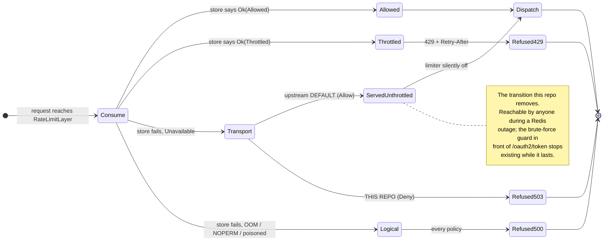
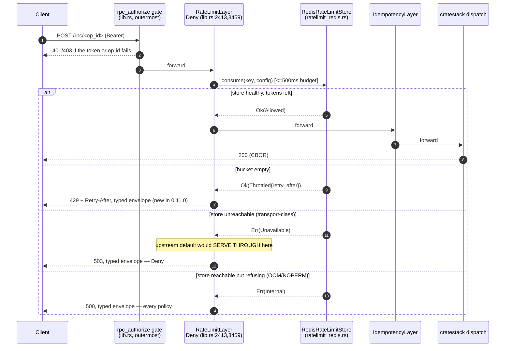

# Plan — cratestack family migration 0.10.0 → 0.11.0 (lockstep)

Status: **executed** · Date: 2026-09-03 · Source of truth:
[cratestack v0.11.0 release](https://github.com/cratestack/cratestack/releases/tag/v0.11.0),
[cratestack#869](https://github.com/cratestack/cratestack/pull/869) (closing
[cratestack#846](https://github.com/cratestack/cratestack/issues/846)), and this repo's
`Cargo.toml` cratestack pin block, `crates/lightbridge-authz-rest/src/lib.rs`,
`crates/lightbridge-authz-rest/src/oauth2_op/device_store.rs` and
`crates/lightbridge-authz-api/schema/authz.cstack`.

Successor to `docs/plans/cratestack-0.10.0-migration.md`, and deliberately much shorter than it:
0.10.0 was a wide sweep with nothing reachable; 0.11.0 is a narrow bump with **exactly one**
reachable change, and that change is a security default. This document is about that one decision.

> **Scope guard.** The *cratestack* family only — the six workspace-declared lines
> (`cratestack-core`, `cratestack-axum`, `cratestack-redis`, `cratestack` = `cratestack-pg`,
> `cratestack-codec-cbor`, `cratestack-codec-json`). Not the **authkestra** family (`=0.7.1`), not
> `sqlx`, not `minicbor`. Six manifest lines plus the two call sites §4 names.

---

## 1. What actually moved

`0.10.0 → 0.11.0`, with `0.10.1` in between. `0.10.1` is inert here: a vscode-extension rename, a
CI auth fix for the Marketplace publish, and the workspace version bump
(cratestack#861/#862/#863) — nothing Rust-runtime-facing.

`0.11.0`'s eight PRs, classified against this repo:

| Upstream PR | What it is | Reachable here? |
| --- | --- | --- |
| **#869** | `RateLimitLayer` store-failure policy flips to fail-open for transport-class failures; both tower layers' error bodies become codec-negotiated; `CratestackError::TooManyRequests` added | **YES — §2, §3, §4** |
| #870 | Declarative `query <name>(args): Type` block in the parser/macros | No — §5 |
| #868 | musl (Alpine) napi platform packages for `@cratestack/cbor-node` | No (npm side; lands in converse-frontends) |
| #866 | `examples/rpc-client` | No |
| #872 | Example lockfile refresh after #869 | No |
| #864, #865, #873 | vscode extension display name, docs, version bump | No |

All twelve lockfile crates moved in lockstep — the six declared plus the transitive
`cratestack-client-rust`, `-macros`, `-parser`, `-policy`, `-sql`, `-sqlx`. The historical
Dependabot failure mode (the `cratestack = { package = "cratestack-pg", … }` **table** line being
left behind while the five bare `name = "x.y.z"` lines move) was checked explicitly and did not
recur; the bump was done by hand across all six.

---

## 2. The one decision: cratestack#869 flipped a security default

Before 0.11.0, any `RateLimitStore::consume` error became a `500`. In 0.11.0 the layer takes a
`StoreErrorPolicy`, **defaulting to `Allow`**, which serves the request **unthrottled** when — and
only when — the failure is *transport-class* (`CratestackError::Unavailable`: the socket broke, the
server is unreachable, or the new 500ms `with_store_timeout` budget elapsed). A store that is
*reachable and refusing* (`OOM`, `NOPERM`, a poisoned mutex, a malformed reply) stays closed under
every policy, because that class is caller-inducible.

Upstream's argument is a capacity-control argument and it is a good one: a limiter that exists to
protect capacity should degrade to *unlimited* rather than take every rate-limited route down with
it, for a condition nobody in the request path can fix.

### Why this repo says no



The `Transport --> ServedUnthrottled` edge is the whole disagreement. Three reasons it is wrong
here, in order of weight:

1. **This limiter is a security control, not a capacity control.** It is the per-principal
   brute-force guard in front of the CRUD RPC surface and (via the same store) the device-code
   verification path of an *authorization server*. "Degrade to unlimited" for a capacity limiter is
   graceful; for a brute-force guard it is the failure. `StoreErrorPolicy`'s own doc comment names
   this exact case as the reason `Deny` exists ("a paywall, a brute-force guard").
2. **This repo already made the same call, by hand, at the one call site that had a choice.**
   `oauth2_op::device_store::get_by_user_code_rate_limited`
   (`crates/lightbridge-authz-rest/src/oauth2_op/device_store.rs`) consults the *same*
   `RateLimitStore` directly rather than through a layer, and its `Err(_)` arm returns
   `OpError::Storage` with the comment *"rate limit store unavailable, refusing device code lookup
   fail-closed"*, citing "this repo's general 'an unavailable dependency must never become the
   permissive branch' rule". Accepting upstream's default would have left three call sites
   disagreeing about the same store, with the two layered ones silently permissive.
3. **Upstream's own out-of-scope note applies to us with force.** #869 explicitly does *not* fix
   the unbounded-keyspace primitive its security review found (`default_key_fn` hashes an
   unvalidated `Authorization` header, so an unauthenticated caller mints one Redis key per
   request; tracked as cratestack#871). Under `Allow`, the path from that primitive to a *global*
   limiter bypass is: mint keys → drive Redis toward `maxmemory` → … which #869 closes only because
   `OOM` is classified logical. That classification lives in the *backend*
   (`cratestack-redis`'s `is_transport_class`) and is documented, not type-enforced. `Deny` does
   not depend on the classification being right.

**Decision: `StoreErrorPolicy::Deny` on every `RateLimitLayer` this repo builds.**

**Accepted consequence, stated plainly:** a Redis outage now refuses rate-limited requests (`503`,
the store's own status) instead of serving them unthrottled. That is the *pre-0.11.0* behaviour
this repo already shipped and operated, minus the opaque body — 0.11.0 renders the refusal through
the codec-negotiated envelope, so a generated client decodes `UNAVAILABLE` rather than
`unrecognized error body`. This is a **restoration**, not a new risk posture, and it is the
difference between an outage that is visible and one that is silent.

**`DEFAULT_STORE_TIMEOUT` (500ms) is left at upstream's default and this is deliberate.** Under
`Allow` that timeout is the risky knob — a slow Redis becomes a *partial* fail-open. Under `Deny`
it cannot open anything; it only bounds how long a request waits before being refused, which is a
strict improvement over the unbounded `ConnectionManager` reconnect it replaces (upstream's review
measured 9.46s, doubled to 18.92s by the retry).

---

## 3. The other half of #869: typed middleware error bodies

Every response the `RateLimitLayer` and `IdempotencyLayer` emit *themselves* — the throttled `429`,
an identity refusal, a `Deny`d store failure, an idempotency conflict — now carries the framework's
codec-negotiated error envelope (`CratestackErrorResponse` for REST, `RpcErrorBody` for RPC) chosen
by the same `Accept` negotiation handlers already use, instead of a bare `text/plain` string.
Negotiation never rewrites the status. `CratestackError` also gained an additive
`TooManyRequests` variant (`TOO_MANY_REQUESTS`, gRPC `resource_exhausted`).

**Rust-side impact: none, verified rather than assumed.**

- No exhaustive `match` on `CratestackError` exists in this workspace (it is `#[non_exhaustive]`
  upstream anyway, so one could not compile). Grep across `crates/` and `app/`: every use is either
  a constructor, a return type, or a `matches!(…, CratestackError::BadRequest(_))`-style single-arm
  check.
- No test asserted on a middleware error body as text. Grep for `429`, `TOO_MANY_REQUESTS`,
  `resource_exhausted`: the only hits are unrelated (`PR #429` in comments, a gateway comment in
  `reset_scheduler.rs`).
- The one test that *does* traverse the dead-store path,
  `rpc_router_tests::rbac_gate_on_the_batch_endpoint_requires_a_valid_token_then_forwards`, asserts
  `status != 401 && status != 403` rather than a literal, so the `500 → 503` shift under `Deny`
  passes it unchanged.

**Downstream impact: real, and it is a different repo.** The console's CBOR runtime
(`packages/authz-rpc/src/runtime.ts` in converse-frontends) maps error bodies to typed codes; a
middleware-emitted body used to be the un-decodable case it fell back on. That mapping moves with
this bump — the two repos' cratestack versions must stay in lockstep, as the pin block has said
since 0.10.0.

---

## 4. What changed in this repo

Six manifest lines in `Cargo.toml` (`=0.10.0` → `=0.11.0`, the `cratestack-pg` **table** entry
included), the lockfile's twelve crates, and:

| File | Change |
| --- | --- |
| `crates/lightbridge-authz-rest/src/lib.rs` | New `RATE_LIMIT_STORE_ERROR_POLICY: StoreErrorPolicy = Deny` const with the full rationale; `StoreErrorPolicy` added to the `cratestack::ratelimit` import; **both** `RateLimitLayer::new(…)` call sites (`build_api_router` and `build_budget_router`) chain `.with_store_error_policy(…)` |
| `crates/lightbridge-authz-rest/tests/rpc_router_tests.rs` | `AlwaysFailingRateLimitStore` + two guards — one per failure class (§6) |
| `Cargo.toml` | Pin-block history entry, in the format every prior bump used |
| `docs/plans/cratestack-0.11.0-migration.md` | This file |

The two layer call sites, after:



---

## 5. Checked and confirmed not reachable

- **cratestack#870, the declarative `query` block.** Additive syntax, and the parser dispatches it
  only on a *top-level* line beginning `query ` (`cratestack-parser-0.11.0/src/parse/mod.rs:217`).
  `authz.cstack:1975` has a field named `query` — `query String`, inside `type SearchUsersInput` —
  which is a different parse context and does not collide. Not assumed: the schema still expands
  (the workspace builds) and `schema_policy_sync_tests` is green.
- **The seams every prior sweep re-checks.** `@@allow`/`@allow` policy evaluation, `LenientCborCodec`
  and the `undefined`→`null` CBOR normalization, `push_scoped_conditions`,
  `AuthProvider`/`CachedAuthProvider`, the `rpc_router`/`model_router` signatures, and `/rpc/batch`
  dispatch — none changed between 0.10.0 and 0.11.0. The `codec_undefined_regression_tests` and
  `schema_policy_sync_tests` binaries are the standing proof and are green.
- **`cratestack-axum` gained `cratestack-codec-cbor`/`-codec-json` as normal (not dev) deps.** Both
  were already unconditional dependencies of `cratestack-pg`, which this workspace pulls, so the
  dependency graph is unchanged here. `cargo deny check` confirms: advisories, bans, licenses,
  sources all ok.

---

## 6. Evidence

Verification ran against an **isolated** Postgres + Redis (`cs011-pg` on `:15532`, `cs011-redis` on
`:16479`) started for this migration, not the shared `just it-tests` stack, because ports 5432/6379
were held by another worktree's containers. Migrations applied with
`sqlx migrate run --source migrations` (55 files, exit 0). `CARGO_TARGET_DIR` was private to this
worktree.

```text
$ cargo fmt --all --check                                                → exit 0
$ cargo clippy --workspace --all-targets --all-features -- -D warnings   → exit 0
$ cargo deny check     → advisories ok, bans ok, licenses ok, sources ok
$ cargo test --workspace --no-fail-fast   (DATABASE_URL/AUTHZ_REDIS_URL set)
      777 passed, 0 failed, exit 0
$ cargo test -p lightbridge-authz-api-key    --features it-tests --tests   → 0 failed
$ cargo test -p lightbridge-authz-budget     --features it-tests --tests   → 0 failed
$ cargo test -p lightbridge-authz-rest       --features it-tests --no-fail-fast
      686 passed, 0 failed, exit 0   (39 binaries)
$ cargo test -p lightbridge-authz            --features it-tests --test mcp_tool_it_tests
      3 passed, 0 failed
$ cargo test -p lightbridge-authz                     # MCP drift guard
      tests/mcp_parity_tests.rs   → 7 passed, 0 failed
$ cargo test -p lightbridge-authz-usage-rest --features it-tests --test repo_it_tests
      33 passed;  spend_query_it_tests → 6 passed;  scope_ownership_it_tests → 15 passed
```

`clippy` is run with `--all-features`, matching the `justfile`'s `all-checks` recipe. Without
`--all-features` three pre-existing dead-code/unused-import warnings surface in
`lib_tests.rs`/`signing_tests.rs`; they are feature-gated helpers, present on `origin/main`, and
unrelated to this bump.

One flake, reported rather than hidden: on the first full `-p lightbridge-authz-rest --features
it-tests` run, `multi_account_ownership_it_tests::a_stranger_cannot_see_or_write_into_someone_elses_secondary_account`
failed in *setup* with a `500` from `createAccount`. It passes serially
(`--test-threads=1`, 6/6) and passed on the immediately following full-parallelism rerun (686/686).
It is a shared-database collision between parallel tests, not a cratestack regression — the failing
step is account creation, which does not touch the rate limiter or any changed surface.

### The guard was broken on purpose

A test only ever seen green is not evidence that it guards anything. With
`RATE_LIMIT_STORE_ERROR_POLICY` flipped from `Deny` back to `Allow` — i.e. accepting upstream's
default — the transport-class guard fails and the logical one still passes, which is exactly the
asymmetry §2 predicts:

```text
test a_logical_rate_limit_store_failure_is_refused_too ... ok
test a_transport_class_rate_limit_store_failure_is_refused_not_served_unthrottled ... FAILED

assertion `left == right` failed: an unreachable rate-limit store must REFUSE (503, the store's
own status), not serve the request through unthrottled -- cratestack 0.11.0's
StoreErrorPolicy::Allow default is opted out of in lib.rs. ...
  left: 500
 right: 503

test result: FAILED. 1 passed; 1 failed; 23 filtered out
```

The `left: 500` is the bypass, reproduced: under `Allow` the request was **served through** the
limiter and only then failed downstream against this test file's deliberately unreachable Postgres.
Restored to `Deny` → `test result: ok. 2 passed; 0 failed`.

The guards inject a store, not a socket: `AlwaysFailingRateLimitStore` returns a chosen
`CratestackError` on every `consume`. Deliberate — the file's existing `DEAD_REDIS` constant is the
literal `redis://127.0.0.1:6379`, and whether that is actually dead depends on the developer's
machine (it was *live* on the machine this migration ran on, held by an unrelated container). A
security property must not rest on a premise a stray local Redis can falsify.

---

## 7. Not verified

- **No cross-region / real-outage measurement.** The 500ms `with_store_timeout` default is reasoned
  about (§2) and left at upstream's value; it was not measured against a severed TCP proxy. Under
  `Deny` a timeout can only cause a refusal, never a bypass, which is why this was judged
  acceptable rather than chased.
- **The Redis-backed `RedisRateLimitStore` retry-once behaviour** (#869 also added one) is exercised
  only through upstream's own tests. This repo's `ratelimit_redis_tests` cover construction, not a
  mid-flight connection drop.
- **The frontend half.** The typed-error-body change is wire-visible and the converse-frontends
  console runtime moves with it in its own PR; nothing here proves the two agree end to end.
- **`it-authorino` / `it-servers` / `it-idp`** (the Docker-compose service integration suites) were
  not run: they bind the same 5432/6379 ports another worktree holds. The Rust-level equivalents of
  what they cover (`rpc_it_tests`, `budget_rpc_it_tests`, `idp_server_tests`, `mcp_tool_it_tests`)
  all ran green against a real database.
