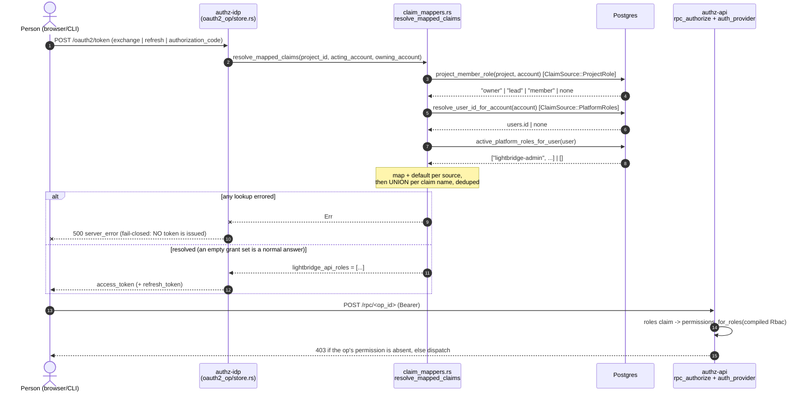
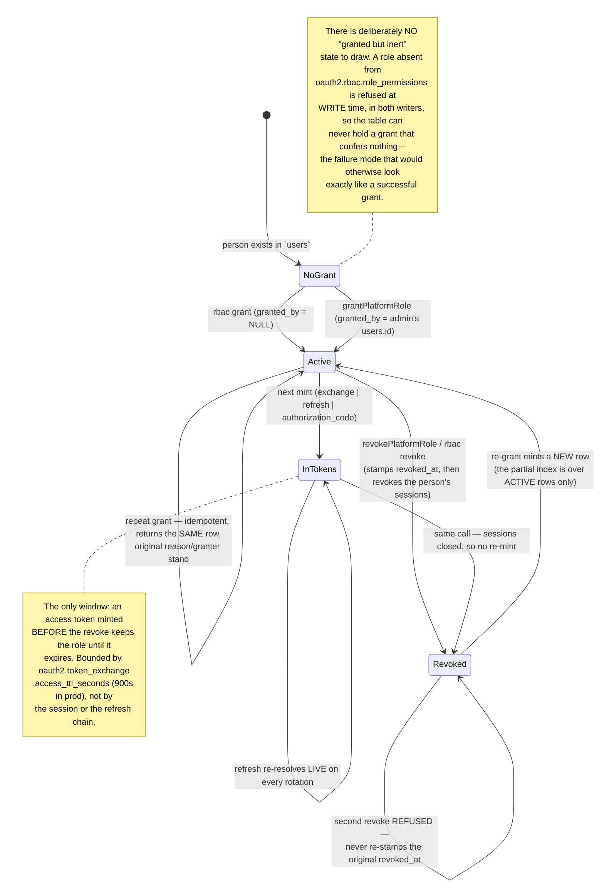

# RBAC: JWT claim → permission mapping

Authentication is delegated to Keycloak; **authorization** is decided here. Every request to the
CRUD API (`authz-api`) and the MCP server (`lightbridge-mcp`) is gated on a **permission**. This
document describes how the roles on a JWT become permissions, which permission each operation
requires, and — since ADR-0033 — **where those roles come from in the first place**.

> **Roles are not a Keycloak fact.** On the human plane `authz-idp` is the issuer, and it stamps
> the roles claim itself from data this deployment owns: the `project_members` roster, and
> `platform_role_grants` (ADR-0033). Nothing is read back from Keycloak, ever, and nothing is
> written to it — the ADR-0014 pattern. See
> [Platform roles are a table](#platform-roles-are-a-table-adr-0033), which is the section to read
> first if your question is "why is this person an admin".

> Ownership still applies. RBAC is a *coarse capability* check (may this caller create projects at
> all?). Account ownership (`accounts.id = sub`) and the per-row `project_members` roster still
> decide *which* accounts/projects a caller can touch. A request must pass **both**: the RBAC gate
> (or it is `403 Forbidden`) and the membership check (or it is `404 Not Found`).

## How it works

1. The issuer mints a JWT carrying the caller's roles in a single, flat, top-level claim. On the
   human plane that issuer is **`authz-idp`**, and the claim is assembled at mint time by
   `oauth2.signing.claim_mappers` (see below) from this deployment's own tables.
2. `lightbridge-authz-bearer` validates the JWT (JWKS) and reads that claim by name.
3. Each role string is mapped to a set of permissions via configuration.
4. The union of those permissions is attached to the request.
5. A single enforcement point checks the permission the requested operation needs; a caller who
   lacks it is rejected with `403 Forbidden` before the handler runs.

Enforcement is centralized, so the handlers/tools themselves contain no authorization code:

- **CRUD API (RPC)** — an `rpc_authorize` middleware
  (`crates/lightbridge-authz-rest/src/rpc_authorize.rs`) wraps the cratestack RPC router as its
  **outermost** layer. For every `POST /rpc/{op_id}` it extracts the bearer token, validates it via
  the same `BearerTokenServiceTrait` used everywhere (reusing the `TokenInfo.permissions` set it
  already computes), maps the `op_id` to the required permission, and rejects with `403 Forbidden`
  **before the request reaches cratestack's dispatch** if the token lacks it. It **fails closed**: an
  unmapped op-id and any missing/invalid token are denied. `POST /rpc/batch` is a special case — see
  "Batch RPC: per-frame RBAC" below.
- **CratestackAuthProvider** (`crates/lightbridge-authz-rest/src/auth_provider.rs`) enforces the
  *same* `op_id` → permission map a second time, from inside cratestack's own dispatch. Redundant for
  a unary call (already checked by `rpc_authorize` above — `request.path` is that call's own
  canonical path both before and after cratestack 0.8.4). For `POST /rpc/batch`, cratestack 0.8.4
  changed this: the provider is now invoked exactly **once per envelope**, not once per frame (a new
  `CachedAuthProvider` caches the one resulting context and reuses it for every frame's dispatch), so
  it can no longer see an individual frame's op-id to authorize it here at all. See "Batch RPC:
  per-frame RBAC" below for where per-frame enforcement actually happens post-0.8.4.
- **MCP** — `call_tool` maps the tool name to the required permission and checks it before
  dispatching. It likewise fails closed (an unmapped tool name is rejected).

### Two gates on the CRUD surface, in order

The CRUD surface (`authz-api`) migrated to cratestack-generated RPC routing (see
`docs/adr/0003-cratestack-crud-migration.md`). Authorization there is now **two independent layers,
both mandatory, evaluated in this order**:

1. **RBAC gate (coarse capability) — first.** The `rpc_authorize` middleware above. Answers "may
   this caller perform this *kind* of operation at all?" A caller lacking the permission gets
   `403 Forbidden` and the request never reaches cratestack. This is the layer this document's
   `op_id` → permission table defines.
2. **Membership policy (per-tenant ownership) — second.** cratestack's generated `@@allow` policies
   on the schema (`crates/lightbridge-authz-api/schema/authz.cstack`), which check
   `account.id == auth().id || members.some.accountId == auth().id`. Answers "does this specific
   account/project/key belong to this caller, or to a project they sit on?" A non-member gets a
   policy-driven empty result / `404`.

So a `lightbridge-viewer` who is a legitimate account member is still blocked from
create/update/delete by gate 1 (they hold only `*:read`), and a `lightbridge-editor` acting on an
account they do **not** belong to passes gate 1 but is stopped by gate 2. Both must pass.

RBAC enforcement on non-CRUD paths — OPA/Authorino validation and `/idp/v1/resolve-context` (Basic
auth, outside RBAC) — is unchanged, and the MCP enforcement above is unaffected.

### Batch RPC: per-frame RBAC

`POST /rpc/batch` bundles multiple ops in one JSON array of frames (`{id, op, input}`), each
carrying its own `op` (op-id). `rpc_authorize` is a URL-derived, whole-HTTP-request gate — it has no
visibility into the frames inside the body, so it cannot check a single permission for the batch call
the way it does for `POST /rpc/{op_id}`, and neither can `CratestackAuthProvider::authenticate`
(cratestack 0.8.4 authenticates a batch envelope exactly once, before it is even split into frames —
see the bullet above). Since #383/#400, per-frame enforcement instead moves into the schema itself:

1. **`rpc_authorize`** requires only that the caller present *some* valid, active bearer token, then
   forwards the request — a wholly unauthenticated batch call still gets a clean top-level `401`
   rather than a `200` envelope full of per-frame `unauthenticated` errors.
2. **`CratestackAuthProvider::authenticate`** builds ONE `CratestackContext` for the whole envelope,
   carrying the caller's `id`, which server (`authz-api` vs `authz-budget`) is asking (`rpcScope`),
   and one boolean field per `Permission` (`permAccountRead`, `permProjectCreate`, …) — the caller's
   real, already-computed `TokenInfo::has_permission` verdicts, never a blanket `true`
   (`build_context` in `auth_provider.rs`).
3. **cratestack's own per-frame policy evaluation** — re-entered once per batch frame from inside
   `#dispatch_ident`, unaffected by the envelope-level auth caching — reads that ONE context back out
   per frame via `@allow`/`@@allow` clauses in `crates/lightbridge-authz-api/schema/authz.cstack`.
   Those clauses are **generated**, not hand-transcribed, from the exact `op_id` → `Permission` map
   `rpc_authorize::MAPPED_OP_ID_PERMISSIONS` defines (see
   `crates/lightbridge-authz-rest/tests/schema_policy_sync_tests.rs`, which fails CI on drift) — so a
   batch frame is authorized against the *same* permission every unary call to that op-id would need.

For `create`/`update`/`delete` verbs and every `procedure.*`, this schema-level check is a genuine
hard gate — cratestack's create/update SQL executors evaluate the policy expression as an
application-level pre-check and return `Forbidden` on denial, and `authorize_procedure` does the
same for procedures — so a frame whose op the caller lacks permission for fails independently with
`{"error": {"code": "permission_denied", ...}}` in its own slot, exactly like a unary call would.

**`model.*` `list`/`get` verbs are the one exception — see "Read verbs filter, they do not refuse"
below.** `@@allow("read", …)` compiles into the SQL `WHERE` clause itself
(`cratestack-sqlx/src/render/policy.rs`), not an application-level pre-check, so there is nothing for
that boolean permission field to short-circuit against before the query runs. A batch frame calling
`model.Account.list`/`.get` (or the `Project`/`ApiKey` equivalents) for a caller lacking the read
permission does not fail at all — it returns `200` with an empty list / a `null` get, the SAME shape
as a caller who holds the permission but owns none of the matching rows.

One token authorizes every frame in a batch (there's one `Authorization` header per HTTP request, not
per frame) — so a batch mixing a permitted read and a forbidden write for the *same* caller returns
`200` with the read's `output` in one frame and a `permission_denied` `error` in the other. Membership
(`@@allow`) is still the second gate per frame for both shapes, exactly as for unary calls.

The `op_id` → permission and tool → permission maps are the single sources of truth and must stay in
sync with the tables below. The claim is read at request time; the role→permission map is compiled
once at startup (wildcards expanded), so the request-time check is a plain set lookup.

## Configuration (`oauth2.rbac`)

```yaml
oauth2:
  rbac:
    # Top-level JWT claim carrying the caller's roles. Configurable; defaults to
    # "lightbridge_api_roles" (matches the dev realm's protocol mapper).
    # Value may be a JSON array of strings, or a single space-delimited string.
    roles_claim: "${RBAC_ROLES_CLAIM:-lightbridge_api_roles}"

    # Each role → the permission grants it confers. When this map is omitted/empty, the
    # built-in default mapping below is used instead.
    role_permissions:
      lightbridge-admin:
        - "*"                # every permission
      lightbridge-editor:
        - "account:create"   # self-provision own account (#321)
        - "account:read"
        - "project:*"        # every project action
        - "apikey:*"         # every api-key action
        - "budget:self-refill" # self-refill own budget, capped by policy (#294)
        - "budget:read-own"  # see own budget balance/history
      lightbridge-viewer:
        - "account:create"   # self-provision own account (#321)
        - "account:read"
        - "project:read"
        - "apikey:read"
        - "budget:read-own"  # see own budget balance/history

    # Applied on behalf of any role string present in the caller's claim that matches none of
    # the entries above. Empty by default -- an unrecognized role then contributes nothing,
    # exactly as before this field existed. Populate it to give every authenticated caller a
    # safe minimum even when their specific role isn't configured.
    default_grants:
      - "budget:read"
```

A **grant** is one of:

| Grant form            | Meaning                                    | Example          |
| --------------------- | ------------------------------------------ | ---------------- |
| `*`                   | every permission (super-admin)             | `*`              |
| `<resource>:*`        | every action on a resource                 | `project:*`      |
| `<resource>:<action>` | a single permission                        | `account:delete` |

Unknown grant strings are logged and ignored — they never widen access. A role present in the JWT
but absent from the map grants nothing, **unless** `oauth2.rbac.default_grants` is configured (see
below), in which case that role contributes the default grants instead.

### `default_grants`: a floor for unrecognized roles

`role_permissions` alone means a caller whose role string doesn't match any configured entry gets
*no* permissions at all — not even to see their own budget status. `default_grants` (`Vec<String>`,
empty by default) fixes that: it is compiled the same way as any role's grants (wildcards expanded,
unknown grants logged and skipped), and applied **per unmatched role string**, not as an
unconditional floor added to every caller. Concretely, for each role string in the caller's claim:

- if it matches an entry in `role_permissions`, that role's compiled permissions are unioned in;
- if it matches **no** entry, `default_grants`'s compiled permissions are unioned in instead.

A caller holding a mix of recognized and unrecognized roles gets the union of both — the fallback
composes per unmatched role rather than being all-or-nothing. A caller holding only recognized
roles never receives `default_grants` on top, even if those roles don't happen to include
whatever `default_grants` lists.

Leaving `default_grants` empty/unset reproduces today's exact behavior (an unrecognized role
contributes nothing). Configuring it wrong is a startup-time error, not a silent gap: `Rbac::validate()`
rejects any `default_grants` entry that doesn't expand to a real permission, and is wired into the
same startup path as `Billing::validate()` (`start_api_server` / `start_mcp_server`), so a bad
`default_grants` value fails server startup rather than surfacing later as "some users can't see
their own budget."

> **Wildcards expand dynamically over the whole permission set.** `<resource>:*` and `*` include
> **every** action on that resource — that means `project:*` grants `project:disable` (suspend a
> project → invalidate all its keys) and `*` grants `account:disable`, not just the CRUD verbs. So
> `lightbridge-editor` (`project:*`) can suspend projects, and any operator config using
> `<resource>:*` inherits new actions as they are added. If you want CRUD without the disable
> capability, list the individual grants instead of a wildcard.

### Configurable claim name

`roles_claim` selects which JWT claim is read. The default `lightbridge_api_roles` matches the
protocol mapper the dev realm installs (`oidc-usermodel-realm-role-mapper` → top-level
`lightbridge_api_roles` array — named to match the frontend's `getJwtRoles` expectations). Point it
at any other flat claim (e.g. a custom `permissions` claim emitted by your own mapper) without a
rebuild.

## Default role → permission mapping

Used when `oauth2.rbac.role_permissions` is not configured
(`lightbridge_authz_core::authz::default_role_permissions`):

| Role                 | Grants                                | Effective permissions                              |
| -------------------- | ------------------------------------- | -------------------------------------------------- |
| `lightbridge-admin`  | `*`                                   | all permissions — including `rbac:manage`, i.e. the ability to grant `lightbridge-admin` to anyone, so this is the role to hand out deliberately and to nobody else by default (ADR-0033) |
| `lightbridge-editor` | `account:create`, `account:read`, `project:*`, `apikey:*`, `session:read-own`, `session:revoke-own`, `budget:read-own` | self-provision own account; read accounts; full project + api-key lifecycle; list and log out own sessions; see own budget |
| `lightbridge-viewer` | `account:create`, `account:read`, `project:read`, `apikey:read`, `session:read-own`, `session:revoke-own`, `budget:read-own` | self-provision own account; otherwise read-only, plus list and log out own sessions and see own budget |

> **Divergence worth knowing about, found while adding `session:read-own` (#649):** the shipped
> `config/default.yaml` and `.docker/authz/container.yaml` set `role_permissions` explicitly, which
> REPLACES this default table entirely — and those files have never listed `session:revoke-own` for
> either non-admin role (they do list `budget:self-refill` for the editor, which this table does
> not). `session:read-own` was added to both files by #649, so listing your own sessions works out
> of the box; revoking one still does not under the shipped config, and closing that gap is its own
> change, not a silent widening inside a read story.

## Platform roles are a table (ADR-0033)

### The problem this closes

Prod configured the roles mapper as `owner → ["lightbridge-admin"]`
(`ai-helm-values/environments/prod/values/lightbridge-app.yaml:266-273`, repeated at 863 and 1172).
`owner` is the claim source's value for "the acting subject owns the account this project belongs
to" — and under [ADR-0026](adr/0026-one-identity-may-own-many-accounts.md) **every signed-in person
owns an account**. So every authenticated user was minted `lightbridge-admin`, which the default map
expands to `*`: every permission in the enum.

That was never a bug in a line of code. It was a configuration whose meaning changed underneath it
when ADR-0026 landed, with no YAML changing. Nothing could have flagged it, because nothing in the
system knew that "who should be an admin" was a question anybody had answered. That is the real
content of [#262](https://github.com/ADORSYS-GIS/lightbridge-authz/issues/262) "full RBAC": **admin
was a default, not a decision.**

### The model

`platform_role_grants` (migration `20260902000006`) makes a platform role a row somebody wrote:

| Column       | Meaning                                                                             |
| ------------ | ----------------------------------------------------------------------------------- |
| `id`         | CUID2                                                                                |
| `user_id`    | the **person** (`users.id`), not an account — a role follows the human across every account they own (ADR-0026) |
| `role`       | a role name from `oauth2.rbac.role_permissions`; validated on write, not by a `CHECK` |
| `granted_by` | the granting admin's `users.id`, or **NULL = CLI bootstrap**                          |
| `granted_at` | database `now()`, never caller-supplied — an audit row cannot be backdated            |
| `revoked_at` | NULL = active. Revocation is a soft delete: the history *is* the product              |
| `reason`     | why. Write it down                                                                    |

A **partial** unique index over `(user_id, role) WHERE revoked_at IS NULL` does two jobs: grant →
revoke → grant is a normal history rather than a conflict, and `grantPlatformRole` is idempotent
(`ON CONFLICT … DO NOTHING`, then read the existing row back — a repeat grant is not a new decision,
so the original `reason` and `granted_by` stand).

`role` is free TEXT with no `CHECK` and no enum on purpose: the role catalogue is operator
configuration, so a database constraint would hard-code one deployment's config into the schema.
Both writers refuse a role absent from the configured catalogue instead — a row for
`lightbridge-admn` confers nothing while looking exactly like a successful grant, and the operator
would find out only when the person it was for could not do anything.

### How a grant becomes a claim



Two things in that diagram carry the whole design:

**Fail-closed.** A lookup failure REFUSES the mint. Omitting the claim instead would produce a token
whose roles are empty, which `permissions_for_roles` reads as "no permissions" — indistinguishable
on the wire from a legitimately unprivileged user, turning a database blip into a silent
authorization failure that looks like a policy decision. An **empty grant set is not a failure**: a
person granted nothing mints normally with whatever the project mapper contributed.

**Union, never overwrite.** Several mappers may name the same claim; their values MERGE,
deduplicated, in mapper-declaration order. That is the mechanism by which the project-role default
and the platform grants coexist on `lightbridge_api_roles`. Last-one-wins would make the roles claim
depend on YAML ordering — a values-file edit must not be able to cause that class of silent
authorization surprise.

The two sources apply their `map` differently, deliberately:

| Source           | Resolves to                       | Unmapped source value                        |
| ---------------- | --------------------------------- | -------------------------------------------- |
| `project_role`   | a roster POSITION (`owner`/`lead`/`member`) — not a role name, so it must be translated | falls through to `default` |
| `platform_roles` | role NAMES already                | **contributes itself** — no mapping table to keep in sync with the grants you hand out |

### The claim_mappers block to deploy

Post-cutover, `oauth2.signing.claim_mappers` reads:

```yaml
oauth2:
  signing:
    claim_mappers:
      - claim: lightbridge_api_roles
        source: project_role
        map:
          owner: ["lightbridge-viewer"]
          lead: ["lightbridge-editor"]
          member: ["lightbridge-viewer"]
        default: []
      - claim: lightbridge_api_roles
        source: platform_roles
        default: []
```

**Account owners default to `lightbridge-viewer`** (owner's binding ruling, 2026-09-02): editor
(`project:*`, `apikey:*`, `account:create`) is too broad to hand every signed-in human by default.
An owner who needs more asks, somebody grants it, and there is a row saying who and why.

> **Sequencing is not optional.** A `platform_roles` mapper configured before migration
> `20260902000006` is live refuses **every** mint — that is the fail-closed contract working exactly
> as designed, and it takes the whole human plane down. Deploy the image first, bootstrap the first
> admins (`rbac grant`), *then* change the mapper. The full order is
> A2 → A5 → B3 → B1 → C9; any other order locks every operator out of `/admin/*`.

### A grant's lifecycle, and how long it takes to bite



**Propagation is bounded by the access-token TTL.** A grant reaches a person's token at the next
mint, not before — the same ADR-0014 property `budget_tier` already has. For a grant that is fine:
gaining a capability a few minutes late is not a security event.

For a **revocation** it is not fine on its own, so `revokePlatformRole` (and `rbac revoke`) also run
the existing `revokeSubjectSessions` path for **every account the person owns**. Without that, the
still-valid access token keeps carrying the role and — worse — a refresh keeps re-minting it from
the same live session for as long as the refresh chain lives. With it, the worst case collapses to
the remaining lifetime of one already-issued access token.

### Bootstrap runbook (the first admin)

`grantPlatformRole` requires `rbac:manage`, which comes from a role, which after the cutover nobody
is minted by default. There is no admin to grant the first admin. The CLI breaks the cycle by
writing the row directly:

```bash
# Inside a pod that already has CONFIG_PATH and database credentials --
# a k8s Job or `kubectl exec`, exactly like `idp jwk rotate`.
lightbridge-authz rbac grant \
  --user selast@example.com \
  --role lightbridge-admin \
  --reason "platform owner, bootstrap 2026-09"

lightbridge-authz rbac list --role lightbridge-admin
# GRANT_ID   USER_ID   ROLE               GRANTED_BY   REASON
# c1f...     kc-u...   lightbridge-admin  CLI          platform owner, bootstrap 2026-09

lightbridge-authz rbac revoke --user selast@example.com --role lightbridge-admin --reason "offboarded"
```

- `--user` takes a `users.id` **or** an email. An email matching **more than one person is a hard
  refusal**, never a pick: `federated_identities` is unique on `(issuer, subject)`, not on `email`,
  so the same address logged in through two realms is two rows, two accounts, two `users` rows.
  Choosing one would grant admin to the wrong human, silently. The error lists every candidate id.
- `granted_by` is **always NULL** on this path. That is what distinguishes a bootstrap from a
  console grant forever after, and it is the honest value even when the operator has a user id: an
  operator with database credentials made this decision, not anybody in `users`.
- Every failure exits non-zero, so a Job that reports success really did write the row.
- The new role reaches the person's token only at their next mint — tell them to sign out and back
  in if they cannot wait out the TTL.

### The RPC surface

| Procedure                                                                   | Permission                    |
| --------------------------------------------------------------------------- | ----------------------------- |
| `listPlatformRoleGrants({ userId?, role?, includeRevoked?, after?, limit? })` | `rbac:manage`                 |
| `grantPlatformRole({ userId, role, reason? })`                               | `rbac:manage`                 |
| `revokePlatformRole({ grantId, reason? })`                                   | `rbac:manage`                 |
| `getMyAccess() → { userId, roles[], permissions[] }`                          | **none — any authenticated caller** |

The three write/read-all procedures share ONE permission because a caller who can grant a role can
trivially list who holds it (grant to themselves, read it back); splitting read from write would be
granularity theatre. `rbac:manage` is its own permission rather than a reuse of `user:read` or any
`account:*` grant because it is the one capability that can hand out every other capability:
**whoever can write this table can make themselves `lightbridge-admin`.**

`getMyAccess` is the deliberate opposite. It is the sole entry in
`rpc_permission_map::AUTHENTICATED_ONLY_OP_IDS`, the enumerated exception to the fail-closed
"unmapped op-id is denied" rule — a list rather than a heuristic, precisely so that adding another
is a conscious edit somebody reviews. Gating it would defeat its purpose (the console calls it to
find out what it may render, so a permission requirement makes "you may not ask what you may do" a
reachable state), and it discloses nothing: every value it returns is already derivable from the
token the caller is holding.

Both halves of its answer are **read back out of the auth context**, not re-derived: `roles` from
the context's roles extension, `permissions` from the `auth().perm*` booleans `build_context`
populated from the caller's real `TokenInfo::has_permission` verdicts. A console that
re-implemented the role → permission map would drift from the server's, and the drift shows up as a
screen offering an action the backend then refuses — or, worse, hiding one it would have allowed.

`listPlatformRoleGrants` defaults to **active grants only**; `includeRevoked: true` is the audit
view. Pages are newest-first, cursored on `grantedAt` (never on `id` — ADR-0039: CUID2 has no
defined ordering), `limit` defaults to 50 and clamps at 200.

## Permissions and the operations they gate

Each permission is the canonical `resource:action` string used in config and grants. On the CRUD
API the operation is an RPC `op_id` (`POST /rpc/{op_id}`); the equivalent MCP tool requires the same
permission. cratestack's `op_id` scheme is `model.<Model>.<verb>` (verb ∈ `list|get|create|update|
delete`) for generated model CRUD and `procedure.<name>` for the hand-written procedures.

This table is the source of truth for `rpc_authorize::required_permission`. **Any RPC `op_id` not
listed here is denied unconditionally (fail closed).**

**`users` (ADR-0024) has no RPC surface or permission in this pass** — the `User` model in
`authz.cstack` carries no `@@allow` clause at all (same precedent as `Session`), so every generic
`model.User.*` verb is denied unconditionally by the rule above; no new entry was needed here or
in `rpc_authorize.rs`. `federated_identities` has no RPC surface either, and never will through the
generated CRUD path — it is deliberately absent from `authz.cstack` entirely (see
[`docs/architecture/data-model.md`](./architecture/data-model.md#users-and-federated-identities-adr-0024)).

**Every `budget:*` row below is served at `POST /budget/rpc/{op_id}` on the separate
`authz-budget` service, not `POST /rpc/{op_id}` on `authz-api`** (hard cutover — see
[`docs/architecture/budget.md`](./architecture/budget.md#service-boundary-authz-budget-hard-cutover)).
The permission each op-id requires is unchanged by that move; only the host and path prefix
differ. A third gate, `RpcScope` (`rpc_authorize.rs`), sits ahead of the RBAC/membership pair
described above and enforces this split: `authz-api` 404s every `budget:*` op-id before the RBAC
gate even runs, and `authz-budget` 404s everything else the same way, for a **unary** call. Inside
`POST /rpc/batch` the scope check moves with everything else described in "Read verbs filter, they
do not refuse" above: `rpcScope` is baked into the one envelope-level context as `auth().rpcScope`,
and every mapped op-id's generated schema clause checks it, so an out-of-scope batch frame still
gets refused — but as `403 permission_denied` (cratestack's policy layer can only ever return
`Forbidden` on denial, never `NotFound`), not the clean `404` a unary call to the same op-id gets.
That 403-vs-404 divergence is a separate, deliberate accepted trade-off recorded in PR #400 — out of
scope for #401.

| Permission        | RPC `op_id`                                          | MCP tool                            |
| ----------------- | ---------------------------------------------------- | ----------------------------------- |
| `account:create`  | `procedure.createAccount`                            | `create-account`                    |
| `account:read`    | `model.Account.list`, `model.Account.get`, `model.AccountSummary.list`, `model.AccountSummary.get` | `list-accounts`, `get-account` |
| `account:update`  | `procedure.updateAccountDefaultQuota`, `procedure.updateAccountName` | `update-account`, `update-account-name` |
| `account:delete`  | `procedure.deleteAccountPermanently`                 | `delete-account`                    |
| `account:disable` | `procedure.disableAccount`, `procedure.enableAccount`| `disable-account`, `enable-account` |
| `project:create`  | `model.Project.create`                               | `create-project`                    |
| `project:read`    | `model.Project.list`, `model.Project.get`            | `list-projects`, `get-project`      |
| `project:update`  | `model.Project.update`, `procedure.setDefaultProject`, `procedure.listModelCatalog`, `procedure.setProjectQuota`, `procedure.setProjectAllowedModels`, `procedure.setProjectModelPolicy` | `update-project`, `set-default-project`, `set-project-quota`, `set-project-allowed-models`, `set-project-model-policy` |
| `project:delete`  | `model.Project.delete`                               | `delete-project`                    |
| `project:disable` | `procedure.disableProject`, `procedure.enableProject`| `disable-project`, `enable-project` |
| `project:member`  | `procedure.listProjectRoster`, `procedure.addProjectMember`, `procedure.removeProjectMember`, `procedure.setProjectMemberRole`, `procedure.setProjectMemberQuotaTier` | `list-project-roster`, `add-project-member`, `remove-project-member`, `set-project-member-role`, `set-project-member-quota-tier` |
| `apikey:create`   | `procedure.createApiKey`, `procedure.listBillingPlans` | `create-api-key`                  |
| `apikey:read`     | `model.ApiKey.list`, `model.ApiKey.get`, `procedure.listMyExpiringApiKeys` | `list-api-keys`, `get-api-key` |
| `apikey:update`   | `model.ApiKey.update`                                | `update-api-key`                    |
| `apikey:delete`   | `model.ApiKey.delete`                                | `delete-api-key`                    |
| `apikey:revoke`   | `procedure.revokeApiKey`                             | `revoke-api-key`                    |
| `apikey:rotate`   | `procedure.rotateApiKey`                             | `rotate-api-key`                    |
| `apikey:validate` | — (OPA server, Basic-auth)                           | `validate-api-key`, `validate-authorino-api-key` |
| `budget:policy-activate` | `procedure.activateBudgetPolicy`                | — (no MCP tool yet)                 |
| `budget:policy-read`     | `procedure.getBudgetPolicyStatus`               | — (no MCP tool yet)                 |
| `budget:policy-simulate` | `procedure.simulateBudgetPolicy`                | — (no MCP tool yet)                 |
| `budget:self-refill`     | `procedure.requestBudgetRefill`, `procedure.getMyBudgetRefillLadder` | — (no MCP tool yet)   |
| `budget:review`          | `procedure.listPendingAugmentationRequests`, `procedure.approveAugmentationRequest`, `procedure.rejectAugmentationRequest` | — (no MCP tool yet) |
| `budget:read-own`        | `procedure.getMyBudgetBalance`, `procedure.listMyBudgetGrants`, `procedure.listMyAugmentationRequests` | — (no MCP tool yet) |
| `budget:read`            | `procedure.getBudgetBalance`, `procedure.getEffectiveResetSchedule` | — (no MCP tool yet)     |
| `budget:audit-read`      | `procedure.listBudgetGrants`                    | — (no MCP tool yet)                 |
| `budget:grant`           | `procedure.grantBudget`                         | — (no MCP tool yet)                 |
| `budget:revoke`          | `procedure.revokeBudgetGrant`                   | — (no MCP tool yet)                 |
| `budget:policy-write`    | `procedure.createBudgetPolicyRevision`          | — (no MCP tool yet)                 |
| `budget:schedule-manage` | `procedure.listBudgetResetSchedules`, `procedure.createBudgetResetSchedule`, `procedure.updateBudgetResetSchedule`, `procedure.deleteBudgetResetSchedule`, `procedure.runBudgetResetScheduleNow` | — (no MCP tool yet) |
| `session:read-own`       | `procedure.querySessions`                            | — (no MCP tool yet)                 |
| `session:read`           | — (widens `procedure.querySessions`; see below)      | — (no MCP tool yet)                 |
| `session:revoke-own`     | `procedure.revokeOwnSessions`, `procedure.revokeSession` | — (no MCP tool yet)             |
| `session:revoke`         | `procedure.revokeSubjectSessions` (and widens `procedure.revokeSession`; see below) | — (no MCP tool yet) |
| `usage:read-all`         | — (not an RPC op-id; see note below)                 | — (no MCP tool)                     |
| `user:read`              | `procedure.resolveUserProfiles`, `procedure.resolveActorLabels`, `procedure.searchUsers` | — (no MCP tool yet) |
| `rbac:manage`            | `procedure.listPlatformRoleGrants`, `procedure.grantPlatformRole`, `procedure.revokePlatformRole` | — (no MCP tool yet) |
| **none** (any authenticated caller) | `procedure.getMyAccess` — the ONE enumerated exception to "unmapped op-id is denied"; see [Platform roles are a table](#platform-roles-are-a-table-adr-0033) | — (no MCP tool yet) |

`read` covers both the list and get operations for a resource.

`usage:read-all` is the one permission in this table that never gates a `POST /rpc/{op_id}` call on
`authz-api`/`authz-budget` at all — it exists purely for `lightbridge-authz-usage`'s own
`/usage/v1/usage/query` endpoint (`crates/lightbridge-authz-usage/src/handlers/query.rs`), which
reads `TokenInfo::has_permission(Permission::UsageReadAll)` directly off the already-JWKS-validated
bearer token to gate `scope=all` (estate-wide usage with no `account_id`/`project_id` filter). It
still needs a `permUsageReadAll Boolean` field in `authz.cstack`'s `auth Principal` block (every
`Permission::ALL` variant gets one, unconditionally — see `auth_provider.rs::build_context`'s doc
comment) even though no `@allow`/`@@allow` clause reads it. Granted to `lightbridge-admin` via that
role's default `*` grant; an operator restricting `role_permissions` explicitly must add
`usage:read-all` (or `usage:*`) back to whichever role should keep estate-wide usage access.

`user:read` (#647) is the estate-wide identity-resolution permission: it gates the three admin
procedures that turn opaque `users.id`/`accounts.id`/`projects.id` values into human labels
(`resolveUserProfiles`, `resolveActorLabels`, `searchUsers`). Those procedures apply **no ownership
filter at all** — that is their purpose, and it is why this is its own permission rather than a
reuse of `account:read`: they read `federated_identities` profile claims for subjects the caller
has no relationship with. It is deliberately admin-only by default, granted to `lightbridge-admin`
via that role's `*` and to neither `lightbridge-editor` nor `lightbridge-viewer`. The surface is
bounded by design: batches are capped at 200 ids per kind and an over-cap batch is **rejected**
rather than truncated, and free-text search requires a 2-character minimum query and returns at
most 50 rows (20 by default). An unresolvable id is simply absent from the result — no procedure
here ever fabricates a placeholder identity; the console renders its own sentinel.

### Read verbs filter, they do not refuse (`POST /rpc/batch` only) — #401

**Contract:** an empty `model.Account.list`/`model.Project.list`/`model.ApiKey.list` result, or a
`null`/not-found `model.Account.get`/`model.Project.get`/`model.ApiKey.get`, is not proof the
underlying data is empty. It can equally mean the caller lacks the corresponding `*:read`
permission entirely. Operators and the frontend must not treat "list came back empty" as "there is
nothing to show" without also checking the caller's granted permissions — this is deliberately
indistinguishable from ordinary per-tenant scoping (a member seeing zero rows because they belong
to no matching account/project), the same way `/idp/v1/resolve-context` deliberately returns a
uniform `404` for "not a member" and "doesn't exist."

This is **not a data-leak** — the filtering is fail-closed, and an unauthorized caller never sees a
row it should not — but it is a **diagnosability gap**: a misconfigured read permission looks
exactly like an empty table, so it can go unnoticed indefinitely (the same silent-inertness class as
the `allowed_models` allowlist that was inert for months, #282/#283).

**Where this applies, precisely — it is narrower than "read verbs":**

- **Unary `POST /rpc/{op_id}`** calls to `model.*.list`/`.get` hard-refuse a caller lacking the
  permission with a clean `403`, exactly like a write verb — `rpc_authorize` and
  `CratestackAuthProvider::authenticate`'s unary branch both check the coarse `op_id` → permission
  map (this page's own table above) *before* cratestack's dispatch/query layer ever runs. Proven by
  `unary_read_verb_hard_refuses_a_caller_lacking_read_permission` in `rpc_it_tests.rs`.
- **`POST /rpc/batch`** frames are where the filtering contract actually bites. Since cratestack
  0.8.4 (#383/#400 — see "Batch RPC: per-frame RBAC" above), `CratestackAuthProvider::authenticate`
  runs once per envelope, not once per frame, so there is no pre-dispatch point left that could see
  an individual frame's op-id and hard-refuse it before cratestack's own per-frame policy evaluation
  runs. For `create`/`update`/`delete` verbs and every `procedure.*`, that per-frame policy
  evaluation is still a hard gate (cratestack's create/update SQL executors and
  `authorize_procedure` both evaluate the policy as an application-level pre-check and return
  `Forbidden`). For `model.*` `list`/`get` verbs it is not: `@@allow("read", …)` compiles directly
  into the query's SQL `WHERE` clause (`cratestack-sqlx/src/render/policy.rs`), so a caller whose
  read-permission field is `false` simply matches zero rows — indistinguishable, at the SQL level,
  from a legitimate per-tenant scoping predicate. Proven by
  `batch_rpc_read_verbs_filter_to_empty_not_an_error_for_a_caller_lacking_read_permission` in
  `rpc_it_tests.rs`.

**Decision (issue #401): keep the semantic, documented here, rather than build a pre-dispatch gate
for batch reads.** The alternative would need one of two things, both investigated and rejected as
disproportionate to a diagnosability-only risk:

1. An upstream cratestack change adding an application-level pre-check hook for `list`/`get`
   dispatch, mirroring the one `create.rs`/`update.rs` already has (`evaluate_create_policy_expr` /
   the existence-probe-then-`Forbidden` pattern) — not something this repo controls, and cratestack's
   own `render/policy.rs` module doc states plainly that read policies compile to SQL, by design.
2. Routing `Account`/`Project`/`ApiKey` reads through hand-written procedures instead of cratestack's
   generated `model.*.list`/`.get` verbs, so they could hard-gate exactly like `authorize_procedure`
   does — the same structural move #379 made for the three write paths cratestack's policy layer
   could not fully cover. Unlike #379's write paths, this would mean abandoning the
   ADR-0003 cratestack-CRUD-migration for the read side of exactly the three generic models it was
   built for, to close a gap that produces an empty result, not a policy bypass — a much larger
   rewrite than the risk (diagnosability, not disclosure) justifies.

If cratestack ever adds a pre-dispatch hook for read policies, revisit option 1 — the two tests named
above will start failing the moment the underlying compiled-to-SQL behavior changes, since both
assert the *current* shape (empty/not-found) rather than merely "the caller sees no data."

### Refresh-token session revocation

There was previously no way to kill a live session short of a manual SQL `UPDATE` against
`exchange_refresh_tokens` in prod. Two surfaces now exist, both flipping the same rows'
`status` from `active` to `revoked` (`StoreRepo::revoke_active_exchange_refresh_tokens_for_subject`),
which `find_active_exchange_refresh_token`/`consume_exchange_refresh_token` already filter on, so
revocation takes effect on the very next refresh attempt:

- **`POST /oauth2/revoke`** (RFC 7009) — a client-facing, single-token revoke. Not gated by RBAC at
  all (it authenticates the way `/oauth2/token` does — `client_id`/`client_assertion`, no bearer
  token); see `crates/lightbridge-authz-rest/src/token_exchange.rs`.
- **The RPC procedures above** — operator/self-service, gated the same self/admin way the budget
  refill pair is (`budget:self-refill` vs `budget:review`): `procedure.revokeOwnSessions` (gated
  `session:revoke-own`) revokes every active session for `auth().id` only — there is no subject
  field on its input at all, so it is structurally incapable of targeting anyone but the caller.
  `procedure.revokeSubjectSessions` (gated `session:revoke`, admin-only via `lightbridge-admin`'s
  `*`) revokes every active session for an operator-supplied `accountId` — the offboarding kill
  switch. Both return `{ revokedCount }` so the caller gets confirmation the kill switch actually
  did something. Both are `@allow(auth() != null)` only in the schema, same pattern as the budget
  procedures above — there is no per-tenant ownership relation between a caller and an arbitrary
  target subject for a schema `@@allow` to check, so the entire authorization story is the RBAC
  gate.

`session:revoke-own` is granted to every default role (including `lightbridge-viewer`) in
`default_role_permissions` — logging yourself out everywhere is self-protective, not a write
capability inconsistent with a read-only role, unlike `budget:self-refill` (which spends budget and
so is withheld from `lightbridge-viewer`). `session:read-own` (#649) is granted the same way and
for the same reason: "which devices am I signed in on" is self-service.

### Reading sessions, and the per-session revoke (#649, ADR-0020 Follow-up 4)

Two op-ids, and both are gated at the SELF-SERVICE permission in `rpc_authorize.rs` — that is the
floor to call them at all, not the ceiling on what they return. The widening to other people's
sessions is a **per-row** decision, and the two procedures place it differently on purpose. Full
contract, with diagrams: `docs/sessions-api.md`.

- **`procedure.querySessions`** (gated `session:read-own`) returns a filtered, cursor-paged list.
  Which rows it can see is decided by the `Session` model's `@@allow("read", (auth().permSessionRead
  == true || subject == auth().id) && auth().rpcScope == "crud")` clause, which cratestack compiles
  into the SQL `WHERE` itself rather than into a pre-check. So `session:read` — admin-only, via
  `lightbridge-admin`'s `*`, in no other default role — turns "my rows" into "every row", and a
  caller holding only `session:read-own` gets an EMPTY page for a `subject` naming somebody else,
  from the database, with no filter combination that gets around it and no handler-side clamp that
  could be forgotten. This is the one permission pair in this document where the scope narrowing is
  enforced entirely in the schema.
- **`procedure.revokeSession`** (gated `session:revoke-own`) closes one session by id and revokes
  the refresh chain hanging off it. Its own-vs-other check is in the handler
  (`session_directory::revoke_session`): a session whose `subject` is not the caller's own — which
  includes a session with a NULL `subject`, since that row belongs to nobody — requires
  `session:revoke`. That check cannot move into the schema: `Session` carries no
  `@@allow("update", ...)` and must not gain one (it would light up the generic
  `model.Session.update` verb, i.e. a way to flip a revoked session back to `active`), and a
  procedure `@allow` clause can only see `auth()`, never the row a caller-supplied id names.
  An unknown id is `404`; someone else's session without `session:revoke` is `403`. Keeping those
  distinct is safe because a session id is an opaque CUID2 nobody can enumerate.

Every generic `model.Session.*` verb stays denied unconditionally — `model.Session.list`/`get`/
`create`/`update`/`delete` have no entry in `MAPPED_OP_ID_PERMISSIONS`, and an op-id that map does
not list is refused before dispatch. The `@@allow("read", ...)` clause above exists solely so that
`querySessions`' internal `db.session()` read is scoped by it.

### Budget policy lifecycle (ADR-0007)

`procedure.activateBudgetPolicy` activates a budget policy: either brand-new rule data
(`ruleDataJson`) or a rollback to an already-existing revision (`revisionId`, the
`docs/runbooks/roll-back-a-budget-policy.md` flow) — exactly one of the two must be supplied.
`procedure.getBudgetPolicyStatus` reports the revision genuinely serving `evaluate()` calls right
now, which can differ from the one most recently *attempted* if that attempt was rejected (a
failed load leaves the previous revision in force). `procedure.simulateBudgetPolicy` evaluates a
proposed rule-data policy against a caller-supplied scenario entirely in memory, with no
side effects of any kind (#190). All three procedures are gated only by `@allow(auth() != null)`
in the schema — there is no per-tenant ownership check, because the budget policy is a single,
platform-wide singleton, not owned by any particular account. The entire authorization story for
these op-ids is therefore the RBAC gate above: `budget:policy-activate` (coarser action, changes
what's serving), `budget:policy-read` (coarser gate, only reads it), and `budget:policy-simulate`
(neither — a proposed policy that is never applied).

### Self-service refill and the admin review queue (#191)

`procedure.requestBudgetRefill` is the RPC surface over
`lightbridge_authz_budget::refill::RefillService::request_refill`: a caller asks for more budget
for `budgetAccountId`/`period`, and the service decides — immediately (auto-grant, possibly
capped), or by queuing the request for a human (`pending_review`) — without anyone hand-editing
policy config. Gated at `budget:self-refill`.

`procedure.getMyBudgetRefillLadder` is the read-only companion over
`RefillService::refill_status`, gated at the same `budget:self-refill` permission: it returns the
self-service refill amounts (`allowedAmountsMicros`) currently offered by the active policy —
visibility only, no policy evaluation, no reason codes. It exists so a UI can render an amount
picker without hand-maintaining its own copy of the offered set; `requestBudgetRefill`'s
`requestedAmountMicros` is checked against this same offered set (ADR-0015) — see
converse-frontends#148 for the prior, pre-ADR-0015 attempt at a tier picker and why it was rejected
at the time. #387 removed the pre-ADR-0015 `currentTier`/`nextTier`/`ladder` fields this response
used to also carry, once the frontend that read them switched to `allowedAmountsMicros` and
deployed.

`procedure.listPendingAugmentationRequests` / `procedure.approveAugmentationRequest` /
`procedure.rejectAugmentationRequest` are the admin review queue over
`lightbridge_authz_budget::review::ReviewService`, all three gated at `budget:review` — listing the
queue and acting on it are both "the reviewer capability" here, unlike the budget-policy trio above
where read/write/simulate are three separate permissions. A rejection requires a non-empty `reason`
at both the schema layer (the field is non-optional) and the service layer (`ReviewService::reject`)
— see #191's own implementation note: a rejection without a visible reason turns into a support
conversation.

All four procedures are gated only by `@allow(auth() != null)` in the schema, same pattern as the
rest of the budget domain — the real authorization is entirely the RBAC permission gate.

> **No caller-kind check (#419, superseding #191/#216):** `requestBudgetRefill` used to *also*
> refuse any caller whose validated token carried the `lightbridge_caller_kind` claim set to
> `api_key` (`lightbridge_authz_bearer::CALLER_KIND_CLAIM` / `API_KEY_CALLER_KIND`), on the theory
> that this reliably identified — and could exclude — a service-account/API-key caller ("refills
> are OIDC users only"). #419 deleted that check: it fired on humans, not service accounts.
> `signing.rs`'s `access_token_extra` — shared by `ApiKeyJwtSigner::sign` (API keys) *and*
> `oauth2_op::store::TokenExchangeOpStore`'s `handle_token_exchange`/`handle_refresh_token` (the
> human-plane RFC 8693 exchange, ADR-0011) — stamps this claim on every access token it mints,
> unconditionally, with no parameter to vary it by caller. So a human's own exchanged token carried
> it too, and got refused by a message asserting the opposite of what was happening.
>
> The check was also never load-bearing, in either `oauth2.type` mode:
> - **`self`** (this repo's shipped default): redundant. An API-key JWT carries no roles claim at
>   all, so `rpc_authorize`/`CratestackAuthProvider` already refuses it for lacking
>   `budget:self-refill` before this procedure ever runs.
> - **`external`**: inert. Tokens minted by the upstream IdP's own API-key token-exchange flow
>   never carried this claim to begin with — the IdP-side flow that would need to stamp it (#216)
>   was never built, so there was nothing here to close.
>
> The service-account exclusion #191 was actually written for is already correctly expressed by
> the permission gate alone: a service account never performs an OIDC dashboard login, so it never
> holds a role granting `budget:self-refill` — see `crates/lightbridge-authz-rest/src/lib.rs`'s
> `Procedures::request_budget_refill` doc comment for the code-level detail, and
> `crates/lightbridge-authz-rest/tests/token_exchange_tests.rs`'s
> `request_refill_accepts_a_real_human_plane_token_that_still_carries_the_stale_api_key_signal`
> for the regression coverage — minted through the real signing path, not a hand-built context —
> that would have caught this before it shipped.

**Machine (`client_credentials`) callers hold no permissions at all (ADR-0030, #534).** A THIRD
`lightbridge_caller_kind` value, `service` (`lightbridge_authz_bearer::SERVICE_CALLER_KIND`), marks
an `authz-idp` `client_credentials` (M2M) access token — distinct from the absent-claim (human)
and `api_key` cases the `#419` note above walks through. Unlike the `api_key` case, this is not
something any procedure needs its own explicit check for: a `client_credentials` token mints NO
`roles` claim at all (`signing::service_token_extra` never stamps one), so `TokenInfo::permissions`
resolves to an empty `PermissionSet` the same way any other zero-roles caller's does, and every
`@allow`/`@@allow` clause on the RPC surface denies it — not only `requestBudgetRefill`. See
ADR-0030 Decision 6 and
`crates/lightbridge-authz-bearer/tests/token_validation_tests.rs`'s
`client_credentials_style_token_has_no_roles_and_zero_permissions_for_every_permission` for the
direct proof against every `Permission` this service defines. **In deployed environments (prod:
`ai-helm-values`), the zero-permissions property above is exactly what protects the RPC surface**:
`authz-api`/`authz-budget` there validate against `authz-idp`'s own JWKS (the owner's platform
rule -- every authz resource server validates against `authz-idp`, which alone brokers the
Keycloak login leg), so a real `client_credentials` token DOES reach this RBAC check, and IS
refused by it. **Only in the LOCAL compose stack** does the token never reach this check at all: it
is rejected earlier, at signature validation, because `.docker/authz/container.yaml`/
`config/default.yaml` still point `oauth2.jwks_url` directly at Keycloak -- a local-dev drift never
migrated when ADR-0023 made `authz-idp` the full IdP, tracked separately (see
`docs/local-testing.md` and ADR-0030 Decision 6), not the platform's actual posture.

**Role grant (#294):** `lightbridge-editor` holds `budget:self-refill` in the shipped configs
(`config/default.yaml`, `.docker/authz/container.yaml`) — a caller with any budget role can
self-refill their own budget, capped by the active policy's `self_service_grant_count` threshold
(see `crates/lightbridge-authz-budget/src/rule_data.rs`'s `default_rule_set_json`); going past that
ceiling routes to `pending_review` rather than being denied outright. `lightbridge-viewer` does
**not** get it — self-refill spends budget, which is inconsistent with a read-only role. Neither
role holds `budget:review`: only `lightbridge-admin` (via `*`) can act on the review queue.

### Direct budget-balance/ledger reads, and admin grant/revoke/policy-write

`RFC-0001` (`docs/rfc/0001-budget-refill.md`) sketches a `budget:*` permission surface for the
budget domain. `budget:policy-activate`, `budget:policy-read`, `budget:policy-simulate`,
`budget:self-refill`, and `budget:review` were wired up first (sections above); this section
covers the remaining five permissions plus `budget:read-own` (added alongside them), all now wired
to real `op_id`s. Before this, `budget_balances` (maintained transactionally on every grant) and
`budget_grants` (the append-only ledger, ADR-0009) had no reader at all — not even for an admin.

**Self vs admin is split into two pairs of procedures**, the same shape
`revokeOwnSessions`/`revokeSubjectSessions` already established for session revocation, rather than
one procedure with an optional/defaulted target:

- `procedure.getMyBudgetBalance` / `procedure.listMyBudgetGrants` / `procedure.
  listMyAugmentationRequests` take no target subject or account at all — the target is always the
  caller's own budget account, mirroring `RevokeOwnSessionsInput` having no subject field. Gated
  at **`budget:read-own`**, a permission added specifically for this: granting the existing
  `budget:read`/`budget:audit-read` broadly so every caller could see their own budget would also
  let them read every OTHER account's budget — exactly the "quietly conflating self and admin
  access" a permission review should catch. Reading your own balance/history is a read-only
  capability with no spend risk, so `budget:read-own` is granted to every default role
  (`lightbridge-admin` via `*`, and explicitly to `lightbridge-editor` and `lightbridge-viewer` in
  the shipped configs), the same posture `session:revoke-own` already has and unlike
  `budget:self-refill` (which spends budget and so is withheld from `lightbridge-viewer`).
  `listMyAugmentationRequests` (#295) is the caller's own `AugmentationRequest` history across
  EVERY status — not filtered to `pending_review` the way `listPendingAugmentationRequests` is,
  and not reviewer-scoped.
- `procedure.getBudgetBalance` / `procedure.listBudgetGrants` take an explicit `budgetAccountId`
  and read ANY account's balance/ledger. Gated at the admin **`budget:read`** /
  **`budget:audit-read`** respectively — reading a balance and reading the full ledger history
  behind it are kept as separate permissions, not collapsed into one, mirroring the existing
  `budget:policy-read` vs `budget:policy-write` split rather than the `budget:review` precedent
  (which bundles list + act into one permission). Neither default role holds these; only
  `lightbridge-admin` (via `*`) can read another account's budget.

**Budget reset schedules (ADR-0032) are one permission, with one deliberate exception.**
`budget:schedule-manage` gates all five management procedures — `listBudgetResetSchedules`,
`createBudgetResetSchedule`, `updateBudgetResetSchedule`, `deleteBudgetResetSchedule`,
`runBudgetResetScheduleNow`. Authoring a standing rule, editing it, deleting it and firing it by
hand are the same capability with the same blast radius (a `global` schedule rewrites every
account's balance on a timer), so splitting them would be granularity theatre — the same reasoning
`budget:review` already applies to list-plus-act. `runBudgetResetScheduleNow` is gated there even
for `dryRun: true`, because the dry run enumerates every matched account and its balance. Kept
distinct from `budget:grant`, which is one amount to one account that a human typed out. No default
role holds it; only `lightbridge-admin` (via `*`).

The exception is **`procedure.getEffectiveResetSchedule`**, gated at **`budget:read`** — the
permission a caller already needs for `getBudgetBalance`. It answers "which schedule governs this
account, and when does it next fire", which is what a console budget card renders as "next reset:
`<date>` → $2.00"; reading the standing rule is materially lower-risk than authoring one, and
requiring schedule-management rights to draw a budget card would be exactly the conflation the
`budget:read` / `budget:read-own` split above exists to avoid. Both directions are asserted in
`crates/lightbridge-authz-rest/tests/budget_router_tests.rs`
(`budget_schedule_manage_alone_reaches_the_five_and_no_other_budget_op`,
`the_effective_schedule_read_rides_budget_read`).

`listMyBudgetGrants`/`listBudgetGrants`/`listMyAugmentationRequests` paginate strictly by
`createdAt`, never by id (ADR-0039 — CUID2 has no defined ordering): the response's `nextCursor` is
the last entry's `createdAt`; a short page (fewer than the requested `limit`) means there is
nothing further. `listMyAugmentationRequests` passes its cursor back as `before` (newest-first,
matching `listMyBudgetGrants`/`listBudgetGrants`'s own convention) — but `listPendingAugmentationRequests`
(#296) is the one exception: it keeps its pre-existing oldest-first order (a review queue, not a
ledger — the longest-waiting request surfaces first), so its cursor is `after`, not `before`. See
`authz.cstack`'s `ListPendingAugmentationRequestsInput`/`ListMyAugmentationRequestsInput` doc
comments for the full reasoning.

**Admin grant/revoke** (`procedure.grantBudget` / `procedure.revokeBudgetGrant`, gated at
**`budget:grant`** / **`budget:revoke`**) delegate to the exact same transactional write path
(`BudgetRepo::grant`) every other grant source already uses — one ledger insert plus one
`budget_balances` update, atomically, under the same per-`(account, period)` row lock. Per ADR-0009
the ledger is append-only (a DB trigger rejects any `UPDATE`/`DELETE` outright, even for a
superuser): `revokeBudgetGrant` never mutates the original row, it looks it up and writes a NEW
`source = "correction"` row for the same `(budgetAccountId, accountId, projectId, period)` carrying
the negated amount, which nets the original grant out of `effective_budget_micros` while leaving
the original completely visible and unchanged. The correction's idempotency key is derived from the
target `grantId` server-side, so calling `revokeBudgetGrant` twice for the same grant is idempotent
rather than double-negating.

**Authoring a policy revision** (`procedure.createBudgetPolicyRevision`, gated at
**`budget:policy-write`**) is deliberately kept separate from `activateBudgetPolicy`
(`budget:policy-activate`) per ADR-0007: with arbitrary rule data, writing a policy means shipping
executable logic into the decision path, so the identity authoring it should not be the same one
that activates it. It delegates to `PolicyStore::create_revision`, which validates
`ruleDataJson` with the exact same `validate_rule_data` `activateBudgetPolicy` uses BEFORE writing
anything, and never touches `active_revision_id` or the live in-memory engine — the currently
active revision keeps serving exactly as before, and a separate `activateBudgetPolicy { revisionId
}` call is what would later make the new revision live.

All seven procedures above are gated only by `@allow(auth() != null)` in the schema, same pattern
as the rest of the budget domain — the real authorization is entirely the RBAC permission gate. The
generic `budget:*` resource wildcard, once something grants it, expands to **all eleven** budget
permissions (including `budget:read-own` and both halves of the write/activate split) — consistent
with how `project:*`/`apikey:*` already behave for their resources (see the wildcard note above).
Operators wanting the finer separations enforced should list the individual grants rather than the
wildcard, exactly as already advised for the existing resources.

**Deliberately unmapped → denied (defense in depth):**

- `model.ApiKey.create` — the schema removed its `@@allow("create")`, so the generic create verb is
  already fail-closed at the policy layer; the RBAC gate denies it too. API-key creation is
  server-side only, via `procedure.createApiKey` (the server generates + hashes the secret and
  validates the billing plan; a caller can never supply `keyHash`/`keyPrefix`/`billingPlan`).
- `model.Account.delete` — the generic delete verb carries no `@@allow` at all and is denied here
  too. Account deletion is `procedure.deleteAccountPermanently` only, whose SQL check is simply "the
  caller is this account".
- `model.Account.update` (#398, completing #379) — #379 marked `Account.defaultQuota`, the verb's
  only settable field, `@readonly`, leaving it with zero writable fields; every call 422ed
  unconditionally, for every caller, regardless of permission — a live endpoint that could only
  ever fail. The schema's `@@allow("update")` was removed alongside this, so the op-id is now
  fail-closed at both layers, same as `model.ApiKey.create` above. Account default-quota updates
  go exclusively through `procedure.updateAccountDefaultQuota`, and account renames through
  `procedure.updateAccountName`. `Account.name` was added `@readonly` for exactly this reason
  rather than resurrecting the removed verb to carry it — both procedures sit behind the same
  `account:update` permission, so nothing was widened to make room for the new field.
- `model.ProjectMember.*` — that model is policy-locked to read-only with no generated mutation
  verbs; roster changes go through the `addProjectMember` / `removeProjectMember` /
  `setProjectMemberRole` / `setProjectMemberQuotaTier` procedures, which enforce the lead check in
  SQL (see "Project roles" below for why it cannot be an `@@allow` predicate).

`/rpc/batch` is not in this fail-closed list — it's handled specially with real per-frame permission
enforcement; see "Batch RPC: per-frame RBAC" above.

> **Field-level immutability on `ApiKey` update.** The coarse `apikey:update` gate allows
> `model.ApiKey.update`, but the schema additionally marks the key's server-managed columns
> (`status`, `keyHash`, `billingPlan`, `keyPrefix`, `projectId`, `revokedAt`, `expiresAt`,
> timestamps) as `@readonly` / `@server_only`, so they are dropped from the generated
> `UpdateApiKeyInput`. The update surface is therefore `{ name }` only — a caller with
> `apikey:update` cannot flip a key's `status`, overwrite its `keyHash`, change its `billingPlan`,
> or touch its `expiresAt`; those transitions are reachable exclusively through `apikey:rotate` /
> `apikey:revoke` / `apikey:create`. `expiresAt` joined this list in lightbridge-authz#395: every
> API key must now carry an expiry (no more nullable "never expires"), and before this change
> `model.ApiKey.update` was a live, unvalidated bypass for it — a caller could set `expiresAt` to
> anything, including explicit `null`, with no cap and no procedure in the path.

> **Approaching-expiry visibility (lightbridge-authz#436).** `procedure.listMyExpiringApiKeys`
> (`apikey:read`, same permission as the two read verbs above) returns the caller's own active,
> not-yet-expired keys landing inside a configurable "soon" window, aggregated across every
> project the caller can already see — not one project at a time the way the self-service UI's
> list view is. See `docs/api-key-expiry-visibility.md` for the window/threshold and why it has no
> cross-tenant admin counterpart.

The OPA validation endpoints (introspection / `/idp/v1/resolve-context`) are protected by Basic
auth, not JWT, so they are outside RBAC; the equivalent MCP validation tools (which run behind JWT)
require `apikey:validate`.

## Keycloak setup

The dev realm (`.docker/keycloak_config/realm.json`) shows the required wiring:

- **Realm roles** `lightbridge-admin` / `lightbridge-editor` / `lightbridge-viewer`.
- The seeded user is granted `lightbridge-admin` (`realmRoles`).
- A protocol mapper on `test-client` (`oidc-usermodel-realm-role-mapper`) emits the user's realm
  roles into a top-level, multivalued `lightbridge_api_roles` claim on the **access token**:

  ```json
  {
    "name": "lightbridge-roles",
    "protocolMapper": "oidc-usermodel-realm-role-mapper",
    "config": {
      "claim.name": "lightbridge_api_roles",
      "jsonType.label": "String",
      "multivalued": "true",
      "access.token.claim": "true"
    }
  }
  ```

For your own realm, create the roles, assign them to users/groups, and add an equivalent mapper
whose `claim.name` matches `oauth2.rbac.roles_claim`.

## Account / project suspension (data-plane authorization)

RBAC above gates the **control plane** (who may call the management API). Suspension gates the
**data plane** (whether an issued API key still works at the gateway).

An admin holding `account:disable` / `project:disable` can soft-disable a tenant without deleting
anything, via the RPC procedures (`account:disable` gates both disable and enable, `project:disable`
likewise):

- `procedure.disableAccount` · `procedure.enableAccount`
- `procedure.disableProject` · `procedure.enableProject`

Disabling sets `status = 'suspended'` on the row. The `api_key_validation` SQL view resolves the
full cascade (`account → project → key`) in one indexed read, so **every API key beneath a
suspended account or project immediately fails validation** — no token reissue, no per-key writes.
It takes effect within the gateway's auth-cache TTL. `validate_api_key_context`
(`crates/lightbridge-authz-rest/src/handlers/opa.rs`) reads this view and reports the key as
inactive with a precise reason (`account_suspended`, `project_suspended`, `key_revoked`,
`key_expired`).

### 401 vs 403 at the gateway

API keys are JWTs, so Authorino evaluates them in two phases, and the phase that fails determines
the status code:

| Situation | Failing phase | Status |
|---|---|---|
| Missing / malformed / **expired** JWT (bad signature or `exp`) | Identity (JWKS) | **401 Unauthorized** |
| Valid JWT, but key revoked or **account/project suspended** | Authorization (liveness rule) | **403 Forbidden** |

So "the JWT passes but OPA refuses" is precisely the authorization-phase deny: the introspection
metadata reports `active: false`, the `active == true` authorization rule fails, and Authorino
returns 403. See `docs/authorino-usage.md` for the AuthConfig.
## Project membership (who a tenant's resources belong to)

RBAC decides *what actions* a caller may attempt; **membership** decides *whose* projects and API
keys they act on. Since ADR-0006 there is **no account-level membership at all** — a person's
identity in this system *is* their `accountId`, and `accounts.id` holds their JWT `sub` verbatim.
So "does this account belong to me" is a primary-key comparison (`accounts.id = sub`), not a join.

A caller can see or mutate a project (and every API key beneath it) if either:

- they own the account the project belongs to (`projects.account_id = sub`), or
- they hold a `project_members` row for it (`project_members.account_id = sub`).

Enforced in SQL on every project/key query — RBAC is checked first (else `403`), then membership
(else `404`).

Membership is **project-level**. An account's *default* project has no roster at all: nothing ever
inserts a `project_members` row for it, so the "no membership concept on the default project"
requirement falls out of the data model rather than needing a special case in policy.

A caller holding `project:member` manages a roster directly (no invite/accept handshake):

- `procedure.listProjectRoster` with `{ projectId }` — the roster's **only** read path. The four
  mutations below all return `Project`, and the generic `model.ProjectMember.list`/`get` verbs are
  fail-closed (the model is policy-traversal-only, and its `id` is synthetic — `project_members` is
  keyed `(project_id, account_id)` with no `id` column), so this procedure is how a roster is read
  at all. Its SQL check is deliberately **wider** than the mutations': any member of the project may
  read it, plus the owning account — leads are not privileged here, since knowing who you work
  alongside is not a management capability. A caller with no standing gets `404`, not `403`.

- `procedure.addProjectMember` with `{ projectId, accountId, role? }` — add a member by their
  account id (which is their subject). `role` defaults to `"member"`. Idempotent on the membership
  itself; use `setProjectMemberRole` to change an existing member's role.
- `procedure.removeProjectMember` with `{ projectId, accountId }` — remove a member. Unlike the
  account-membership model this replaces, there is **no** last-member invariant to enforce: the
  project's owning account is a standing authority over the roster, so a project can never be left
  with nobody able to administer it.
- `procedure.setProjectMemberRole` with `{ projectId, accountId, role }` — `"lead"` or `"member"`.
- `procedure.setProjectMemberQuotaTier` with `{ projectId, accountId, quotaTier }` — the member's
  per-project spending ceiling, validated against the configured tier catalogue at write time.

All four are **lead-gated**: the acting caller must own the project's account or hold `role = "lead"`
on that project. A caller who is neither gets a uniform `404`, the same non-leaking pattern used
everywhere on this surface.

### Project roles

Every `project_members` row carries a `role` — `"lead"` or `"member"` — plus an optional
`quota_tier`. Role is a **second, finer authorization layer inside a single project**, distinct from
the coarse RBAC gate above (global, JWT-role-driven) and from membership itself (binary).

| Role     | Can do beyond plain membership |
| -------- | ------------------------------- |
| `member` | Nothing extra — read/update the project and its API keys, same as any member. |
| `lead`   | + roster add/remove, + `setProjectMemberRole`, + `setProjectMemberQuotaTier`, + `createApiKey`. |

API-key creation is lead-gated deliberately: a key is live spending power with no per-request human
in the loop, so letting any member mint unlimited keys would remove the lead's ability to bound the
project's blast radius. It is cheaper to loosen this later than to tighten it after people depend on
the loose behaviour.

**Why this isn't expressed as an `@@allow` schema policy, unlike membership itself:** cratestack's
relation-quantifier policy predicates (`project.members.some.accountId == auth().id`) resolve each
dotted path to exactly one target scalar field per relation hop — there is no support for a compound
condition jointly checked on the *same* related row. Writing
`members.some.accountId == auth().id && members.some.role == "lead"` would compile to two
independent `EXISTS` checks ("some member matches me" AND, separately, "some member — any member —
is a lead"), not "the member row matching me is also a lead". So role gating lives entirely in
hand-written SQL inside the procedures above (confirmed by reading
`cratestack-macros/src/policy/model/relation_path.rs`) rather than in the schema's `@@allow`
policies. ADR-0005 first hit this limitation with account roles; ADR-0006 re-confirmed it for
project roles.

### The default project can't be hard-deleted

The first project ever created under an account is marked `isDefault = true` — server-computed once
at insert time by a `BEFORE INSERT` trigger (`migrations/20260725000001_default_account_project.sql`),
since `model.Project.create` is the generic cratestack verb and has no hand-written hook for the
"is this the account's first project" computation. A partial unique index
(`projects_account_id_default_uidx`) backstops the race where two concurrent first-project creates
for the same brand-new account would otherwise both see zero existing rows. `isDefault Boolean
@readonly` keeps it out of the generated create/update inputs, so a raw RPC caller can never supply
or overwrite it.

This is a hard safety rail, not a role check: `model.Project.delete`'s `@@allow` policy denies a
default project outright. Suspending (`disableProject`) still works — only the permanent-delete path
is blocked, so a tenant can never accidentally wipe out their only project and every API key
underneath it with no way back.

There is **no** equivalent default-*account* concept. One account is one person, so there is nothing
to default away from; the `accounts.is_default` column and the `setDefaultAccount` procedure that
briefly existed were removed by ADR-0006 (`migrations/20260727000006_accounts_drop_is_default.sql`).

### Escape hatch: reassigning the default (`setDefaultProject`)

Because the default project can never be hard-deleted, an account's bootstrap project would be
*permanently* undeletable if `isDefault` could never move — so it can, but only through
`setDefaultProject(projectId)`, never through the generic `model.Project.update` (the field stays
`@readonly`). It promotes a different project to default while atomically demoting whichever project
is currently default, in a single transaction (`StoreRepo::set_default_project`) — never a bare
"unset then set" a caller could race against. The partial unique index still backstops the
invariant: if two reassignments for the same account raced past the unset step, the second
`SET is_default = true` would hit a unique-constraint conflict (surfaced as `409 Conflict`) rather
than silently leaving two defaults.

Once a different project is promoted, the old default is a plain row and `model.Project.delete`
works on it normally. Coarsely the procedure requires `project:update` — reassigning `isDefault` is
conceptually an update, just one that cannot go through the generic verb. A caller who owns neither
the account nor a roster seat gets a uniform `404`.
