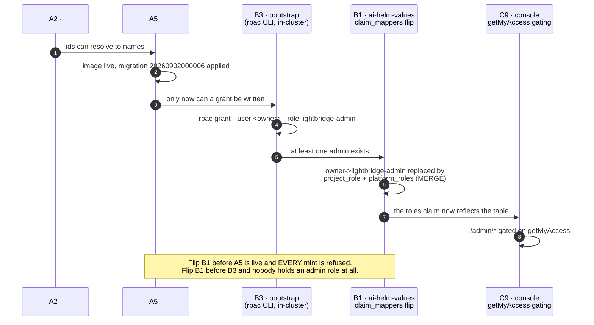
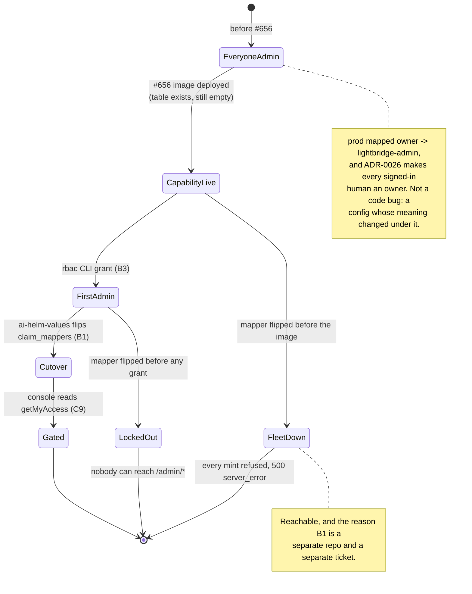

# 2026-09-02/03 — the admin-console backend, in one narrative

**What this is.** `CHANGELOG.md` is owned by release-please and lists *what* merged. It cannot say
*why these fifteen PRs are one thing*, which of them depend on each other, or which parts are live.
This page does. It is a narrative record, written once, and it is not maintained after the fact —
the linked ADRs and domain docs are the living sources.

**Source of truth:** backend epic [#645](https://github.com/ADORSYS-GIS/lightbridge-authz/issues/645),
console epic [converse-frontends#443](https://github.com/ADORSYS-GIS/converse-frontends/issues/443).

---

## The one-sentence version

Two days took the admin console from *"every screen renders opaque ids and every signed-in human is
secretly a platform admin"* to *"who is an admin is a row you can audit, ids resolve to names,
sessions are readable and revocable, budgets reset on a schedule, usage queries answer in seconds
instead of half a minute, and every service can tell you which commit it is."*

## What actually changed

| # | PR | What it does | Where it is documented |
| --- | --- | --- | --- |
| 1 | [#652](https://github.com/ADORSYS-GIS/lightbridge-authz/pull/652) | `azp` / `operation` / `billing_plan` promoted out of the `attributes` JSONB blob into real, groupable, filterable columns; `operation_in`; `usage:read-all` may query any `scope_id` | [`usage-api.md`](../usage-api.md), [`lightbridge-query-api.md`](../lightbridge-query-api.md) |
| 2 | [#653](https://github.com/ADORSYS-GIS/lightbridge-authz/pull/653) | `budget_reset_schedules` + a replica-safe 60 s scheduler + dry-run RPCs. There was **no scheduler anywhere in this repo** before it | [ADR-0032](../adr/0032-budget-reset-schedules.md), [`budget-refill-ui-contract.md`](../budget-refill-ui-contract.md) |
| 3 | [#654](https://github.com/ADORSYS-GIS/lightbridge-authz/pull/654) | `requested_by_user_id` on refill requests — an approval workflow that could not name the requester | [`budget-refill-ui-contract.md`](../budget-refill-ui-contract.md) |
| 4 | [#655](https://github.com/ADORSYS-GIS/lightbridge-authz/pull/655) | `resolveUserProfiles` / `resolveActorLabels` / `searchUsers` behind a new `user:read` | [`admin-identity-resolution.md`](../admin-identity-resolution.md) |
| 5 | [#656](https://github.com/ADORSYS-GIS/lightbridge-authz/pull/656) | Platform roles are a table, stamped at mint. `getMyAccess`. The `rbac` CLI | [ADR-0033](../adr/0033-platform-roles-are-a-table-stamped-at-mint.md), [`rbac.md`](../rbac.md) |
| 6 | [#657](https://github.com/ADORSYS-GIS/lightbridge-authz/pull/657) | `querySessions` + `revokeSession`; own-scoping enforced in the schema policy, not the handler | [`sessions-api.md`](../sessions-api.md), ADR-0020 Follow-up 4 |
| 7 | [#659](https://github.com/ADORSYS-GIS/lightbridge-authz/pull/659) | Browser sessions record the client that started the login | [`sessions-api.md`](../sessions-api.md), ADR-0021 D3 amendment |
| 8 | [#662](https://github.com/ADORSYS-GIS/lightbridge-authz/pull/662) ⚠️ breaking | One `global.lightbridge.sharedConfig` object instead of five copies of `config.yaml` | [`single-source-config.md`](../single-source-config.md) |
| 9 | [#663](https://github.com/ADORSYS-GIS/lightbridge-authz/pull/663) | `GET /version`, `getBuildInfo()`, `--version`, a `service.build` startup log — one stamp, four readers | [`build-info.md`](../build-info.md) |
| 10 | [#665](https://github.com/ADORSYS-GIS/lightbridge-authz/pull/665) | One-scan usage query, a covering index, a `metrics` field, quiet ingest logs. 34.8 s → seconds | [`usage-performance.md`](../usage-performance.md) |
| 11 | [#667](https://github.com/ADORSYS-GIS/lightbridge-authz/pull/667) | The LoC grandfather baseline had gone stale and was failing `main` for sixteen files | `.github/loc-baseline.json` |
| 12 | [#668](https://github.com/ADORSYS-GIS/lightbridge-authz/pull/668) | `Helm chart tests` had never passed since #662 added it. Three stacked breakages | [`runbooks/release-and-rollout.md`](../runbooks/release-and-rollout.md#step-7--the-chart-is-a-separate-currently-broken-pipeline) |
| 13 | [#669](https://github.com/ADORSYS-GIS/lightbridge-authz/pull/669) | `nextRunAt` as an input — force a schedule's next execution onto a date | [ADR-0032](../adr/0032-budget-reset-schedules.md) A8 |
| 14 | [#670](https://github.com/ADORSYS-GIS/lightbridge-authz/pull/670) | MCP goes 31/68 → **68/68** op-ids, and its second permission table is deleted | [`rbac.md`](../rbac.md#the-mcp-surface-serves-both-halves-one-scope-per-tool), [`architecture/services.md`](../architecture/services.md#lightbridge-mcp) |
| 15 | [#672](https://github.com/ADORSYS-GIS/lightbridge-authz/pull/672) | `main` went red on `integration-test`: a *third* copy of the MCP tool list, outside #670's own drift guard | `.docker/it/servers_it.py` |

Five new permissions, 32 → **37** (`crates/lightbridge-authz-core/src/authz.rs:196`):
`budget:schedule-manage`, `session:read`, `session:read-own`, `user:read`, `rbac:manage`.

## The one ordering that matters

#656 ships a **capability**, not a cutover. `platform_role_grants` starts empty, and a
`platform_roles` claim mapper deployed before its migration is live **refuses every mint** —
fail-closed working exactly as designed, and fleet-fatal if sequenced wrong.

The CLI half of B3 is [`rbac.md` → Bootstrap runbook](../rbac.md#bootstrap-runbook-the-first-admin);
the cluster half is an `ai-helm-values` runbook and is deliberately not copied here.

## Three lessons the tree now encodes

1. **A list that exists in more than one place goes stale in the copy you did not think about.**
   #670 built a drift guard for exactly the MCP tool-list failure mode — and still shipped a red
   `main`, because a *third* copy lived in `.docker/it/servers_it.py`, a Python file that cannot
   import the crate. #672's fix is not "be more careful": it pulls the third copy inside the guard,
   from the Rust side, where both halves are readable.
2. **Two green PRs can make a red `main` without either being wrong.** #653 and #654 merged minutes
   apart, both claiming migration version `20260902000002`. sqlx keys `_sqlx_migrations` on the
   numeric prefix alone, so every fresh deploy's migrate step would have died on a duplicate key.
   Neither branch's CI could see it — the collision exists only in the merge result. Check the
   prefix against `origin/main`, not against your branch.
3. **A gate nobody maintains inverts its own meaning.** The LoC gate's contract is *"grandfathered
   files may be touched but must not grow"*. With a stale baseline it silently became *"already over
   the line ⇒ may not be touched at all"* and was failing sixteen files on `main` (#667). The same
   week, `Helm chart tests` had never once passed since the PR that added it (#668) — a green tick
   that proved nothing for eleven days.

## Is it live?

`main` is at `ab11479` and all three images are pinned there in production (verified 2026-09-03 —
see [`runbooks/release-and-rollout.md` Step 3](../runbooks/release-and-rollout.md#step-3--did-the-promotion-land-in-ai-helm-values)).
`https://auth.ai.camer.digital/version` reports `gitShortSha: ab11479`.

**But images and releases are not the same clock**, and right now they are seven PRs apart:

- **Images** ship per *commit* on `main`, gated on a cosign signature. Everything through #672 is
  live.
- **Releases and charts** ship per *tag*. `10.0.0` was cut at `aa6c9ce`, which is **before**
  #663, #665, #667, #668, #669, #670 and #672. Those seven are running in production and are in no
  released chart or GitHub Release.
- Worse, chart publishing itself has been silently broken since `v5.0.0`
  ([#666](https://github.com/ADORSYS-GIS/lightbridge-authz/issues/666), open): release-please tags
  with `GITHUB_TOKEN`, which never fires a `push: tags` workflow. `10.0.0` exists only because
  somebody ran `helm-oci.yml` by hand.

Two things from these two days are also **accepted but not implemented**, and should not be assumed:

- [ADR-0031](../adr/0031-migrations-run-in-init-containers.md) (migrations in init containers) is
  Accepted; the chart still ships the ADR-0016 sync-wave Job and the cluster still runs five of
  them. Its *expand/contract* half is a discipline you can follow today regardless.
- The `budget:*` reset schedules are **ledger-only**. Gateway 429s still come from Envoy
  `BackendTrafficPolicy` buckets keyed on `x-billing-plan`. ADR-0032 D10 says so; the console copy is
  required to say so too.
