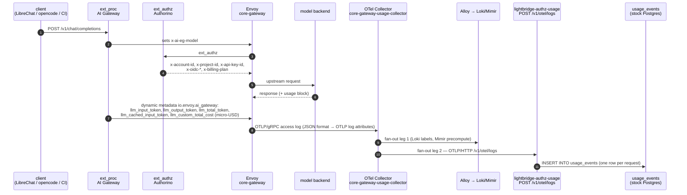
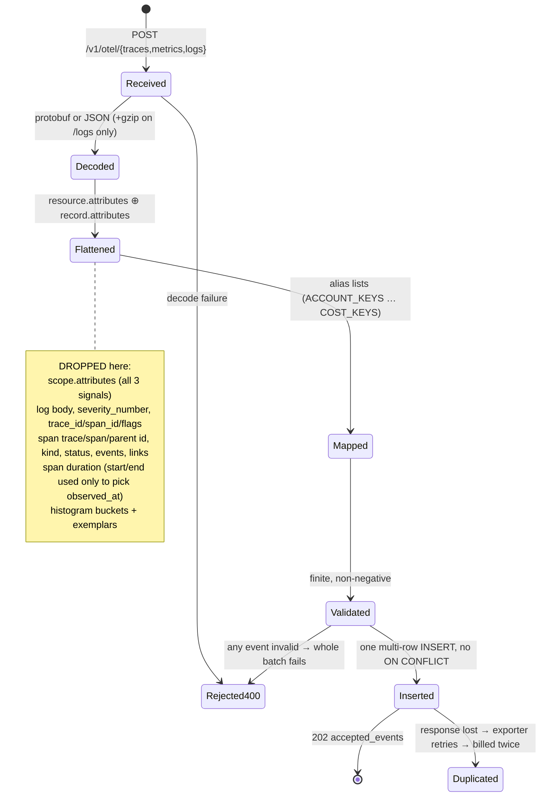

# Can the lightbridge usage database ingest the full GenAI observability surface?

**Research + design report — no implementation.**
Date: 2026-08-25 · Scope: `lightbridge-authz-usage` (`usage_events`, `migrations-usage/`), the Envoy AI Gateway
observability surface, OTel GenAI semconv, and AI-IDE OTLP emitters, measured against what
`lightbridge-governance` and `ai-helm` say management wants reported.

---

## 0. Executive summary

**Short answer: no, and the reasons are more structural than "some columns are missing."**

The current `usage_events` table can physically *accept* every payload discussed here — it has a
`JSONB attributes` catch-all, so nothing is rejected. What it cannot do is *answer* the questions
management asks, and along the way it is silently wrong in six specific ways that a schema change
alone will not fix.

The six findings, in descending order of damage:

| # | Finding | Mechanism | Severity |
|---|---|---|---|
| **F1** | **Cost is off by 1,000,000×** in the budget domain | The gateway's `llm_custom_total_cost` CEL emits **micro-USD** (ai-helm ADR-0051, ADR-0058, `docs/models-chart-docs/cost-tracking.md`). It lands verbatim in `usage_events.total_cost`. `lightbridge-authz-budget`'s `cost_to_micros()` then multiplies by `1_000_000.0` again, treating it as dollars. | **P0** |
| **F2** | **`usage_events` is not a hypertable — anywhere** | `create_hypertable()` refuses a table whose `PRIMARY KEY` omits the partition column; `usage_events` has `PRIMARY KEY (id)` on a `BIGSERIAL`. The migration swallows the error in `EXCEPTION WHEN OTHERS ... RAISE NOTICE`. Prod additionally has **no TimescaleDB extension at all** (ai-helm `charts/lightbridge-db/values.yaml` states this explicitly). So there is no hypertable, no chunking, **and no retention policy**, on a 5 Gi cluster shared by 7 tenants. | **P0** |
| **F3** | **Every KPI double-counts** | Gateway access logs (request-grain), gateway/IDE OTLP *metrics* (pre-aggregated counters over an export interval), and spans all land in **one table** and are summed together by `query_usage`. `signal_type` is an optional filter, and the default is "no filter." | **P1** |
| **F4** | **"Unknown cost" is stored as `0`** | `total_cost DOUBLE PRECISION NOT NULL DEFAULT 0` + `push_bind(event.total_cost.unwrap_or(0.0))`. Both `lightbridge-authz-budget` and `lightbridge-governance` treat absent-vs-zero as load-bearing; the storage layer destroys the distinction. `Spend::Unavailable` becomes unreachable the moment any row exists. | **P1** |
| **F5** | **Ingest is not idempotent** | No natural key, no unique index, no `ON CONFLICT`. An OTLP exporter whose response is lost after commit retries the whole batch and bills it twice. The governance repo makes idempotent upsert a house invariant. | **P1** |
| **F6** | **PII lands in `attributes` JSONB, unfiltered and un-retained** | The deployed access log carries `oidc_email`, `oidc_name`, `lc_user_email`, `lc_user_name`, `x-forwarded-for`, `oidc_jti`. All of it is written wholesale into `attributes` on a table with (in prod) no retention policy. ai-helm ADR-0011 marks these fields PII with an explicit obligation on every downstream. | **P1** |

Beyond the defects, the **capability gap** is large: of the ~55 fields the deployed Envoy access log
already emits today, `usage_events` promotes **9** to typed columns. Everything that makes a GenAI
KPI interesting — provider, response model, cached tokens, latency, HTTP status, error taxonomy,
stream flag, billing period, trace correlation — is either in JSONB or nowhere.

**Recommended shape** (detailed in §6): split by **grain**, not by signal — a request-grain fact table,
a metric-datapoint table, and a span table — each with a typed governed-dimension core, integer
micro-USD money, a deterministic dedup key, and `attributes JSONB` for the tail. Then a
continuous-aggregate layer that reads from exactly one authoritative source per measure.

**The precondition that gates all of it:** decide whether TimescaleDB is actually going to run.
Today the migration *pretends* to be a Timescale schema and is not one. Both answers are workable;
silently having neither is not.

---

## 1. The deployed pipeline, as actually configured

This is not inferred — it is read from `ADORSYS-GIS/ai-helm@main` (public) and this repo's own tests.



Load-bearing facts from that diagram, each cited:

- **Gateway access logs reach this service as OTLP *logs*, not metrics and not spans.**
  `charts/core-gateway/templates/envoy-proxy.yaml` configures `accessLog.settings[0].sinks[0].type:
  OpenTelemetry` pointing at `<fullname>-usage-collector...:4317`, and the comment there states the
  collector "re-exports this exact stream to BOTH Alloy (→ Loki …) and lightbridge-authz-usage's
  OTLP/HTTP ingest (→ usage_events, billing)." This repo's own regression test
  `extract_log_events_should_capture_real_envoy_access_log_json_keys`
  (`crates/lightbridge-authz-usage/src/handlers/ingest.rs:1164`) says the field names were "copied
  verbatim from ai-helm's `charts/core-gateway/templates/envoy-proxy.yaml` accessLog JSON format
  block."
- **A collector hop exists and is required.** The `EnvoyProxy` OTLP access-log sink speaks only
  OTLP/gRPC `host:port` with no URL path, and this service's ingest is OTLP/HTTP at `/v1/otel/logs`
  with no gRPC receiver. The collector is what bridges them.
- **Gateway *traces* do not reach this service.** `telemetry.tracing.provider` points at
  `alloy.observability.svc.cluster.local:4317` directly. So `/v1/otel/traces` receives nothing from
  the gateway today.
- **Gateway *metrics* do not reach this service.** `telemetry.metrics.prometheus: {}` exposes
  `:19001/stats/prometheus`, scraped by a PodMonitor into Mimir. So `/v1/otel/metrics` receives
  nothing from the gateway today either.
- **Access logs are emitted only for model traffic.** `matches: ["request.headers['x-ai-eg-model'] != ''"]`.
  Anything rejected before ext_proc sets that header — a 401 from Authorino, a 403 model-allowlist
  denial on the external listener, a 429 from the rate limiter — **produces no access log at all**,
  therefore no `usage_events` row. Error-rate KPIs computed from this table are structurally
  incapable of seeing the most interesting errors.

### 1.1 What the platform already has, that this table is not

| Store | Grain | Retention | Source |
|---|---|---|---|
| Mimir | precomputed counters, ~8 labels | **90 d** | ai-helm `docs/playbooks/observability-storage-retention.md` |
| Loki | raw access-log lines | **90 d** | same |
| Tempo | spans (incl. full prompt/completion content) | **30 d** | same |
| `usage_events` | one row per request (+ noise) | **none in prod** (F2) | this repo |

ai-helm ADR-0058 precomputes three counters into Mimir at Alloy ingestion time:
`gen_ai_usage_cost_micro_usd`, `gen_ai_usage_tokens`, `gen_ai_requests`, labelled
`model, azp, display_name, user_id, email, billing_plan, service_name, billing_period`
(the last added by ADR-0130). Those are the dashboards' current source.

**So the honest positioning question** (§10, Q1): is `usage_events` meant to be the *durable ledger*
that Mimir's 90-day window and Loki's rate-limited object store cannot be — or is it a second,
weaker copy of what Grafana already reads? ai-helm ADR-0026 decommissioned a predecessor `usage`
service *and its TimescaleDB* on the grounds that "Grafana is the dashboard now." The service came
back; the justification for it did not come back with it. The design below assumes the ledger
answer, because that is the only one that survives contact with `authz-budget`'s spend query and
with `lightbridge-governance`'s requirement for a SQL-queryable system of record.

---

## 2. Source-by-source field inventory

### 2.1 Gateway access logs — **the only source actually reaching this service today**

Emitted by Envoy as a JSON access log, delivered as **OTLP log records whose JSON keys become log
*attributes*** (ai-helm ADR-0046 documents the envelope repair Alloy needed for exactly this).
Source of truth: `ai-helm/charts/core-gateway/templates/envoy-proxy.yaml`.

Legend for **Now**: `col` = promoted to a typed `usage_events` column · `json` = lands only in
`attributes` JSONB · `—` = not emitted.

| Access-log key | Envoy source | Meaning | Now | Keep? |
|---|---|---|---|---|
| `gen_ai.request.model` | `%REQ(X-AI-EG-MODEL)%` | requested model | **col** `model` | yes |
| `gen_ai.request.model_override` | `DYNAMIC_METADATA(...:model_name_override)` | route-level override | json | yes |
| `gen_ai.provider.name` | `DYNAMIC_METADATA(...:backend_name)` | **provider/backend** | json | **yes — missing column** |
| `gen_ai.usage.input_tokens` | `...:llm_input_token` | prompt tokens | **col** `prompt_tokens` | yes |
| `gen_ai.usage.output_tokens` | `...:llm_output_token` | completion tokens | **col** `completion_tokens` | yes |
| `gen_ai.usage.total_tokens` | `...:llm_total_token` | total | **col** `total_tokens` | yes |
| *(absent)* `llm_cached_input_token` | declared in `llmRequestCosts`, **not in the access-log format** | cache-read tokens | **—** | **yes — needs an ai-helm change first** |
| `gen_ai.usage.custom_total_cost` | `...:llm_custom_total_cost` | **cost in micro-USD** (§4, F1) | **col** `total_cost` (as float dollars — wrong) | yes, as `BIGINT` micros |
| `response_code` | `%RESPONSE_CODE%` | HTTP status | json | **yes — missing column** |
| `response_flags` | `%RESPONSE_FLAGS%` | Envoy failure taxonomy (`UO`,`UT`,`DC`,`URX`…) | json | **yes — missing column** |
| `response_code_details` | `%RESPONSE_CODE_DETAILS%` | detail string | json | yes (low-card enough) |
| `connection_termination_details` | `%CONNECTION_TERMINATION_DETAILS%` | | json | tail |
| `upstream_transport_failure_reason` | `%UPSTREAM_TRANSPORT_FAILURE_REASON%` | TLS/connect failures | json | yes |
| `duration` | `%DURATION%` | total request ms | json | **yes — missing column** |
| `x-envoy-upstream-service-time` | `%RESP(...)%` | upstream ms (excl. gateway) | json | yes |
| `bytes_received` / `bytes_sent` | `%BYTES_*%` | payload size | json | yes |
| `start_time` | `%START_TIME%` | request start | json (`observed_at` uses log record time) | yes |
| `method`, `protocol`, `x-envoy-origin-path`, `:authority`, `route_name`, `requested_server_name` | Envoy ops | routing | json | `route_name` + path yes, rest tail |
| `upstream_host`, `upstream_cluster`, `upstream_local_address`, `downstream_local_address` | Envoy ops | topology | json | tail |
| `downstream_remote_address`, `x-forwarded-for` | Envoy ops | **client IP — PII** | json | **no — see §8** |
| `user-agent` | `%REQ(USER-AGENT)%` | client identification | json | **yes — missing column**; `by-client.json` is built entirely on it |
| `x-request-id` | `%REQ(X-REQUEST-ID)%` | per-request unique id | json | **yes — this is the idempotency key (F5)** |
| `traceparent` | `%REQ(TRACEPARENT)%` | W3C trace context → Tempo | json | **yes — missing column**; the only content↔metadata join key |
| `account_id` | `%REQ(X-ACCOUNT-ID)%` | Authorino-stamped | **col** | yes |
| `project_id` | `%REQ(X-PROJECT-ID)%` | Authorino-stamped | **col** | yes |
| `api_key_id` | `%REQ(X-API-KEY-ID)%` | Authorino-stamped | **col** | yes |
| `billing_plan` | `%REQ(X-BILLING-PLAN)%` | plan tier | json | **yes — missing column**; `scoreboard.json` groups by it |
| `user_id` | `%REQ(X-OIDC-USER-ID)%` | Keycloak `sub` | **col** | yes |
| `user_name` | `%REQ(X-OIDC-USER-NAME)%` | display name | **col** `user_name` | yes |
| `azp` | `%REQ(X-OIDC-AZP)%` | OAuth client / "channel" | json | **yes — missing column**; 6 dashboards group by it |
| `oidc_iss` | `%REQ(X-OIDC-ISS)%` | issuer | json | yes (low card) |
| `oidc_jti` | `%REQ(X-OIDC-JTI)%` | access-token id | json | yes as a column (**never** a metric label) |
| `oidc_roles_realm`, `oidc_resource_access`, `oidc_scope` | Authorino | RBAC claims | json | tail |
| `oidc_email`, `oidc_name` | Authorino | **PII** (ai-helm ADR-0011) | json | **no on the fact row — see §8** |
| `lc_user_id`, `lc_user_role` | LibreChat headers | app-level identity | json (`lc_user_id` falls back into `user_id`) | yes |
| `lc_user_email`, `lc_user_name` | LibreChat headers | **PII** | json | **no on the fact row** |
| *(missing)* `x-billing-period` / `x-billing-week` | stamped by the Lua `EnvoyExtensionPolicy` **on the request** | calendar billing bucket (ADR-0111/0112/0119) | **—** | **yes — needs an ai-helm access-log change**, or derive server-side |

**Not present, and worth knowing they are not:** `gen_ai.response.model` (the gateway *can* emit
`DYNAMIC_METADATA(...:response_model)` per upstream docs, but this deployment's format map does not),
`gen_ai.request.stream`, TTFT, and any `gen_ai.operation.name`. Streaming and TTFT exist only as
gateway *metrics* (`gen_ai.server.time_to_first_token`), which do not reach this service.

### 2.2 Gateway metrics — **not routed here today**

Emitted on `:19001/stats/prometheus`, scraped by a PodMonitor into Mimir. If ever also exported OTLP
to this service, the shape is (Envoy AI Gateway docs + OTel GenAI semconv):

| Metric | Type | Unit | Attributes |
|---|---|---|---|
| `gen_ai.client.token.usage` | Counter (gateway) / Histogram (semconv — **type disagreement**, see §10 Q6) | `{token}` | `gen_ai.operation.name`, `gen_ai.provider.name`, `gen_ai.token.type` (`input`/`output`), `gen_ai.request.model`, `gen_ai.response.model`, `server.address`/`port` |
| `gen_ai.server.request.duration` | Histogram | `s` | + `error.type` when failed |
| `gen_ai.server.time_to_first_token` | Histogram | `s` | success only — the **only** TTFT source |
| `gen_ai.server.time_per_output_token` | Histogram | `s` | success only |

Custom labels can be added by request header via `controller.metricsRequestHeaderAttributes`.

### 2.3 Gateway traces — **not routed here today**

`telemetry.tracing` ships to Alloy → Tempo at `samplingRate: 1` (1%). Convention is selected by
`AI_GATEWAY_TRACING_SEMCONV`; the default is **OpenInference**, whose content capture is **on by
default** (`OPENINFERENCE_HIDE_INPUTS`/`_HIDE_OUTPUTS` unset) — ai-helm `docs/patterns/chat-observability.md`
confirms "Tempo has been holding full-content chat traces all along." ai-helm ADR-0079 records that
these spans **cannot be attributed to a person**, because AIEG's ext_proc builds the span *before*
Authorino injects identity headers, and no shared correlation key exists.

That is the single strongest argument for the design in §6: this database is the *only* place where
identity, cost and tokens are joined on one row. It should not try to become a second Tempo.

### 2.4 AI-IDE OTLP — Claude Code (the only emitter with real, built-in identity)

Off by default; enabled by `CLAUDE_CODE_ENABLE_TELEMETRY=1` plus `OTEL_METRICS_EXPORTER` /
`OTEL_LOGS_EXPORTER` and an endpoint. Two grains arrive:

**Metrics** (delta counters, exported every `OTEL_METRIC_EXPORT_INTERVAL`, default 60 s):

| Metric | Unit | Key attributes | Serves |
|---|---|---|---|
| `claude_code.session.count` | — | `start_type` | adoption / active users |
| `claude_code.token.usage` | tokens | `type` = `input`/`output`/**`cacheRead`**/**`cacheCreation`**, `model`, `query_source`, `agent.name`, `mcp_server.name`, … | token KPIs incl. cache split |
| `claude_code.cost.usage` | **USD** (note: dollars, unlike the gateway) | same | cost KPIs |
| `claude_code.lines_of_code.count` | — | `type` = `added`/`removed`, `model` | governance "code generation activity" |
| `claude_code.commit.count`, `claude_code.pull_request.count` | — | standard only | governance engineering adoption |
| `claude_code.code_edit_tool.decision` | — | `tool_name`, `decision` = `accept`/`reject`, `language` | governance **code-acceptance rate** |
| `claude_code.active_time.total` | s | `type` = `user`/`cli` | governance "active users", licence hygiene |

**Log records / events** (request grain — these are the billing-usable ones):

| Event | Notable attributes |
|---|---|
| `claude_code.api_request` | `model`, **`cost_usd`**, **`cost_usd_micros`**, `duration_ms`, `input_tokens`, `output_tokens`, **`cache_read_tokens`**, **`cache_creation_tokens`**, `request_id`, `client_request_id`, `query_source`, `speed`, `effort`, `agent.name`/`skill.name`/`plugin.name`/`mcp_server.name`/`mcp_tool.name` |
| `claude_code.api_error` | `model`, `error`, `status_code`, `duration_ms`, `attempt`, `request_id` |
| `claude_code.tool_result` | `tool_name`, `tool_use_id`, `success`, `duration_ms`, `error_type`, `decision_type`, `tool_input_size_bytes`, `tool_result_size_bytes` |
| `claude_code.tool_decision` | `tool_name`, `decision`, `tool_source`, `source` |
| `claude_code.user_prompt` | `prompt_length`, **`prompt`** (redacted unless `OTEL_LOG_USER_PROMPTS=1`) |
| `claude_code.assistant_response` | `response_length`, **`response`** (redacted unless `OTEL_LOG_ASSISTANT_RESPONSES=1`) |
| `claude_code.api_request_body` / `api_response_body` | **full Messages API JSON** — only under `OTEL_LOG_RAW_API_BODIES` |
| `claude_code.mcp_server_connection`, `claude_code.auth`, `claude_code.permission_mode_changed`, `claude_code.internal_error`, `claude_code.plugin_*` | operational |

**Standard attributes on everything**: `session.id`, `user.id` (always; anonymous, persisted in
`~/.claude.json`), `user.email` (OAuth, when available), `user.account_uuid`/`user.account_id`,
`organization.id`, `app.version`, `app.entrypoint`, `terminal.type`, `identity.source`. Cardinality
toggles exist: `OTEL_METRICS_INCLUDE_SESSION_ID` (default **on**),
`OTEL_METRICS_INCLUDE_ACCOUNT_UUID` (default on), `OTEL_METRICS_INCLUDE_VERSION` (default off).

`cost.usage` is in **USD**, while `claude_code.api_request.cost_usd_micros` is in micros — the ingest
must not treat "a cost field" as a single unit. This is the same class of bug as F1.

### 2.5 AI-IDE OTLP — the others

| Tool | OTLP? | Identity | Verdict |
|---|---|---|---|
| **opencode** | **No native support.** The upstream feature request was closed *not planned*. Only an unofficial third-party plugin (`@devtheops/opencode-plugin-otel`) mirrors Claude Code's schema (`opencode.session.count`, `.token.usage`, `.cost.usage`, `.tool.duration`, …). | **none documented** | Do not design columns for it. It already shows up at the gateway as a `user-agent`, which is the attribution that actually works. |
| **OpenAI Codex CLI** | Config exists (`~/.codex/config.toml` `[otel]`: `exporter`, `metrics_exporter`, `trace_exporter`, `log_user_prompt`, endpoint/headers/TLS) but **`metrics_exporter` defaults to `statsig`**, not OTLP, and the event/attribute taxonomy is undocumented and reported unstable. The governance repo already records that Codex telemetry is **admin-unenforceable** (spikes 0034/0008). | operator-supplied `OTEL_RESOURCE_ATTRIBUTES` only | Treat as best-effort; every governance report over it must be labelled "participating users only". |
| **GitHub Copilot** | Two disjoint surfaces: a pull-based **admin REST metrics API** (org/user/repo *daily aggregates*, `login` only — no email, no id), and a real but off-by-default OTel push path in the VS Code extension (`COPILOT_OTEL_ENABLED`) emitting GenAI-semconv spans plus `copilot_chat.*` metrics. | REST: `login`. OTel: **none built in** — identity is whatever the operator injects via `OTEL_RESOURCE_ATTRIBUTES`. | The REST path is daily-aggregate grain and belongs in `lightbridge-governance`'s `copilot_*_daily` tables, **not** here. |

**Design consequence:** for three of four IDE emitters, `user_id`/`email` is *declared by the
exporter's environment*, not asserted by the tool. Any identity column sourced from IDE telemetry is
**self-asserted and must not be trusted for billing**. `lightbridge-governance` already solved this:
identity is bound **server-side by the per-developer ingest token** (`Integration.internalUserId`),
and the payload's `user.email` is stored only as a cross-check that raises
`governance_ingest_identity_mismatch_total`. This service has **no equivalent mechanism** — see §3.3.

---

## 3. Ingest-path gaps — what the handlers parse vs ignore

### 3.1 Per-signal



**Logs (`/v1/otel/logs`) — wired, and it is the live path.**
Handles gzip (`decode_maybe_gzip`, logs only). Reads attributes; **drops the log body entirely** and
maps `severity_text` into `metric_name` — so a `claude_code.api_request` event's `event.name` would
land nowhere, and its body (where OTel puts structured event payloads) is discarded.

**Traces (`/v1/otel/traces`) — wired, receives nothing today.**
Keeps only `span.name` → `metric_name` and end-or-start time. **Drops `trace_id`, `span_id`,
`parent_span_id`, `kind`, `status`, events, links, and the computed duration.** Without `trace_id`
there is no join to Tempo and no way to reconstruct an execution from its model/tool spans —
exactly the `Execution`/`ModelCall`/`ToolCall` shape `lightbridge-governance` needs.

**Metrics (`/v1/otel/metrics`) — wired, receives nothing today, and would be wrong if it did.**
Two concrete defects beyond grain-mixing:
- `merge_attr_maps(&resource_attrs, &key_values_to_map(&metric.metadata))` uses OTLP
  `Metric.metadata` — a rarely-populated field — where the intent was scope/metric identity.
  Datapoint attributes *are* merged, so it mostly works by accident.
- `request_count_from_metric_value(value)` sets `request_count` to the **rounded metric value**. A
  `gen_ai.client.token.usage` datapoint of 5 000 tokens records **5 000 requests**. Any
  requests-per-day KPI computed over metric rows is nonsense.
- Histogram/exponential-histogram points keep only `sum` and `count`; **all bucket boundaries are
  discarded**, so no percentile can ever be recovered — which kills TTFT/TPOT/latency KPIs at the
  source, precisely the metrics only the gateway can supply.

### 3.2 Where the gateway's fields go today

Of the ~55 access-log keys in §2.1, the ingest promotes **9** (`account_id`, `project_id`,
`api_key_id`, `user_id`, `user_name`, `model`, and the three token counts) plus cost. Everything else
survives only inside `attributes` JSONB, which has **no index** — so any dashboard needing
`response_code`, `azp`, `billing_plan`, `duration`, or `user-agent` must full-scan.

One alias-list detail worth keeping: `COST_KEYS` includes `gen_ai.usage.custom_total_cost`, which is
the key this deployment actually sends. The cost *is* being read. It is the unit that is wrong (F1).

### 3.3 Auth posture — the routing question, flagged not solved

Current state, verified:

- The ingest listener (`UsageServerGroup::usage`) applies **no** JWT, Basic-auth, or mTLS check.
  `routers::ingest_router()`'s doc comment and `docs/usage-api.md` both say so, and both justify it
  by "the caller is an AI Envoy/OpenTelemetry exporter outside this repo's deploy surface."
- The collector side confirms the shape: `otlphttp/lightbridge_usage` sets `tls.ca_file` — it
  **verifies the server's certificate**, but presents **no client certificate**. So the trust is
  one-directional.
- The mitigation is topological: `ClusterIP`, no Ingress/HTTPRoute/Gateway anywhere in `ai-helm`.

**An IDE on a developer's laptop is outside the cluster.** So enabling Claude Code / Codex ingestion
requires *one of*:

1. **Route IDE OTLP through the existing gateway** (`api.ai.camer.digital`), where Authorino already
   authenticates and stamps `x-account-id`/`x-project-id`/`x-oidc-*`. This is the only option that
   reuses the platform's existing identity plane and produces *trustworthy* attribution. It needs an
   AI-Gateway route for `/v1/otel/*` and a decision about whether OTLP counts as "model traffic".
2. **Per-developer ingest tokens**, the `lightbridge-governance` pattern
   (`Integration.internalUserId` bound at issuance; payload `user.email` only a cross-check). This
   requires the ingest listener to grow an auth check it deliberately does not have.
3. **Point the IDEs at `lightbridge-governance` instead**, which already has the token model, the
   `Execution`/`ModelCall`/`ToolCall` schema, and the identity-mismatch alerting — and let this
   service stay gateway-only.

Option 3 is the smallest change and the one most consistent with both repos' existing ADRs. **This
report does not choose; see §10 Q2.** What it does assert is that *option 0 — exposing the current
unauthenticated ingest listener to laptops — is not on the table*: `docs/lightbridge-query-api.md`
already states that anyone who can reach it "can write fabricated usage/billing records for any
account or project."

---

## 4. Gap analysis against the exact current schema

### 4.1 `usage_events` as it exists today

Reconstructed from all three files in `migrations-usage/`:

```sql
-- 20260223000001_init_usage.sql + 20260320000001_total_cost.sql + 20260506000001_usage_event_subject_dimensions.sql
CREATE TABLE usage_events (
    id                BIGSERIAL PRIMARY KEY,          -- ⚠ violates the CUID2 house rule; blocks create_hypertable
    observed_at       TIMESTAMPTZ      NOT NULL,
    signal_type       TEXT             NOT NULL,      -- 'trace' | 'metric' | 'log'  → grain mixing (F3)
    account_id        TEXT,
    project_id        TEXT,
    user_id           TEXT,
    model             TEXT,
    metric_name       TEXT,                           -- span.name | metric.name | severity_text (three meanings)
    usage_value       DOUBLE PRECISION NOT NULL DEFAULT 0,
    request_count     BIGINT           NOT NULL DEFAULT 1,
    prompt_tokens     BIGINT,
    completion_tokens BIGINT,
    total_tokens      BIGINT,
    attributes        JSONB            NOT NULL DEFAULT '{}'::jsonb,   -- no index; PII lands here
    created_at        TIMESTAMPTZ      NOT NULL DEFAULT NOW(),
    total_cost        DOUBLE PRECISION NOT NULL DEFAULT 0,  -- ⚠ float money; ⚠ micro-USD mislabelled as USD; ⚠ NOT NULL kills absent-vs-zero
    api_key_id        TEXT,
    user_name         TEXT
);
-- 7 indexes, all (<dim>, observed_at DESC)
```

### 4.2 Exact missing columns, by what they block

| Missing | Type | Source field | Blocks |
|---|---|---|---|
| `provider` | TEXT | `gen_ai.provider.name` | provider-billing reconciliation (ADR-0120); "cost per provider" |
| `response_model` | TEXT | `gen_ai.response.model` *(not emitted here yet)* | requested-vs-served drift, alias accounting |
| `cache_read_tokens` | BIGINT | `llm_cached_input_token` *(not in access log yet)*; `claude_code.api_request.cache_read_tokens` | cached-vs-fresh cost split; `provider-billing.json` has explicit `cache_read`/`cache_write` panels |
| `cache_write_tokens` | BIGINT | `gen_ai.usage.cache_write.input_tokens`; `claude_code…cache_creation_tokens` | same |
| `reasoning_tokens` | BIGINT | `gen_ai.usage.reasoning.output_tokens` | reasoning-model cost attribution |
| `cost_micro_usd` | **BIGINT NULL** | `gen_ai.usage.custom_total_cost` | fixes F1 + F4; ADR-0008 integer-micro-USD compliance |
| `duration_ms` | INTEGER | `duration` | every latency KPI; `chat-overview.json` p50/p95 |
| `upstream_ms` | INTEGER | `x-envoy-upstream-service-time` | gateway overhead vs provider latency |
| `status_code` | SMALLINT | `response_code` | 5xx-rate; `by-client.json` non-2xx |
| `response_flags` | TEXT | `response_flags` | Envoy error taxonomy (`UO`/`UT`/`DC`/`URX`) |
| `error_type` | TEXT | `error.type` (semconv) / `claude_code.api_error.status_code` | governance "model error rate", "tool error rate" |
| `stream` | BOOLEAN | `gen_ai.request.stream` *(not emitted)* | streaming-vs-batch cost/latency separation |
| `azp` | TEXT | `azp` | 6 of 14 dashboards group by it ("channel") |
| `billing_plan` | TEXT | `billing_plan` | `scoreboard.json` spend-share-by-plan |
| `billing_period` | TEXT | `x-billing-period` *(request header, not logged)* | calendar-month budget (ADR-0111/0112); must otherwise be derived |
| `billing_week` | TEXT | `x-billing-week` *(same)* | weekly sub-budget (ADR-0119) |
| `user_agent` | TEXT | `user-agent` | `by-client.json` **entirely**; is also how opencode/Claude-Code traffic is identified at all |
| `route_name`, `http_path`, `http_method` | TEXT | Envoy ops | per-endpoint breakdown; MCP vs chat separation |
| `jti` | TEXT | `oidc_jti` | `jwt-tokens.json` per-token consumption |
| `trace_id`, `span_id` | TEXT | `traceparent` | **the only join to Tempo's content spans**; governance `Execution.traceId`/`spanId` |
| `request_id` | TEXT | `x-request-id` | **the idempotency key** (F5) |
| `source` | TEXT | derived | `gateway` \| `claude-code` \| `codex` \| `copilot` \| `foundry` — replaces the overloaded `signal_type` |
| `session_id`, `conversation_id` | TEXT | `session.id`, `gen_ai.conversation.id` | governance "executions", per-session cost |
| `tool_name`, `agent_name` | TEXT | `gen_ai.tool.name`, `agent.name` | governance "most-used tools" |
| `operation_name` | TEXT | `gen_ai.operation.name` | chat vs embedding vs rerank vs image separation |

### 4.3 Existing columns that are wrong, not merely missing

| Column | Problem |
|---|---|
| `id BIGSERIAL PRIMARY KEY` | (a) violates the repo's CUID2-TEXT id rule; (b) a PK not containing `observed_at` makes `create_hypertable()` fail — see F2. |
| `total_cost DOUBLE PRECISION NOT NULL DEFAULT 0` | float money (banned by ADR-0008 and by `lightbridge-authz-budget/src/amount.rs`'s "a float anywhere near a currency amount is a defect (#189)"); wrong unit; `NOT NULL DEFAULT 0` destroys unknown-vs-zero. |
| `signal_type` | conflates OTLP signal with row grain (F3). |
| `metric_name` | means three different things depending on `signal_type`; grouping by it across sources is meaningless. |
| `usage_value` | a polymorphic number: token total for logs/spans, the metric value for counters, `sum` for histograms, and `1.0` as a fallback. Summing it is never correct. |
| `request_count` | derived from the metric *value* for metric rows (`request_count_from_metric_value`). |
| `attributes` | unfiltered, unindexed, PII-carrying. |
| indexes | 7 single-dimension btrees. Under Timescale compression these stop applying to compressed chunks; the same columns belong in `compress_segmentby` instead. |

### 4.4 What the governance repo needs that has no home here at all

`lightbridge-governance` normalises push telemetry into three tables
(`crates/governance-core/schema/governance.cstack`): `executions` (one row per agent session/run,
with `trace_id`/`span_id`/`internal_user_id`/`estimated_cost_micro_usd`), `model_calls` (per LLM call
within an execution), and `tool_calls`. `usage_events` has **no execution grouping key**, **no tool
grain**, and **no trace correlation**, so it cannot produce: "total executions", "success rate",
"tool-call count per execution", "most-used tools", "P95 tool latency", or the execution drill-down.

Its money columns are `BIGINT … _micro_usd` throughout, and a `NULL` cost is explicitly "unknown, not
free". That is the contract this schema should match.

---

## 5. Schema-evolution strategy — the choice, and why

Three candidates were considered against the actual query surface
(`/usage/v1/usage/query`'s 8-dimension `group_by`, `/usage/v1/spend/query`, the 14 ai-helm
dashboards, and `lightbridge-governance`'s SQL-over-Postgres reports).

| Option | Verdict |
|---|---|
| **A. One wide events table** (status quo, plus ~25 columns) | **Reject.** It is the current design and it is the direct cause of F3: request-grain rows, pre-aggregated metric datapoints, and spans cannot share a `SUM()`. Widening it does not fix that; it makes the double-counting more expensive. It also produces a sparse ~50-column table where each source populates a disjoint third. |
| **B. Per-*signal* tables** (`usage_logs` / `usage_metrics` / `usage_traces`) | **Reject.** Signal ≠ grain. A Claude Code `api_request` **log** record and a gateway **access log** are the same grain; a Claude Code `token.usage` **metric** point is not; a gateway request **span** (if tracing were ever routed here) is the *same* grain as the access log. Splitting by OTLP signal puts the same fact in two tables depending on which exporter shipped it. |
| **C. Split by *grain*: typed governed core + JSONB tail** | **Adopt.** |

**C, stated precisely — three tables:**

1. `usage_request_events` — **one row per model request.** Gateway access logs today;
   `claude_code.api_request` / `api_error` events and Foundry model calls tomorrow. This is the
   billing and cost spine. Everything `/usage/v1/spend/query` and every cost dashboard reads.
2. `usage_metric_points` — **one row per OTLP metric datapoint.** For signals that have no request
   grain and *only* exist as counters: `claude_code.lines_of_code.count`, `.commit.count`,
   `.pull_request.count`, `.session.count`, `.active_time.total`, `.code_edit_tool.decision`. These
   answer governance's adoption/acceptance/licence-hygiene KPIs and must never be summed with (1).
3. `usage_span_events` — **one row per span.** Tool calls, agent invocations, execution roots. Carries
   `trace_id`/`span_id`/`parent_span_id` so `Execution → ModelCall → ToolCall` is reconstructable and
   Tempo is joinable. Optional in phase 1; required for governance's execution drill-down.

Each table gets:
- a **typed governed-dimension core** — the ~20 columns in §4.2 that are filtered, grouped, indexed
  or compressed on. These must be real columns: Timescale's `compress_segmentby` and any usable index
  only work on real columns, and ai-helm ADR-0003's analogue in governance
  (`docs/adr/0003-grafana-reads-postgres-directly.md`) is explicit that "usernames, repositories,
  teams, models and application IDs become **columns**, which is what they are."
- `attributes JSONB` for the genuine tail, **written through an allowlist**, not verbatim (§8).
- **Promotion path without a rewrite:** a hot JSONB key is first exposed by an *expression index*
  (`CREATE INDEX … ON t (((attributes->>'k')))`) — no table rewrite, works immediately. It graduates
  to a real column only when it needs to participate in `compress_segmentby` or a continuous
  aggregate. **Do not reach for `GENERATED … STORED` as the default promotion tool**: adding a stored
  generated column rewrites the table, and on a compressed hypertable requires decompressing every
  chunk first.

**Anti-goal:** this database is not a second Tempo. It stores the *metadata* row that Tempo's
content span cannot be joined to today (ADR-0079). Adding `trace_id` here is what finally makes that
join possible — from the metadata side, where identity actually exists.

---

## 6. Proposed migrations — concrete Timescale DDL

> **Precondition (§0, F2).** Everything in §6.2–§6.5 requires the `timescaledb` extension to be
> installed on the `usage` database. It is **not** installed in prod today: `ai-helm`
> `charts/lightbridge-db/values.yaml` states `lightbridge-authz-usage` runs as a `usage` Database CR
> on the shared `lightbridge-main-db` CNPG cluster (`ghcr.io/cloudnative-pg/postgresql:18.4-system-trixie`)
> and that "every Timescale statement in `migrations-usage/…` is guarded behind an `IF EXISTS …` check,
> so it degrades to a plain heap table on this cluster's stock CNPG image." §6.6 gives the stock-PG
> fallback and what it costs.

### 6.0 Migration ordering

All migrations are additive files under `migrations-usage/` (never `migrations/` — separate stream,
separate `Migrator`, separate database). Proposed sequence:

| File | Purpose |
|---|---|
| `2026xxxx01_usage_fix_cost_units.sql` | **Ship first, alone.** Fixes F1/F4 before anything else. |
| `2026xxxx02_usage_request_events.sql` | New request-grain hypertable + indexes. |
| `2026xxxx03_usage_metric_points.sql` | Metric-datapoint hypertable. |
| `2026xxxx04_usage_span_events.sql` | Span hypertable. |
| `2026xxxx05_usage_policies.sql` | Compression + retention on all three. |
| `2026xxxx06_usage_caggs.sql` | Continuous aggregates + their refresh policies. |
| `2026xxxx07_usage_identity.sql` | The PII-segregated identity table (§8). |
| `2026xxxx08_drop_legacy_usage_events.sql` | **Hard cutover**, after the ingest change lands. |

### 6.1 Fix the money first (independent of Timescale)

```sql
-- 2026xxxx01_usage_fix_cost_units.sql
-- F1: the gateway's llm_custom_total_cost CEL emits micro-USD (ai-helm ADR-0051/0058,
--     docs/models-chart-docs/cost-tracking.md). It was stored verbatim in a column named
--     `total_cost` that lightbridge-authz-budget's cost_to_micros() then multiplied by 1e6 again.
-- F4: NOT NULL DEFAULT 0 made "cost unknown" indistinguishable from "cost zero", which
--     lightbridge-authz-budget's Spend::Known/Spend::Unavailable split depends on.
ALTER TABLE usage_events ADD COLUMN IF NOT EXISTS cost_micro_usd BIGINT;

-- Backfill is a *rename of units*, not an arithmetic conversion: the stored double already
-- holds micro-USD. Rows whose cost was never present are indistinguishable from genuine zeros
-- in the old column, so they are backfilled as 0 and the ambiguity is recorded, not hidden.
UPDATE usage_events SET cost_micro_usd = ROUND(total_cost)::BIGINT WHERE cost_micro_usd IS NULL;

COMMENT ON COLUMN usage_events.cost_micro_usd IS
  'Integer micro-USD (1 USD = 1e6), matching gateway llm_custom_total_cost, '
  'lightbridge-authz-budget AmountMicros, and governance ADR-0008. '
  'NULL means UNKNOWN cost -- never 0. Rows written before <migration date> cannot '
  'distinguish unknown from zero; treat pre-cutover zeros as suspect.';
```

`total_cost` is left in place for exactly one release so a rollback is possible, then dropped in
`…08`. **`lightbridge-authz-budget::spend::cost_to_micros` must be deleted in the same PR** — the
value is already micros.

### 6.2 The request-grain hypertable

```sql
-- 2026xxxx02_usage_request_events.sql
CREATE TABLE usage_request_events (
    -- identity ------------------------------------------------------------
    occurred_at        TIMESTAMPTZ NOT NULL,   -- partitioning column, from the request START_TIME
    id                 TEXT        NOT NULL,   -- CUID2, minted by lightbridge_authz_core::cuid::cuid2()
    source             TEXT        NOT NULL,   -- 'gateway' | 'claude-code' | 'codex' | 'copilot' | 'foundry'
    dedup_key          TEXT        NOT NULL,   -- x-request-id (gateway) / client_request_id (IDE); see F5

    -- tenancy / attribution ------------------------------------------------
    account_id         TEXT,
    project_id         TEXT,
    api_key_id         TEXT,
    user_id            TEXT,                   -- Keycloak sub. NOT an email. See §8.
    azp                TEXT,                   -- OAuth client ("channel")
    billing_plan       TEXT,
    billing_period     TEXT,                   -- 'YYYY-MM' UTC, calendar-aligned (ADR-0111/0112)
    billing_week       TEXT,                   -- 'GGGG-Www' ISO, Monday-start (ADR-0119)
    jti                TEXT,                   -- access-token id; column only, never a metric label

    -- what was asked ------------------------------------------------------
    operation_name     TEXT,                   -- gen_ai.operation.name: chat|embeddings|rerank|image_generation
    model              TEXT,                   -- gen_ai.request.model
    response_model     TEXT,                   -- gen_ai.response.model
    provider           TEXT,                   -- gen_ai.provider.name / backend_name
    stream             BOOLEAN,
    session_id         TEXT,
    conversation_id    TEXT,

    -- measures -------------------------------------------------------------
    input_tokens       BIGINT,                 -- NULL = unknown, never 0
    output_tokens      BIGINT,
    total_tokens       BIGINT,
    cache_read_tokens  BIGINT,
    cache_write_tokens BIGINT,
    reasoning_tokens   BIGINT,
    cost_micro_usd     BIGINT,                 -- integer micro-USD; NULL = UNKNOWN
    duration_ms        INTEGER,
    upstream_ms        INTEGER,
    bytes_received     BIGINT,
    bytes_sent         BIGINT,

    -- outcome --------------------------------------------------------------
    status_code        SMALLINT,
    status_class       SMALLINT GENERATED ALWAYS AS (status_code / 100) STORED,
    response_flags     TEXT,                   -- Envoy taxonomy: UO, UT, DC, URX, ...
    error_type         TEXT,                   -- semconv error.type / _OTHER

    -- routing / correlation ------------------------------------------------
    route_name         TEXT,
    http_method        TEXT,
    http_path          TEXT,
    user_agent         TEXT,
    trace_id           TEXT,                   -- from traceparent -> joins Tempo
    span_id            TEXT,

    attributes         JSONB NOT NULL DEFAULT '{}'::jsonb,   -- ALLOWLISTED tail only (§8)
    ingested_at        TIMESTAMPTZ NOT NULL DEFAULT NOW(),

    -- The partitioning column MUST be in every unique constraint on a hypertable.
    PRIMARY KEY (occurred_at, id)
);

-- NB: in TimescaleDB 2.17 the chunk interval is the SECOND argument of by_range(); passing it as
-- `chunk_time_interval =>` alongside by_range() is a function-does-not-exist error. Verified §6.7.
SELECT create_hypertable('usage_request_events', by_range('occurred_at', INTERVAL '1 day'));

-- F5: makes ingest idempotent. An OTLP exporter that retries a batch whose response was lost
-- re-inserts the same (occurred_at, source, dedup_key) and is absorbed by ON CONFLICT DO NOTHING.
CREATE UNIQUE INDEX ux_ure_dedup
    ON usage_request_events (occurred_at, source, dedup_key);

-- Query-shaped indexes. The existing dynamic QueryBuilder always emits
--   WHERE occurred_at >= $a AND occurred_at < $b AND <one scope column> = $c
-- so every index is (scope, time DESC) -- the same shape the current table already uses.
CREATE INDEX ix_ure_account   ON usage_request_events (account_id,  occurred_at DESC);
CREATE INDEX ix_ure_project   ON usage_request_events (project_id,  occurred_at DESC);
CREATE INDEX ix_ure_apikey    ON usage_request_events (api_key_id,  occurred_at DESC);
CREATE INDEX ix_ure_user      ON usage_request_events (user_id,     occurred_at DESC);
CREATE INDEX ix_ure_model     ON usage_request_events (model,       occurred_at DESC);
CREATE INDEX ix_ure_provider  ON usage_request_events (provider,    occurred_at DESC);
CREATE INDEX ix_ure_azp       ON usage_request_events (azp,         occurred_at DESC);
-- Serves the budget spend query directly: account + calendar period.
CREATE INDEX ix_ure_billing   ON usage_request_events (account_id, billing_period, occurred_at DESC);
-- Partial index: errors are a small fraction of rows, and every error KPI filters on them.
CREATE INDEX ix_ure_errors    ON usage_request_events (occurred_at DESC, status_code)
    WHERE status_code >= 400;
-- Trace correlation is a point lookup, not a range scan.
CREATE INDEX ix_ure_trace     ON usage_request_events (trace_id) WHERE trace_id IS NOT NULL;

-- NO GIN index on `attributes` by default: it costs write amplification on the hot ingest path
-- for queries nobody has written yet. Promote a hot key with an expression index instead:
--   CREATE INDEX ix_ure_attr_foo ON usage_request_events (((attributes->>'foo')));
```

**Why `id` is CUID2 TEXT and not `BIGSERIAL`:** the repo's house rule (AGENTS.md, ADR-0039) makes
`cuid2()` the single chokepoint for every id this service mints, stored as `TEXT`, never sorted or
paginated on. `BIGSERIAL` also forces a sequence round-trip per row on a bulk-insert path.

**No space dimension.** `add_dimension(..., by_hash('account_id', N))` was considered and rejected:
space partitioning earns its keep on multi-node clusters or where parallel chunk scans are IO-bound.
This is a single-node, few-GB, one-writer workload; hash partitioning would multiply chunk count by N
with no query benefit, and `account_id` is `NULL` on IDE-sourced rows. Revisit only if a single
day-chunk stops fitting comfortably in shared buffers.

**Chunk interval `1 day`** targets the Timescale guidance that a chunk plus its indexes fit in ~25 %
of available memory. The shared CNPG cluster is capped at `2Gi` (`charts/lightbridge-db/values.yaml`),
so a ~100–500 MB/day chunk is right. Re-tune with `SELECT chunk_time_interval …` after two weeks of
real volume rather than guessing twice.

### 6.3 Metric datapoints and spans

```sql
-- 2026xxxx03_usage_metric_points.sql
CREATE TABLE usage_metric_points (
    occurred_at    TIMESTAMPTZ NOT NULL,
    id             TEXT        NOT NULL,
    source         TEXT        NOT NULL,
    dedup_key      TEXT        NOT NULL,   -- metric_name|start_ts|end_ts|hash(attributes)
    metric_name    TEXT        NOT NULL,   -- claude_code.token.usage, gen_ai.client.token.usage, ...
    instrument     TEXT        NOT NULL,   -- 'sum' | 'gauge' | 'histogram' | 'exp_histogram' | 'summary'
    temporality    TEXT,                   -- 'delta' | 'cumulative'  -- REQUIRED to sum correctly
    start_at       TIMESTAMPTZ,            -- datapoint window start; delta counters are only
                                           -- summable within [start_at, occurred_at)
    account_id     TEXT, project_id TEXT, user_id TEXT, session_id TEXT,
    model          TEXT, provider TEXT,
    value_num      DOUBLE PRECISION,       -- sum/gauge value
    count          BIGINT,                 -- histogram count
    sum            DOUBLE PRECISION,       -- histogram sum
    bucket_counts  BIGINT[],               -- ⚠ kept: without these no percentile is recoverable
    explicit_bounds DOUBLE PRECISION[],
    attributes     JSONB NOT NULL DEFAULT '{}'::jsonb,
    ingested_at    TIMESTAMPTZ NOT NULL DEFAULT NOW(),
    PRIMARY KEY (occurred_at, id)
);
SELECT create_hypertable('usage_metric_points', by_range('occurred_at', INTERVAL '1 day'));
CREATE UNIQUE INDEX ux_ump_dedup ON usage_metric_points (occurred_at, source, dedup_key);
CREATE INDEX ix_ump_name_time ON usage_metric_points (metric_name, occurred_at DESC);
CREATE INDEX ix_ump_user_time ON usage_metric_points (user_id, occurred_at DESC);

-- 2026xxxx04_usage_span_events.sql
CREATE TABLE usage_span_events (
    occurred_at    TIMESTAMPTZ NOT NULL,   -- span END time
    id             TEXT        NOT NULL,
    source         TEXT        NOT NULL,
    trace_id       TEXT        NOT NULL,
    span_id        TEXT        NOT NULL,
    parent_span_id TEXT,
    span_name      TEXT        NOT NULL,
    span_kind      SMALLINT,
    started_at     TIMESTAMPTZ NOT NULL,
    duration_ms    INTEGER     NOT NULL,   -- computed, not discarded
    status_code    SMALLINT,               -- OTLP span status: UNSET|OK|ERROR
    error_type     TEXT,
    account_id     TEXT, project_id TEXT, user_id TEXT, session_id TEXT,
    operation_name TEXT, model TEXT, provider TEXT,
    tool_name      TEXT, agent_name TEXT, workflow_name TEXT,
    input_tokens   BIGINT, output_tokens BIGINT, cost_micro_usd BIGINT,
    attributes     JSONB NOT NULL DEFAULT '{}'::jsonb,   -- NEVER gen_ai.input/output.messages (§8)
    ingested_at    TIMESTAMPTZ NOT NULL DEFAULT NOW(),
    PRIMARY KEY (occurred_at, id)
);
SELECT create_hypertable('usage_span_events', by_range('occurred_at', INTERVAL '1 day'));
CREATE UNIQUE INDEX ux_use_dedup ON usage_span_events (occurred_at, trace_id, span_id);
CREATE INDEX ix_use_trace ON usage_span_events (trace_id);
CREATE INDEX ix_use_tool  ON usage_span_events (tool_name, occurred_at DESC) WHERE tool_name IS NOT NULL;
```

`temporality` on metric points is not optional bookkeeping: Claude Code defaults to **delta**
temporality (`OTEL_EXPORTER_OTLP_METRICS_TEMPORALITY_PREFERENCE=delta`), and summing delta and
cumulative datapoints together silently over-counts. Recording it is the only way a later `SUM` can
be justified.

### 6.4 Compression and retention

```sql
-- 2026xxxx05_usage_policies.sql
ALTER TABLE usage_request_events SET (
    timescaledb.compress,
    -- segmentby = the columns queries FILTER on. Under compression, ordinary btree indexes stop
    -- applying to compressed chunks; segmentby columns keep their per-segment min/max so chunk
    -- and segment exclusion still work. These are exactly the /usage/v1/usage/query scope columns.
    timescaledb.compress_segmentby = 'account_id, project_id, model, source',
    -- orderby = the columns queries ORDER/RANGE on, most selective last.
    timescaledb.compress_orderby   = 'occurred_at DESC, user_id'
);
-- 7 days: long enough that "yesterday" and "last week" stay uncompressed and cheap to
-- backfill/correct; short enough that the bulk of the table is columnar.
SELECT add_compression_policy('usage_request_events', INTERVAL '7 days');

ALTER TABLE usage_metric_points SET (
    timescaledb.compress,
    timescaledb.compress_segmentby = 'metric_name, source, user_id',
    timescaledb.compress_orderby   = 'occurred_at DESC'
);
SELECT add_compression_policy('usage_metric_points', INTERVAL '3 days');

ALTER TABLE usage_span_events SET (
    timescaledb.compress,
    timescaledb.compress_segmentby = 'source, span_name, trace_id',
    timescaledb.compress_orderby   = 'occurred_at DESC'
);
SELECT add_compression_policy('usage_span_events', INTERVAL '3 days');

-- RETENTION. Deliberately LONGER than the current (non-functional) 30 days.
-- Rationale, in order:
--   * The budget period is a CALENDAR month (ADR-0111/0112), up to 31 days, and a spend query
--     may be issued on the last day of it. A 30-day retention silently truncates the window --
--     the current setting is a correctness hazard, not just a capacity choice.
--   * Loki and Mimir keep 90 days; anything shorter here makes this store strictly worse than
--     what already exists, which removes its reason to exist.
--   * Governance wants month-over-month and licence-hygiene windows (30/60 days inactive).
-- 400 days on the RAW table would need a storage decision first (§10 Q4); 90 days matches the
-- platform and is the defensible default. The continuous aggregates below are never dropped,
-- so year-over-year reporting survives raw expiry.
SELECT add_retention_policy('usage_request_events', INTERVAL '90 days');
SELECT add_retention_policy('usage_metric_points',  INTERVAL '90 days');
SELECT add_retention_policy('usage_span_events',    INTERVAL '30 days');  -- matches Tempo
```

**Note on the existing guard pattern.** The current migration wraps every Timescale call in
`EXCEPTION WHEN OTHERS THEN RAISE NOTICE` — which is exactly how F2 stayed invisible. New migrations
should **not** copy that. Either Timescale is a hard requirement of this database (then let the
statement fail loudly), or it is optional (then branch on the extension explicitly and log at
`WARNING`, and have a test assert which mode is in effect). Silently swallowing `WHEN OTHERS` is how
"we have retention" became untrue without anyone noticing.

### 6.5 Legacy cutover

```sql
-- 2026xxxx08_drop_legacy_usage_events.sql   (ships only AFTER the ingest change is live)
DROP TABLE usage_events;
```

Per the repo owner's stated delivery style — hard cutovers, no parallel/back-compat paths, nothing
left dormant — `usage_events` is dropped rather than dual-written. The data it holds is at most 90
days of rows whose cost column is F1-affected and whose grain is F3-mixed; a backfill of the
request-grain subset (`WHERE signal_type = 'log'`) into `usage_request_events` is cheap and is the
only part worth keeping. **That backfill is worth doing before the drop**, because it is the only
historical billing record that exists.

### 6.6 If TimescaleDB is not adopted (the fallback)

On stock PostgreSQL 18 the three tables above still work verbatim, minus the Timescale calls:

- `create_hypertable` → native declarative partitioning: `PARTITION BY RANGE (occurred_at)` with
  monthly partitions created ahead of time by a small job.
- `add_compression_policy` → nothing equivalent. Expect roughly **5–20× more storage**; the current
  cluster is `storage: 5Gi` shared across 7 tenant roles, so this is the binding constraint.
- `add_retention_policy` → `DROP TABLE <partition>` on a schedule (pg_cron is not installed on the
  CNPG image either; it becomes a CronJob or a task in the usage binary).
- Continuous aggregates → plain `MATERIALIZED VIEW` + scheduled `REFRESH MATERIALIZED VIEW
  CONCURRENTLY`. This loses **incremental** refresh: each refresh rescans the whole window, which is
  the exact cost profile that pushed ai-helm off Loki log-scans and onto Mimir precompute (ADR-0058).

The fallback is workable and honest. What is not workable is the status quo, where the DDL *claims*
Timescale and delivers none of it.

---

### 6.7 Empirical verification of §6 (run, not assumed)

Every claim in §6 was executed against a throwaway `timescale/timescaledb:2.17.2-pg17` container
(the exact image `compose.yaml:94` pins), then the container was destroyed. Nothing touched the
running dev stack.

**Test 1 — F2 reproduced.** The repo's three `migrations-usage/*.sql` files, applied verbatim to a
database where TimescaleDB 2.17.2 *is* installed:

```
psql:/tmp/m1.sql:60: NOTICE:  Unable to create usage_events hypertable (legacy signature):
                              cannot create a unique index without the column "observed_at"
                              (used in partitioning)
psql:/tmp/m1.sql:60: NOTICE:  Unable to configure usage_events retention policy:
                              "usage_events" is not a hypertable or a continuous aggregate
DO
```

Post-state:

```
 hypertables                                    -> 0
 jobs (proc_name='policy_retention')            -> 0
 usage_events indexes: "usage_events_pkey" PRIMARY KEY, btree (id)
```

So `usage_events` is a **plain heap table with no chunking and no retention policy even on a machine
that has TimescaleDB**. The `PRIMARY KEY (id)` is the cause; the `EXCEPTION WHEN OTHERS … RAISE
NOTICE` wrapper is why nobody saw it. This is not a prod-only problem — it is true in local Compose
too, and the `sqlx::test` integration tests run against the same migrations.

**Test 2 — the proposed shape works.** `PRIMARY KEY (occurred_at, id)` + `create_hypertable` +
the unique dedup index + compression + retention all succeeded:

```
 create_hypertable      -> (2,t)
 add_compression_policy -> 1000
 add_retention_policy   -> 1001
```

with two advisory warnings worth recording:

```
WARNING:  column "id" should be used for segmenting or ordering
WARNING:  column "dedup_key" should be used for segmenting or ordering
```

**Test 3 — idempotency holds on compressed chunks (the important one).** Inserting a duplicate
`(occurred_at, source, dedup_key)` with `ON CONFLICT DO NOTHING`:

| Scenario | Result |
|---|---|
| recent, **uncompressed** chunk | `INSERT 0 0` → 1 row, cost 1875 ✅ |
| old chunk, **compressed first** | `INSERT 0 0` → 1 row, cost 1875 ✅ |

TimescaleDB 2.17 does enforce the unique index against compressed chunks (it decompresses the
matching segments to check). The warnings above are about the *cost* of that check, not its
correctness — which is a second, independent reason to keep the compression delay comfortably longer
than any retry or backfill window.

> A first version of this test used `now()` in both inserts and appeared to show dedup failing. That
> was a test artifact — `now()` is per-statement in `psql`, so the two rows had different
> `occurred_at` and were genuinely distinct keys. Re-run with literal timestamps, dedup works. Noted
> because the wrong version of this test would have produced a wrong design.

**Test 4 — hierarchical continuous aggregates work.** `usage_request_daily` built on top of
`usage_request_hourly` (not on raw) created cleanly, with refresh policies on both:

```
      view_name       | materialization_hypertable_name
----------------------+---------------------------------
 usage_request_daily  | _materialized_hypertable_5
 usage_request_hourly | _materialized_hypertable_4
```

**Test 5 — two corrections to the DDL sketch, found by running it:**

1. **`chunk_time_interval` is not a parameter of the `by_range()` overload** in 2.17. This fails:
   `create_hypertable('t', by_range('occurred_at'), chunk_time_interval => INTERVAL '1 day')`
   → `ERROR: function create_hypertable(unknown, _timescaledb_internal.dimension_info, chunk_time_interval => interval) does not exist`.
   The correct form is `create_hypertable('t', by_range('occurred_at', INTERVAL '1 day'))`.
   **§6.2/§6.3 above have been corrected to this form.**
2. **`percentile_agg`/`stats_agg`/`tdigest` are NOT available.** They ship in
   `timescaledb_toolkit`, a *separate* extension absent from the `timescale/timescaledb` image —
   `pg_available_extensions` lists only `timescaledb`. Latency percentiles in a continuous aggregate
   therefore require either the `timescale/timescaledb-ha` image or an explicit toolkit install.
   Without it, a CAGG can only carry `sum`/`count`/`max` of `duration_ms`, and p50/p95 must be
   computed from raw rows inside the uncompressed window. **This is a deployment decision, not a
   schema one — see §10 Q5.**

---

## 7. Continuous aggregates → KPI map

Each aggregate names the dashboards and reports it serves. Dashboard names are the 14 files in
`ai-helm/charts/observability-dashboards/files/envoy-ai-gateway/`; governance KPIs come from
`lightbridge-governance/docs` and `crates/governance-core/src/org_kpis.rs`.

| Aggregate | Bucket | Dimensions | Measures | KPIs served |
|---|---|---|---|---|
| `usage_request_hourly` | 1 h | source, account, project, user, model, provider | requests, errors, tokens (in/out/total/cache), `cost_micro_usd`, `rows_missing_cost`, duration sum/max | `chat-overview` (chats/tokens/cost, 5xx rate), `per-user`, `actor-consumption`, `cost-by-model` at sub-day zoom |
| `usage_request_daily` *(hierarchical, from hourly)* | 1 d | source, account, user, model, provider | same, summed | `cost-by-model` "cost per day by model", `actor-consumption` daily series, `user-tokens-cost` daily stacks, governance adoption trend |
| `usage_billing_period_spend` | 1 d + `billing_period` | account, billing_plan, billing_period | `cost_micro_usd`, requests, `rows_missing_cost` | **`/usage/v1/spend/query`** (the budget domain's spend read), `my-usage` budget-burn gauge, `scoreboard` budget burn, reconciliation vs `gateway_ratelimit_spend_micro_usd` |
| `usage_actor_daily` | 1 d | user_id, azp, billing_plan | requests, tokens, `cost_micro_usd` | `user-directory`, `user-tokens-cost` (incl. "blended cost / 1k tokens"), `chats-by-user`, `scoreboard` leaderboards, `sessions-grants` spend columns, governance **cost per active user** |
| `usage_model_provider_daily` | 1 d | model, response_model, provider, operation_name | tokens split incl. `cache_read`/`cache_write`, `cost_micro_usd`, requests | `provider-billing` reconciliation delta (gateway estimate vs `provider_billing_*` invoice gauges), `cost-by-model` share |
| `usage_error_hourly` | 1 h | account, model, provider, `status_class`, `response_flags`, `error_type` | count | `chat-overview` "Errors — 5xx", `by-client` "Non-2xx by client", `per-user` status piecharts, governance **success rate** / model-error-rate / tool-error-rate |
| `usage_client_daily` | 1 d | `user_agent`, azp, model | requests, tokens, non-2xx, duration sum/max | **`by-client`** — currently the only Loki-log-scan dashboard, because Alloy never promotes `user_agent` to a label (ADR-0046). This aggregate is what would let it move off log-scans. Also: this is how Claude Code / opencode traffic gets identified at the gateway. |
| `usage_latency_hourly` | 1 h | model, provider, operation_name | percentile sketch **(requires `timescaledb_toolkit`, §6.7)**; otherwise sum/count/max | `chat-overview` p50/p95, `per-user` p95, `by-client` p95, governance **P95 latency** / P95 model latency |
| `ide_activity_daily` *(from `usage_metric_points`)* | 1 d | user_id, source, model, `type` | lines added/removed, commits, PRs, sessions, active seconds, edit accept/reject counts | governance **engineering adoption** (code-generation & code-acceptance activity, active users by team), **licence hygiene** (inactive 7/30/60 d via `max(occurred_at)` per user) |
| `tool_call_daily` *(from `usage_span_events`)* | 1 d | tool_name, source, outcome | count, duration sum/max, error count | governance "most-used tools", "tool success rate", "tool-call count per execution" |

**Absent-vs-zero, preserved deliberately.** `lightbridge-governance/crates/governance-core/src/org_kpis.rs`
makes this a hard rule ("a day can be missing entirely… otherwise every gauge reads zero for part of
each day and any alert on them fires spuriously") and ships a `governance_org_kpi_has_data` sentinel
for it. Every aggregate above therefore carries a `rows_missing_cost` (or equivalent) column and
**must not** be gap-filled with zeros inside the materialised view. Gap-filling is a presentation
choice (`time_bucket_gapfill` at query time), never a storage one.

**Compatibility with the existing dynamic QueryBuilder.** `query_usage` emits
`date_bin(<interval>, observed_at, TIMESTAMPTZ '1970-01-01')`, which for any interval that divides
evenly is numerically identical to `time_bucket(<interval>, occurred_at)` — both floor from the Unix
epoch. So a request for `bucket >= '1 hour'` that is a whole multiple of an hour can be answered
from `usage_request_hourly` with no change to the response shape. **TimescaleDB does not rewrite
queries onto continuous aggregates automatically** — the repository must choose the target
explicitly. Recommended routing:

| Requested bucket | Target |
|---|---|
| `< 1 hour`, or any window inside the uncompressed head | `usage_request_events` (raw) |
| whole multiple of 1 hour, `< 1 day` | `usage_request_hourly` |
| whole multiple of 1 day | `usage_request_daily` |

`validate_bucket_interval`'s regex (`^\d+\s+(second|…|days)$`) already rejects `1 week`/`1 month`,
so the routing table is closed. It should be extended to `week`/`month` only alongside a matching
aggregate — the current rejection is honest and should stay until then.

---

## 8. What NOT to store

### 8.1 Content — never, in any table

Both governing repos already decided this; the schema just has to not undo it.

- `lightbridge-governance`: `DEFAULT_CONTENT_CAPTURE = "metadata_only"`
  (`crates/governance-core/src/credential.rs:33`); RFC-0002 calls privacy a *"release blocker, not
  an enhancement"* with three modes (`metadata_only` default / `redacted` / `full`), and the
  normalized `Execution`/`ModelCall`/`ToolCall` tables contain **no content column at all**.
- `AGENTS.md` there: *"Never log a token, a signed URL, or a request/response body."*
- The Claude Code / Codex rollout docs are explicit: `log_user_prompt = false  # Never enable -
  privacy policy`.

Concretely, **do not create columns for and do not let the allowlist pass**:

| Never store | Where it comes from |
|---|---|
| `gen_ai.input.messages`, `gen_ai.output.messages`, `gen_ai.system_instructions`, `gen_ai.prompt.variable`, `gen_ai.tool.definitions`, `gen_ai.tool.call.arguments`, `gen_ai.tool.call.result`, `gen_ai.retrieval.query.text`, `gen_ai.retrieval.documents`, `gen_ai.memory.*` | OTel GenAI semconv — all marked **Opt-In**, all gated by `OTEL_INSTRUMENTATION_GENAI_CAPTURE_MESSAGE_CONTENT` |
| `llm.input_messages.*`, `llm.output_messages.*` | OpenInference — **on by default**, which is why Tempo already holds full chat content |
| `claude_code.user_prompt.prompt`, `claude_code.assistant_response.response`, `tool_input`, `tool_parameters`, `api_request_body.body`, `api_response_body.body` | Claude Code events |

Content stays in Tempo, where it already lives, under a 30-day retention. **This database is the
metadata side of that pair, and `trace_id` is the seam.**

### 8.2 PII — segregate, do not denormalise

The deployed access log carries `oidc_email`, `oidc_name`, `lc_user_email`, `lc_user_name`. ai-helm
ADR-0011 is explicit: *"Downstream services consuming this MUST treat as PII (redact in logs,
restrict access, observe retention)"*, and records the PII expansion as a deliberate but costly
trade-off that *"raises the bar on downstream log hygiene."*

Writing those into `attributes` on every one of millions of fact rows, in a table that currently has
no working retention policy, is the opposite of that obligation. **Recommendation:** copy the pattern
ai-helm's own `user-directory.json` dashboard uses — it joins Mimir's `user_id` against Keycloak's
`user_entity` **at query time** rather than denormalising email into every series.

```sql
-- 2026xxxx07_usage_identity.sql
-- One row per subject, not one per request. Small, updatable, separately grantable,
-- independently deletable for a GDPR erasure request -- none of which is true of a JSONB
-- blob replicated across every fact row.
CREATE TABLE usage_identities (
    user_id      TEXT PRIMARY KEY,     -- Keycloak sub; the ONLY identity on the fact tables
    email        TEXT,                 -- PII (ai-helm ADR-0011)
    display_name TEXT,                 -- PII
    azp          TEXT,
    first_seen_at TIMESTAMPTZ NOT NULL DEFAULT NOW(),
    last_seen_at  TIMESTAMPTZ NOT NULL DEFAULT NOW()
);
```

Then the fact tables carry `user_id` only, and an erasure is one `UPDATE`, not a rewrite of every
compressed chunk. Note the platform's identity sentinels (`missing:<source>:<claim>`,
`unstamped:<field>`, and the synthetic `<resource>@<service>` emails from ADR-0068) must survive as
literal values — `per-user.json` filters on `email!~"(missing|unstamped):.*"`, so collapsing them to
`NULL` would break the existing dashboards.

**Also drop entirely, by default:** `x-forwarded-for` and `downstream_remote_address`. A client IP is
personal data under GDPR, nothing in either repo's KPI list needs it, and it is pure cardinality.

### 8.3 Cardinality hazards

| Do not | Why | Do instead |
|---|---|---|
| Make `oidc_jti` a metric label or a `compress_segmentby` column | one distinct value per token; ai-helm ADR-0064 keeps it Loki-body-only for exactly this reason | keep it as a plain column on the request-grain table (it is request-grain anyway) and index it only if `jwt-tokens.json` moves here |
| Add `response_code` as a metric label | ai-helm's cardinality budget explicitly excludes it (~15 values × user × model) | it is a *column* here, which has none of that cost |
| Add a GIN index on `attributes` "just in case" | write amplification on the hot ingest path for queries nobody has written | expression index on the specific hot key (§5) |
| Store `attributes` verbatim | that is how F6 happened | **allowlist** — an explicit `TAIL_KEYS` set in the ingest, everything else dropped |
| Store one row per histogram bucket | row explosion | keep `bucket_counts[]`/`explicit_bounds[]` arrays on one datapoint row (§6.3) |

---

## 9. Ingest-code change list (file-level, for the implementation epic)

| File | Change |
|---|---|
| `crates/lightbridge-authz-budget/src/spend.rs` | **Delete `cost_to_micros()`** and its four tests. The value is already micro-USD (F1). Change `SpendQueryResponse` to carry `Option<i64>` micros. Add a `rows_missing_cost` check so incomplete cost coverage maps to `Spend::Unavailable`, not a silently short `Known`. |
| `crates/lightbridge-authz-usage/src/repo.rs` | `UsageEvent` → three structs (`RequestEvent`, `MetricPoint`, `SpanEvent`). Insert with `ON CONFLICT (occurred_at, source, dedup_key) DO NOTHING`. **Remove `push_bind(event.total_cost.unwrap_or(0.0))`** — bind the `Option` (F4). `spend_for_account` returns `(Option<i64>, i64 rows_total, i64 rows_missing_cost)`. `query_usage` gains aggregate routing (§7). |
| `crates/lightbridge-authz-usage/src/handlers/ingest.rs` | The bulk of the work. Replace the 10 alias-list constants with a per-source **mapper** (`GatewayAccessLogMapper`, `ClaudeCodeMapper`, …) selected on resource attributes (`service.name`, `telemetry.sdk.name`). Extract the ~25 new fields (§4.2). Compute `dedup_key`. Stop discarding: span `trace_id`/`span_id`/`parent_span_id`/`kind`/`status`/duration; log `body`, `severity_number`, `trace_id`; histogram buckets; scope attributes. **Delete `request_count_from_metric_value`** (§3.1). Apply the `attributes` allowlist (§8). Parse `traceparent` → `trace_id`/`span_id`. |
| `crates/lightbridge-authz-usage/src/models/mod.rs` | Extend `UsageGroupBy`/`UsageQueryFilters` with `provider`, `azp`, `billing_plan`, `billing_period`, `status_class`, `user_agent`, `source`, `operation_name`. Add cache/reasoning token fields and `cost_micro_usd: Option<i64>` to `UsageSeriesPoint`. Replace `signal_type` with `source`. |
| `crates/lightbridge-authz-usage/src/handlers/query.rs` | Validate the new filters; keep the existing time-range/scope/limit checks. |
| `crates/lightbridge-authz-usage/src/handlers/spend.rs` | Return the richer spend response; keep the fail-closed `Option` contract. |
| `crates/lightbridge-authz-usage/src/routers/mod.rs` + `lib.rs` | Unchanged unless IDE ingest is adopted (§3.3), which would add an auth layer to `ingest_router()` — a decision, not a task. |
| `crates/lightbridge-authz-usage/src/config.rs` | Optional: a `timescale: { required: bool }` knob so startup can **assert** the extension is present instead of silently degrading (the lesson of F2). |
| `migrations-usage/` | The 8 files in §6.0. **Do not** copy the `EXCEPTION WHEN OTHERS … RAISE NOTICE` wrapper. |
| `crates/lightbridge-authz-usage/tests/repo_it_tests.rs` | New: assert `usage_request_events` **is** a hypertable and **has** a retention policy (the test that would have caught F2 — `SELECT count(*) FROM timescaledb_information.hypertables`). Assert duplicate `dedup_key` inserts are absorbed. Assert `cost_micro_usd IS NULL` survives a round trip. |
| `crates/lightbridge-authz-usage/tests/spend_query_it_tests.rs` | Assert `Known(0)` vs `Unavailable` for: no rows; rows with all-NULL cost; rows with mixed NULL/present cost. |
| `docs/usage-api.md`, `docs/lightbridge-query-api.md` | Rewrite the field reference; document micro-USD; document the grain split. |
| **`ai-helm` (separate repo, separate PR)** | Add to the access-log JSON format: `gen_ai.usage.cache_read_tokens` (from `llm_cached_input_token`, already declared in `llmRequestCosts` but never logged), `x-billing-period`, `x-billing-week`, and optionally `gen_ai.response.model`. Consider **removing** `oidc_email`/`oidc_name`/`lc_user_email` from the leg that goes to this service. |

**Prove each fix catches its bug.** Per the repo's testing rules, every one of F1–F6 should get a
test that fails *for the predicted reason* before the fix, and the PR should say so. F1's test is the
cheapest and most valuable: assert that a gateway access log carrying
`gen_ai.usage.custom_total_cost = 1875` produces a spend of **1875 micro-USD**, not 1 875 000 000.

---

## 10. Open questions for the owner

**Q1 — What is this database *for*, relative to Mimir and Loki?**
Mimir holds 90 days of precomputed counters; Loki holds 90 days of the same access-log lines; ai-helm
ADR-0026 decommissioned a predecessor `usage` service *and its TimescaleDB* because "Grafana is the
dashboard now." This service came back but the ADR justifying it did not. The design above assumes
**durable, SQL-queryable billing/audit ledger** — the thing neither Mimir nor Loki is. If that is
wrong, most of §6–§7 is over-built and the right answer is to shrink this service to the spend query
only. *This is the question that determines the size of the epic.*

**Q2 — Where should AI-IDE telemetry land, and how is it authenticated?**
The ingest listener is deliberately unauthenticated and ClusterIP-only; a laptop is outside the
cluster. Three options in §3.3 (route via the AI Gateway / per-developer ingest tokens / send it to
`lightbridge-governance` which already has the token model and the `Execution`/`ModelCall`/`ToolCall`
schema). Option 3 is the smallest change. **Not decided here.**

**Q3 — F1: has the budget domain's spend read been live in prod?**
If `UsageServiceSpendReader` has been running against real `usage_events` rows, every account's
computed spend has been ~10⁶× its true value, which would drive `requestBudgetRefill` to the
fail-closed floor for everyone. I could not verify prod (out of scope by constraint). **This needs a
same-day check**, independent of the rest of the epic.

**Q4 — Storage.** `lightbridge-main-db` is `storage: 5Gi` shared by 7 tenant roles, with
`max_connections: 200` and a `2Gi` memory limit. Any real retention window for raw request events
needs a sizing decision first. What is the actual request volume per day?

**Q5 — Which Timescale image, if any?** Percentile aggregates need `timescaledb_toolkit`, which is
absent from `timescale/timescaledb` (verified, §6.7) — it needs `timescale/timescaledb-ha`. And prod
runs stock `ghcr.io/cloudnative-pg/postgresql:18.4-system-trixie` with no Timescale at all. Three
sub-decisions: (a) Timescale in prod, yes/no; (b) if yes, which image; (c) if no, accept the §6.6
fallback and its storage cost.

**Q6 — `gen_ai.client.token.usage` type disagreement.** The Envoy AI Gateway docs describe it as a
**Counter**; the OTel GenAI semconv defines it as a **Histogram**. If gateway metrics are ever routed
here, the ingest must not assume one. (Moot while metrics go only to Mimir.)

**Q7 — Cost units differ *between sources*.** Gateway `llm_custom_total_cost` is micro-USD;
`claude_code.cost.usage` is **USD**; `claude_code.api_request` carries *both* `cost_usd` and
`cost_usd_micros`. The per-source mapper must own the conversion. Is there appetite for a
`ModelPricing`-style table here (governance already has one: `model_pricing` with
`input_per_million_micro_usd`/`output_per_million_micro_usd`/`effective_from`), so cost can be
*recomputed* rather than trusted from the emitter?

**Q8 — Does `usage_events` overlap `lightbridge-governance`'s `executions`/`model_calls`/`tool_calls`?**
Two repos are building a normalized AI-usage cost store with integer micro-USD. They should either
merge or have an explicit boundary. Today the boundary appears to be "gateway traffic here,
push-connector traffic there" — but that is inferred, not written down anywhere.

**Q9 — Access logs only exist for model traffic** (`matches: x-ai-eg-model != ''`). Should a second
access-log setting capture auth failures and rate-limit rejections, so error-rate and
denied-request KPIs become possible? That is an ai-helm change, not one here.

---

## 11. References

### Local repositories (read-only)

**`lightbridge-authz`** (this repo, worktree `/Users/selast/dev/gis/lightbridge-authz`)
- `migrations-usage/20260223000001_init_usage.sql`, `…/20260320000001_total_cost.sql`, `…/20260506000001_usage_event_subject_dimensions.sql`
- `crates/lightbridge-authz-usage/src/handlers/ingest.rs` (alias lists L28–101; `extract_log_events` L283; `extract_trace_events` L376; `extract_metric_events` L431; `request_count_from_metric_value` L639; Envoy-access-log regression tests L1164, L1204)
- `crates/lightbridge-authz-usage/src/repo.rs` (`insert_usage_events` L65 incl. `unwrap_or(0.0)` L91; `spend_for_account` L107; `query_usage` L131; `validate_bucket_interval` L321)
- `crates/lightbridge-authz-usage/src/models/mod.rs`, `.../src/lib.rs`, `.../src/config.rs`, `.../src/routers/mod.rs`, `.../src/handlers/{query,spend}.rs`
- `crates/lightbridge-authz-usage/tests/repo_it_tests.rs`
- `crates/lightbridge-authz-budget/src/spend.rs` (`cost_to_micros` L92–111), `.../src/amount.rs`
- `docs/usage-api.md`, `docs/lightbridge-query-api.md`, `docs/governance-model-and-enforcement.md`, `docs/adr/0051…`(n/a), `AGENTS.md`
- `compose.yaml` (`timescaledb: timescale/timescaledb:2.17.2-pg17` L94; `authz-usage` L410), `config/usage.yaml`

**`lightbridge-governance`** (`/Users/selast/dev/gis/lightbridge-governance`)
- `AGENTS.md`; `crates/governance-core/schema/governance.cstack` (telemetry models L368–461; Copilot models L244–352)
- `crates/governance-core/src/{money.rs,org_kpis.rs,credential.rs}`; `app/lightbridge-governance/src/metrics.rs`
- `docs/adr/0002-postgres-is-the-system-of-record-not-parquet-on-s3.md`, `0003-grafana-reads-postgres-directly.md`, `0004-observability-stack-stays-single-tenant.md`, `0008-money-is-integer-micro-usd.md`, `0009-cratestack-only-rest-transport-cbor-payloads.md`, `0011-bridge-copilot-run-metrics-push-to-pull.md`
- `docs/rfc/0001-github-copilot-connector.md`, `0002-microsoft-foundry-otlp-ingestion.md`; `docs/rfc/sources/{claude-codex-usage-investigation,github-copilot-governance-mvp,microsoft-foundry-governance-mvp-plan}.md`
- `docs/integrations/{ai-client-support-matrix,codex-telemetry-rollout,claude-code-managed-settings,codex-telemetry-test-plan,foundry-golden-fixtures}.md`
- `docs/runbooks/{copilot-sync-failed,onboard-a-foundry-integration,replay-from-the-raw-archive,revoke-an-integration-token}.md`; `docs/spikes/{0034,spike-0008}`

### `ADORSYS-GIS/ai-helm` (public GitHub, read-only)
- `charts/core-gateway/templates/envoy-proxy.yaml` — **the deployed access-log JSON format**
- `charts/core-gateway/templates/otel.yaml` — the `-usage` collector fan-out to `/v1/otel/logs`
- `charts/core-gateway/templates/backendtrafficpolicy.yaml`, `envoyextensionpolicy-billing-period.yaml`, `podmonitors-observability.yaml`, `values.yaml`
- `charts/ai-model/templates/aigatewayroute.yaml` + `_helpers.tpl` — the `llmRequestCosts` CEL
- `charts/lightbridge-db/values.yaml` — **"lightbridge-authz-usage does not need TimescaleDB … degrades to a plain heap table"**
- `charts/observability-dashboards/files/envoy-ai-gateway/` — 14 dashboards (`actor-consumption`, `by-client`, `chat-overview`, `chats-by-user`, `cost-by-model`, `jwt-tokens`, `my-usage`, `per-user`, `provider-billing`, `ratelimit-quota`, `scoreboard`, `sessions-grants`, `user-directory`, `user-tokens-cost`)
- `docs/adr/`: 0004, 0005, 0011, 0026, 0028, 0035, 0045, 0046, 0051, 0058, 0060, 0064, 0067, 0068, 0070, 0077 (×2), 0078, 0079, 0084, 0096, 0104, 0111, 0112, 0113, 0115, 0116, 0119, 0120, 0127, 0128, 0130
- `docs/models-chart-docs/cost-tracking.md` — *"Micro-USD | One millionth of a US dollar…"*
- `docs/patterns/{cost-observability,per-user-observability,chat-observability,jwt-token-observability,ratelimit-quota-observability,observability-gaps,shared-cross-model-budget}.md`
- `docs/playbooks/{observability-storage-retention,observability-stack,provider-billing-reconciliation,alloy-servicemonitor-guide}.md`
- `docs/architecture/08-observability.md`

### External documentation
- Envoy AI Gateway — [Access logs](https://aigateway.envoyproxy.io/docs/capabilities/observability/accesslogs/) · [Metrics](https://aigateway.envoyproxy.io/docs/capabilities/observability/metrics/) · [Tracing](https://aigateway.envoyproxy.io/docs/capabilities/observability/tracing/) · [Usage-based rate limiting](https://aigateway.envoyproxy.io/docs/0.1/capabilities/usage-based-ratelimiting/) · [API reference](https://aigateway.envoyproxy.io/docs/latest/api/)
- OpenTelemetry GenAI semantic conventions — [registry/attributes/gen-ai.md](https://github.com/open-telemetry/semantic-conventions-genai/blob/main/docs/registry/attributes/gen-ai.md) · [gen-ai-spans.md](https://github.com/open-telemetry/semantic-conventions-genai/blob/main/docs/gen-ai/gen-ai-spans.md) · [gen-ai-metrics.md](https://github.com/open-telemetry/semantic-conventions-genai/blob/main/docs/gen-ai/gen-ai-metrics.md) · [gen-ai-events.md](https://github.com/open-telemetry/semantic-conventions-genai/blob/main/docs/gen-ai/gen-ai-events.md) *(note: `opentelemetry.io/docs/specs/semconv/gen-ai/` now redirects here)*
- [Claude Code — monitoring usage](https://code.claude.com/docs/en/monitoring-usage)
- opencode — [feature request #12142, closed *not planned*](https://github.com/anomalyco/opencode/issues/12142) · unofficial [`@devtheops/opencode-plugin-otel`](https://github.com/DEVtheOPS/opencode-plugin-otel)
- OpenAI Codex CLI — [config reference](https://learn.chatgpt.com/docs/config-file/config-reference) · [issue #12913](https://github.com/openai/codex/issues/12913)
- GitHub Copilot — [metrics data reference](https://docs.github.com/en/copilot/reference/metrics-data) · [agent monitoring (vscode-copilot-chat)](https://github.com/microsoft/vscode-copilot-chat/blob/main/docs/monitoring/agent_monitoring.md)

### Empirical
- `timescale/timescaledb:2.17.2-pg17`, throwaway container, destroyed after use. Tests 1–5 in §6.7.
  No production endpoint, cluster, or secret was contacted; no local repo was modified.
