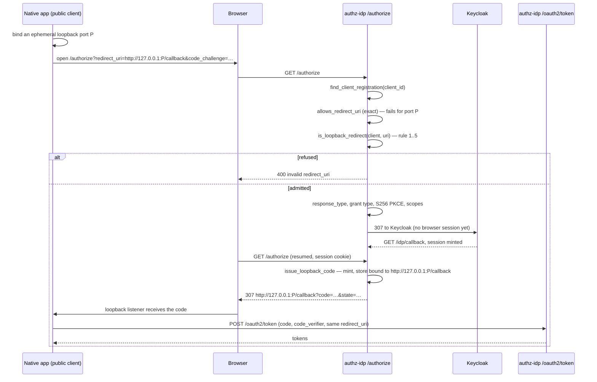

# RFC 8252 §7.3 loopback redirect URIs

`/authorize` matches `redirect_uri` **byte-for-byte** against the client's registration. That is
the right default and it stays the default. It cannot, however, serve a native app that receives
the redirect on a loopback listener: the operating system hands out the port at login time, so the
URI the app asks for is not a string anyone could have registered.

RFC 8252 §7.3 is explicit about this — an authorization server "MUST allow any port to be specified
at the time of the request for loopback IP redirect URIs". This document is the source of truth for
how far that goes here, and for what it deliberately does not cover.

Implementation: `crates/lightbridge-authz-rest/src/loopback/` (`redirect.rs` — the rule;
`code.rs` — issuance). Gate: `crates/lightbridge-authz-rest/src/authorize.rs`.

## The rule

A requested `redirect_uri` that **fails** the exact registry match is admitted if, and only if,
every one of these holds:

| # | Condition | Why |
|---|---|---|
| 1 | The client is public (`token_endpoint_auth_method == NoAuth`) | A native app ships to laptops and holds no secret. A confidential client has no reason to redirect to loopback. Anything that is not explicitly `NoAuth` — including `None` — fails closed. |
| 2 | Scheme is `http` and the host is a **loopback IP literal**: `127.0.0.1` or `[::1]` | §7.3's own construction. `[0:0:0:0:0:0:0:1]` is the same address and is accepted; `127.0.0.2` (elsewhere in `127.0.0.0/8`) is not "the loopback IP literal" and is refused. |
| 3 | **`localhost` is refused** | RFC 8252 §8.3: its use is NOT RECOMMENDED, because it resolves through the name service and can be pointed off-host — the exact property the IP literal removes. This is the RFC-strict reading and a deliberate policy choice. |
| 4 | No fragment | RFC 6749 §3.1.2 forbids one on a redirection endpoint. |
| 5 | It equals one of the client's **registered** loopback URIs in scheme, host, path and query — **the port is the only component allowed to differ** | §7.3's carve-out is "any port", not "any path". Without the path comparison, one registered loopback entry would admit every path on every loopback port, so a local process that won the port race would need only the `client_id`, not the registered path, to be handed `code` + `state`. |

Everything else is untouched. The exact match runs first and still wins, so the five fixed ports
`governance-auth-cli` pins today (`127.0.0.1:17452`–`17456/callback`) behave exactly as before —
they simply no longer need to be the *only* ports that work.

The blast radius of an admitted-but-hostile redirect is bounded by PKCE: `/authorize` requires
`S256` unconditionally, and `POST /oauth2/token` verifies the challenge, so a code delivered to a
process that won the port race cannot be redeemed without that process also holding the verifier.

## Sequence — where the rule sits



The `issue_loopback_code` step is not decoration. `authkestra_op::handlers::handle_authorize`
re-runs the same exact-match check with no knowledge of this rule, so an admitted ephemeral-port
URI routed through it is refused with `RedirectUriMismatch` — which `issue_code` turns into a bare
`500`. Admitting the request at the gate without also owning issuance produces a flow that
validates and then never issues a code.

## Lifecycle of the requested `redirect_uri`

```mermaid
stateDiagram-v2
    [*] --> Received: GET /authorize
    Received --> ExactMatch: allows_redirect_uri == true
    Received --> CarveOutCandidate: exact match failed
    CarveOutCandidate --> Rejected: not a public client (rule 1)
    CarveOutCandidate --> Rejected: not http + 127.0.0.1 / [::1] (rules 2, 3)
    CarveOutCandidate --> Rejected: fragment present (rule 4)
    CarveOutCandidate --> Rejected: no registered loopback URI matches on path/query (rule 5)
    CarveOutCandidate --> Admitted: port is the only difference
    ExactMatch --> CodeViaHandleAuthorize: session present
    Admitted --> CodeViaIssueLoopbackCode: session present
    ExactMatch --> KeycloakLeg: no session
    Admitted --> KeycloakLeg: no session
    KeycloakLeg --> Received: resume with session cookie
    CodeViaHandleAuthorize --> BoundToRequestedUri
    CodeViaIssueLoopbackCode --> BoundToRequestedUri
    BoundToRequestedUri --> Redeemed: token endpoint, same redirect_uri + verifier
    BoundToRequestedUri --> Rejected: any other redirect_uri at redemption
    Rejected --> [*]
    Redeemed --> [*]
```

The stored code is bound to the **actual requested** URI, ephemeral port included — never to the
registered one. The token endpoint's `authorization_code_matches`
(`crates/lightbridge-authz-api-key/src/repo.rs`) compares the presented `redirect_uri` to the stored
one exactly; substituting the registration would both break redemption and let every port redeem
against a single stored value. There is deliberately no state in which an admitted loopback URI is
stored as anything other than itself.

## What this does not do

- It does not introduce wildcards, prefixes, or inferred redirect URIs anywhere else. Rule 5 is a
  single-component relaxation on an otherwise exact comparison, restricted to loopback.
- It does not change any registered client. `governance-auth-cli` still pins its fixed port block
  today; moving it to ephemeral ports is a separate change on the CLI side.
- It does not relax PKCE, scope validation, `response_type`, or grant-type checks. Those all run
  before issuance, and `/authorize`'s scope check is stricter than upstream's (it intersects the
  client's registration with the OP's `scopes_supported`).
