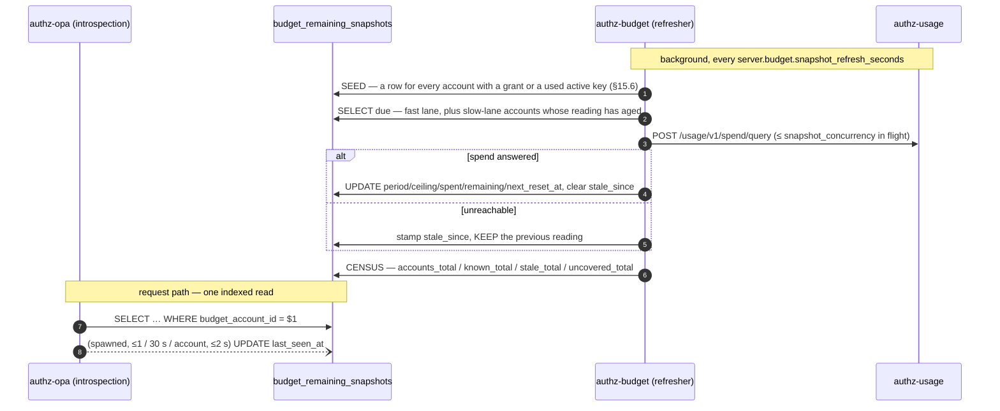
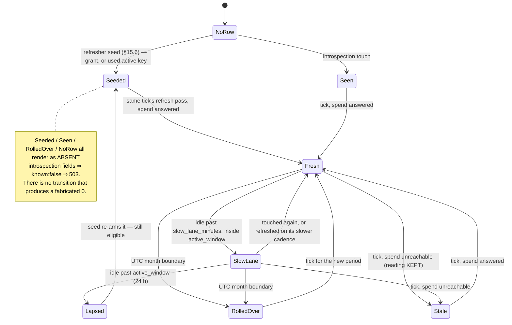

# Runbook — the budget remaining snapshot (ADR-0034 §15)

What to do when the gateway starts refusing metered requests with `503 budget_unavailable`, when
`budget_snapshot_age_seconds` climbs, or when a refill "did not take effect".

Scope: the **backend** half. The gateway/values half (`budgetLimiter` flags, the AuthConfig, shadow
mode) is `ai-helm-values docs/runbooks/budget-limiter-rollout.md`.

---

## 1. The shape, in one diagram





---

## 2. Symptom: `503 budget_unavailable` on metered requests

`503` means the gateway could not learn the balance. It never means the account is out of money —
that is `402 budget_exhausted`, a different status with a different body.

Work down this list; each step distinguishes one cause from the next.

1. **Is there a row at all?**
   ```sql
   SELECT budget_account_id, period, remaining_micros, refreshed_at, stale_since, last_seen_at
   FROM budget_remaining_snapshots WHERE budget_account_id = '<acct>';
   ```
   - **No row** → since §15.6 this should be rare: the seed gives a row to every account with a
     budget grant or a used, active API key inside `snapshot_seed_lookback_days`. No row means the
     account matches neither (check `budget_grants` and `api_keys.last_used_at`), or it is not a
     budget account at all (`accounts` ⋈ `users`), or the refresher is not running (go to 2). The
     next introspection also creates it. If requests *are* arriving and no row appears, the touch
     is failing — grep `authz-opa` for `failed to touch the budget snapshot's last_seen_at` and
     read the `budget_snapshot_touch_dropped_total` field on that line.
   - **Row with `remaining_micros IS NULL`** → seen, never successfully refreshed. Go to 2.
   - **Row whose `period` is not the current `YYYY-MM`** → the month rolled over and no tick has run
     since. Go to 2.

2. **Is the refresher running?** On `authz-budget`, at startup:
   `starting the budget remaining-snapshot refresher`. Per tick (at `debug`):
   `budget remaining snapshot refresh tick`. A tick that fails logs
   `budget snapshot refresh tick failed; retrying on the next interval`.
   - No startup line at all → this process has no `server.budget` block, or it is not the
     `budget` subcommand. Only `authz-budget` runs the refresher.

3. **Is `authz-usage` answering?** `stale_since` non-NULL is the direct signal, and
   `budget snapshot refresh failed for one account` names the error. Check
   `usage_service.base_url`, the CA bundle, and the client certificate — a spend read that cannot
   be made is `SpendObservation::Unreachable`, which keeps the previous reading and stamps
   `stale_since`. An account with **no** previous reading stays `NULL` and therefore `503`.

4. **Is another replica holding the advisory lock and wedged?**
   ```sql
   SELECT pid, granted, query_start FROM pg_locks l
   JOIN pg_stat_activity a USING (pid)
   WHERE l.locktype = 'advisory' AND l.objid = 1397905232;   -- 0x4255_4447_5F53_4E50 low word
   ```
   A tick releases the lock explicitly; a crashed backend releases it when its session ends. A held
   lock with no live query is the case to escalate.

5. **Confirm the ledger itself is fine**, bypassing every layer above:
   ```
   GET /budget/v1/remaining?account_id=<acct>&fresh=true
   ```
   `?fresh=true` skips the snapshot and recomputes live (ledger `SUM` + spend query). If that
   answers `200` and the snapshot path does not, the fault is in the refresher, not in the ledger.

---

## 3. Symptom: `budget_snapshot_age_seconds` is climbing

Expected steady state is `< snapshot_refresh_seconds + one tick` (≈ 30 s at the default 15 s).

| Age | Read it as |
|---|---|
| < 30 s | normal |
| 30 s – 5 min | ticks are overrunning: the active set is larger than `snapshot_batch`, or the spend reads are slow. Raise `snapshot_concurrency` first, `snapshot_batch` second. |
| > 5 min, `stale_since` NULL | the refresher is not running, or the advisory lock is held by a wedged session (§2.4). |
| > 5 min, `stale_since` set | `authz-usage` has been unreachable since `stale_since`. The balance being served is that old. |

The account's own `last_seen_at` also matters: an account outside
`snapshot_active_window_minutes` is deliberately not refreshed, and its age grows until it is used
again. That is the design, not a fault.

---

## 4. Symptom: "I granted a refill and nothing changed"

A booked grant moves the snapshot **inside the grant's own transaction**, so the new balance is
visible on the very next request. If it is not, exactly one of these is true:

- **The account had no reading yet** (`remaining_micros IS NULL`). There was no number to move; the
  next tick computes the first one. Correct behaviour — a delta is not a balance.
- **The grant's period is not the snapshot's period.** A grant booked into next month must not move
  this month's balance.
- **Authorino is still serving a cached introspection.** The `lightbridgeintrospect` step caches per
  `jti` for 30 s. Wait it out; this is the first term of ADR-0034 §15.1's window.

---

## 5. Knobs, and what each one trades

All on `server.budget` (`config/default.yaml`, `charts/lightbridge-authz/values.yaml`).

| Key | Default | Raising it | Lowering it |
|---|---|---|---|
| `snapshot_refresh_seconds` | 15 | less load on `authz-usage`; more forgiven overspend | fresher balances; one spend query per fast-lane account per tick |
| `snapshot_active_window_minutes` | 1440 | idle accounts stay covered for longer | less background work; an account idle past it is only kept alive by the seed |
| `snapshot_slow_lane_minutes` | 10 | a bigger fast lane boundary AND a slower slow lane | more accounts recomputed every tick |
| `snapshot_seed_lookback_days` | 30 | covers accounts that go quiet for longer | narrows the census population; does not delete already-seeded rows |
| `snapshot_batch` | 500 | a bigger active set is covered per tick | shorter, more predictable ticks |
| `snapshot_concurrency` | 8 | ticks finish faster | gentler on `authz-usage`, which also serves the console |

`snapshot_refresh_seconds: 0` and `snapshot_slow_lane_minutes: 0` are both refused at startup — a
zero-second interval is a busy loop against the database, and a zero-minute lane boundary puts every
account in the fast lane permanently.

---

## 7. Symptom: the gateway reports `known: false` for accounts that should be funded

This is a **coverage** question, and since ADR-0034 §15.6 the refresher answers it itself. Every
tick logs, at `info`:

```
budget remaining snapshot refresh tick
  budget_snapshot_accounts_total=41 budget_snapshot_known_total=41
  budget_snapshot_stale_total=0 budget_snapshot_uncovered_total=0
  seeded=0 considered=6 refreshed=6 kept_stale=0 failed=0
```

`budget_snapshot_uncovered_total` is the one that matters: accounts that can send metered traffic
and that the introspection would still answer `known: false` for. **Steady state is zero.** Read it
straight off the deployment:

```bash
kubectl -n converse logs deploy/lightbridge-budget-main --tail=200   | grep 'snapshot refresh tick' | tail -1
```

Confirm it against the database (read-only) when you need the number in a report:

```sql
SELECT count(*) AS snapshot_rows FROM budget_remaining_snapshots;

SELECT count(*) AS eligible_accounts
FROM accounts a JOIN users u ON u.id = a.user_id
WHERE a.id IN (
    SELECT budget_account_id FROM budget_grants WHERE created_at >= now() - interval '30 days'
    UNION
    SELECT owner_account_id FROM api_keys
     WHERE deleted_at IS NULL AND status = 'active' AND last_used_at >= now() - interval '30 days'
);
```

A non-zero `uncovered_total` that does not fall to zero within one tick means the seed ran but the
refresh pass did not reach those rows — check `considered` against `snapshot_batch`, and §2 above.

**What this counter does NOT cover.** ADR-0034 §15.3's `repobinding` (GitHub Actions) and legacy
Keycloak planes do not carry an introspection step and are not keyed on an `accounts.id` — the
busiest `usage_events` producers in production are repo slugs like `ADORSYS-GIS/lightbridge-authz`,
which by construction can never hold a snapshot row. They must ship `enforced: false` at the
AuthConfig; a `known: false` there is not a coverage regression and raising
`snapshot_seed_lookback_days` will not change it. See `ai-helm-values
docs/runbooks/budget-limiter-rollout.md`.

---

## 6. What must never be "fixed" by writing a zero

If you are tempted to `UPDATE budget_remaining_snapshots SET remaining_micros = 0` to clear a 503:
don't. That converts our outage into `402 budget_exhausted` for the account — a bill for our own
latency, and indistinguishable to the user from genuinely running out. Every layer of this design
keeps "unknown" and "nothing left" apart on purpose (ADR-0034 D5). Fix the refresher, or accept the
503 while `authz-usage` is down.
