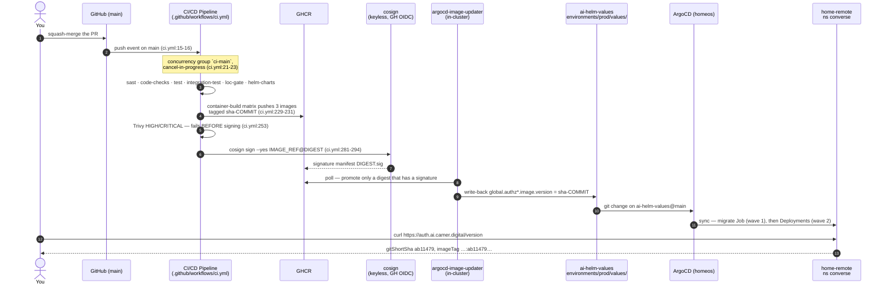
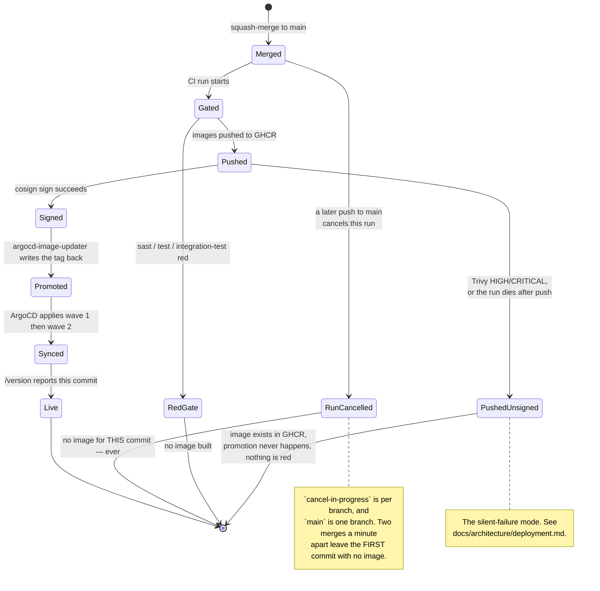

# Runbook: from a merged PR to code running in production

Open this when you have merged something and need to answer *"is it live?"* — or when it should be
live and is not.

[`docs/architecture/deployment.md`](../architecture/deployment.md) describes the **topology** (which
job builds what, where the signature gate is, why image promotion is not a job in this repo). This
runbook is the **procedure**: what you run, in what order, and what each answer means. It does not
restate the topology; it links to it.

> **Scope.** Everything here is about the `lightbridge-authz` half of the chain. The first-admin
> bootstrap that has to happen *after* an image with platform roles is live is a `ai-helm-values`
> runbook, not this one — see [Step 6](#step-6--the-first-admin-is-not-in-this-repo).

---

## The chain, end to end





---

## Step 1 — did a CI run for *this* commit survive?

`ci.yml` restricts `push` to `main` (`.github/workflows/ci.yml:15-16`) and declares one concurrency
group per branch with `cancel-in-progress: true` (`.github/workflows/ci.yml:21-23`). For pushes to
`main` that group is `ci-main` — a single lane for the whole branch.

**What that means for images.** Merging two PRs in quick succession cancels the first merge's run.
Nothing goes red; the run is simply `cancelled`. `container-build` never reaches
`cosign sign`, so the first commit gets **no signed image and therefore never deploys**. This is not
a bug — the last commit's image contains the first commit's code, so the *content* ships. But it
does mean:

- `sha-<commit>` is **not** a tag that exists for every commit on `main`. Do not build a rollback
  procedure that assumes it does.
- If the second run then fails, both commits are unshipped, and only the second one looks red.

```bash
zsh -i -c 'gh run list -R ADORSYS-GIS/lightbridge-authz --branch main -L 10 \
  --json databaseId,headSha,conclusion,displayTitle \
  --jq ".[] | [.headSha[0:7], .conclusion, .displayTitle] | @tsv"'
```

A `cancelled` line against your SHA is the answer: nothing was published for it. Re-run it
(`gh run rerun <id>`) or merge a follow-up.

## Step 2 — were all three images pushed and signed?

`container-build` is a three-leg matrix — `runtime` → `lightbridge-authz` (serves `authz-api`,
`authz-opa`, `authz-idp`, `authz-budget`), `mcp-runtime` → `-mcp`, `usage-runtime` → `-usage`
(`.github/workflows/ci.yml:229-231`). It runs only on a `main` push
(`.github/workflows/ci.yml:224`) and it is gated on `sast`, `binaries`, `test` and
`integration-test` (`.github/workflows/ci.yml:223`) — the comment above that line records the
2026-08-25 incident that put them there.

Order inside the job is load-bearing: build+push → **Trivy** (`ci.yml:253`) → **cosign**
(`ci.yml:281-294`). Trivy failing leaves an image in GHCR that is never signed and therefore never
promoted. That is deliberate and it is the shape you must be able to recognise, because *nothing is
red downstream*.

The signature check itself is scripted in
[`docs/architecture/deployment.md`](../architecture/deployment.md#continuous-delivery-to-prod-the-image-updater-hop-and-its-silent-failure-mode)
— `200` on the `<digest>.sig` manifest means promotable, `404` means it will never move.

## Step 3 — did the promotion land in `ai-helm-values`?

Image promotion is **not** a job in this repository. `argocd-image-updater` polls GHCR and writes the
new tag back into `ai-helm-values`. Read the pins the cluster is actually holding:

```bash
zsh -i -c 'kubectl get application lightbridge-app -n argocd -o json' \
  | python3 -c 'import json,sys; [print(" ", i) for i in json.load(sys.stdin)["status"]["summary"]["images"]]'
```

Verified 2026-09-03, after `ab11479` (#672) merged:

```
  ghcr.io/adorsys-gis/lightbridge-authz-mcp:sha-ab11479ad2f94efb3f949cdad3e2e35b18f70a91
  ghcr.io/adorsys-gis/lightbridge-authz-usage:sha-ab11479ad2f94efb3f949cdad3e2e35b18f70a91
  ghcr.io/adorsys-gis/lightbridge-authz:sha-ab11479ad2f94efb3f949cdad3e2e35b18f70a91
```

All three at one SHA. Note that `lightbridge-authz-usage` **is** moving with the other two now;
`deployment.md`'s older "usage is not covered by image-updater" note is kept there as history, but
do not rely on either statement — read the live list.

## Step 4 — did ArgoCD sync, and did the migration run first?

`lightbridge-app` lives in the ArgoCD on the **`homeos`** context and deploys to the destination
named **`home-remote`** (namespace `converse`, reachable directly as the `hetzner-prod` kube
context). Its chart comes from OCI, its values from git:

```bash
zsh -i -c 'kubectl get application lightbridge-app -n argocd -o jsonpath="{.spec.sources}"' | python3 -m json.tool
```

```
oci://ghcr.io/adorsys-gis/charts/lightbridge-authz-stack   targetRevision 10.0.0
https://github.com/adorsys-gis/ai-helm-values  main  environments/prod/values/lightbridge-app.yaml
```

**Migrations run as wave-1 Jobs, one per component**, not as init containers:

```bash
zsh -i -c 'kubectl --context hetzner-prod -n converse get jobs | grep migrate'
```

```
lightbridge-api-migrate-3bdd82753e       Complete   1/1   6s
lightbridge-budget-migrate-2d8df2955a    Complete   1/1   6s
lightbridge-idp-migrate-9be300e290       Complete   1/1   6s
lightbridge-opa-migrate-e911e8e931       Complete   1/1   6s
lightbridge-usage-migrate-7fcaa25f12     Complete   1/1   6s
```

> **Read this before you trust ADR-0031.**
> [`ADR-0031`](../adr/0031-migrations-run-in-init-containers.md) is **Accepted** (2026-09-02) and
> says migrations run in an init container on every component. **The chart has not been changed
> yet.** `charts/lightbridge-authz/values.yaml:129` still declares `controllers.migrate` as a
> `type: job` annotated `argocd.argoproj.io/sync-wave: "1"`
> (`charts/lightbridge-authz/values.yaml:187-188`), and the live cluster runs five such Jobs, with
> zero init containers on `lightbridge-api-main`. So ADR-0016's mechanism is what is deployed and
> ADR-0031's two failure classes are still reachable today. The *other* half of ADR-0031 —
> **expand/contract: a migration may only add, and code that requires the new shape ships in the
> next release** — is a discipline you can and should follow right now, and it is the half that
> makes ordering stop being load-bearing at all.

If a sync is stuck on `field is immutable` for a migrate Job, that is ADR-0031 Class 1: the residual
case the `suffix` hash cannot cover (`charts/lightbridge-authz/values.yaml:169-171`). Remedy is
`kubectl delete job <name>` and re-sync — see lightbridge-authz#480.

## Step 5 — ask the running binary what it is

Every listener serves `GET /version`, unauthenticated, beside `/healthz` (#573,
[`docs/build-info.md`](../build-info.md)). This is the only check that is not inference:

```bash
curl -s https://auth.ai.camer.digital/version | python3 -m json.tool
```

Real output, 2026-09-03:

```json
{
    "service": "authz-idp",
    "version": "0.8.1",
    "gitSha": "ab11479ad2f94efb3f949cdad3e2e35b18f70a91",
    "gitShortSha": "ab11479",
    "gitCommitDate": "2026-09-03T09:14:39+02:00",
    "gitDirty": false,
    "rustcVersion": "rustc 1.98.0 (88d9e12ae 2026-08-18)",
    "buildTime": "2026-09-03T07:18:52Z",
    "imageBuildSha": "ab11479ad2f94efb3f949cdad3e2e35b18f70a91",
    "imageTag": "ghcr.io/adorsys-gis/lightbridge-authz:ab11479ad2f94efb3f949cdad3e2e35b18f70a91",
    "imageBuildTime": "2026-09-03T07:38:58Z"
}
```

Reading it:

| field | says |
| --- | --- |
| `gitSha` / `gitShortSha` | which commit's **source** this binary was compiled from |
| `imageBuildSha` / `imageTag` | which commit's **image** the pod is running (injected as `ARG`→`ENV` at image build, `null` outside a container) |
| `version` | the crate version release-please last cut — **not** a deploy identity; two different pods can share it |
| `service` | which of the four routers this listener is. Threaded as `&'static str`, never derived, so it cannot lie |

`gitSha != imageBuildSha` would mean the image was built from a different tree than the binary
claims. They agree above.

For an authenticated caller the same struct is available as the `getBuildInfo()` RPC — one of the
two entries in `rpc_permission_map::AUTHENTICATED_ONLY_OP_IDS`, the other being `getMyAccess`.

`/version` is not mounted on the raw ingress for every host: `mcp.ai.camer.digital/version` 404s
(that host fronts the MCP router's own paths) and `self-service.ai.camer.digital` is the SPA. Ask
`auth.ai.camer.digital` for the idp, or `kubectl exec` into the pod you care about.

## Step 6 — the first admin is not in this repo

An image carrying [ADR-0033](../adr/0033-platform-roles-are-a-table-stamped-at-mint.md) being live
grants **nobody** anything: `platform_role_grants` starts empty, and the only writer that can run
before an admin exists is the CLI. The ordering is
**A2 → A5 (the image) → B3 (bootstrap) → B1 (flip the prod claim mapper) → C9 (console gating)**,
and any other order locks every operator out of `/admin/*` — a `platform_roles` mapper configured
before migration `20260902000006` is live **refuses every mint**, fail-closed by design.

The CLI half lives here: [`docs/rbac.md` → Bootstrap runbook (the first admin)](../rbac.md#bootstrap-runbook-the-first-admin).
The *cluster* half — which Job runs it, against which secret, and the `claim_mappers` flip that
follows — is an `ai-helm-values` runbook. **Do not fork a second copy of it into this repo.**

## Step 7 — the chart is a separate, currently-broken pipeline

Images and charts do not ship together.

- Images: every `main` push (`ci.yml`), promoted by signature.
- Charts: **only a `v*` tag** fires `Helm Charts Publish` (`.github/workflows/helm-oci.yml:17-20`),
  and that tag is cut by release-please.

**Known breakage — [#666](https://github.com/ADORSYS-GIS/lightbridge-authz/issues/666), open.**
`release-please` runs with `token: ${{ secrets.RELEASE_PLEASE_TOKEN || secrets.GITHUB_TOKEN }}`
(`.github/workflows/ci.yml:311`). A tag created with `GITHUB_TOKEN` does not fire a
`push: tags` workflow — GitHub's recursive-workflow guard — so `helm-oci.yml` silently stopped
running somewhere between `v5.0.0` and `v6.0.0`. `v6.0.0` through `v9.0.0` were tagged and **no
chart was ever published for them**; production sat pinned to chart `5.0.0`, four majors behind the
repo, with nothing red anywhere. `10.0.0` exists only because it was published by a manual
`workflow_dispatch` on the `v10.0.0` tag.

So, until #666 is fixed, **a chart change is not live when the release PR merges.** After a release:

```bash
zsh -i -c 'gh run list -R ADORSYS-GIS/lightbridge-authz --workflow=helm-oci.yml -L 3'
zsh -i -c 'gh api /orgs/ADORSYS-GIS/packages/container/charts%2Flightbridge-authz-stack/versions \
  --jq ".[].metadata.container.tags[]" | head'
```

If the newest published chart version is behind `.release-please-manifest.json`, dispatch it by
hand:

```bash
zsh -i -c 'gh workflow run helm-oci.yml -R ADORSYS-GIS/lightbridge-authz --ref v<version>'
```

The publish action's own preflight refuses to overwrite an already-published version, so a manual
re-run is safe. Then move the ArgoCD pin (`targetRevision`) in `ai-helm`.

The `Helm chart tests` job that guards those charts was itself red from the moment it was added
(#662) until #668 pinned `azure/setup-helm` to `v4.2.1` — the Helm ArgoCD v3.5.1 actually renders
prod with — added the `bjw-s` repo before `dependency build`, and deleted the stale
`charts/lightbridge-authz-stack/Chart.lock`. If you touch the charts, that job is now meaningful;
before #668 a green tick there proved nothing.

---

## Fast triage table

| Symptom | First check | Likely cause |
| --- | --- | --- |
| `/version` reports an older SHA | Step 3 (live image list) | image never promoted |
| Image list is old, CI green | Step 2 (`.sig` manifest → 404) | Trivy failed after push, or `cosign` never ran |
| No run at all for your SHA | Step 1 (`cancelled`) | `ci-main` concurrency cancelled it |
| ArgoCD `Synced` but pods unchanged | Step 4 | migrate Job `field is immutable`; ArgoCD served a cached diff (ADR-0031 Class 1) |
| Chart change not in prod | Step 7 | #666 — the tag never fired `helm-oci.yml` |
| Console 403s every `/admin/*` | Step 6 | no `platform_role_grants` row yet, or the mapper was flipped before the image was live |
| Usage queries slow again | [`docs/usage-performance.md`](../usage-performance.md) | check `idx_usage_events_query_cover` exists on the target database |

## Sources

Everything above is read from, and re-checkable against:
`.github/workflows/ci.yml`, `.github/workflows/helm-oci.yml`,
`.github/actions/container-build/action.yml`, `charts/lightbridge-authz/values.yaml`,
[`docs/architecture/deployment.md`](../architecture/deployment.md),
[`docs/build-info.md`](../build-info.md),
[ADR-0016](../adr/0016-migrate-job-sync-wave-not-hook.md),
[ADR-0031](../adr/0031-migrations-run-in-init-containers.md),
[ADR-0033](../adr/0033-platform-roles-are-a-table-stamped-at-mint.md),
and the live cluster (`kubectl --context hetzner-prod -n converse`, ArgoCD on `homeos`).
