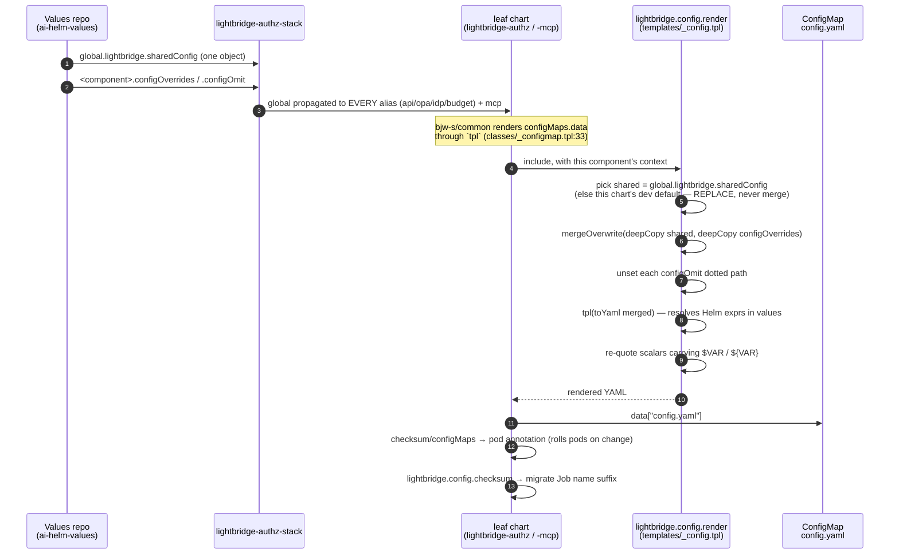
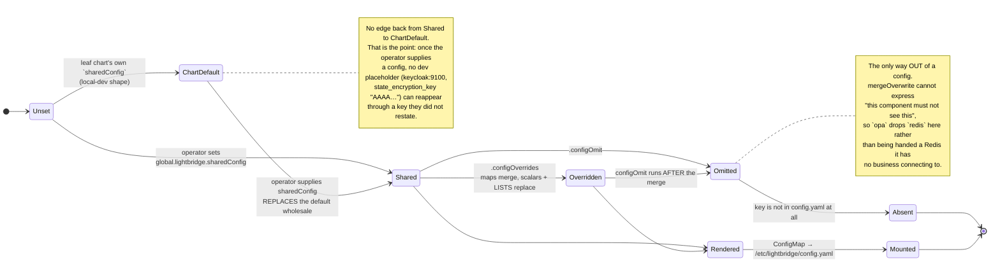

# One config, many components

The stack chart deploys the same binary six ways. Five of them — `api`, `opa`, `idp`, `budget`
(four aliases of `charts/lightbridge-authz`) and `mcp` (`charts/lightbridge-mcp`) — mount a
`/etc/lightbridge/config.yaml` whose oauth2 signing and `claim_mappers`, rbac `role_permissions`,
`database`, `federation` and `otel` blocks are meant to be identical. Until
[#645](https://github.com/ADORSYS-GIS/lightbridge-authz/issues/645) the only way a values repo
could express that was to write the whole file out once per component, as a YAML string, and keep
the five copies in sync by hand. `ai-helm-values`' `lightbridge-app.yaml` did exactly that — five
copies, the `idp` one flattened into a `\n`-escaped double-quoted scalar — so a one-line policy
change ([#350](https://github.com/ADORSYS-GIS/lightbridge-authz/pull/350),
[#353](https://github.com/ADORSYS-GIS/lightbridge-authz/pull/353)) had to be applied five times, in
five places, correctly, every time.

Now there is one object.

## The contract

```yaml
global:
  lightbridge:
    sharedConfig:          # the ONE source of truth — a YAML OBJECT, never a string
      oauth2: { ... }
      database: { ... }

api:
  configOverrides: { ... } # merged OVER sharedConfig, for this component only
  configOmit: []           # dotted paths deleted AFTER the merge
idp:
  configOverrides: { ... }
  configOmit: [billing]
```

Three rules, and they are the whole model:

1. **`global.lightbridge.sharedConfig` is the only shared channel.** Helm gives an umbrella chart
   no way to write a value once and have every *alias* see it — `api`, `opa`, `idp` and `budget`
   are four instances of one subchart, and a value set on one is invisible to the others. `global`
   is the exception, so that is where the shared object lives.
2. **`configOverrides` merges over it** (`mergeOverwrite`: maps merge recursively, scalars and
   **lists** are replaced wholesale). Per-component identity belongs here — `otel.service_name`,
   the listener block for that subcommand, its client certificates.
3. **`configOmit` deletes.** A merge can add a key; it can never take one away. `opa` has no Redis
   of its own and must not be handed one, so `opa.configOmit: [redis]`.

### `sharedConfig` replaces, it does not merge

When `global.lightbridge.sharedConfig` is non-empty it wins **outright** over the chart's own
`sharedConfig` default — it is not deep-merged into it. Helm's normal merge would carry every key
the operator did not happen to restate into the render, and this chart's defaults are
local-dev-shaped: `keycloak:9100`, and a fixed `oauth2.relying_party.state_encryption_key` of
`"AAAA…"` documented as development-only. Deep-merging those into a production config is a
security bug, not a convenience. The operator's config is authoritative or it is not used at all.

The chart keeps its own `sharedConfig` default so `helm install charts/lightbridge-authz` alone
still produces a working local-dev deployment.

### Env placeholders

The backend substitutes `$VAR`, `${VAR}`, `${VAR-default}` and `${VAR:-default}` *textually*,
before the YAML is parsed (`interpolate_env_vars`,
`crates/lightbridge-authz-core/src/config/mod.rs:1336`). `toYaml` emits such a value as an
unquoted plain scalar — `password: ${OPA_PASSWORD}` — so a secret containing `#`, `%`, a leading
`*`/`&`/`!`, or a `: ` would corrupt the document at parse time. The hand-written strings this
replaces were quoted by hand; `lightbridge.config.render` re-quotes exactly the scalars that carry
a placeholder (`charts/lightbridge-authz/templates/_config.tpl:93-94`), and
`charts/lightbridge-authz/tests/config-render_test.yaml` pins that behaviour.

## How a render happens



## What a key can be, and how it gets there



## Why the migrate Job's name had to change with it

`controllers.migrate.suffix` folds the mounted config into the Job's name, so a config-only
change mints a *new* Job instead of re-applying a completed one with a different — and immutable —
`spec.template` (the failure mode of
[#480](https://github.com/ADORSYS-GIS/lightbridge-authz/issues/480): ArgoCD's server-side diff
dry-run rejects it and **nothing** in the whole app syncs). That suffix used to hash
`configMaps.config.data` directly. That value is now a fixed one-line template, identical for
every possible config, so hashing it raw would have produced one Job name forever.
`lightbridge.config.checksum` hashes the *rendered* config instead, which is what the original
comment always meant. `charts/lightbridge-authz/tests/config-render_test.yaml` asserts a
config-only change still moves the name.

## Scope

`charts/lightbridge-authz-usage` is deliberately **not** wired into the shared object. Its config
is a different schema, not a variation on the same one: `oauth2.type: external` where the others
are `self`, no `signing`/`federation` block at all, `otel.enabled: false`, a `scope_authority`
block nothing else has, and dual listeners (`server.usage` + the mTLS-gated `server.query`).
Exactly six keys are common between it and the other five, so folding it in would mean a
`configOmit` list longer than its config. It keeps its own `configMaps.config.data` string.
