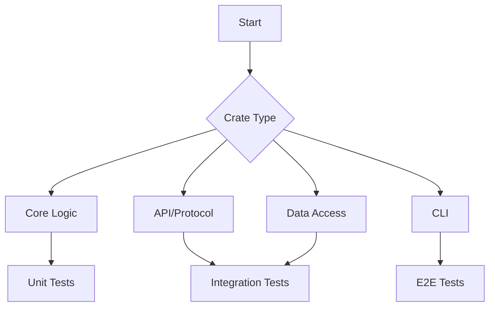

# Testing Strategy

## Why?

A comprehensive testing strategy is essential to ensure the quality, reliability, and maintainability of the Lightbridge Authz project. This document outlines the testing approach for each crate, ensuring that all critical components are thoroughly tested.

## Actual

The testing strategy is divided into three main categories: unit tests, integration tests, and end-to-end (E2E) tests. Each type of test is suited for different parts of the application, as detailed below.

### Unit Tests

Unit tests are focused on testing individual functions and components in isolation. They are ideal for testing the core business logic of the application.

- **`lightbridge-authz-core`**: All public functions in this crate should have unit tests. The tests should cover both success and failure cases, ensuring that the error handling is working correctly.

### Integration Tests

Integration tests are designed to test the interactions between different components of the application. They are particularly useful for testing the API and data access layers.

- **`lightbridge-authz-api-key`**: The repositories in this crate should be tested with integration tests that connect to a test database. This will ensure that the SQL queries are correct and that the data is being mapped correctly.

- **`lightbridge-authz-api`**: The API controllers should be tested with integration tests that simulate HTTP requests and verify the responses. These tests should cover all API endpoints and HTTP methods.

- **`lightbridge-authz-rest`** & **`lightbridge-authz-grpc`**: The REST and gRPC servers should be tested with integration tests to ensure that they are correctly handling requests and responses.

### End-to-End (E2E) Tests

E2E tests are designed to test the entire application from the user's perspective. They are most suitable for testing the command-line interface.

- **`lightbridge-authz-cli`**: The CLI should be tested with E2E tests that execute the compiled binary with different arguments and assert that the output is correct.

## How to?

To implement this testing strategy, we will use the following tools and techniques:

- **Unit Tests**: We will use the built-in Rust testing framework (`#[test]`) to write unit tests.
- **Integration Tests**: For integration tests, we will use a combination of the `reqwest` crate for making HTTP requests and the `diesel` crate for interacting with the test database.
- **E2E Tests**: We will use the `assert_cmd` crate to write E2E tests for the CLI.

All tests will be run as part of the CI/CD pipeline to ensure that no regressions are introduced.
