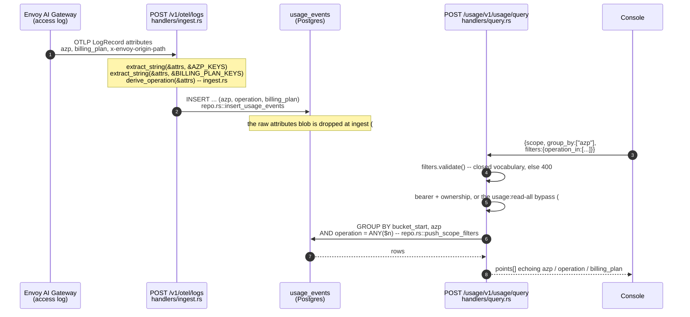
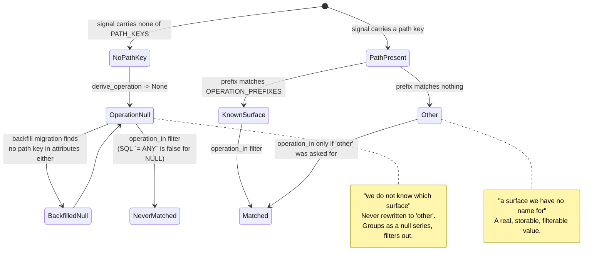

# Usage API (lightbridge-authz-usage)

`lightbridge-authz-usage` ingests OTLP/HTTP traces + metrics + logs from AI Envoy/OpenTelemetry exporters and stores normalized usage events in Timescale/Postgres.

> [!WARNING]
> **The ingest routes are unauthenticated.** This service splits its TLS surface
> across two listeners (#347, `UsageServerGroup` in
> [`crates/lightbridge-authz-usage/src/config.rs`](../crates/lightbridge-authz-usage/src/config.rs)):
> an **ingest listener** (`/v1/otel/*`, `routers::ingest_router()`) that applies no JWT,
> Basic-auth, or mTLS check — its caller is an AI Envoy/OpenTelemetry exporter outside
> this repo's deploy surface, so anyone who can reach it can write fabricated
> usage/billing records for any account or project — and a **query listener**
> (`/usage/v1/usage/query` + `/usage/v1/spend/query`, `routers::query_router()`) that
> **requires and verifies a client certificate (mTLS)**. This service is
> `ClusterIP`-only in prod with no external route regardless — see
> [`docs/lightbridge-query-api.md`](lightbridge-query-api.md) for the full detail
> (base URL, blast radius) before giving this service any external route.
>
> **`/usage/v1/usage/query`'s cross-tenant ownership gap (#570) is now fixed.** mTLS
> alone authenticates "a legitimate lightbridge workload holding a CA-signed cert", not
> which `scope_id` the caller is entitled to see, so `/usage/v1/usage/query` now
> ADDITIONALLY requires an end-user `Authorization: Bearer <access token>` (validated
> via JWKS, `lightbridge-authz-bearer::BearerTokenService`) and checks that the
> token's subject actually owns the requested `account`/`project` scope by calling
> `authz-opa`'s `POST /idp/v1/authorize-usage-scope` (`ScopeAuthority`,
> `crates/lightbridge-authz-usage/src/scope_authority.rs`) — the same real,
> Postgres-backed ownership predicate `resolve_context` already enforces for the OIDC
> token-exchange path. `scope=api_key` has no resolvable ownership authority at all
> and is refused unconditionally (403), matching the console's own guard. `scope=user`
> is allowed ONLY when `scope_id` equals the caller's own validated subject
> (self-ownership, answered from the token directly, no `authz-opa` round trip);
> anything else is `403`. `scope=all` (estate-wide, no entity filter) requires the
> caller's token to hold the `usage:read-all` permission — granted to
> `lightbridge-admin` by default, configurable via `oauth2.rbac.role_permissions` like
> every other permission (`docs/rbac.md`); `authz-opa` is not consulted for this scope
> either. Missing/invalid bearer → `401`; authenticated but not authorized → `403`
> with an opaque body. `/usage/v1/spend/query` stays exempt from this bearer requirement — it
> is `authz-budget`'s legitimate cross-account service reader, mTLS-only, and now
> REFUSES any request carrying an `Authorization` header (closing the "console
> catch-all-proxy" hole where a misrouted browser bearer token could otherwise reach
> this ownerless cross-account read).
>
> **Divergence from the console's own guard, stated not hidden:** the backend
> predicate here (owner of the account, OR any `project_members` roster row for a
> project scope) is deliberately WIDER than the console UI's own client-side guard
> (owner-only) — a roster member who the console UI would never let ask can still
> query their project's usage through this endpoint directly, matching the exact
> visibility boundary `resolve_context`/`Project`'s `@@allow("read", ...)` already use
> elsewhere in this codebase, not a new, narrower one invented for this endpoint.

## Endpoints

- `POST /v1/otel/traces`
  - Accepts `application/x-protobuf` or OTLP JSON payloads compatible with `ExportTraceServiceRequest`.
- `POST /v1/otel/metrics`
  - Accepts `application/x-protobuf` or OTLP JSON payloads compatible with `ExportMetricsServiceRequest`.
- `POST /v1/otel/logs`
  - Accepts `application/x-protobuf` or OTLP JSON payloads compatible with `ExportLogsServiceRequest`.
- `POST /usage/v1/usage/query`
  - Single query endpoint for scoped, bucketed usage retrieval. Requires
    `Authorization: Bearer <end-user access token>` (#570) — see the warning above.
- `POST /usage/v1/spend/query`
  - Summed spend for an account/period, called by `lightbridge-authz-budget`'s
    `UsageServiceSpendReader`. mTLS-only, no bearer token, no per-caller ownership check (it is a
    legitimate cross-account service-to-service reader) — and since #603 REFUSES any request
    carrying an `Authorization` header, returning `403`.

## Query request

```json
{
  "scope": "project",
  "scope_id": "proj_123",
  "start_time": "2026-02-20T00:00:00Z",
  "end_time": "2026-02-23T00:00:00Z",
  "bucket": "1 hour",
  "filters": {
    "model": "gpt-4.1",
    "signal_type": "metric",
    "operation_in": ["chat_completions", "responses", "messages"]
  },
  "group_by": ["model", "metric_name", "azp"],
  "limit": 1000,
  "metrics": ["totals"]
}
```

`metrics` (optional; **omit it and you get everything**, which is what every caller written before
2026-09-03 does) selects which metric FAMILIES the query computes:

| value                  | fields                                                                                            | cost |
|------------------------|---------------------------------------------------------------------------------------------------|------|
| `totals`               | `requests`, `usage_value`, `prompt_tokens`, `completion_tokens`, `total_tokens`, `total_cost`, `latency_samples` | free -- plain `SUM`/`COUNT` in the pass that already reads the row. Always computed; listing it is a documented no-op. |
| `latency_percentiles`  | `latency_p50_ms`, `latency_p95_ms`, `latency_p99_ms`                                              | changes the PLAN. See [Query cost](#query-cost-2026-09-03). |

Omitting `latency_percentiles` returns the three percentile fields as `null`, and the response
echoes back a `metrics` array saying so -- which is what keeps that `null` unambiguous. A point
with `latency_samples > 0` and `latency_p50_ms: null` means "percentiles were not requested";
`latency_samples: 0` still means "no row in this bucket reported a latency at all".

## Response shape and truncation (#578)

The response is `{ "points": [...], "truncated": bool, "metrics": [...] }`. `limit` bounds the number of DISTINCT
`bucket_start` values returned, not the number of `points` entries (rows) -- with a non-empty
`group_by`, each bucket can contribute multiple `points` (one per series), so `points.len()` can
exceed `limit` even when `truncated` is `false`. `truncated: true` means more than `limit`
DISTINCT buckets matched the query and the OLDEST one was dropped to fit; `points` then holds
every series for exactly the newest `limit` buckets, in ascending `bucket_start` order. Truncation
always drops a bucket WHOLE — every series that bucket had, together, never an arbitrary subset of
one bucket's series while its sibling buckets keep theirs; a bucket that straddles the truncation
boundary is dropped or kept as a whole bucket, not split (a known caveat tracked as #586).

## Query cost (2026-09-03)

The owner reported the query backend as "very slow". It was: the console's estate-wide 30-day
overview took **34.8 s** on production. Three independent causes, all fixed in #665, and the
biggest one is not the one the question assumed:

1. **The table was scanned twice** — #578's bucket-scoped truncation was two statements over the
   same `WHERE`. `StoreRepo::query_usage` is now one statement.
2. **87% of the heap is `attributes`, a column no query reads** — it averages 1,445 B and stays
   inline, so a page holds ~4 rows instead of ~35.
   `migrations-usage/20260903000002_usage_event_query_covering_index.sql` adds a covering index over
   the eighteen columns the query actually reads: 279,627 → 13,436 pages on a production-width
   fixture, 20.8x fewer.
3. **`percentile_cont` cannot be hash-aggregated** — asking for latency percentiles changes the
   plan, not just its cost. That is what the `metrics` request field above turns off: send
   `"metrics": ["totals"]` when the caller does not render percentiles.

**The measurements, the query shape before/after, the rejected alternatives (BRIN, a CTE), the
log-noise fix and how to re-measure on the read-only replica live in
[`docs/usage-performance.md`](./usage-performance.md)** — they are not repeated here. The related
question *"would Timescale hypertables fix this?"* is answered against the same numbers in
[`docs/plans/0581-multi-source-usage-plan-of-work.md` §0a](./plans/0581-multi-source-usage-plan-of-work.md).


## Scope semantics

- `scope=user` filters by `user_id = scope_id` — allowed ONLY when `scope_id` equals the
  caller's own validated subject (self-ownership); any other subject is refused with `403`.
- `scope=api_key` filters by `api_key_id = scope_id` — no resolvable ownership authority at
  all; every request is refused with `403` regardless of the caller (#570).
- `scope=project` filters by `project_id = scope_id` — requires the bearer token's subject to
  own the project's account OR hold a `project_members` roster row for it.
- `scope=account` filters by `account_id = scope_id` — requires the bearer token's subject to
  own the account (ADR-0026 anchor semantics: same `accounts.user_id` identity, not merely the
  same `accounts.id`).
- `scope=all` adds no entity filter at all (estate-wide) — requires the bearer token to hold
  the `usage:read-all` permission (`Permission::UsageReadAll`); `scope_id` is ignored and
  should be sent as `""`.

**Admin bypass (#648).** A caller whose token holds `usage:read-all` may query
`scope=user`, `scope=project` or `scope=account` with ANY `scope_id`, with no
ownership round trip to `authz-opa` at all. This is not a widening: that same
permission already returns every row in the estate through `scope=all`, so
refusing the same data sliced by one account was a missing feature (it is what
blocked the console's per-actor usage pages), not a boundary. Two things are
deliberately unchanged: `scope=api_key` is still refused for **everyone**,
`usage:read-all` holders included — no permission conjures an ownership authority
that has never existed for a raw `api_key_id` — and a caller **without** the
permission sees exactly today's behaviour, `scope=user` self-only and
account/project through `ScopeAuthority`.

`filters` also accepts `api_key_id` and `user_name` (in addition to `account_id`,
`project_id`, `user_id`, `model`, `metric_name`, `signal_type`), plus the three
usage dimensions below (`azp`, `operation`, `billing_plan`) and the set-membership
filter `operation_in`. `group_by` accepts the same set of dimensions. See
[`docs/lightbridge-query-api.md`](lightbridge-query-api.md) for the full field
reference.

## Usage dimensions: `azp`, `operation`, `billing_plan` (#648)

Three dimensions the AI gateway has always emitted are stored as real, indexed,
groupable columns on `usage_events` rather than only inside the `attributes` JSONB
blob:

| Column | Source attribute keys, first match wins | Meaning |
|---|---|---|
| `azp` | `azp`, `x-oidc-azp`, `oauth.azp`, `client_id` | The OAuth client the request arrived on — "which channel". Gateway: `ai-helm` `charts/core-gateway/templates/envoy-proxy.yaml:257`, from Authorino's `x-oidc-azp`. |
| `billing_plan` | `billing_plan`, `x-billing-plan` | The plan Authorino stamped on the request (`envoy-proxy.yaml:240`). |
| `operation` | derived from `x-envoy-origin-path`, `http.route`, `url.path`, `route_name` | Which API surface was called. Closed vocabulary, below. |

`operation` is derived at ingest by **path prefix** (a real request target carries a
query string, so `/v1/chat/completions?stream=true` must still be
`chat_completions`):

| Path prefix | `operation` |
|---|---|
| `/v1/chat/completions` | `chat_completions` |
| `/v1/responses` | `responses` |
| `/v1/messages` | `messages` |
| `/v1/embeddings` | `embeddings` |
| anything else | `other` |
| *no path key present at all* | `null` |

The last two rows are different facts and are stored differently on purpose:
`other` means "a surface was called and we have no name for it", `null` means "this
signal never told us which surface". Collapsing the second into the first would
invent data — the same honesty rule `total_cost` and `latency_ms` already follow.
`operation_in` is a set-membership filter (`operation = ANY($1)`, one bound
`text[]`) validated against exactly the five values above, so the console's chat
view asks one query instead of three that can disagree with each other at a bucket
boundary.

**This bridge is interim and dies with the table.** #581
(`docs/plans/0581-multi-source-usage-plan-of-work.md`) replaces `usage_events` with
the `usage_request_events` hypertable and ends with `DROP TABLE usage_events`;
PR-1b there carries these three columns and this exact vocabulary forward. Total
surface here: three columns, one backfill, the query-schema additions.

### How a dimension gets from the gateway to a chart



### A row's `operation`, and why `null` is not `other`



Every transition above is exercised by a test:
`operation_derivation_should_cover_the_whole_table` and
`extract_log_events_should_promote_azp_billing_plan_and_operation_to_columns`
(`crates/lightbridge-authz-usage/src/handlers/ingest.rs`),
`operation_in_never_matches_rows_with_a_null_operation`
(`crates/lightbridge-authz-usage/tests/repo_it_tests.rs`).

## Latency

Each `usage_events` row carries an optional `latency_ms` (a single `DOUBLE PRECISION` column, 8
bytes/row), and `/usage/v1/usage/query` returns `latency_samples` plus `latency_p50_ms` /
`latency_p95_ms` / `latency_p99_ms` per point, computed with Postgres' `percentile_cont`
ordered-set aggregate at query time. Nothing about the distribution is stored -- no sample arrays,
no histogram buckets -- which keeps this out of the unbounded-wide-column territory that made this
table a contributing factor in the 2026-08-29 outage (#549).

Latency is genuinely absent for some signals (aggregate metric data points carry a bucketed
distribution, not one observation), and the API reports that as `latency_samples: 0` with `null`
percentiles rather than a zero. See
[`docs/lightbridge-query-api.md`](lightbridge-query-api.md)'s "Latency, and when it is legitimately
absent" for the full source table and the honesty contract consumers are expected to honour.

Since 2026-09-03 the three percentiles are computed by ONE multi-quantile
`percentile_cont(ARRAY[0.5, 0.95, 0.99])` call rather than three separate ones (each ordered-set
aggregate builds its own tuplesort, so the old form sorted the same latencies three times), and a
caller that does not need them can say so with `"metrics": ["totals"]` -- see
[Query cost](#query-cost-2026-09-03).

## Migrations

Usage storage migrations are separate from authz migrations:

- `migrations-usage/`
- migration module: `app/lightbridge-authz-usage/src/migrate.rs`

The primary table is `usage_events`. Production is PLAIN POSTGRES: `SELECT count(*) FROM
pg_extension WHERE extname = 'timescaledb'` is `0` on `lightbridge-main-db` (re-confirmed
2026-09-03), so `usage_events` is an ordinary table there and nothing may depend on hypertable
functions or continuous aggregates. `20260223000001`'s `create_hypertable` block is conditional on
the extension being available and no-ops.

`20260903000002_usage_event_query_covering_index.sql` adds `idx_usage_events_query_cover` -- see
[Query cost](#query-cost-2026-09-03) for the measurements that justify it and for the BRIN
alternative that was measured and rejected.

`20260903000003_drop_usage_event_attributes.sql` drops the write-only `attributes` column (#549
AC1). It was 60% of the table and nothing ever read it; ingest no longer writes it. The drop is a
catalog-only change (no rewrite); the ~900 MB of existing rows are reclaimed separately by a
scheduled `VACUUM FULL` / `pg_repack` (#549 AC5). The #648 backfill (`20260902000002`) that read
the blob already ran in production and, on a fresh database, runs before this migration in the
sequence.

#648's bridge is three files, in this order and for this reason: columns added
nullable first (`20260902000001`, catalog-only, no rewrite), then the backfill
(`20260902000002`) as a `-- no-transaction` migration whose single `DO` block
updates by `id` range in batches of **10 000** and `COMMIT`s each one — so
autovacuum can reclaim as it goes and a killed run resumes instead of rolling
back — then the indexes (`20260902000003`), built once over final data. The
backfill reads `attributes` and never rewrites it, and only touches a row whose
three columns are all still NULL and whose blob actually yields something, which
is what makes a re-run free. No `EXCEPTION WHEN OTHERS` anywhere: a migration that
cannot do its job fails loudly.

`20260903000004_usage_event_rollup.sql` creates `usage_events_daily`, the retention/rollup target
(#549 AC2) — see [Retention](#retention-549-ac2) below.

## Retention (#549 AC2)

`usage_events` grows ~100 MB/day with no retention. A background job in the usage service
(`crates/lightbridge-authz-usage/src/retention.rs`, driven by the `retention` config block)
periodically rolls rows older than `retention.raw_days` (default **90**) out of `usage_events` into
the `usage_events_daily` aggregate table, then deletes them — in one transaction.

- **The dashboard's 90-day window is always served from raw.** The cutoff is rounded down to the
  day boundary, so raw keeps slightly more than `raw_days`, and the console's 7d/30d/90d ranges
  stay exact — including latency percentiles, which the rollup deliberately does not carry (an
  ordered-set aggregate cannot be exactly rolled up from daily sums).
- **Budget spend is never truncated.** `spend_for_account` reads `usage_events` UNION ALL
  `usage_events_daily`, so a spend query is correct whether its rows are still raw or have aged
  into the rollup. The current billing period is always within the raw window, so budget decisions
  do not shift as data ages (AC3).
- **Money semantics are preserved.** `usage_events.total_cost` is `NOT NULL DEFAULT 0` and ingest
  collapses an unknown cost to `0.0` at write time, so `SUM` over raw rows is never NULL. The
  rollup column is nullable only defensively; the `Spend::Known` / `Spend::Unavailable` split is
  unchanged across the boundary.
- **Only complete days are rolled up**, so a re-run is idempotent. The rollup is a single
  `DELETE ... RETURNING` feeding an `INSERT ... ON CONFLICT DO UPDATE` (one statement, so the
  rollup and purge can never drift under READ COMMITTED), and a late-arriving event for an
  already-rolled-up day is folded into the existing rollup row with a NULL-safe `COALESCE` add --
  never dropped, so spend for a closed period is stable.
- **The rollup table is itself bounded.** A rolled-up day older than `retention.rollup_days`
  (default **365**) is deleted from `usage_events_daily` too, so the long-term store does not grow
  without bound. Nothing reads the rollup today (the dashboard's 90-day window is served from raw,
  and budget spend reads the current period), so this bound is what keeps `usage_events_daily` from
  becoming the next write-only, unbounded table.

The `retention` config block is optional with safe defaults (`enabled: true`, `raw_days: 90`,
`rollup_days: 365`, `interval_seconds: 3600`). `raw_days` MUST stay >= 90 to keep the full dashboard
window in raw; `rollup_days` MUST be > `raw_days` (otherwise a rolled-up day is deleted from the
rollup in the same transaction that wrote it).
