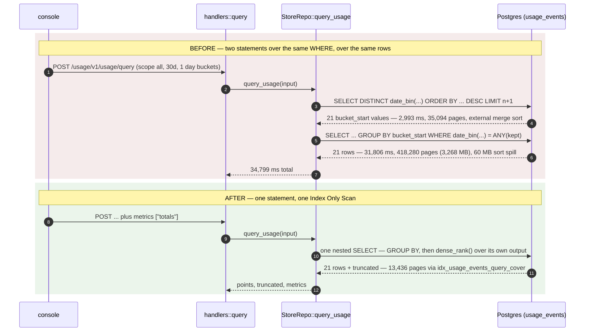
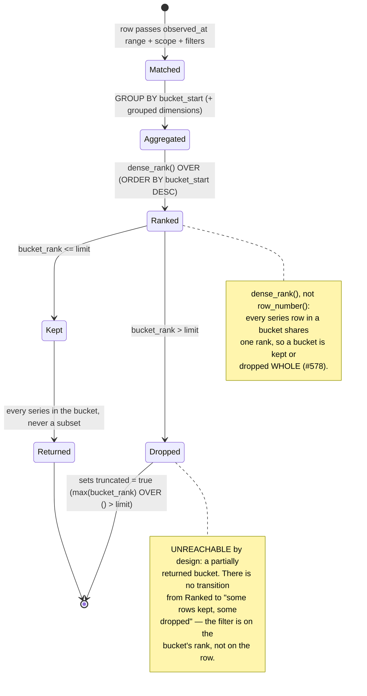

# Usage query performance

Why `/usage/v1/usage/query` was slow, what was done about it on 2026-09-03 (#665), and how to
re-measure it yourself without touching production.

This is the performance reference for the usage store. Two neighbours own the other halves and are
**not** duplicated here:

- [`docs/usage-api.md`](./usage-api.md) — the request/response contract, including the `metrics`
  field this document explains the cost of.
- [`docs/plans/0581-multi-source-usage-plan-of-work.md` §0a](./plans/0581-multi-source-usage-plan-of-work.md)
  — **"would Timescale hypertables fix this?"**, answered against these same measurements, with the
  cost broken down by who fixes each part. Read that section rather than re-deriving it: the short
  version is *compression and continuous aggregates would help, chunk exclusion would not*, and all
  of it stays gated on the epic's D1–D7.

Everything below is `EXPLAIN (ANALYZE, BUFFERS)` output, not estimation. `ms` on a shared replica is
noisy; **`buffers` is the honest column** and is what every claim here rests on.

---

## The three causes



A bucket's lifecycle through that single statement — which is where the `truncated` contract lives,
and where the states that used to be reachable only across two round trips now are not:



### Cause 1 — the table was scanned twice

#578 implemented bucket-scoped truncation as two statements carrying the same `WHERE`. The first
one's `SELECT DISTINCT … ORDER BY … LIMIT` shape makes Postgres pick `Sort → Unique` rather than a
hash aggregate, so it sorted all 933k rows — external merge, spilling to disk — to learn that 21
distinct days existed.

```
Limit (actual time=2603.774..2913.401 rows=21)
  -> Unique -> Gather Merge -> Unique
     -> Sort  Sort Method: external merge  Disk: 3896kB
        -> Parallel Index Only Scan using idx_usage_events_operation_time
           Buffers: shared hit=31224 read=3854
Execution Time: 2993.313 ms
```

`StoreRepo::query_usage` is now ONE statement: the aggregation runs once, and a `dense_rank()`
window over its own output — tens of rows, not a million — does the bucket ranking
(`crates/lightbridge-authz-usage/src/repo.rs:345` `build_usage_query`, shape documented at
`:309-337`). The two-query `select_kept_buckets` path was **deleted**, not kept beside it.

`dense_rank()` and not `row_number()` is what keeps truncation bucket-scoped: every series row in a
bucket shares one rank, so a bucket is kept or dropped whole (`repo.rs:317`, #578). A partially
returned bucket is not a state this statement can reach.

### Cause 2 — 87% of the heap is a column no query reads

From `pg_stats` on `usage_events`: `attributes` has `avg_width` **1445**; every other column summed
is **~205 bytes**. It peaks at 2,084 — just under the ~2 KB TOAST threshold — so it stays **inline**
and a heap page holds ~4 rows instead of ~35. The aggregation therefore reads 3.27 GB to sum
eighteen narrow columns.

```
GroupAggregate (actual time=28394.384..31689.294 rows=21)
  Buffers: shared hit=3254 read=415026          <-- 3.17 GB, essentially all uncached
  -> Gather Merge -> Sort  Sort Method: external merge  Disk: 20696kB (x3 workers)
     -> Parallel Seq Scan on usage_events (actual time=99.381..27085.608)
Execution Time: 31806.314 ms
```

The fix is `migrations-usage/20260903000002_usage_event_query_covering_index.sql:70-91`: an index
keyed on `observed_at` with the eighteen read columns as `INCLUDE` payload, so the query is answered
from the index alone. They are `INCLUDE` and not key columns deliberately — they are never used for
ordering or as an index condition, and keying them would bloat every internal page for nothing. The
migration ends with `ANALYZE usage_events` (`:96`), because #648's backfill had rewritten nearly
every row the day before and stale statistics are exactly how a plan that should be an index-only
scan ends up sequential.

**Since #549 (2026-09-04)** the `attributes` column is dropped from the schema (`20260903000003`,
catalog-only, no rewrite) and no longer written at ingest, so Cause 2's 87%-of-heap column is gone
from every new row; the physical reclaim of the ~900 MB of existing rows is the separate one-off
#549 AC5 (`VACUUM FULL`/`pg_repack`). The retention job also rolls rows older than
`retention.raw_days` (default 90) out of `usage_events` into `usage_events_daily`, so the raw table
— and therefore `/usage/v1/usage/query`, which reads raw only — is bounded to the 90-day window; a
query for a longer horizon returns only what still exists (see `docs/lightbridge-query-api.md`'s
"Query horizon").

`CREATE INDEX CONCURRENTLY` is **not** used, and the migration says why in its own header
(`:66-69`): sqlx applies a file as one multi-statement simple query — an implicit transaction block,
where `CONCURRENTLY` is rejected — and its failure mode leaves a silently-INVALID index that a
re-run's `IF NOT EXISTS` skips. A plain build takes a SHARE lock for the seconds it needs, and the
only writer is an OTLP exporter that retries.

### Cause 3 — `percentile_cont` changes the plan, not just its cost

`percentile_cont` is an ordered-set aggregate and cannot be hash-aggregated. Requesting latency
percentiles forces `GroupAggregate` fed by a full `Sort` instead of a `HashAggregate` over 21
groups. It was also being called three times, each ordered-set aggregate building its own tuplesort
over the same values; it is now one multi-quantile call.

```
with percentiles : GroupAggregate <- Sort (external merge, Disk: 32344kB)  -- 221.6 ms
without          : HashAggregate, no sort at all                           -- 129.7 ms
both             : Index Only Scan using idx_usage_events_query_cover (81 ms)
```

That is what the `metrics` request field turns off
(`crates/lightbridge-authz-usage/src/models/mod.rs:63`). `metrics: None` — what every caller written
before the field existed sends — means **everything**, so the wire contract is unchanged. Only
`latency_percentiles` is worth dropping; `totals` is computed in the pass that already has to read
the row and listing it is a documented no-op (`models/mod.rs:92-100`).

`latency_samples` stays a true count either way, which is what keeps the `null` unambiguous:
`latency_samples > 0` with `latency_p50_ms: null` means *not asked for*, and `latency_samples == 0`
still means *no row in this bucket reported a latency at all*.

---

## Measurements

### Production, before (read-only replica, cold)

Replica `lightbridge-main-db-2`, database `usage`, PostgreSQL 18.4, 933,494 rows / 3,267 MB heap /
625 MB indexes, `shared_buffers = 128MB`, `work_mem = 4MB`, no `pg_stat_statements`, no
`timescaledb`. Every statement inside `BEGIN; SET LOCAL default_transaction_read_only = on;`.

| console shape (30 d, estate-wide unless noted) | step 1 (bucket pick) | step 2 (aggregate) | total ms | pages touched |
|---|---|---|---|---|
| `scope:all`, 1 day, `group_by: []` | 2,993 ms / 35,094 pg | 31,806 ms / 418,280 pg | **34,799** | 453,374 (3.5 GB) |
| `scope:all`, 1 hour, `[model]` | 3,105 ms / 35,060 pg | 49,993 ms / 418,288 pg | **53,098** | 453,348 |
| `scope:all`, 1 day, `[account_id, model]` | 4,592 ms / 35,158 pg | 38,207 ms / 418,288 pg | **42,799** | 453,446 |
| `scope:all`, 1 day, `[user_id]` | 3,895 ms / 35,271 pg | 34,212 ms / 418,288 pg | **38,107** | 453,559 |
| `scope:all`, 1 day, `[azp]` + `operation_in` | 500 ms / 11,264 pg | 52,004 ms / 91,329 pg | **52,504** | 102,593 |
| `scope:account`, 1 day, `[project_id]` | 2,705 ms / 7,689 pg | 27,907 ms / 418,288 pg | **30,612** | 425,977 |

The rewritten single statement, run on the same replica **before the index existed**, confirms the
scan is the whole story: 34,387 ms / 418,283 pg with percentiles, 31,500 ms / 418,196 pg without.
**The rewrite alone buys back only step 1.**

### Local, 2M-row fixture at production's width

`.docker/it/seed-usage-perf-fixture.sql`. Fixture vs production: `attributes` 1,454 B (prod 1,464),
whole row 1,689 B (prod 1,727), heap 3,906 MB over 2M rows. PostgreSQL 17.5, `shared_buffers =
128MB`, `work_mem = 4MB` — matching prod. Page cache is warm here, so `buffers` is the primary
signal and `ms` is secondary.

| shape (30 d) | before: OLD 2-query | before: NEW 1-query | **after index: NEW** | **after index, `metrics:["totals"]`** |
|---|---|---|---|---|
| `all`, 1 day, `[]` | 561 ms / 283,341 pg | 642 ms / 279,630 pg | **222 ms / 13,439 pg** | **130 ms / 13,436 pg** |
| `all`, 1 hour, `[model]` | 680 ms / 283,284 pg | 876 ms / 279,627 pg | **466 ms / 13,436 pg** | **445 ms / 13,436 pg** |
| `all`, 1 day, `[account_id, model]` | 594 ms / 283,168 pg | 1,125 ms / 279,627 pg | **712 ms / 13,436 pg** | **695 ms / 13,436 pg** |
| `all`, 1 day, `[user_id]` | 664 ms / 283,202 pg | 1,336 ms / 279,627 pg | **938 ms / 13,436 pg** | **913 ms / 13,436 pg** |
| `all`, 1 day, `[azp]` + `operation_in` | 463 ms / 283,673 pg | 609 ms / 279,627 pg | **202 ms / 13,436 pg** | **190 ms / 13,436 pg** |
| `account`, 1 day, `[project_id]` | 11 ms / 2,470 pg | 3 ms / 2,441 pg | **3 ms / 2,441 pg** | **2 ms / 2,441 pg** |

7-day range, same fixture: 57,951 → **2,785** pages (453 MB → 22 MB).

Read the "NEW 1-query, before the index" column honestly: on some grouped shapes it is *slower* than
the two-query path. That is expected and is why the two changes ship together — the rewrite removes
a scan, the index removes the heap.

### The alternatives, measured rather than argued

| index | size | pages the estate-wide 30-day query still touches |
|---|---|---|
| none | — | 279,627 (2,185 MB) |
| `USING brin (observed_at) WITH (pages_per_range=32)` | 536 kB | **279,627 — identical** |
| `(observed_at) INCLUDE (…18 columns)` (shipped) | 436 MB | **13,436 (105 MB)** |

BRIN narrows *which* heap pages are visited, not *how wide* they are — and a 30-day query against a
30-day retention window is the whole table anyway.

**Index size:** 436 MB against a 3,906 MB heap locally; ~215 MB against 3,267 MB at production's
shape. **20.8× fewer pages** on the estate-wide shape.

**A `WITH agg AS (…)` CTE was also measured and rejected — not on speed.** It is indistinguishable
(652 ms / 279,627 pg vs 669 ms / 279,627 pg without the index; 237 ms vs 228 ms with it). It was
rejected because it only avoids the double scan while Postgres *chooses* to materialise it; the
nested form has one `FROM usage_events` and cannot regress that way (`repo.rs:337`).

---

## The log-noise half of #665

Same report, different mechanism, and worth knowing because source text does not show it:
`#[instrument]` records every non-skipped **argument** into the span at entry. An unskipped
`body: Bytes` stamped the whole compressed protobuf payload into every ingest span.

Writing the test to prove that fix surfaced a worse instance one layer down:
`StoreRepo::insert_usage_events` carried `#[instrument(skip(self))]`, and a `UsageEvent`'s `Debug`
includes its whole `attributes` blob — so every insert logged the decoded contents of the export.
`StoreRepo::query_usage`'s span was echoing `scope_id` and the entire `filters` set, which
`handlers::query::query_usage` already deliberately refuses to do in its own span.

All four are now `skip_all` with an explicit size/count field:

| site | now |
| --- | --- |
| `handlers/ingest.rs:242`, `:270`, `:298` | `#[instrument(skip_all, fields(bytes = body.len()))]` |
| `repo.rs:104` | `#[instrument(skip_all, fields(events = events.len()))]` |
| `repo.rs:228` | `#[instrument(skip_all)]` |
| `handlers/query.rs:74` | `#[instrument(skip(state, headers, input))]` |

Per-request accept lines moved `info!` → `debug!`. **Rejects stay at `warn!`** (`invalid OTLP …
payload`, `invalid gzip body`, `persisted N of M`) — quieting a success path is not the same as
quieting a failure.

The rule this leaves behind: **`skip_all` plus an explicit field, never `skip(a, b)`.** An
allow-list of skips silently starts leaking the next argument somebody adds.

---

## Re-measuring, safely

Prerequisite: read [`docs/runbooks/release-and-rollout.md`](./runbooks/release-and-rollout.md) for
the cluster/context map. The database lives on the `hetzner-prod` context, namespace `converse`.

**Always the replica, always read-only, both.** `lightbridge-main-db-2` is the physical replica;
`SET LOCAL default_transaction_read_only = on` inside an explicit transaction is the second belt, so
a mistyped statement fails rather than lands.

```bash
# 1. Forward the replica. Never the primary.
zsh -i -c 'kubectl --context hetzner-prod -n converse port-forward pod/lightbridge-main-db-2 55434:5432'

# 2. Every statement in this shape, without exception.
psql "$DSN" -X -q -v ON_ERROR_STOP=1 -c \
  "BEGIN; SET LOCAL default_transaction_read_only = on;
   EXPLAIN (ANALYZE, BUFFERS, TIMING ON) <statement>;
   COMMIT;"
```

Then read `Buffers: shared hit=… read=…` as the number that matters, and the node type
(`Index Only Scan` vs `Parallel Seq Scan`, `HashAggregate` vs `GroupAggregate <- Sort`) as the
*reason*. A change in `ms` alone on a shared replica proves nothing.

To reproduce a production-shaped table locally instead — which is what every "after" number above
came from — load `.docker/it/seed-usage-perf-fixture.sql` into a scratch Postgres. It is built to
production's row width on purpose: a fixture with a narrow `attributes` blob makes cause 2 vanish
and every conclusion drawn from it wrong.

**Sanity check on any environment**, before believing a slow-query report:

```sql
SELECT indexrelname, pg_size_pretty(pg_relation_size(indexrelid))
FROM pg_stat_user_indexes WHERE relname = 'usage_events'
ORDER BY pg_relation_size(indexrelid) DESC;
-- idx_usage_events_query_cover missing => migration 20260903000002 has not run there.

SELECT count(*) FROM pg_extension WHERE extname = 'timescaledb';
-- 0 on production, re-confirmed 2026-09-03. Nothing in the query path assumes otherwise.
```
